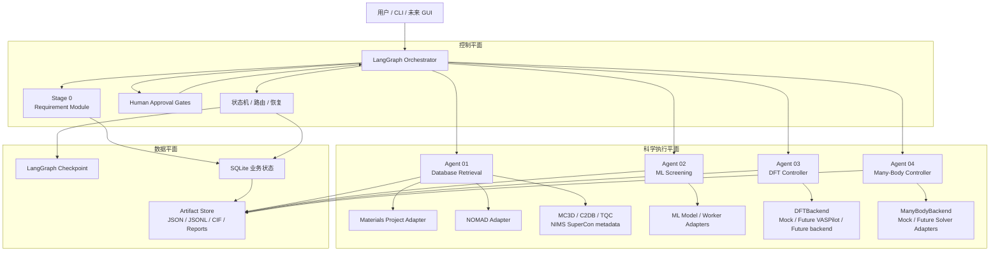
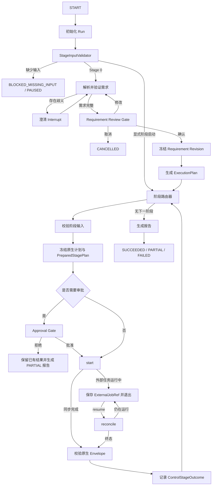
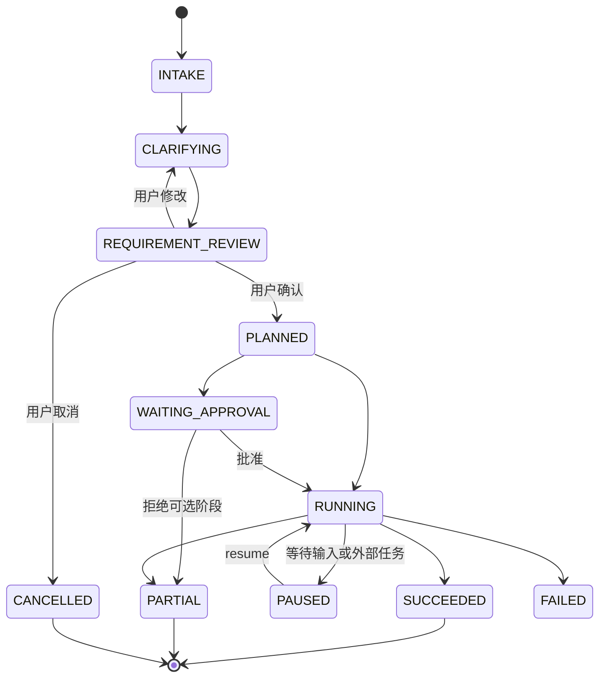
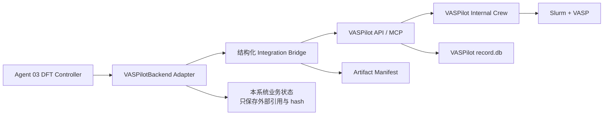

# 强关联材料高通量筛选 Agent：技术架构

> **职责：** 本文档说明系统如何实现、运行和恢复，覆盖控制平面、科学执行平面、数据平面、状态机、模块边界、核心契约、Artifact/provenance 和未来后端集成；产品目标与科学政策见系统蓝图，项目进度见主计划。
>
> **文档导航：** [系统蓝图](./system-plan.md) · [主计划](../plans/master.md) · [原始总方案](./system-plan-original.md)
>
> **来源说明：** 本文由仓库原始总方案
> [`system-plan-original.md`](./system-plan-original.md) 的技术章节拆分整理，并按
> README 与现有 Orchestrator/Agent 分计划中的已冻结契约校正术语。当前可运行能力以
> README、源码、配置和测试为准；未在仓库实现的目录、模块和后端均明确标为“计划”或“未来”。

## 1. 架构目标与不变量

系统采用“控制平面、科学执行平面、数据平面”分离，以确定性代码和版本化 policy 约束科学流程。

以下不变量适用于全部阶段：

1. Orchestrator 负责控制流，不承载具体科学计算。
2. 各 Agent 拥有自己的原生、版本化计划与结果契约；Orchestrator 只校验、冻结、引用和映射。
3. 缺失输入必须阻塞，不能自动伪造上游结果。
4. 已批准的输入和计划不可修改；任何实质变化产生新 revision、hash 和必要的新审批。
5. 外部副作用必须幂等；无法证明幂等的真实 backend 不得上线。
6. 每个外部任务只有一个 execution backend 作为状态真源。
7. checkpoint 只保存小型 JSON 控制状态和 URI/hash，不保存科学大对象。
8. Artifact 内容、业务状态、控制位置和外部任务状态分别有明确真源。
9. fixture/mock 必须显式标记，不能提升真实 L2/L3/L4 证据。
10. LLM 不直接进入科学计算内核，也不能绕过 Schema、policy 或人工 Gate。

安全、审批和证据语义的产品级规则见[系统蓝图](./system-plan.md)。

## 2. 总体架构

下图描述目标架构和稳定能力边界。节点出现于图中不表示其生产实现已经可用；当前 capability 状态以[主计划](../plans/master.md)为准。



## 3. 三个平面

### 3.1 控制平面

LangGraph Orchestrator 负责：

- 对话、需求澄清和 Requirement review；
- 工作流规划和版本化确定性路由；
- 阶段前置条件与 capability 检查；
- 人工审批；
- Run、Stage、Approval、Operation 和 ExternalJob 状态转换；
- Runner Adapter 调用；
- checkpoint、失败恢复、重试和取消；
- 原生 Envelope 校验后的控制面映射；
- 汇总报告；
- 小型 Global State 更新。

它不负责：

- 保存大文件；
- 查询或解释具体科学 backend 的私有文件格式；
- 直接运行 VASP、Slurm、CHGNet 或多体求解器；
- 根据自然语言静默修改科学参数；
- 取代专业工作流引擎的内部 provenance；
- 读取“最新 artifact”来隐式选择阶段输入。

### 3.2 科学执行平面

每个阶段把科学逻辑封装在独立 Runner/Adapter 后：

- 原生 planner 解释该阶段输入并生成不可变原生计划；
- Adapter 把原生计划映射到 Orchestrator 的 `PreparedStagePlan`；
- backend 只执行已经冻结、校验并按需批准的请求；
- 结果先通过 Agent 原生 Envelope 和科学 validator，再映射到控制面；
- 阶段内部可以维护候选级或任务级 ledger，但不能直接修改 LangGraph checkpoint 表。

生产科学 Runner 与测试 fixture 必须分开注册。测试 fixture 可以覆盖生命周期、失败和恢复，但必须 `is_mock=true`，且不能伪造科学数值。

### 3.3 数据平面

控制状态只保存：

- project、run、stage 和 attempt 身份；
- 已确认 Requirement revision；
- ExecutionPlan、StagePlan、StageResult 的 URI/hash；
- 候选 ID 或小型摘要；
- 外部任务引用；
- 审批、错误、重试和时间戳；
- prompt、模型、policy 和代码版本引用。

以下内容保存到 Artifact Store：

- 原始 API 响应和查询快照；
- Candidate manifest 和审计账本；
- CIF、结构 JSON 和结构 lineage；
- ML 轨迹与数值数组；
- DFT 输入输出与验证记录；
- Hamiltonian、solver 结果与数值验证记录；
- JSON/Markdown 报告。

大对象不得直接进入 checkpoint、SQLite JSON 字段或 LLM prompt。

## 4. Orchestrator、状态机与阶段状态

### 4.1 顶层流程



### 4.2 Run 状态机



### 4.3 阶段状态

统一阶段状态：

- `PENDING`
- `VALIDATING_INPUT`
- `BLOCKED_MISSING_INPUT`
- `WAITING_APPROVAL`
- `READY`
- `RUNNING`
- `RETRYABLE_FAILED`
- `PERMANENT_FAILED`
- `PARTIAL`
- `SUCCEEDED`
- `CANCELLED`

状态语义：

- 无查询结果：`SCIENTIFIC_NO_MATCH`，Stage 可以 `SUCCEEDED`；
- 方法不适用：`NOT_APPLICABLE`，保留证据缺口，不等同工具失败；
- 外部任务仍运行：Stage `RUNNING`，Run `PAUSED`；
- 可选阶段被拒绝或失败，但已有有效结果：Run `PARTIAL`；
- 必需阶段永久失败：Run `FAILED`；
- backend 状态倒退、引用改变或结果 hash 冲突：`BACKEND_INCONSISTENT`，停止推进。

### 4.4 `status`、`resume` 与取消

- `status` 严格只读，只查询 checkpoint、业务表和 Artifact 索引；
- 只有 `resume` 可以调用 `reconcile` 并推进外部状态；
- `cancel` 通过 Runner/backend 契约取消已知外部任务，不能只覆盖本地状态；
- LangGraph interrupt 恢复会重新进入节点，因此 interrupt 前后的副作用必须拆分并使用确定性幂等键；
- 同一 Project 在本地阶段只允许一个 CLI 进程推进任一 Run。

## 5. 模块与 Subagent 边界

### 5.1 输入输出总览

| 模块 | 最低输入 | 核心输出 | 明确边界 |
|---|---|---|---|
| Stage 0 Requirement | 自然语言或结构化需求 | 不可变 `requirement.json` revision、面向用户的说明 | 不偷偷补科学阈值 |
| Agent 01 Retrieval | 已确认 Requirement URI/hash/revision | 原始查询证据、候选审计、候选 manifest、来源结构、检索报告 | 不做 ML/DFT/多体结论 |
| Agent 02 ML | Candidate manifest、结构引用、Requirement、policy/registry/health | ML 原生计划、适用域、ML 增量 manifest、结构 lineage、报告 | 不重复主检索，不把 ML 能量称为 hull/DFT |
| Agent 03 DFT | 候选结构、DFT claim、方法 policy、预算、审批 | DFT workflow plan、ExternalJobRef、验证结果、claim 级证据 | 不自由写参数，不以 backend completed 代替 L3 |
| Agent 04 Many-Body | `EffectiveModelPackage`、state point、observable、solver policy | 路由、资源估算、solver 结果、数值验证、claim 级证据 | 不从结构或自然语言猜 Hamiltonian/U/J |

### 5.2 Stage 0：Requirement Module

Stage 0 是 Orchestrator 内的确定性模块加可选 LLM Provider。

职责：

- 保存原始输入；
- 区分硬约束、软偏好和科学目标；
- 识别歧义并生成澄清问题；
- 展示可操作化定义和默认 policy profile；
- 验证 Schema；
- 通过 Gate 后冻结不可变 revision；
- 修改需求时创建新 revision，不覆盖历史。

### 5.3 Agent 01：公开数据库检索与确定性筛选

内部职责：

- Query Planner；
- Materials Project Adapter；
- NOMAD public Archive Adapter；
- MC3D OPTIMADE、C2DB 官方 Web/JSON、TQC 版本化 API Adapter；
- NIMS MDR SuperCon 元数据 Adapter（无结构，不发布下游候选）；
- Raw Response Archiver；
- Normalizer 与结构校验；
- 硬约束执行；
- 精确重复标注与非破坏性结构聚类；
- 确定性排序和 Candidate Reporter。

关键边界：

- `candidate_id` 表示项目内稳定实体；
- 每个 Run 必须显式冻结单一来源，默认 `materials_project`；所有其他来源也必须显式
  选择，不得在同一 Run 跨库补齐缺失性质；
- `structure_id` 表示内容寻址的结构版本；
- 数据库、ML 弛豫、DFT 弛豫结构演化时 candidate 不变，structure 改变；
- 所有数据库性质带单位、来源、计算层级、数据库版本和获取时间；
- Materials Project 继续使用冻结的 `agent01-contract-v1`；所有非 MP 来源使用
  `agent01-contract-v2`。NOMAD 保留 entry/parser/method provenance、SI→Agent01 单位
  换算政策及数据库快照限制。NOMAD 缺少可安全等同于 MP
  `energy_above_hull` 的统一字段时必须保留 `MISSING/UNCERTAIN`；
- MC3D 只映射 OPTIMADE 结构；C2DB 显式标记其 PBE/二维来源；TQC 拓扑分类只作为
  数据库 provenance，不自动满足更高证据级别；SuperCon 无原子坐标记录必须在结构
  Gate 失败且不得发布给 Agent02；
- Agent 02 消费 Agent 01 发布的 manifest，不重新定义检索阶段的硬约束。

完整契约见 [Agent 01 详细计划](../plans/subagents/material-screening-agent01-plan.md)。

### 5.4 Agent 02：机器学习筛选

计划中的三段式边界：

1. 防御性 `pre_filter`：复核冻结输入，不重新查询数据库；
2. `applicability` 与受控结构弛豫：只有适用域通过的真实模型运行才能产生 L2；
3. 结构 QC、双轨结构 lineage 和下游计算就绪度。

模型选择必须来自 Model Registry，而不是 LLM。Registry 至少记录模型/包/checkpoint 版本、支持任务、训练域、元素覆盖、设备、许可、限制、hash 和健康快照。

真实重型依赖计划通过独立 JSON worker 进程运行；主 Orchestrator 环境不应导入 Torch/CHGNet/ASE。worker 只能在预创建 sandbox 中使用 root-relative 路径，stdout 只返回一份严格 JSON。

当前 CHGNet v1 继续承担结构静态预测和预弛豫。DeepH-pack 以独立 companion flow
接入 Agent02 包，不复用或修改冻结的 CHGNet v1 原生契约，也暂不注册为默认
Orchestrator capability。DeepH 不能仅消费 CIF：它还必须接收已训练模型、同一 DFT
interface/局域基组产生的 overlap、结构 linkage 和全部 Artifact hash。控制桥只冻结
`task=[1,2,3,4]` Hamiltonian inference 的执行边界；缺任一科学输入时阻塞。

DeepH worker 可以运行在与 CHGNet 不同的独立环境中，主环境不导入 DeepH、Torch
Geometric、e3nn 或 Julia。真实 executable 完成只证明控制流程和 Artifact 完整性；
在独立 benchmark、适用域和专家审查完成前，结果固定不产生科学结论或 evidence
晋级。未来若把该 companion flow 并入统一 `StageId.ML`，必须发布 composite/v2
Agent02 契约并同步 Orchestrator、fixture、contract test 和消费者计划，不能把
sidecar Artifact 隐式塞入现有 CHGNet plan。

完整契约见 [Agent 02 详细计划](../plans/subagents/material-screening-ml-agent-plan.md)。

### 5.5 Agent 03：DFT Controller

Agent 03 负责：

- 将证据缺口转换为 DFT claims 和版本化 workflow template；
- 应用方法 policy、冻结结构与参数、估算资源；
- 生成审批材料；
- 通过唯一 `DFTBackend` 提交、查询、取消和获取；
- 独立校验 Envelope、Artifact、执行、数值和 claim；
- 保存结构修订、性质和 provenance。

真实 DFT 中，调度器退出码、`vasprun.xml` 存在或 backend completed 都只能触发验证，不能自动晋级 L3。

完整计划见 [Agent 03 DFT 详细计划](../plans/subagents/material-screening-agent-dft-plan.md)。

### 5.6 Agent 04：Many-Body Controller

Agent 04 首先验证完整 `EffectiveModelPackage`：

- geometry、basis、Hamiltonian、interaction；
- filling、temperature、boundary；
- 参数来源和模型—材料 linkage；
- solver capability 与资源上限；
- 数值验证和 evidence scope。

它不能从结构、普通 band structure 或自然语言自动猜测模型。未来真实 solver 从窄范围、固定 benchmark 的能力开始，数值结果与材料映射证据分别记录。

完整计划见 [Agent 04 多体详细计划](../plans/subagents/material-screening-agent04-plan.md)。

## 6. 核心控制契约

### 6.1 Requirement

Requirement 至少包含：

- `requirement_id`、`revision`、`confirmed_by_user`；
- `target_class`；
- `hard_constraints`；
- `scientific_targets[]` 及每项 required evidence；
- `ranking_preferences[]`；
- `budget` 与 `allow_ml/allow_dft/allow_many_body`；
- `policy_version`。

数值范围必须带单位、拒绝 NaN/Infinity，并明确上下界语义。`allow_*` 只是用户授权上限，不表示路由必须执行相应阶段。

### 6.2 Candidate 与 PropertyValue

Candidate 至少包含：

- 稳定 `candidate_id`；
- 来源数据库和 material ID；
- 当前 `structure_id` 与 Artifact URI/hash；
- `properties[]`；
- constraint/target evaluations；
- `missing_evidence[]`；
- `evidence_level`；
- `decision` 与 reason codes；
- provenance。

`decision` 只允许：

- `PASS`
- `REJECT`
- `UNCERTAIN`
- `FAILED`

每个 `PropertyValue` 必须包含名称、值、单位、来源、方法、证据等级、结构版本和 provenance；不能只保存裸数值。

### 6.3 Stage Runner 生命周期

Orchestrator 与 Agent 原生契约分离。当前控制面生命周期为：

```text
validate_input(context) -> StageInputValidation
prepare(context) -> PreparedStagePlan
start(context, prepared_plan, idempotency_key) -> ControlStageOutcome
reconcile(context, prepared_plan, external_job_ref, idempotency_key)
    -> ControlStageOutcome
cancel(external_job_ref, idempotency_key) -> CancelOutcome
```

同步阶段可以明确拒绝 `reconcile/cancel`，但不能伪造外部任务。

`StageInputValidation` 区分：

- 缺失输入：`BLOCKED_MISSING_INPUT`；
- 输入存在但 hash、Schema 或路径非法：`PERMANENT_FAILED`；
- 能力未注册：`CAPABILITY_UNAVAILABLE`；
- 方法不适用：结构化 `NOT_APPLICABLE`。

### 6.4 `PreparedStagePlan`

控制面计划至少冻结：

- project/run/revision/stage/agent/attempt；
- 输入快照 URI/hash；
- 原生计划 URI/hash；
- `operation_input_sha256`；
- 审批要求和 Gate；
- 资源估算、policy 和风险摘要。

动态审批规则：

```text
effective_approval =
    stage_capability.requires_approval
    OR prepared_stage_plan.approval_required
```

Runner 可以提高审批要求，不能取消 capability 的强制审批下限。计划或输入 hash 改变后必须重新计划并重新审批。

### 6.5 原生结果与控制结果

各 Agent 使用自己的版本化原生 Envelope。Adapter 必须：

1. 校验原生 Envelope；
2. 校验全部 Artifact URI/hash；
3. 执行 evidence/mock 不变量；
4. 映射到小型 `ControlStageOutcome`；
5. 在控制结果中只保留原生结果引用、外部任务引用、小型摘要和控制错误。

禁止复用 Agent 01 的结果模型作为所有阶段的通用科学契约。

## 7. Adapter 与 Backend 规则

### 7.1 通用 backend 语义

科学 backend 至少提供：

```python
class ScientificBackend(Protocol):
    def validate_input(self, request): ...
    def estimate(self, request): ...
    def submit(self, request, idempotency_key): ...
    def status(self, job): ...
    def cancel(self, job): ...
    def fetch_result(self, job): ...
```

通用规则：

- `validate_input` 和 `estimate` 无外部副作用；
- 相同 key 和输入 hash 返回同一任务；
- 相同 key 但输入不同必须报冲突；
- terminal 状态不能倒退；
- `fetch_result` 只对允许的终态开放；
- backend 返回的 result 必须引用原 request/plan/input hash；
- backend 不自行提升 evidence；
- cancel 必须幂等，并区分请求发送、远端确认和最终未知。

### 7.2 幂等与恢复

Stage operation key 绑定 project、run、stage、attempt 和 `operation_input_sha256`。阶段内部可增加候选级或 task 级 canonical JSON hash，但不能以易碰撞的自由字符串拼接替代结构化 hash 输入。

完成记录存在时：

- 全部 URI/hash 正确：复用结果；
- 任一已登记 Artifact 缺失、篡改或冲突：`BACKEND_INCONSISTENT`；
- 不允许通过静默重算覆盖历史证据。

### 7.3 错误分类

- `TRANSIENT_EXTERNAL`：超时、429、临时 5xx，可有限重试；
- `INVALID_RESPONSE`：非法 JSON 或 Envelope；
- `MISSING_INPUT`：阻塞；
- `NOT_APPLICABLE`：保留证据缺口；
- `SCIENTIFIC_NO_MATCH`：正常成功；
- `PERMANENT_CONFIGURATION`：凭据、路径、Schema 或不支持参数；
- `BACKEND_INCONSISTENT`：状态、引用或 hash 矛盾；
- `APPROVAL_DECLINED`：阶段取消并保留已有结果。

transport retry 与 scientific retry 必须分开。任何会改变科学参数的 remediation 都必须形成新计划和必要的新审批。

## 8. Artifact、Provenance 与状态真源

### 8.1 状态真源

| 内容 | 真源 |
|---|---|
| 可恢复控制流位置 | LangGraph checkpoint |
| project/run/stage/approval/operation/external job 查询与审计 | SQLite 业务表 |
| 文件内容 | Artifact Store |
| 已提交外部任务当前状态 | execution backend / scheduler |
| 规范化科学结果与 claim | 对应 Agent 的已验证记录 |

业务 migration 不得修改 LangGraph 自有 checkpoint 表。未完成的旧 checkpoint 如果与新图或契约不兼容，必须显式拒绝恢复；已完成报告和 Artifact 应保持可读。

### 8.2 Artifact 规则

- 使用逻辑 URI 和 SHA-256，不依赖机器绝对路径；
- 同目录临时文件、hash 校验、原子 rename；
- 大型数值数组使用安全格式，禁止 pickle；
- Artifact manifest 记录 URI、hash、大小、媒体类型、生产者、输入 hash、时间、保留策略和验证状态；
- 完成记录只有在其引用的全部 Artifact 都通过校验时才具权威性；
- 阶段目录按实际产物延迟创建，不预铺大量空目录；
- 共享结构使用内容寻址，来源结构、ML 结构和 DFT 结构不得互相覆盖。

### 8.3 Provenance 最低集合

- project、run、stage、attempt 和 operation；
- Requirement revision/hash；
- 输入结构和全部上游 Artifact URI/hash；
- Schema、policy、模型、checkpoint、Adapter/backend 版本；
- 代码 commit；
- 资源请求与实际使用；
- 审批与参数 diff；
- 外部 job/scheduler 引用；
- 重试、状态观察和错误；
- 输出 Artifact hash；
- validator 和 evidence decision；
- 时间戳；
- 不泄露凭据、POTCAR 内容或远端敏感绝对路径。

## 9. 存储与代码结构

### 9.1 项目 Artifact 布局

以下是逻辑布局，不要求预先创建空目录：

```text
workspace/
└── users/<user_id>/projects/<project_id>/
    ├── project.json
    ├── state/
    │   └── orchestrator.sqlite3
    ├── requirements/
    │   ├── requirement.v1.json
    │   └── requirement.v1.md
    ├── plans/
    │   └── <run_id>/stages/<stage>/
    ├── candidates/
    │   └── structures/
    ├── stages/
    │   ├── agent01/
    │   ├── agent02/
    │   ├── agent03/
    │   └── agent04/
    ├── approvals/
    ├── events/
    ├── reports/
    └── artifacts/
        └── artifact_manifest.jsonl
```

实际路径和版本化阶段布局以对应 Agent 的冻结契约为准。

### 9.2 推荐代码结构

仓库当前已有 `orchestrator`、`retrieval`、`ml_screening`、`dft` 和 `many_body` 包。
其中 DFT/多体当前实现是严格边界内的 mock 控制链，Agent03 另有不注册生产能力的
结构化 VASPilot bridge PoC；下列内容是从原始总方案保留的**目标结构建议**，不是对
所有目录已存在的声明，未来真实科学 backend、通用 stages/adapters 和服务器层仍属于计划：

```text
src/material_agent/
├── cli.py
├── config.py
├── domain/
├── orchestrator/
├── retrieval/
├── ml_screening/
├── stages/
│   ├── requirement/
│   ├── dft/                 # 计划
│   └── many_body/           # 计划
├── adapters/
│   ├── llm/                 # 计划中的联网 Provider
│   ├── materials_project/
│   ├── ml_models/
│   ├── dft/                 # 计划
│   └── many_body/           # 计划
├── storage/
├── policies/
└── reporting/

tests/
├── unit/
├── contract/
├── integration/
├── e2e/
├── fixtures/
└── eval_cases/              # 计划扩展
```

依赖方向：

```text
domain / native contracts
        ↑
policies / validators / planners
        ↑
stage runners / adapters
        ↑
orchestrator / CLI
```

科学内核不应依赖 LangGraph、CLI 或 SQLite；backend adapter 不直接修改 Candidate；validator 不调用 LLM；reporter 不重新解释原始数值。

## 10. CLI 设计

控制面命令集合：

```bash
material-agent project create
material-agent run --project <id> --request "..."
material-agent run-stage <retrieval|ml|dft|many_body> \
  --project <id> --input <stage-input.json> [--run-id <id>]
material-agent status --project <id> --run <id>
material-agent respond --project <id> --run <id> \
  --interaction <id> --json <payload>
material-agent approve --project <id> --run <id> \
  --approval <id> --decision <approve|reject>
material-agent resume --project <id> --run <id>
material-agent retry --project <id> --run <id>
material-agent cancel --project <id> --run <id>
material-agent report --project <id> --run <id>
```

CLI 规则：

- `run-stage` 必须使用显式来源 Run、Requirement revision 和 Artifact URI/hash；
- 不得隐式发现“最新”Artifact；
- 命令运行到澄清、审批或外部等待点后可以正常退出；
- `status` 不触发外部调用；
- `resume` 和 `cancel` 通过已冻结计划与 Runner 契约推进；
- 未注册的生产 capability 返回明确不可用状态，不运行测试 fixture。

当前可运行命令、参数和示例以[仓库 README](../README.md)为准；未来阶段的命令只有在相应 capability 实现后才可视为可用。

## 11. VASPilot 与未来后端集成

### 11.1 定位

VASPilot 是未来 DFT execution backend 候选，不是 Global State，也不是与 LangGraph 并列的第二个顶层编排器。初始 Mac 环境缺少 Slurm、合法 VASP/POTCAR 和满足要求的服务安全条件，因此当前不能把它视为可用真实后端。

### 11.2 计划中的集成拓扑



默认采用 `VASPilot-as-workflow-backend`：

- Agent 03 提交完整、冻结的 workflow；
- VASPilot 内部负责其 child task 执行；
- Agent 03 对账 workflow、child job、Artifact 和结果；
- 不同时让 Agent 03 与 VASPilot Crew 各自重新规划相同 relaxation/SCF/NSCF。

若改用 VASPilot 的确定性 MCP tools 作为 task backend，必须先作架构决策，明确由 Agent 03 管理完整 DAG。

### 11.3 不使用自由文本 `/submit`

生产接入必须使用结构化、版本化 bridge，至少提供：

```text
POST /integration/v1/dft-workflows
GET  /integration/v1/dft-workflows/{id}
POST /integration/v1/dft-workflows/{id}/cancel
GET  /integration/v1/dft-workflows/by-idempotency-key/{key}
GET  /integration/v1/dft-workflows/{id}/artifacts
```

请求必须包含 idempotency key、plan/input hash、批准的方法、资源限制、Artifact policy 和 child job 元数据。自由文本提交无法可靠保证参数未被改写、输入 hash 一致和强幂等，因此不得用于真实生产链。

### 11.4 上线前技术 Gate

未来真实接入至少要求：

- 合法 VASP、POTCAR 和可用 Slurm；
- 独立锁定环境、专用低权限账号、并发初始为 1；
- 认证、TLS 或可信内网/localhost；
- server-side 幂等唯一约束和按 key 找回；
- immutable submitted snapshot、plan/input hash；
- child calculation ID 与 Slurm ID 映射；
- cancel 向所有相关任务传播；
- Artifact manifest，不暴露绝对路径和 POTCAR；
- 禁用或隔离动态代码执行；
- 路径、上传、请求体大小和并发限制；
- backend、SQLite、日志、目录和 Slurm 状态一致性测试；
- 一个小体系的人工 relaxation → SCF → band/DOS 验收；
- Agent 03 能拒绝 backend 的假阳性 completed；
- 安全审查和课题组专家批准。

如果 VASPilot 未通过 Gate，保持真实 DFT capability 不可用；可以评估 Direct Slurm Adapter 或 AiiDA，但任何替代都必须保持唯一 backend 真源、幂等、审批、Artifact 和证据约束。

### 11.5 其他未来后端

- `AiiDABackend`：服务器阶段备选；不与 VASPilot 同时管理同一任务。
- `ExactDiagonalizationBackend`：未来首个窄范围多体真实 backend 候选；先作为有限尺寸 benchmark solver。
- DMFT/DMRG：只在物理目标、有效模型、benchmark、许可和维护责任明确后选型。
- 后台 worker/Postgres：服务器阶段替换本地同步推进与 SQLite checkpoint，不改变上层逻辑身份、计划 hash 和证据语义。

## 12. 进一步设计依据

- [系统蓝图与科学/安全政策](./system-plan.md)
- [当前项目管理与验收状态](../plans/master.md)
- [Orchestrator 详细计划](../plans/subagents/material-screening-orchestrator-plan.md)
- [Agent 01 详细计划](../plans/subagents/material-screening-agent01-plan.md)
- [Agent 02 详细计划](../plans/subagents/material-screening-ml-agent-plan.md)
- [Agent 03 DFT 详细计划](../plans/subagents/material-screening-agent-dft-plan.md)
- [Agent 04 多体详细计划](../plans/subagents/material-screening-agent04-plan.md)
