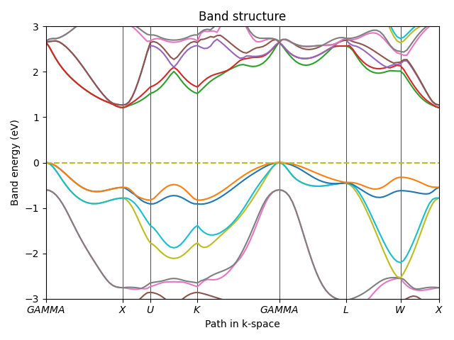
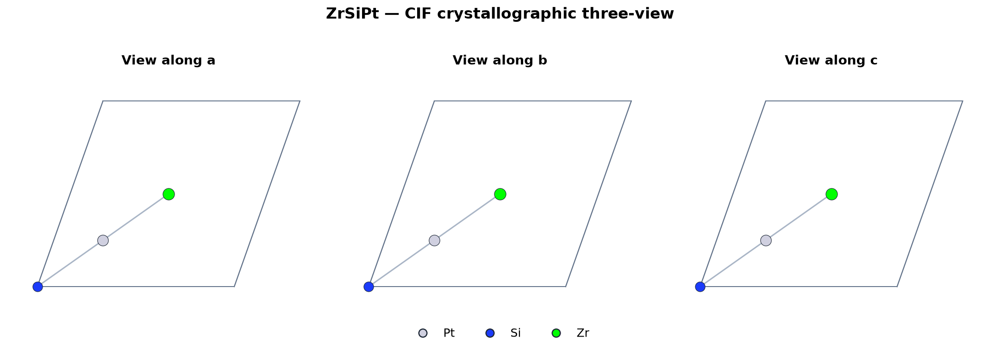

# Uni-HamGNN L40S 纯 ML 真实权重运行记录

日期：2026-08-25（Asia/Shanghai）

## 结论

Hermes 已在 WHU 的一张 NVIDIA L40S 上使用官方 Uni-HamGNN 2.1 权重和官方 ZrSiPt
预计算 non-SOC/SOC graph 跑通真实 SOC Hamiltonian 推理。严格 worker 完成输入 hash、
graph/结构/basis linkage、单卡隔离、入口脚本 hash、输出 sandbox 和 allowlist 校验后返回
`SUCCEEDED`。本次没有运行 OpenMX、Quantum ESPRESSO、VASP、SOC-DFT 或 Wannier。

该结果证明真实模型执行与控制边界可用，不证明 ZrSiPt 或任一候选具有平带、拓扑或磁性。
请求未绑定独立二维 held-out benchmark，故证据等级保持 `NONE`，不得提升为 L2。

## 冻结输入

| 项目 | 来源/身份 | SHA-256 |
|---|---|---|
| HamGNN source | GitHub revision `2fe5debb28711dae72a90ba09f9c44bec39a663c` | source tar `a77cab1be55d039dd2fc4286c0d0783e4369fc1027eeac1e9cc189e9f0534d9f` |
| predictor | `Uni-HamiltonianPredictor.py` | `ab28414046eed80d0e501752c7c99f1f767d53bfbc4aa958a35485d8afe84e7e` |
| model pickle | Zenodo record 17239078, `uni-hamgnn_2_1.pkl` | `5d0257a54dd1c026c08fa29adc537cf0023def1560361da964d289102ec36b06` |
| exact graph structure | ZrSiPt `openmx.cif` | `52562da91ac5f980dfd4410005f523f18cffd2fbcb52b47967e05b7f17122229` |
| non-SOC graph | official example, DFT_DATA19/NAO26 | `eca81de3ec045858405b5c21535285da141bb59efe10c6e51e4055c9e7512ea9` |
| SOC graph | official example, DFT_DATA19/NAO26 | `964fd99eda4115b043523e6046a17ea4f2ccdd92a65abd17223ea01b097d2673` |

权重记录许可证为 CC BY 4.0。官方 graph 是历史预计算输入；“本次无 DFT”指候选执行链
没有生成电子结构输入，而不是把 graph 的历史来源改写成非 DFT。

## 运行时

- 主机：WHUServer-L40S，GPU 物理索引 6；worker 内只暴露一个逻辑设备；
- GPU：NVIDIA L40S 46,068 MiB；driver `580.159.03`；
- Python 3.11.15；Torch `2.10.0+cu128`；Torch CUDA `12.8`；
- HamGNN `2.1.0`；PyG `2.8.0.post1`；torch-scatter
  `2.1.2+pt210cu128`；e3nn `0.5.0`；PyTorch Lightning `2.6.5`；
- 完整 `pip freeze | sort` fingerprint（含 band 后处理所需 seekpath 2.2.1）：
  `602dc7e4a70680714856534fadeefe71261a2ddae9b2b871feb743cae710b8ad`；
- `pip check`：`No broken requirements found.`

这是经实际 smoke 验证的现代兼容环境，不冒充 Zenodo 提供的旧 Torch 1.11 官方环境。

## 严格 worker 收据

- operation key：
  `9fe0a71b02260a8b4af91fa2319f3b5884b264dbe2649a7b1ed51c5c465e5099`；
- runtime provenance：requested/observed 均为 `cuda`，可见 GPU 数为 1，设备名
  `NVIDIA L40S`；
- Hamiltonian：shape `(490, 2704)`，dtype `float32`，全部有限；
- output size：`5,299,968` bytes；
- worker Hamiltonian SHA-256：
  `ca6ec76289ef247f79831373adc33ffd7d05f5e70b85800de8ad5ff676d7909d`；
- 直接受控运行 wall time `14.71 s`，其中单 batch 前向约 `5.42 s`；最大主机 RSS
  约 `3.02 GB`。

同输入 CUDA 重放并非逐字节确定：两次输出的元素 MAE 为
`8.79e-11`、最大绝对差为 `2.38e-7`。因此生产缓存按请求 operation key 管理，数值 QA
使用明确容差，不能要求不同 CUDA 重放具有相同 output hash。

## 无 DFT 能带后处理

在 worker Hamiltonian 和官方 graph 内已有 overlap 上运行 HamGNN `band_cal`，没有调用
电子结构程序：

- 116 条 SOC 能带，每条 120 个 k 点；wall time `6.24 s`；
- predicted band data SHA-256：
  `ea2134f039e9df3075d785280e677e0483755a6972790832f74c9409f85bab48`；
- band PNG SHA-256：
  `592ba34948e8fc8a122e993c8e7a8c3cdb5470d03837c929fde560cf77d3d073`；
- 与官方示例已有 predicted band 的整体 MAE 为 `0.001269 eV`；
- 预测间接/直接语义未在本 smoke 重新定级；上游输出的占据带顶到导带底差为
  `1.210894 eV`；
- 费米附近最近的目标带宽为约 `0.827865 eV`，远大于 50 meV，因此该运行样例不是
  prompt1 的平带候选。

本地新增严格 `.dat` parser，按 k 距离回绕分带并去除上游在高对称节点写入的重复行；
后续候选可直接进入统一平带 validator。轨道投影仍需 eigenvector/projector 输出，不能从
只有 eigenvalue 的 `.dat` 猜测。

对应 band graph 中导出的 CIF 已保存为
[`zrsipt-band-structure.cif`](assets/2026-08-25-uniham-l40s-ml-only-smoke/zrsipt-band-structure.cif)，
三视图 SHA-256 为
`e3435723d64b53992fcb3387b87ee0466932f332a0f59c893725631252e4ee0e`。

## 科学 DAG 远程桥接复核

新增的 `PRECOMPUTED_ELECTRONIC_INPUT_IMPORT → ML_HAMILTONIAN_SOC` 执行链把 graph
descriptor、远程 request、Hamiltonian 和 research-memory evidence 绑定为同一条 lineage。
导入节点只接受预计算 graph，不生成 overlap 或 graph；Uni-HamGNN 节点只接受前序节点
发布的两个 descriptor，因而不会绕过 `ModelTaskPlan` 直接 SSH。

使用同一 ZrSiPt operation 对生产远程客户端进行真实恢复测试：

- 远程 worker 返回“hash-verified completed operation”，没有重新运行模型或 DFT；
- 首次本地控制桥恢复、下载并逐文件复核用时 `10.7 s`；
- 本地 Hamiltonian 大小和 SHA-256 与 worker 收据完全一致；
- 本地完成账本 result ID 为 `uniham-remote-95458379088ecdf255741b38`；
- 第二次调用完全复用本地完成账本，用时 `0.86 s`，operation key 和结果 ID 不变；
- 未绑定 benchmark，因此 scientific DAG 收据仍为 `NONE / INCONCLUSIVE`。

测试覆盖 graph/结构/basis linkage、危险 SSH identity 拒绝、远程输出 hash 复核、完成账本
缓存、双 graph 导入、GPU Hamiltonian Artifact 发布以及 research memory 写回。

随后把 `band_cal` 后处理也改为严格 remote worker。request 冻结 SOC graph、Hamiltonian
operation key、`band_cal` executable SHA-256、`nk=120`、SOC 模式和 NAO26；worker 只接受
一个 `.dat`、一个 `.png`、一个 `.cif`，另保存固定 YAML 和执行摘要。本次真实新 operation：

- band operation key：
  `474d621c502a1da0cbac124a0807a1122fb363bba3f7617eb6aebed8ccfa5c4c`；
- `band_cal` executable SHA-256：
  `e3c42110285408a2ed7848574d9afd18298f244cf1a37d7c3e90aa8c726a76fc`；
- 首次严格远程执行及回收用时 `22.4 s`；
- `.dat/.png/.cif` SHA-256 与先前手工 smoke 完全一致；
- remote band result ID：`uniham-band-d4a2c220d77b7d21ffac0df9`。

最终真实三节点科学 DAG
`PRECOMPUTED_ELECTRONIC_INPUT_IMPORT → ML_HAMILTONIAN_SOC → BAND_ORBITAL_ANALYSIS`
全部执行成功，并写入 3 条 research-memory outcome。自动选择费米面最近的第 31 条带，
测得带宽 `0.827865 eV`，同时检测到一阶交点，因而对 50 meV 平带要求返回
`CONTRADICTS`。由于模型未 benchmark，该信号仍保持 evidence `NONE`；没有 projector 时
轨道贡献改为 `UNRESOLVED`，不再被错误写成 orbital failure。完整 DAG 第二次恢复仅
`1.60 s`，evidence ID 和 memory outcome 数保持不变。

## 已发现并修复的问题

1. 上游 predictor 不创建 `output_dir`；Hermes worker 在调用前创建固定 sandbox/output。
2. 现代 PyTorch 会在 `TMPDIR` 留下空的 `torchinductor_*` 目录；worker 现在只允许并清理
   空目录，任何临时文件、symlink 或其他项目路径写入仍 fail closed。
3. 现代环境需要显式 CUDA `torch_scatter` wheel；其 SHA-256 为
   `326034587c62459af0a171374eb23383fed3f1e693fe8420fee7a47d1a289502`。
4. 未做二维 held-out benchmark，故当前结果只能解除“真实模型不可执行”的工程阻塞，
   不能解除平带/SOC gap/拓扑分类的科学证据阻塞。
5. 预计算 graph 与结构 hash 严格绑定，不能先用 CHGNet 改写结构再复用旧 graph；动态
   DAG 必须在“CIF 预弛豫直达性质模型”和“原结构预计算 graph”之间分支。
6. 缺失轨道 projector 的旧判据会把 unknown 当作 fail；现已改为三态判定，只有已解析
   的硬条件失败才直接淘汰。

## 真实 DeepSeek 动态路由复核

使用 macOS Keychain 中的科研专用密钥运行真实 `deepseek-v4-pro` thinking/tool loop；密钥
未写入环境快照、Artifact 或日志。DeepSeek 只看到运行时注册的预计算图导入、
Uni-HamGNN SOC Hamiltonian 和 HamGNN band 三项能力，并自主生成三节点 ML-only DAG。

第一次路由虽通过旧审计，但暴露出 capability 只声明 `accepted_artifact_kinds`、没有声明
`required_input_artifact_kinds` 的缺口：band 节点漏掉了两个 graph 硬依赖。补齐通用必需
输入契约后再次真实调用，DeepSeek 生成：

`PRECOMPUTED_ELECTRONIC_INPUT_IMPORT → ML_HAMILTONIAN_SOC → BAND_ORBITAL_ANALYSIS`

其中最后一个节点显式依赖图导入与 Hamiltonian 两个前序节点，并消费
`ML_SOC_HAMILTONIAN`、`NON_SOC_HAMILTONIAN_GRAPH`、`SOC_HAMILTONIAN_GRAPH`。三项任务
全部返回 `DEEPSEEK_ROUTE_PASSED_DETERMINISTIC_AUDIT`；没有 DFT、DFT fallback、runtime
overlap 或 graph generation。第二次路由收据为 3 rounds、9,593 prompt tokens、13,953
completion tokens、11,164 reasoning tokens、23,546 total tokens，transport retry 为 0；
route SHA-256 为
`b387b6ef945beffd7527630dfe47bf0158de70a65205979ebb6742c030c42d99`。

这次只验证真实动态路由和审计，没有重复运行 GPU；此前 hash-bound GPU DAG 已完成。
ZrSiPt 是三维工程控制样例，不是 prompt1 的二维发现，且未绑定 held-out benchmark，
因此不能把该路由提升为二维平带、拓扑或磁性结论。

## 真实 feedback 与速度优先淘汰

随后把既有 GPU DAG 的三条 hash-bound evidence 写回 research memory，并运行真实
`deepseek-v4-pro` feedback。模型根据 `0.827865 eV` 带宽和一阶交点提出淘汰；旧的严格
证据审计因该 control case 没有 held-out benchmark 而拒绝。按“速度优先、不追求绝对
准确”的产品目标，policy 增加非对称规则：真实 ML/数据库证据若命中枚举的决定性硬失败
原因，可以把候选移出当前搜索池；正向性质结论仍要求校准 benchmark，且最高只能到 L2。

复跑后 action 以 `SPEED_FIRST_REAL_ML_SEARCH_POOL_ELIMINATION_ACCEPTED` 通过，feedback
cycle 为 `feedback-cycle-ac34db0c5ae02784a31d9787`，receipt SHA-256 为
`e78d03b0b08a6135fd694bd2c08c2b92bc9920207cac0833f35c6a0e28e3a679`。这仍只是三维
control 的搜索池决策，不是 ZrSiPt 平带、SOC、拓扑或磁性的科学证明。

## 来源

- [HamGNN/Uni-HamGNN 官方仓库](https://github.com/QuantumLab-ZY/HamGNN)
- [Uni-HamGNN 权重与示例 Zenodo 记录](https://zenodo.org/records/17239078)
- [官方旧环境 Zenodo 记录](https://zenodo.org/records/11064223)
