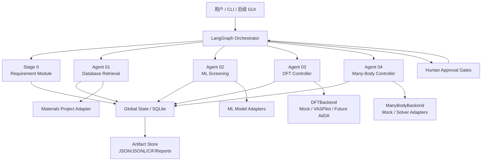
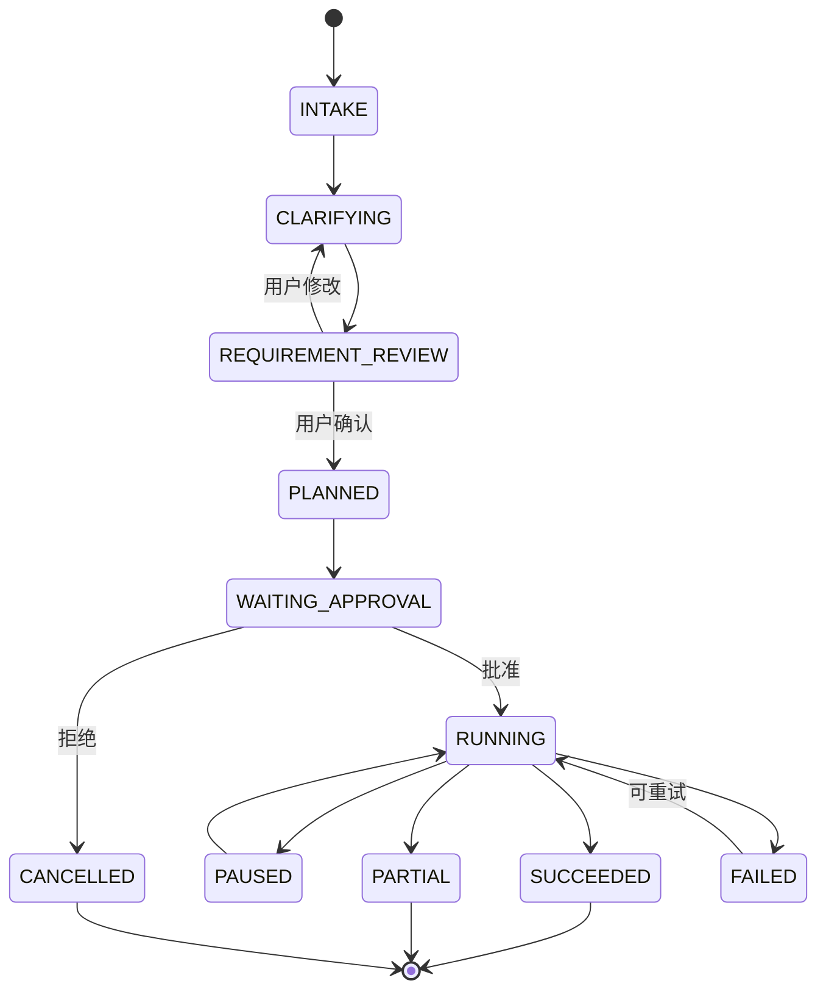
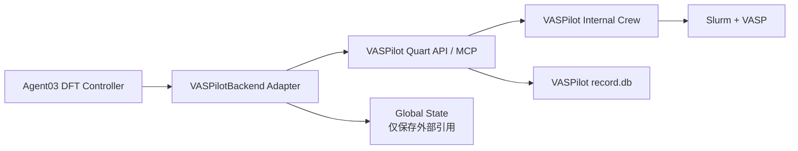

# 强关联材料高通量筛选 Agent：系统总 Plan

版本：v0.1  
日期：2026-07-24  
当前目标：Mac 单机两周 MVP，后续迁移到课题组服务器

## 0. 执行结论

本项目的长期目标，是让科研人员用自然语言描述目标材料，由系统完成需求澄清、公开数据库检索、机器学习筛选、DFT 验证、多体数值分析，并返回晶体结构、性质、证据与完整计算溯源。

两周内不追求“完整自动发现强关联材料”，而交付一条真实可运行、可恢复、可审计的纵向链路：

> 自然语言需求 → 结构化需求 → 人工确认 → Materials Project 检索 → 结构规范化与筛选 → 候选排序 → 证据报告

机器学习阶段采用“真实基础能力 + 可替换模型接口”；DFT 和多体阶段先实现输入校验、审批、状态机、Adapter 与可信 mock。系统不得把数据库代理指标、ML 预测或 mock 结果描述成经过 DFT/多体计算确认的科研结论。

### 已冻结的关键决策

| 事项 | 决定 |
|---|---|
| 初始运行环境 | macOS，本地 CLI/API |
| 后续环境 | Linux 服务器或课题组集群 |
| 开发人力 | 1 人，每天约 6–7 小时 |
| v1 数据源 | Materials Project |
| v1 结构生成 | 不生成新结构 |
| 顶层编排 | LangGraph |
| Schema | Pydantic v2 |
| 元数据索引 | SQLite |
| Artifact 存储 | 本地文件系统 |
| DFT 后端 | `DFTBackend` Adapter；v1 使用 mock，未来接 VASPilot |
| 多体后端 | `ManyBodyBackend` Adapter；v1 使用 mock |
| 人工审批 | 需求确认、批量/昂贵计算、生成代码执行、高级方法 |
| v1 并发 | 单项目串行；检索可受控并发 |
| LLM | Provider 可替换；无 API key 时提供离线演示 Parser |

## 1. 产品目标与边界

### 1.1 目标用户

- 凝聚态物理、材料计算或材料实验科研人员；
- 希望从公开数据库中寻找满足某类物性要求的候选材料；
- 能够审核筛选定义、DFT 参数、有效模型和最终科学结论。

### 1.2 核心用户故事

用户输入：

> 我想找拓扑平带材料，必须包含某种元素，不能包含某些元素，并优先选择比较稳定的结构。

系统应当：

1. 提取明确约束；
2. 识别“拓扑”“平带”“稳定”等尚未操作化的概念；
3. 给出拟采用的筛选定义、证据等级和计算预算；
4. 要求用户确认；
5. 查询数据库并保留原始来源；
6. 规范化、去重、筛选和排序候选；
7. 根据证据缺口决定是否建议 ML、DFT 或多体计算；
8. 对昂贵步骤请求人工批准；
9. 返回候选材料、晶体结构、性质、置信信息、来源和完整 provenance。

### 1.3 v1 非目标

- 不生成掺杂、元素替换、异质结、超晶胞或新晶体结构；
- 不保证四类强关联目标都达到真实 DFT 或多体验证；
- 不在 Mac 上直接运行 VASPilot/VASP；
- 不支持无人监管的高通量计算；
- 不允许 Agent 自行执行未经审核的生成代码；
- 不建设课题组多用户 Web 平台；
- 不承诺“绝不答错”，而是显式表达不确定性、失败和证据等级。

## 2. 科学目标与证据成熟度

### 2.1 支持的目标类别

`target_class` 第一版定义为：

- `simple_semiconductor`
- `fm_2d_semiconductor`
- `topological_flat_band`
- `mott_candidate`
- `charge_transfer_bilayer`
- `custom`

四类强关联目标在 v1 中都能被解析和路由，但不等于都能被真实验证。

### 2.2 统一证据等级

| 等级 | 含义 | v1 支持 |
|---|---|---|
| `L0_PARSED` | 自然语言需求已结构化并经用户确认 | 是 |
| `L1_RETRIEVED` | 数据库记录或代理性质满足条件 | 是 |
| `L2_ML_SCREENED` | 经过模型适用域检查的 ML 预测 | 部分 |
| `L3_DFT_VALIDATED` | DFT 真实收敛且通过结果检查 | 接口/mock |
| `L4_MANY_BODY_VALIDATED` | 有效模型与多体计算通过验证 | 接口/mock |
| `L5_EXPERT_REVIEWED` | 科研人员完成最终审查 | 流程支持 |

所有候选材料必须携带 `evidence_level`。系统不能把 L1 或 L2 的结果写成 L3/L4 结论。

### 2.3 v1 端到端验收任务

固定一个简单、可查询的用例：

> 从 Materials Project 中寻找同时包含 Si 和 O、带隙为 0.5–1.0 eV、energy above hull 不超过 0.05 eV/atom 的非金属材料。

该用例用于验证：

- 自然语言解析；
- 需求确认；
- API 查询构造；
- 字段与单位处理；
- CIF/结构获取；
- 候选排序；
- provenance；
- 报告生成；
- 中断后恢复。

它不用于证明 Materials Project 的计算带隙等于实验带隙。

## 3. 总体架构

系统采用“控制平面、科学执行平面、数据平面”分离。



### 3.1 控制平面

LangGraph Orchestrator 只负责：

- 对话与需求澄清；
- 工作流路由；
- 阶段前置条件检查；
- 人工审批；
- 任务状态转换；
- Adapter 调用；
- 失败恢复；
- 汇总报告；
- Global State 的小型状态更新。

它不负责：

- 保存大文件；
- 直接运行 VASP/Slurm；
- 直接管理长时间计算进程；
- 根据自然语言静默修改关键科学参数；
- 替代专业工作流引擎的 provenance。

### 3.2 科学执行平面

每种外部能力放在 Adapter 后：

```python
class DFTBackend(Protocol):
    def validate_input(self, request: DFTRequest) -> ValidationResult: ...
    def estimate(self, request: DFTRequest) -> ResourceEstimate: ...
    def submit(self, request: DFTRequest, idempotency_key: str) -> ExternalJobRef: ...
    def status(self, job: ExternalJobRef) -> JobStatus: ...
    def cancel(self, job: ExternalJobRef) -> CancelResult: ...
    def fetch_result(self, job: ExternalJobRef) -> DFTResultEnvelope: ...
```

实现：

- `MockDFTBackend`：v1；
- `VASPilotBackend`：有 Slurm、VASP、POTCAR 和服务器后启用；
- `AiiDABackend`：未来备选。

一个计算任务只能有一个 execution backend 作为状态真源，禁止同时让 LangGraph、VASPilot 和 AiiDA 各自认为自己是主编排器。

### 3.3 数据平面

Global State 只存：

- 项目、运行和阶段状态；
- 用户已确认需求的版本；
- 候选材料 ID 列表；
- Artifact URI/hash；
- 外部任务引用；
- 审批记录；
- 错误、重试和时间戳；
- Prompt、模型、政策和代码版本。

CIF、轨迹、Hamiltonian、波函数、CHGCAR、WAVECAR、图像和报告存入 Artifact Store，Global State 只保存引用。

## 4. Orchestrator 与状态机

### 4.1 顶层流程



### 4.2 阶段状态

统一使用：

- `PENDING`
- `VALIDATING_INPUT`
- `BLOCKED_MISSING_INPUT`
- `WAITING_APPROVAL`
- `READY`
- `RUNNING`
- `RETRYABLE_FAILED`
- `PERMANENT_FAILED`
- `PARTIAL`
- `SUCCEEDED`
- `CANCELLED`

不得把“无结果”“工具异常”“不适用”和“科学上未满足条件”全部混成 `FAILED`。

### 4.3 任意阶段启动

用户可以从任意阶段开始，但系统首先运行 `StageInputValidator`：

| 阶段 | 最低输入 |
|---|---|
| Stage 0 | 用户自然语言或结构化需求 |
| Agent 01 | 已确认的 `requirement.json` |
| Agent 02 | `candidate_manifest.jsonl`、结构引用、筛选需求 |
| Agent 03 | 候选结构、DFT 目标、方法政策、预算与审批 |
| Agent 04 | 有效 Hamiltonian、相互作用参数、填充/温度、求解目标 |

缺少输入时返回缺失字段与补充方式，不能自动伪造上游结果。

## 5. 各模块职责

### 5.1 Stage 0：Requirement Module

Stage 0 不是独立 Agent，而是 Orchestrator 内的确定性模块加可选 LLM。

职责：

- 保存原始用户输入；
- 提取硬约束、软偏好和目标性质；
- 识别歧义；
- 生成澄清问题；
- 提出可操作化定义；
- 验证 JSON Schema；
- 生成面向用户的 `requirement.md`；
- 通过人工 Gate 后冻结 `requirement.json`。

重要规则：

- 不为“稳定”“平带”“强关联”等词偷偷补阈值；
- 若用户无法给出阈值，展示带版本号的默认 policy profile；
- 默认值必须出现在确认页面；
- 用户确认后生成不可变 requirement revision；
- 后续修改产生新 revision，不覆盖历史版本。

### 5.2 Agent 01：公开数据库筛选

v1 只接 Materials Project。

详细的数据契约、确定性筛选政策、Artifact 布局、恢复语义和验收 Gate
见 `material-screening-agent01-plan.md`。元素、带隙、稳定性、原子数、
结构有效性、维度、去重聚类和确定性排序归 Agent 01；Agent 02 只消费
Agent 01 发布的候选执行 ML/MLIP 处理，不重复这些确定性规则。

内部模块：

- Query Planner；
- Materials Project Adapter；
- Raw Response Archiver；
- Normalizer；
- Structure Validator；
- Deduplicator；
- Candidate Reporter。

输出：

- 原始查询与 API 响应摘要；
- 规范化候选记录；
- 来源 ID 和计算来源；
- canonical CIF；
- 数据缺失标记；
- 去重映射；
- 检索报告。

注意：

- `candidate_id` 是项目内稳定实体 ID；
- `structure_id` 表示某一版本结构；
- 同一材料从数据库结构、ML 弛豫结构、DFT 弛豫结构演化时，`candidate_id` 不变，`structure_id` 改变；
- 所有数据库数值必须携带单位、来源、计算层级和获取时间。

### 5.3 Agent 02：机器学习筛选

三段式设计可以保留，但 v1 缩小实现：

1. `pre_filter`
   - 元素包含/排除；
   - 化学式、元素数、原子数；
   - band gap、energy above hull 等数据库字段；
   - 结构有效性；
   - 确定性规则。

2. `relaxation_stability`
   - 先实现 `MLIPAdapter`、模型注册表和适用域检查；
   - 若 CHGNet 等模型在 Mac 环境能稳定安装，则对少量候选进行真实试跑；
   - 否则使用可信 fixture/mock，不阻塞主链路。

3. `property_funnel`
   - v1 实现统一预测结果 Schema、uncertainty 字段和排序接口；
   - DeepH、ALIGNN 等只作为后续 Adapter，不在两周内同时集成。

模型选择不能只靠 LLM。模型注册表至少记录：

- 模型名与版本；
- 支持元素；
- 训练数据域；
- 可预测性质；
- 输入要求；
- 设备要求；
- 许可证；
- 已知限制；
- 本地 smoke test 状态。

### 5.4 Agent 03：DFT Controller

Agent03 负责 DFT 任务的计划、校验和结果接收，不重新实现 VASPilot 内部 Crew。

职责：

- 材料与任务分类；
- 生成 `DFTRequest`；
- 应用方法 policy；
- 资源估计；
- 请求人工批准；
- 调用 `DFTBackend`；
- 轮询外部任务状态；
- 验证结果 Envelope；
- 保存 provenance；
- 将结果写回 Global State。

v1：

- 实现 `MockDFTBackend`；
- 覆盖 submit/running/succeeded/failed/cancelled；
- 模拟超时、收敛失败、用户拒绝和重试；
- 明确标记 `is_mock=true`；
- 不生成伪造的科研数值。

### 5.5 Agent 04：Many-Body Controller

Agent04 的核心不是“自动选一个求解器”，而是先证明有效模型定义完整。

职责：

- 检查 Hamiltonian、轨道基、相互作用、填充、温度和边界条件；
- 判断模型维度和求解器适用性；
- 给出可选方法及局限；
- 请求用户/专家确认；
- 通过 `ManyBodyBackend` 提交；
- 进行收敛与跨方法一致性检查；
- 输出结果与方法局限。

v1：

- 实现输入 Schema、路由结果 Schema 和 mock backend；
- 演示 `BLOCKED_MISSING_INPUT`；
- 不实现通用 DMFT/DMRG/ED 自动代码生成；
- 不把“路由到 DMFT”描述成“完成 DMFT 验证”。

### 5.6 Reasoning 与 Coding 能力

`reasoning skill` 在 v1 中改为版本化政策包：

- requirement interpretation policy；
- tool routing policy；
- scientific evidence policy；
- error classification policy；
- report language policy。

它必须尽量纯函数化、无副作用、可测试。

`coding skill` 不进入 v1 生产运行图。未来若启用：

- 只能在隔离沙箱运行；
- 禁止读取项目外路径；
- 禁止直接使用集群凭据；
- 禁止自动提交计算；
- 先生成 diff、测试和风险摘要；
- 必须经人工批准；
- 代码和运行结果都需 hash 与审计。

## 6. 核心数据契约

### 6.1 Requirement

```json
{
  "requirement_id": "req_...",
  "revision": 1,
  "target_class": "topological_flat_band",
  "hard_constraints": {
    "include_elements": [],
    "exclude_elements": [],
    "band_gap_ev": null,
    "energy_above_hull_ev_atom": null,
    "dimensionality": null,
    "max_num_sites": null
  },
  "scientific_targets": [
    {
      "name": "flat_band",
      "operational_definition": null,
      "required_evidence_level": "L1_RETRIEVED"
    }
  ],
  "ranking_preferences": [],
  "budget": {
    "max_candidates": 200,
    "allow_ml": true,
    "allow_dft": false,
    "allow_many_body": false
  },
  "confirmed_by_user": true,
  "policy_version": "requirement-policy-v1"
}
```

### 6.2 Candidate

每个候选至少包含：

- `candidate_id`
- `formula`
- `source_database`
- `source_material_id`
- `structure_id`
- `structure_artifact_uri`
- `properties[]`
- `matched_constraints[]`
- `unmatched_constraints[]`
- `missing_evidence[]`
- `evidence_level`
- `decision`
- `decision_reasons[]`
- `provenance`

`decision` 只能是：

- `PASS`
- `REJECT`
- `UNCERTAIN`
- `FAILED`

### 6.3 PropertyValue

每个性质不能只存一个裸数值：

```json
{
  "name": "band_gap",
  "value": 0.82,
  "unit": "eV",
  "source": "materials_project",
  "method": "GGA+U",
  "evidence_level": "L1_RETRIEVED",
  "uncertainty": null,
  "origin_task_id": "mp-...",
  "retrieved_at": "ISO-8601 timestamp"
}
```

### 6.4 StageResultEnvelope

所有 subagent 使用同一外壳：

```json
{
  "run_id": "run_...",
  "stage": "agent01",
  "status": "SUCCEEDED",
  "input_snapshot_uri": "artifact://...",
  "output_artifacts": [],
  "candidate_ids": [],
  "warnings": [],
  "errors": [],
  "metrics": {},
  "provenance": {},
  "started_at": "...",
  "finished_at": "..."
}
```

## 7. 项目目录调整

现有五份目录设计适合作为长期 artifact taxonomy，但对 v1 过于庞大。不要预先创建大量空文件。

建议实际目录：

```text
workspace/
└── users/<user_id>/projects/<project_id>/
    ├── project.json
    ├── state/
    │   ├── global_state.json
    │   └── checkpoints/
    ├── requirements/
    │   ├── requirement.v1.json
    │   └── requirement.v1.md
    ├── candidates/
    │   ├── candidate_manifest.jsonl
    │   └── structures/
    ├── stages/
    │   ├── agent01/
    │   ├── agent02/
    │   ├── agent03/
    │   └── agent04/
    ├── approvals/
    │   └── approvals.jsonl
    ├── events/
    │   └── events.jsonl
    ├── reports/
    └── artifacts/
        └── artifact_manifest.jsonl
```

阶段内部目录按实际产生的 artifact 延迟创建。

## 8. 人工审批与安全策略

### 8.1 四个强制 Gate

1. `REQUIREMENT_CONFIRMATION`
   - 用户确认机器可读需求和默认阈值。

2. `EXPENSIVE_BATCH_APPROVAL`
   - 任何 DFT/多体任务；
   - 超过候选数或预计成本阈值的 ML 批次；
   - 参数扫描。

3. `GENERATED_CODE_EXECUTION`
   - 未来任何自动生成代码的执行。

4. `ADVANCED_METHOD_APPROVAL`
   - HSE、cRPA、DMFT、DMRG、ED、RPA 等。

### 8.2 默认安全规则

- API key 只从环境变量或 macOS Keychain 读取；
- 配置快照必须脱敏；
- 禁止将密钥写入项目 artifact；
- 所有外部写操作保留 tool-call 审计；
- 路径必须限制在项目 workspace；
- 不执行任意 Python；
- 不直接对公网开放本地服务；
- 失败时不得静默更换模型、泛函、U、磁序或求解器；
- 关键参数改变必须生成 before/after diff。

## 9. VASPilot 集成方案

### 9.1 当前判断

VASPilot 是面向 VASP + Slurm 的实验性平台。当前 Mac 环境没有 Slurm、合法 VASP/POTCAR 和稳定 LLM/Embedding 配置，因此不能作为 v1 真实计算后端。

v1 不安装并嵌入其完整 CrewAI Web 栈，只实现 `VASPilotBackend` 的接口契约与 mock。

### 9.2 未来接入方式



顶层系统只关心：

- task ID；
- calculation ID；
- 状态；
-日志引用；
- 输入文件 hash；
- 输出 artifact；
- 收敛和验证标记。

VASPilot 内部 Crew 的 memory 和数据库不能直接成为本系统 Global State。

### 9.3 VASPilot 上线前 Gate

必须满足：

- 合法 VASP 和 POTCAR；
- 可用 Slurm；
- 独立 Python 3.11 环境与锁定依赖；
- 专用低权限 Unix 账号；
- 服务绑定 localhost/可信内网；
- 默认并发为 1；
- 禁用或沙箱化 `python_plot` 的任意代码执行；
- 修复绝对路径文件访问；
- 增加 API 认证；
- 参数 hash 幂等键；
- 提交前重复任务检查；
- 每次 VASP 输入人工审批；
- 人工验证一个小体系的 relaxation → SCF → NSCF；
- SQLite、日志、计算目录和 Slurm ID 一致性测试；
- 不把 Result Validation Agent 当作科研人工复核的替代品。

### 9.4 暂不使用 AiiDA 的原因

v1 不同时引入 AiiDA 和 VASPilot，避免两个执行系统争夺任务状态真源。保留 `AiiDABackend` 接口，待服务器阶段根据课题组实际维护能力再选型。

## 10. LLM 策略

LLM 必须通过统一 Provider：

```python
class LLMProvider(Protocol):
    def structured_generate(self, prompt, schema, context) -> BaseModel: ...
```

候选实现：

- OpenAI-compatible API；
- DeepSeek-compatible API；
- 其他支持可靠 tool/structured output 的服务；
- `MockLLMProvider`；
- `OfflineDemoParser`。

为了不被 API key 阻塞，两周 MVP 必须能够：

- 使用 MockLLM 跑完自动测试；
- 使用 Offline Parser 跑固定验收任务；
- 有真实 API key 时切换到自然语言 Parser；
- 记录 provider、model ID、参数、prompt version 和响应 hash。

## 11. 评测与验收

### 11.1 v1 工程指标

- Requirement Schema 校验通过率：测试集 100%；
- 硬约束翻译正确率：固定回归用例 100%；
- Materials Project 查询参数与确认需求一致；
- 每个候选都有来源 ID、结构和 provenance；
- API 暂时失败可以重试并从 checkpoint 恢复；
- 同一请求重复执行不会产生重复候选；
- mock DFT/多体结果不会被标记为真实；
- 所有人工审批均有不可变记录；
- CLI 中断后可以通过 `resume` 继续；
- 单元和集成测试通过。

### 11.2 初始评测集

当前没有专家 gold set，因此分两层：

1. 工程回归集
   - 简单半导体检索；
   - 元素包含/排除；
   - 缺失阈值；
   - 数据库无结果；
   - API 失败；
   - 重复结构；
   - 从 Stage 2/3/4 启动但缺少输入；
   - 用户拒绝审批；
   - mock backend 超时/失败。

2. 科学 silver set
   - 为四类强关联目标各准备若干已知材料；
   - 只验证需求表示、路由和证据缺口；
   - 不把这些样本当成严格真值。

正式科学 gold set 必须由课题组成员后续共同维护，包括正例、负例、边界案例、来源论文和判定理由。

### 11.3 失败注入

必须测试：

- MP API 超时和限流；
- LLM 返回非法 JSON；
- CIF 解析失败；
- 候选字段缺失；
- 模型不支持某元素；
- 用户长时间不审批；
- backend 状态不一致；
-重复 submit；
- checkpoint 损坏；
- 报告生成中断。

## 12. 两周实施计划

可用时间约 84–98 小时。优先保证第 7 天已有可演示的 P0 链路。

### Day 1：工程骨架

- 建立 Python 3.11 环境；
- 创建 repo、配置、日志和测试结构；
- 定义 Pydantic Schema；
- 建立 SQLite 与 Artifact Store；
- 建立 CI 可运行的 pytest 基线。

交付：Schema、项目创建、状态持久化。

### Day 2：Stage 0

- 原始输入保存；
- Offline Parser；
- LLM Provider 接口；
- 澄清问题与 requirement revision；
- CLI 人工确认。

交付：自然语言/固定语法到 `requirement.json`。

### Day 3–4：Agent01

- Materials Project Adapter；
- 查询参数生成；
- 原始响应与 provenance；
- 结构下载和 CIF 保存；
- normalized candidate；
- 缺失字段处理。

交付：真实 MP 候选集。

### Day 5：筛选、去重与报告

- 硬约束执行；
- candidate/structure ID；
- 结构 hash 与来源映射；
- PASS/REJECT/UNCERTAIN；
- Markdown/JSON 报告。

交付：P0 端到端结果。

### Day 6：LangGraph 串联

- 顶层状态图；
- checkpoint/resume；
- 审批节点；
- 错误分类；
- CLI `run/status/resume/approve`。

交付：可中断恢复的 P0。

### Day 7：P0 验收与缓冲

- 跑固定半导体用例；
- 修复阻塞问题；
- 增加 API/Parser/结构失败测试；
- 录制或整理演示步骤。

若项目进度落后，从此日开始停止新增功能，优先保证 P0 稳定。

### Day 8–9：Agent02 最小实现

- 确定性 pre-filter；
- Model Registry；
- MLIPAdapter；
- 模型适用域检查；
- 可行时试跑一个 CHGNet 小样例；
- 不可行时使用明确标记的 fixture/mock。

交付：L2 接口和可解释筛选漏斗。

### Day 10：Agent03 Adapter

- DFTRequest；
- resource estimate；
- MockDFTBackend；
- submit/status/cancel/fetch；
- 审批和幂等键；
- VASPilot mapping 文档。

交付：不冒充真实计算的 DFT 状态链路。

### Day 11：Agent04 Adapter

- EffectiveModel Schema；
- ManyBodyRequest；
- 前置条件验证；
- Solver capability registry；
- mock backend；
- 缺输入阻塞演示。

交付：多体阶段接口与边界。

### Day 12：审计、安全和恢复

- approvals.jsonl；
- events.jsonl；
- secret redaction；
- path guard；
- retry policy；
- artifact hash；
- failure injection。

### Day 13：综合测试与文档

- 端到端回归；
- 任意阶段启动测试；
- README；
-配置示例；
- 演示脚本；
- 已知限制。

### Day 14：缓冲与展示

- 只修复 bug；
- 冻结 demo 数据；
- 生成架构说明、运行截图和结果报告；
- 列出下一阶段资源申请清单。

## 13. 推荐代码结构

```text
src/material_agent/
├── cli.py
├── config.py
├── domain/
│   ├── requirements.py
│   ├── candidates.py
│   ├── properties.py
│   ├── artifacts.py
│   └── jobs.py
├── orchestrator/
│   ├── graph.py
│   ├── state.py
│   ├── routing.py
│   ├── approvals.py
│   └── checkpoints.py
├── stages/
│   ├── requirement/
│   ├── retrieval/
│   ├── ml_screening/
│   ├── dft/
│   └── many_body/
├── adapters/
│   ├── llm/
│   ├── materials_project/
│   ├── ml_models/
│   ├── dft/
│   └── many_body/
├── storage/
│   ├── sqlite.py
│   ├── artifact_store.py
│   └── event_log.py
├── policies/
│   ├── requirement/
│   ├── evidence/
│   ├── routing/
│   └── errors/
└── reporting/

tests/
├── unit/
├── contract/
├── integration/
├── e2e/
├── fixtures/
└── eval_cases/
```

## 14. CLI 草案

```bash
material-agent project create
material-agent run --project <id> --request "..."
material-agent status --project <id>
material-agent approve --project <id> --approval <id>
material-agent resume --project <id>
material-agent run-stage retrieval --project <id>
material-agent run-stage ml --project <id>
material-agent run-stage dft --project <id>
material-agent report --project <id>
```

## 15. Mac 到课题组服务器的迁移路线

### 本地阶段

- 单用户；
- SQLite；
- 本地 artifact；
- localhost CLI/API；
- 串行执行；
- 环境变量/Keychain；
- mock DFT/多体。

### 服务器阶段

必须增加：

- PostgreSQL；
- 共享文件系统或对象存储；
- 后台任务队列；
- 用户登录与 RBAC；
- 项目/目录/数据库隔离；
- API Token 和 TLS；
- 资源配额；
- Slurm Adapter；
- 专用服务账号；
- 备份与迁移；
- 审计日志；
- 监控与告警；
- 模型/API 成本统计；
- 数据发送给外部 LLM 的合规策略。

Global State 应保存逻辑 Artifact URI，而不是依赖 Mac 绝对路径，以降低迁移成本。

## 16. 后续路线图

### P1：可靠 ML 筛选

- 选择一个 MLIP；
- 建立适用域和版本化模型注册表；
- 小批量弛豫；
- phase stability；
- uncertainty；
- 科学 silver set。

### P2：单体系真实 VASPilot

- 申请 VASP、POTCAR、Slurm；
- 部署隔离 VASPilot；
- 非 SOC 小体系 SCF；
- 人工审核全部输入输出；
- 实现 idempotency 和外部 job mapping。

### P3：固定 DFT 工作流

- relaxation → SCF → band/DOS；
- 磁序枚举；
- SOC；
- HSE/phonon/Wannier 等按实际资源逐项加入；
- 确定性错误处理优先于 LLM 修复。

### P4：多体求解

- 先冻结有效模型 Schema；
- 为一种物理目标选择一种真实 solver；
- 建立小模型 benchmark；
- 收敛和交叉验证；
- 再扩展 DMFT/ED/DMRG 等。

### P5：多人平台

- Web/Cherry Studio；
- 多用户权限；
- 任务队列；
- 配额；
- 课题组 gold set；
- 生产运维。

## 17. 主要风险

| 风险 | 影响 | 缓解 |
|---|---|---|
| 两周范围过大 | 主链路无法完成 | 第 7 天冻结 P0，后续均为可删 P1 |
| LLM API key 未获得 | 自然语言链路阻塞 | Offline Parser + MockLLM |
| MP 数据不是实验真值 | 科学误导 | evidence level、method、origin、uncertainty |
| 四类目标定义不明确 | 路由漂移 | policy profile + 用户确认 |
| ML 模型不支持材料域 | 错误预测 | model registry + applicability gate |
| VASPilot 依赖 Slurm/VASP | Mac 无法实算 | Adapter + mock，服务器再接 |
| 自动生成代码 | 安全与科研错误 | v1 禁用；未来沙箱 + Gate |
| 双重编排 | 状态不一致 | 每个任务一个 execution backend 真源 |
| 无 gold set | 无法测科学准确率 | 先测工程正确性，后建专家 gold set |
| 多体模型不完整 | 求解结果无意义 | 强制输入校验和专家审批 |

## 18. v1 Definition of Done

只有同时满足以下条件，v1 才算完成：

- 能创建项目并持久化；
- 能接收自然语言或离线演示请求；
- 能生成结构化需求并要求用户确认；
- 能真实查询 Materials Project；
- 能保存来源结构和 provenance；
- 能执行确定性筛选并生成候选报告；
- 能清楚区分 PASS/REJECT/UNCERTAIN/FAILED；
- 能中断并 resume；
- 能从任意阶段启动并报告缺失输入；
- DFT/多体 mock 明确标记；
- 所有审批有记录；
- 同一操作具备幂等性；
- secret 不进入 artifact；
- 核心单元、契约、集成和 E2E 测试通过；
- README 能让另一名开发者在新环境复现 P0。

## 19. 资料与方法依据

- 用户提供的五份阶段目录设计；
- 用户提供的组会 PPT 架构；
- 用户提供的高通量筛选与多体方法参考资料；
- 用户提供的 VASPilot 论文；
- 用户提供的《VASPilot 仓库调研、使用指南与适用范围分析》；
- Materials Project API：
  https://docs.materialsproject.org/downloading-data/using-the-api/querying-data
- Materials Project 电子结构方法：
  https://docs.materialsproject.org/methodology/electronic-structure
- Materials Project 磁性方法：
  https://docs.materialsproject.org/methodology/materials-methodology/magnetic-properties
- VASPilot：
  https://github.com/JiaxuanLiu-Arsko/VASPilot

## 20. 立即开始时的第一批任务

1. 创建代码仓库与 Python 3.11 环境；
2. 实现 Requirement、Candidate、Property、Artifact、StageResult Schema；
3. 实现 SQLite project/run/stage/approval 表；
4. 实现本地 Artifact Store；
5. 实现固定半导体用例的 Offline Parser；
6. 实现 Materials Project Adapter；
7. 实现 Stage 0 → Agent01 的最短链路；
8. 在第 3 天前获得第一个真实候选结果；
9. 在第 7 天前完成可恢复 P0 演示；
10. 只有 P0 稳定后才进入 ML、DFT 和多体 Adapter。
