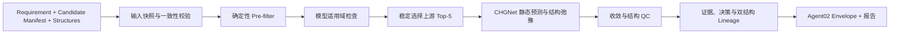

# Agent02 机器学习筛选 Subagent 实施方案

版本：v0.1  
日期：2026-07-25  
上位设计：`material-screening-agent-system-plan.md`、`material-screening-orchestrator-plan.md`

## 1. 执行摘要

Agent02 是一个确定性、可恢复、可审计的机器学习筛选阶段，不是让 LLM 自主选择模型或科学阈值的对话 Agent。

v1 采用三段式漏斗：



v1 必须真实跑通一个最多 5 个候选的 CHGNet 小批量；fixture/mock 仅用于离线测试和失败注入，不能提升证据等级。Agent02 的科学作用是：

- 复核确定性硬约束；
- 判断候选是否处于模型适用域；
- 为体相无机晶体执行低成本结构预弛豫；
- 识别不收敛、结构大幅漂移和异常模型输出；
- 为 Agent03 同时提供来源结构和 ML 弛豫结构；
- 提升“经过真实 MLIP 预弛豫检查”这一项证据到 `L2_ML_SCREENED`。

Agent02 不得把 CHGNet 能量、弛豫收敛或磁矩描述为：

- formation energy；
- energy above hull；
- 热力学稳定性证明；
- 磁基态、Mott、拓扑或平带证明；
- DFT 验证结果；
- 带有校准概率的置信度。

## 2. 冻结决策与范围

| 项目 | v1 决策 |
|---|---|
| 首个真实能力 | 结构弛豫、能量/力/应力预测和结构异常检查 |
| 模型 | CHGNet MPtrj checkpoint `0.3.0` |
| 代码包 | Python 3.11 环境，固定 `chgnet==0.4.1` 并锁定完整依赖 |
| 适用结构 | 周期性、体相、无机晶体 |
| 非适用结构 | 2D 真空层、双层/界面、分子、明显域外结构、超过原子数上限的结构 |
| 自动真实批次 | 上游排序 Top-5，每结构最多 100 个原子 |
| 候选选择 | 按冻结的上游 L1 排名；并列时按 `candidate_id` 排序 |
| 弛豫参数 | FIRE，离子与晶胞共同优化，`fmax=0.1 eV/Å`，最多 200 步 |
| 晶胞 Filter | `FrechetCellFilter` |
| 候选淘汰 | 仅确定性 pre-filter 可以 `REJECT`；ML 只能 `PASS`、`UNCERTAIN` 或 `FAILED` |
| 下游结构 | 保留来源结构和 ML 结构；ML 通过 QC 时推荐 Agent03 使用 ML 结构 |
| 不确定性 | v1 固定为 `NOT_AVAILABLE`，禁止生成伪概率 |
| L2 提升 | 真实模型、适用域通过、弛豫成功、QC 通过时允许提升 |
| LLM 权限 | 不参与模型选择、阈值、适用域、候选决策或排序 |
| P1 优先级 | 先建立 DFT benchmark、OOD 和不确定性校准，再扩展性质模型 |

CHGNet 官方接口支持 checkpoint `0.3.0`、CPU/MPS、静态能量/力/应力/磁矩预测及 `StructOptimizer` 弛豫；当前包声明 Python ≥3.10、Modified BSD 许可证。[CHGNet 官方仓库](https://github.com/CederGroupHub/chgnet)、[API 文档](https://chgnet.lbl.gov/api)、[项目配置](https://github.com/CederGroupHub/chgnet/blob/main/pyproject.toml)

选择 CHGNet 的理由是其训练数据来自 Materials Project 的 GGA/GGA+U 轨迹，与 Agent01 的首个数据源较一致；这不代表模型对所有 MP 材料同样可靠，也不能替代体系相关 DFT 验证。[CHGNet 原始论文](https://www.nature.com/articles/s42256-023-00716-3)

### v1 非目标

- 不训练或微调神经网络；
- 不接入 ALIGNN、DeepH、MACE、MatGL 等第二模型；
- 不进行 MD、声子、弹性或相图计算；
- 不从单个结构能量计算凸包；
- 不处理新结构生成、掺杂或元素替换；
- 不为强关联目标生成专用分类概率；
- 不允许 LLM 动态改变模型、设备或弛豫参数；
- 不把 CHGNet 预测磁矩用于确认磁序或磁性基态。

## 3. 输入、输出与公共契约

### 3.1 最低输入

`StageInputValidator` 启动 Agent02 前必须验证：

- 已确认且不可变的 `requirement.json` 及 SHA-256；
- `candidate_manifest.jsonl` 及 SHA-256；
- 每个待处理候选的来源结构 URI、结构 hash 和 `structure_id`；
- `allow_ml=true`；
- 上游候选排名或可重现的排序字段；
- `ml-screening-policy-v1`；
- `model-registry-v1`。

缺少 requirement、manifest、结构或 hash 不一致时：

- Stage 状态设为 `BLOCKED_MISSING_INPUT`；
- 返回缺失字段、候选 ID 和补充方式；
- 不生成替代结构，不猜测缺失属性，不启动模型。

### 3.2 `MLScreeningRequest`

至少包含：

```text
project_id
run_id
requirement_revision
requirement_artifact_uri
requirement_hash
candidate_manifest_uri
candidate_manifest_hash
requested_candidate_ids | null
requested_tasks = ["static_prediction", "structure_relaxation"]
model_ref = "chgnet-mptrj-0.3.0"
policy_version = "ml-screening-policy-v1"
max_candidates = 5
max_num_sites = 100
allow_real_inference = true
```

`requested_candidate_ids=null` 表示由确定性选择器从上游结果中取 Top-5。调用者提供显式 ID 时仍须通过 pre-filter、适用域和预算校验。

### 3.3 `MLModelSpec`

Model Registry 中每个模型必须有版本化记录：

```text
model_id
adapter_type
package_name
package_version
checkpoint_name
checkpoint_sha256
license
training_dataset
training_method
supported_tasks
supported_properties
supported_elements
supported_dimensionalities
input_requirements
max_num_sites_policy
supported_devices
native_uncertainty
known_limitations
model_card_uri
smoke_test_status
smoke_tested_at
```

CHGNet v1 固定记录：

- `model_id=chgnet-mptrj-0.3.0`；
- `package_name=chgnet`；
- `package_version=0.4.1`；
- `checkpoint_name=0.3.0`；
- 输出为 energy、forces、stress、site magnetic moments；
- `native_uncertainty=false`；
- 训练方法标记为 MP GGA/GGA+U；
- 许可证标记为 Modified BSD；
- checkpoint 和 model card 必须保存 SHA-256。

支持元素集合必须来自可审计的官方训练域数据，并作为版本化 registry artifact 提交。不能用“网络结构能编码该原子序数”代替“训练数据覆盖该元素”。若无法确认某元素是否被训练数据覆盖，适用域结果必须是 `UNKNOWN`。

### 3.4 `ApplicabilityAssessment`

```text
candidate_id
structure_id
model_id
status = APPLICABLE | NOT_APPLICABLE | UNKNOWN
eligible_for_real_inference
eligible_for_l2
checks[]
reasons[]
warnings[]
policy_version
```

每个 `checks[]` 项包含：

```text
check_id
status = PASS | FAIL | UNKNOWN
severity
expected
observed
source
message
```

v1 顺序执行以下检查：

1. 结构文件可解析且 hash 匹配；
2. 结构为周期性晶体；
3. 化学组分为无机体系；
4. 原子数不超过 100；
5. 所有元素位于 registry 的训练覆盖集合；
6. 结构维度为 3D；
7. 晶格、坐标、占位和物种均可被 Pymatgen/ASE 表示；
8. 无无穷值、NaN、零体积或明显原子重叠；
9. 模型和设备 smoke test 已通过。

维度优先读取有 provenance 的上游结果；缺失时使用固定版本的 Pymatgen dimensionality 算法并记录算法版本。结果不是 3 或无法确定时不得真实弛豫，不得提升 L2。

### 3.5 `MLRelaxationResult`

```text
candidate_id
input_structure_id
input_structure_uri
input_structure_hash
output_structure_id | null
output_structure_uri | null
output_structure_hash | null
model_id
checkpoint_sha256
adapter_version
device
relaxation_profile
status = CONVERGED | MAX_STEPS | INVALID_OUTPUT | RUNTIME_FAILED
num_steps
initial_energy_ev
final_energy_ev
initial_energy_ev_atom
final_energy_ev_atom
delta_energy_ev_atom
initial_max_force_ev_angstrom
final_max_force_ev_angstrom
final_stress_gpa
magmom_summary
structure_drift
uncertainty
warnings[]
errors[]
wall_time_seconds
provenance
```

`uncertainty` 固定为：

```json
{
  "kind": "NOT_AVAILABLE",
  "value": null,
  "unit": null,
  "calibrated": false,
  "reason": "CHGNet v1 uses a single pretrained checkpoint without calibrated predictive uncertainty."
}
```

磁矩只能存为 `diagnostic_prediction`，不得满足磁性、Mott 或磁序目标的 required evidence。

### 3.6 模型 Adapter

统一协议：

```python
class MLModelAdapter(Protocol):
    def describe(self) -> MLModelSpec: ...
    def healthcheck(self, device: str) -> ModelHealth: ...
    def predict_static(
        self,
        structure: StructureRef,
        request: StaticPredictionRequest,
    ) -> StaticPredictionResult: ...
    def relax(
        self,
        structure: StructureRef,
        request: RelaxationRequest,
    ) -> MLRelaxationResult: ...
```

Adapter 负责：

- 模型加载和 checkpoint 校验；
- Pymatgen/ASE 转换；
- raw tensor 到 JSON 可序列化类型转换；
- 单位显式归一化；
- CPU/MPS 设备处理；
- 捕获第三方库异常；
- 输出完整 provenance；
- 禁止把 Numpy、Torch 对象或 pickle 放入 Global State。

Agent02 Runner 继续实现 Orchestrator 已冻结的 `StageRunner`：

```text
validate_input(context) -> StageInputValidation
prepare(context) -> StagePlan
start(plan, idempotency_key) -> StageOutcome
reconcile(ref) -> StageOutcome
```

Agent02 v1 为本地同步执行，不返回 `WaitingExternal`。`reconcile` 用于读取 operation ledger、确认已完成候选并恢复未完成部分。

## 4. 详细执行流程

### 4.1 输入快照

启动时生成不可变 `input_snapshot.json`，包含：

- requirement URI/hash/revision；
- candidate manifest URI/hash；
- 候选 ID、来源结构 ID 和 hash；
- 上游 rank；
- model registry hash；
- policy hash；
- Python、CHGNet、Torch、Pymatgen、ASE 版本；
- 操作系统、架构和选定设备；
- 代码版本。

相同 Run 恢复时任一输入 hash 变化都必须停止，并要求创建新 Stage Run，不得复用旧结果。

### 4.2 确定性 pre-filter

Agent02 不重新查询 Materials Project，但必须针对冻结 requirement 做防御性复核：

- include/exclude elements；
- 化学式、元素数、原子数；
- band gap、energy above hull 等硬约束；
- 结构有效性；
- 单位是否可转换；
- required property 是否缺失。

规则：

- 明确违反硬约束：`REJECT`；
- required 字段缺失或单位不明：`UNCERTAIN`；
- 明确满足：进入适用域检查；
- 上游已 `REJECT` 的候选不得被 Agent02 恢复为 `PASS`；
- 每条决定必须使用稳定的 reason code，不只保存自然语言。

建议 reason code：

```text
HARD_CONSTRAINT_INCLUDE_ELEMENT
HARD_CONSTRAINT_EXCLUDE_ELEMENT
HARD_CONSTRAINT_NUM_SITES
HARD_CONSTRAINT_PROPERTY_RANGE
MISSING_REQUIRED_PROPERTY
INVALID_PROPERTY_UNIT
INVALID_STRUCTURE
```

### 4.3 适用域 Gate

只有 `APPLICABLE` 才允许真实 CHGNet 弛豫。

- `NOT_APPLICABLE`：候选 ML 结果为 `UNCERTAIN`，保留 L1；
- `UNKNOWN`：按保守原则不执行真实模型，结果为 `UNCERTAIN`；
- 域外不是工具失败，Stage 可正常 `SUCCEEDED`；
- 报告必须逐项展示域外原因。

2D、界面和双层候选仍可经过 pre-filter，但 v1 必须在适用域 Gate 截止，不允许以警告代替 Gate 后继续提升 L2。

### 4.4 预算和批次选择

自动执行条件：

- 候选数不超过 5；
- 每个候选不超过 100 个原子；
- requirement 已确认 `allow_ml=true`；
- 使用标准弛豫 profile；
- 所有候选串行执行。

超过 5 个候选时：

1. 按上游 rank 升序；
2. 缺失 rank 的候选排在有 rank 候选之后；
3. 并列按 `candidate_id` 字典序；
4. 选前 5 个；
5. 其余标为 `NOT_SELECTED_BUDGET`，保持 L1，不视为失败。

如显式请求超过 5 个候选，必须进入 `EXPENSIVE_BATCH_APPROVAL`。Mac v1 的硬安全上限为 20 个候选、每个不超过 100 个原子；超过硬上限直接 `BLOCKED_MISSING_INPUT`，要求缩小批次或迁移服务器，不允许仅靠审批绕过。

审批 payload 必须包含候选数、最大原子数、200 步上限、设备、估算 wall time、模型和输入快照 hash。

### 4.5 设备选择

设备政策固定为：

1. 默认检测 MPS；
2. 对固定小结构执行 CPU/MPS parity smoke test；
3. energy/atom 差异不超过 `1e-4 eV/atom`，最大力分量差异不超过 `5e-3 eV/Å` 时允许 MPS；
4. 不满足条件或 MPS 不可用时使用 CPU；
5. MPS 发生 OOM 或设备错误时允许同一候选自动回退 CPU 一次；
6. 回退行为和原始错误必须进入 provenance；
7. CPU 再失败后不得重复换设备。

常规 CI 使用 CPU；目标 Mac 的 release smoke test 同时验证 MPS 路径。

### 4.6 CHGNet 弛豫

固定调用语义：

```text
checkpoint = "0.3.0"
optimizer = "FIRE"
fmax = 0.1 eV/angstrom
steps = 200
relax_cell = true
ase_filter = "FrechetCellFilter"
assign_magmoms = true
on_isolated_atoms = "error"
```

Adapter 必须保存：

- 初始静态 energy、forces、stress、magmoms；
- 每一步 energy、forces、stress、cell 和 positions；
- 最终结构；
- 总步数和 wall time；
- CHGNet package/model/device 信息。

CHGNet trajectory 的总能量必须同时归一化成 `eV/atom`。该值命名为 `mlip_potential_energy`，禁止命名为 formation energy。

### 4.7 收敛与结构 QC

`CONVERGED` 必须由最终最大原子力重新计算确认：

```text
max_i ||F_i|| <= 0.1 eV/angstrom
```

不能只依赖第三方优化器是否正常返回。

硬完整性检查失败时结果为 `FAILED`：

- NaN/Inf；
- 最终结构无法解析；
- 元素组成或原子数改变；
- artifact 写入/hash 失败；
- 最小原子间距小于 `0.5 Å`；
- 模型返回缺失或维度不匹配的数据。

软科学 QC 任一失败时结果为 `UNCERTAIN`，不得 `REJECT`：

- 200 步内未收敛；
- 最终能量比初始能量高超过 `1e-4 eV/atom`；
- 最终/初始体积比不在 `[0.8, 1.2]`；
- `StructureMatcher` 无法匹配同一结构原型；
- 存在孤立原子警告；
- 最终最大力不满足阈值；
- 结构漂移指标无法可靠计算。

`StructureMatcher` 参数固定为：

```text
ltol = 0.2
stol = 0.3
angle_tol = 5 degrees
primitive_cell = false
scale = true
attempt_supercell = false
```

所有 QC 阈值写入 `ml-screening-policy-v1`，不得散落为代码常量。

### 4.8 证据和候选决策

| 情况 | Agent02 决策 | 证据 |
|---|---|---|
| 违反确定性硬约束 | `REJECT` | 保留已有等级 |
| 未被 Top-5 选中 | `UNCERTAIN` / `NOT_SELECTED_BUDGET` | 保持 L1 |
| 模型域外或适用性未知 | `UNCERTAIN` | 保持 L1 |
| fixture/mock 成功 | `UNCERTAIN` | 不得提升 |
| 真实弛豫收敛且 QC 通过 | `PASS` | 增加 L2 ML 性质 |
| 真实弛豫未收敛或结构漂移 | `UNCERTAIN` | 保持 L1，保留诊断结果 |
| 模型运行或输出损坏 | `FAILED` | 保持已有证据 |
| 一部分候选运行失败 | 候选级 `FAILED` | Stage 为 `PARTIAL` |

候选整体 `evidence_level=L2_ML_SCREENED` 只表示至少存在一个有效的 L2 ML 结果。每个目标性质仍须保留自己的 evidence level：

- CHGNet 预弛豫达到 L2；
- Materials Project band gap 仍是 L1；
- 未计算的拓扑、Mott 或磁基态证据仍然缺失；
- 路由 Agent03/04 时必须依据 property-level evidence gap，不能仅查看候选最高等级。

### 4.9 排序

不得输出“稳定概率”或把不同量纲随意加权成黑箱总分。

Agent02 输出两个顺序：

- `scientific_rank`：保持 Agent01 的上游排名，不因是否抽中 Top-5 而改变；
- `downstream_readiness_rank`：用于安排 Agent03，顺序为：
  1. 真实 L2、收敛且 QC 通过；
  2. 未因预算执行 ML、但上游有效；
  3. ML 结果 `UNCERTAIN`；
  4. 模型域外；
  5. 运行失败。

同一组内保持上游 rank，再用 `candidate_id` 打破平局。报告必须把该顺序称为“下游计算就绪度”，不能称为热力学稳定性排名。

## 5. 结构 Lineage 与 Artifact

### 5.1 双轨结构

`candidate_id` 在全流程中保持不变。

真实弛豫成功后创建新结构版本：

```text
structure_id = content-addressed ML structure ID
parent_structure_id = Agent01 source structure
transformation = "ml_relaxation"
model_id = "chgnet-mptrj-0.3.0"
policy_version = "ml-screening-policy-v1"
```

不得覆盖来源 CIF，不得把 ML 结构伪装成 Materials Project 原结构。

Agent02 输出：

```text
source_structure_id
ml_relaxed_structure_id | null
recommended_downstream_structure_id
recommendation_reason
```

默认规则：

- L2 PASS：向 Agent03 推荐 ML 结构；
- UNCERTAIN、FAILED 或 NOT_APPLICABLE：推荐来源结构；
- Agent03 的 DFT plan 必须再次明确记录最终选用哪个结构及原因。

### 5.2 Artifact 布局

Agent02 阶段延迟创建：

```text
stages/agent02/
├── input_snapshot.json
├── stage_plan.json
├── pre_filter.jsonl
├── applicability.jsonl
├── batch_selection.json
├── model_snapshot.json
├── candidates/
│   └── <candidate_id>/
│       ├── static_prediction.json
│       ├── relaxation_summary.json
│       ├── relaxed_structure.json
│       ├── relaxed_structure.cif
│       └── trajectory.npz
├── ml_candidate_manifest.jsonl
├── stage_result.json
└── report.md
```

`trajectory.npz` 只允许数值数组，读取时必须 `allow_pickle=False`。Global State 只保存 URI/hash，不保存轨迹、Tensor、DataFrame 或完整结构。

所有 artifact 使用临时文件、SHA-256 校验和原子 rename。中断时遗留的临时文件不登记到 artifact manifest。

## 6. Orchestrator、恢复和错误语义

### 6.1 幂等性

候选级 operation key：

```text
<project_id>:<run_id>:agent02:relax:<input_structure_hash>:<model_hash>:<policy_hash>
```

同一个 Run 重复 `resume`：

- 已有成功 operation 且所有 artifact hash 正确：直接复用；
- operation 成功但 artifact 缺失或损坏：标记 `BACKEND_INCONSISTENT`，停止推进；
- operation 未完成：只重跑该候选；
- 不得重复创建结构 lineage 或候选性质。

每完成一个候选就提交 operation ledger 和 checkpoint，不能等整个批次结束才保存。

### 6.2 Stage 状态

- pre-filter 后零候选：`SUCCEEDED`，属于正常科学无结果；
- 所有候选域外：`SUCCEEDED`，候选为 `UNCERTAIN`；
- 存在未收敛或软 QC 警告，但无运行错误：`SUCCEEDED`；
- 部分候选运行失败：`PARTIAL`；
- 所有选中候选均因运行错误失败：`FAILED`；
- 输入缺失/hash 不匹配：`BLOCKED_MISSING_INPUT`；
- 等待大批次审批：`WAITING_APPROVAL`；
- 用户拒绝大批次：Agent02 `CANCELLED`，顶层 Run 保留上游结果并生成 `PARTIAL` 报告。

### 6.3 错误和重试

- `NOT_APPLICABLE`：不重试；
- 非法结构、元素域外、超过原子数：不重试；
- MPS OOM/设备异常：CPU 回退一次；
- checkpoint/model hash 不一致：不重试；
- 模型输出 NaN/维度错误：不重试；
- 临时 artifact 写入错误：允许一次原子重写；
- 同一确定性错误不得通过重复 `resume` 无限重试。

报告中的公开错误与内部 traceback 分离；traceback 进入受控诊断 artifact，不进入用户候选摘要。

## 7. 测试方案

### 7.1 单元测试

必须覆盖：

- include/exclude elements 和数值范围 pre-filter；
- 缺失性质与非法单位不会被误判为硬拒绝；
- 上游 `REJECT` 不能被 Agent02 翻转；
- Top-5 选择及并列排序可重现；
- 2D、界面、超过 100 原子、域外元素和未知训练覆盖；
- 收敛阈值恰好等于 `0.1 eV/Å` 的边界；
- 199、200 步及未收敛分支；
- energy 增加、体积变化、StructureMatcher 失败；
- mock/fixture 永远不能产生 L2；
- `uncertainty=NOT_AVAILABLE` 且不存在伪 confidence；
- property-level evidence 不被候选整体 L2 覆盖；
- downstream structure 推荐规则；
- reason code、单位和 JSON 序列化。

### 7.2 Adapter 契约测试

同一组契约测试同时运行 Fake Adapter 和 CHGNet Adapter：

- `describe()` 与 registry 一致；
- checkpoint hash 正确；
- energy、force、stress、magmom 形状正确且数值有限；
- 单位转换正确；
- 输出没有 Tensor/Numpy/Pymatgen 对象；
- relaxed structure 组成和原子数保持；
- CPU/MPS healthcheck 有结构化结果；
- 第三方异常被映射为系统错误类型。

### 7.3 真实模型集成测试

固定、可再分发的体相结构 fixture 至少包含：

- Si；
- Si/O 化合物；
- 一个含过渡金属的体相无机晶体。

测试分层：

- 普通 CI：CPU 静态预测和一个小结构短弛豫；
- `slow-real-ml`：标准 200 步上限的真实弛豫；
- Mac release gate：真实 Top-5 串行批次、MPS parity 和 CPU fallback；
- 数值测试使用容差，不跨设备断言逐位完全相同；
- 必须记录运行时间和峰值内存，但 v1 不以未经测量的性能数字作为科学验收标准。

### 7.4 恢复和失败注入

必须模拟：

- 第 3 个候选运行中进程终止，恢复后只继续未完成候选；
- 完成 artifact 被篡改；
- 模型 checkpoint hash 错误；
- MPS OOM 后 CPU 成功；
- 单个候选 NaN、其余候选成功；
- 全部候选域外；
- 超过 5 个候选等待审批；
- 用户拒绝审批；
- 重复 `start/resume` 不产生重复结构和 operation；
- report 生成中断后可由已有 manifest 重建。

### 7.5 E2E 验收

固定 Si/O 主用例必须完成：

1. 读取 Agent01 candidate manifest；
2. 防御性复核硬约束；
3. 稳定选出 Top-5；
4. 对适用候选执行真实 CHGNet；
5. 生成新 `structure_id` 和 lineage；
6. 明确区分 L1 数据库性质与 L2 ML 性质；
7. 输出来源结构和 ML 结构；
8. 生成 JSON/Markdown 报告；
9. 中断后恢复得到相同候选选择、artifact hash 和结构引用；
10. 报告中不存在“DFT 验证”“热力学稳定”“置信概率”等越级表述。

## 8. 实施顺序

### Day 8：确定性骨架

- 定义 Agent02 Pydantic 契约、枚举和 reason code；
- 实现输入快照与 StageInputValidator；
- 实现 pre-filter；
- 实现 Model Registry 和 CHGNet model card；
- 实现 applicability policy；
- 实现 Top-5 选择；
- 实现 Fake/Fixture Adapter；
- 完成纯函数单元测试和 Adapter 契约测试。

当日交付：不依赖真实模型也能完整生成 Agent02 manifest、适用域结果和可信 mock 报告，但 mock 不提升 L2。

### Day 9：真实 CHGNet 与编排集成

- 建立 Python 3.11 隔离环境并锁定依赖；
- 实现 CHGNet Adapter、checkpoint hash 和 healthcheck；
- 实现 CPU/MPS parity 与 CPU fallback；
- 实现标准结构弛豫；
- 实现收敛、漂移和结构 QC；
- 实现结构 lineage、artifact 和 operation ledger；
- 接入 Orchestrator `StageRunner`；
- 完成真实模型、部分失败、幂等和恢复测试。

当日交付：固定候选可由真实 CHGNet 生成 L2 预弛豫结果并交给 Agent03。

### Day 12–14 补强

按系统总计划的审计、综合测试和缓冲日完成：

- secret/path/artifact 安全检查；
- Top-5 release E2E；
- Mac 性能记录；
- 报告措辞审查；
- README、model card 和已知限制；
- 冻结 demo 数据和环境 lockfile。

## 9. v1 Definition of Done

只有同时满足以下条件，Agent02 v1 才完成：

- 三段漏斗真实可运行；
- CHGNet `0.3.0` checkpoint 和依赖版本固定且可校验；
- 至少一个真实 Top-5 批次在目标 Mac 完成；
- pre-filter、适用域、候选选择和 QC 全部为确定性政策；
- LLM 不参与科学决策；
- 2D、界面和域外结构不会获得 L2；
- mock/fixture 永远不会获得 L2；
- 无校准 uncertainty 时明确输出 `NOT_AVAILABLE`；
- ML 不能直接淘汰通过硬约束的候选；
- 来源结构和 ML 结构均被保留；
- Agent03 能获得明确的推荐结构和 lineage；
- 每个模型数值有单位、方法、模型版本、checkpoint hash 和来源；
- candidate-level 与 property-level evidence 均正确；
- partial failure 不丢失其他候选结果；
- 中断恢复不重复推理或创建结构；
- 所有核心单元、契约、真实集成、恢复和 E2E 测试通过；
- 报告没有把 ML 能量冒充 formation energy、hull 或 DFT 结果。

## 10. P1：可靠 ML 筛选路线

P1 首要目标不是增加更多模型，而是证明 v1 模型的可靠边界。

### P1.1 科学 benchmark

建立课题组维护的 DFT benchmark：

- 覆盖普通半导体、过渡金属氧化物、磁性材料和域外案例；
- 保存 DFT 方法、U、磁序、结构版本和计算 provenance；
- 对比能量差、力、应力、晶格变化和结构原型；
- 分化学体系、元素、结构类型和距离训练域程度报告误差；
- 不把混合计算层级的数据放入同一误差统计。

### P1.2 OOD 与不确定性

按顺序实现：

1. 元素/结构/维度规则型适用域；
2. 基于 benchmark 的误差分桶；
3. 模型 ensemble 或多 checkpoint disagreement；
4. 校准方法和 coverage 测试；
5. 只有通过校准后才允许输出置信区间或概率。

`uncertainty=NOT_AVAILABLE` 在完成校准前保持不变。

### P1.3 模型对照

在同一冻结数据集、相同结构和相同指标下比较：

- CHGNet MPtrj；
- CHGNet R2SCAN；
- MatGL/MatPES；
- 后续候选 MLIP。

选择主模型必须依据 benchmark、运行成本、许可证、部署复杂度和适用域，不得由 LLM 根据模型宣传文字决定。Matbench Discovery 可作为评测设计参考，但课题组体系仍需自有 benchmark。[Matbench Discovery 评测框架](https://www.nature.com/articles/s42256-025-01055-1)

### P1.4 Phase stability

只有具备下列条件后才增加 ML phase stability：

- 同一计算层级的元素参考能；
- 相同化学空间中的竞争相；
- 明确的兼容性修正；
- 可复现的 convex hull 构建；
- 与 DFT/MP hull 的独立命名和 provenance；
- 不确定性传播和域外处理。

在此之前，v1 的 `delta_energy_ev_atom` 只能表示同一结构在 CHGNet 弛豫轨迹中的势能变化。

### P1.5 Property funnel

可靠性基线建立后，再按独立 Adapter 增加 band gap、formation energy、磁性或其他性质模型。每个 Adapter 必须独立提供：

- model card；
- 训练标签和计算方法；
- 适用域；
- uncertainty；
- benchmark；
- 单位和 Schema；
- 是否能满足某类 required evidence；
- 与数据库/DFT 数据冲突时的报告规则。

模型扩展不得改变 v1 已冻结的 Candidate、PropertyValue、StageResultEnvelope 和结构 lineage 语义。

## 11. 明确假设

- Agent01 会提供不可变候选 manifest、来源结构、property provenance 和稳定上游排名；
- Orchestrator 会提供 operation ledger、artifact store、审批和 checkpoint 能力；
- 目标 Mac 为 arm64 macOS，Agent02 使用独立 Python 3.11 环境；
- v1 没有课题组 gold set，因此验收限于工程正确性和物理健全性；
- CHGNet 是预筛选工具，而不是强关联材料科学结论的最终来源；
- 未来模型替换通过 Adapter 和 Model Registry 完成，不修改顶层编排契约。
