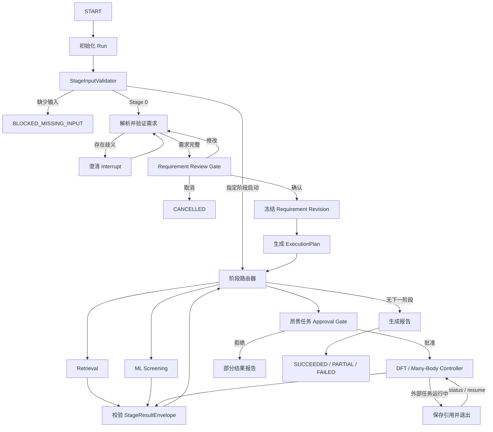

# 材料筛选 Agent：Orchestrator v1 实施计划

版本：v0.1  
日期：2026-07-24  
依据：`material-screening-agent-system-plan.md`

## 1. 目标与完成标准

编排器采用 LangGraph `StateGraph`，负责需求确认、阶段路由、人工审批、状态持久化、失败恢复和报告汇总，不承载具体科学计算。

首版范围：

- 真实实现 Stage 0 → Materials Project 检索 → 报告的 P0 链路。
- 建立 ML、DFT、多体阶段的完整路由和统一接口，使用明确标记的 mock。
- 采用单项目串行、命令式运行；执行到澄清、审批或外部任务等待点后退出。
- 通过 `status`、`respond`、`approve`、`resume` 恢复，不运行后台 worker。
- 同一操作重复执行不得重复提交任务、候选或审批记录。

验收主链路：

> 创建项目 → 提交需求 → 澄清 → 确认需求 → 自动规划 → 检索 → 筛选 → 报告 → 中断后恢复

## 2. 编排模型

### 2.1 顶层状态图



具体节点拆分为：

- `initialize_run`：创建 `run_id`，绑定项目、起始阶段和配置快照。
- `validate_entry_input`：检查目标阶段最低输入，禁止伪造上游结果。
- `parse_requirement`、`validate_requirement`：调用离线 Parser 或 LLM Provider，输出结构化草稿。
- `clarification_gate`：以 LangGraph `interrupt()` 暂停并等待结构化回答。
- `requirement_review_gate`：支持 `approve`、`revise`、`cancel`。
- `freeze_requirement`：生成不可变 requirement revision 和内容 hash。
- `build_execution_plan`：确定性生成阶段列表、理由、前置条件和 Gate。
- `route_next_stage`：依据预算、证据缺口、能力注册表和当前结果路由。
- `prepare_stage`、`execute_stage`、`reconcile_stage`、`validate_stage_result`。
- `generate_report`、`finalize_run`。

v1 使用单个顶层图和 `StageRunner` 服务，不引入嵌套子图；候选级并发由阶段内部控制，顶层图保持串行。

### 2.2 路由规则

- 从 Stage 0 启动时，需求确认后必须执行 Retrieval。
- ML 仅在 `allow_ml=true`、存在可处理的证据缺口且模型适用时进入。
- DFT/多体仅在预算允许、输入完整且对应方法能提升目标证据等级时进入。
- DFT、Many-Body、超预算 ML 和高级方法必须进入审批 Gate。
- LLM 只能帮助解析和解释；阶段选择由版本化 routing policy 决定。
- 未选择的阶段不创建 `stage_run`；审批被拒绝的阶段记为 `CANCELLED`，已有结果保留，顶层运行以 `PARTIAL` 结束。
- “检索结果为空”属于成功执行的科学结果，Retrieval 和 Run 均可为 `SUCCEEDED`，不能标记为工具失败。
- 从任意阶段启动时，只使用已存在且 hash 匹配的 artifact；输入不足时阶段为 `BLOCKED_MISSING_INPUT`、Run 为 `PAUSED`。

## 3. 状态、接口与持久化

### 3.1 核心状态契约

`OrchestratorState` 只保存 JSON 可序列化的小型状态：

- `schema_version`
- `project_id`、`run_id`、`thread_id`
- `requested_start_stage`
- `run_status`、`current_stage`
- `requirement_revision`、`requirement_artifact_uri`
- `execution_plan_uri`、`execution_plan_hash`
- `stage_statuses`
- `candidate_ids`
- `stage_result_uris`
- `external_job_refs`
- `pending_interaction`
- `retry_counters`
- `warnings`、结构化 `errors`
- `created_at`、`updated_at`

CIF、API 响应、候选清单、报告和计算输出只存 Artifact Store，图状态只引用 URI/hash。

新增公共契约：

- `ExecutionPlan`：阶段顺序、选择理由、所需证据、预算、Gate 和 policy version。
- `StageInputValidation`：`valid`、缺失字段、补充方式和 artifact hash。
- `StagePlan`：精确输入快照、参数、资源估计和审批要求。
- `StageOutcome`：`Completed`、`WaitingExternal`、`Blocked`、`Failed`。
- `PendingInteraction`：澄清或审批的类型、ID、展示内容和输入 Schema。
- `ApprovalRecord`：Gate、输入快照 hash、决定、操作者、时间和理由。
- `OperationRecord`：幂等键、尝试次数、状态、结果引用。
- `ErrorRecord`：错误类别、是否可重试、阶段、操作、公开消息和内部诊断。

所有阶段实现统一 `StageRunner`：

- `validate_input(context) -> StageInputValidation`
- `prepare(context) -> StagePlan`
- `start(plan, idempotency_key) -> StageOutcome`
- `reconcile(external_job_ref) -> StageOutcome`

完成结果必须通过既有 `StageResultEnvelope` 校验；mock 信息写入 provenance，并禁止提升到真实 L3/L4。

### 3.2 状态真源

- LangGraph checkpoint：控制流当前位置和可恢复图状态的真源。
- SQLite 业务表：project、run、stage run、approval、operation、external job 的查询与审计真源。
- Artifact Store：文件内容真源。
- 外部 backend：已提交外部任务状态真源。

`thread_id` 固定等于 `run_id`。一个 Project 可以有多个 Run，但同一时刻只允许一个 CLI 调用推进同一个 Run。

使用同步 `SqliteSaver`，并将 LangGraph 框架表与业务表放在同一 SQLite 文件的不同表中；禁止业务代码直接修改 checkpoint 表。官方将 `SqliteSaver` 定位为轻量同步本地场景，符合该 Mac MVP；服务器迁移时替换为 Postgres checkpointer。[LangGraph Checkpoint 文档](https://reference.langchain.com/python/langgraph/checkpoints)

checkpoint 使用严格 msgpack 白名单，状态中禁止对象、密钥、DataFrame 和 pickle fallback。

### 3.3 审批与恢复

- 先由 `prepare_*_approval` 幂等创建审批记录，再进入只负责 `interrupt()` 的 Gate 节点。
- 审批 payload 必须包含 `approval_id`、Gate 类型、输入快照 URI/hash、资源估计和 policy version。
- `approve` 只接受当前仍为 PENDING 且快照 hash 一致的审批；过期审批不得复用。
- Requirement 修改生成新 revision、新 ExecutionPlan 和新审批，历史记录不覆盖。
- `resume` 必须使用原 `run_id/thread_id`；节点中的外部副作用全部放在 interrupt 之后或拆成独立幂等节点。
- LangGraph 恢复时会从发生 interrupt 的节点开头重新执行，因此所有写操作和 backend submit 都必须使用确定性幂等键。[LangGraph Interrupts](https://docs.langchain.com/oss/python/langgraph/interrupts)

幂等键格式：

```text
<project_id>:<run_id>:<stage>:<operation>:<input_snapshot_hash>
```

Artifact 使用临时文件写入、SHA-256 校验和原子 rename；SQLite 对幂等键加唯一约束。

### 3.4 错误与重试

错误分类：

- `TRANSIENT_EXTERNAL`：超时、429、临时 5xx，可自动重试。
- `INVALID_RESPONSE`：非法 JSON、Envelope 不合规；允许一次修复，不能静默换 Provider。
- `MISSING_INPUT`：进入 `BLOCKED_MISSING_INPUT`。
- `NOT_APPLICABLE`：生成证据缺口说明，不视为失败。
- `SCIENTIFIC_NO_MATCH`：正常成功结果。
- `PERMANENT_CONFIGURATION`：凭据、路径、Schema 或不支持的参数错误。
- `BACKEND_INCONSISTENT`：本地与 backend 状态矛盾，停止推进并要求检查。
- `APPROVAL_DECLINED`：阶段取消，保留已有结果。

默认瞬时错误最多执行三次，指数退避并带 jitter；耗尽后阶段为 `RETRYABLE_FAILED`、Run 为 `PAUSED`。确定性错误不自动重试。P0 必需阶段永久失败时 Run 为 `FAILED`；可选后续阶段失败但已有有效结果时生成 `PARTIAL` 报告。

## 4. CLI 与实施顺序

CLI 固定为：

```bash
material-agent project create
material-agent run --project <id> --request "..."
material-agent run-stage <retrieval|ml|dft|many-body> --project <id>
material-agent status --project <id> [--run <id>]
material-agent respond --project <id> --run <id> --interaction <id> --json <payload>
material-agent approve --project <id> --run <id> --approval <id> --decision <approve|reject> [--reason "..."]
material-agent resume --project <id> --run <id>
material-agent retry --project <id> --run <id> --stage <stage>
material-agent cancel --project <id> --run <id>
material-agent report --project <id> --run <id>
```

实施分四步：

1. 建立 Pydantic 契约、状态枚举、SQLite 业务表、Artifact Store 和 LangGraph checkpointer。
2. 实现 Requirement 节点、澄清/确认 interrupt、不可变 revision、ExecutionPlan 和确定性路由。
3. 接入 Retrieval 真实执行链，并完成 Envelope 校验、错误分类、幂等 operation ledger 和报告。
4. 接入 ML/DFT/Many-Body runner 骨架与 mock，完成昂贵任务审批、外部状态 reconcile 和 CLI 恢复。

## 5. 测试与验收

必须覆盖：

- 状态转换表和 routing policy 的纯函数单元测试。
- Requirement approve、revise、cancel，以及旧审批 hash 失效。
- 固定 Si/O 用例从输入到候选报告的离线 E2E；真实 MP 测试作为需 API key 的可选集成测试。
- 在澄清、审批、Retrieval 完成后和外部任务运行中强制终止进程，再由新进程恢复。
- 重复执行 `run`、`approve`、`resume`、backend `submit` 不产生重复记录或任务。
- 从 ML/DFT/多体直接启动时，准确返回缺失字段和补充方式。
- 审批拒绝后阶段为 `CANCELLED`、Run 为 `PARTIAL`，已有 artifact 仍可报告。
- API 超时、限流、非法 LLM JSON、CIF 失败、Envelope 错误、checkpoint 损坏和 backend 状态倒退。
- 零候选为成功；部分候选失败为 `PARTIAL`；mock 永远不能生成真实 L3/L4 证据。
- secret 脱敏、路径越界拒绝、Artifact hash 校验和审批/event 审计完整性。

最终验收要求：同一个 `run_id` 在跨进程恢复后得到相同 requirement、candidate ID、artifact hash 和外部任务引用，且所有阶段状态、审批、错误与证据等级均可追溯。

## 6. 已确认假设

- 首版采用“完整四阶段骨架 + P0 真实实现”。
- 默认由版本化政策自动路由，不要求用户逐阶段选择。
- 编排器无后台 worker；长任务通过 `status/resume` 显式对账。
- 有限自动重试，仅处理明确的瞬时错误。
- 拒绝昂贵阶段不会取消已有工作，而是输出部分报告。
- Python 3.11、Pydantic v2、LangGraph 1.x 和兼容的 SQLite checkpoint 包统一锁定版本。
- 当前仅支持单用户、单项目串行调用；服务器阶段再迁移 PostgreSQL、任务队列和多用户权限。
