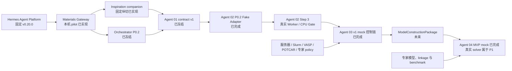

# Material Screening Agent：主实施计划

> **职责：** 本文档是项目管理真源，只维护当前里程碑、任务状态、两周计划、验收、工程评测、依赖、风险、阻塞项和下一步；长期目标与科学政策见系统蓝图，稳定技术设计见技术架构。
>
> **文档导航：** [系统蓝图](../docs/system-plan.md) · [技术架构](../docs/architecture.md) · [原始总方案](../docs/system-plan-original.md)
>
> **来源说明：** 本计划由原始总方案的项目管理章节拆分而来，并根据
> [README](../README.md)、[Orchestrator 计划](subagents/material-screening-orchestrator-plan.md)、
> [Agent 01 计划](subagents/material-screening-agent01-plan.md)和
> [Hermes 与灵感生成器计划](subagents/material-screening-inspiration-plan.md)、
> [Agent 02 计划](subagents/material-screening-ml-agent-plan.md)、
> [Agent 03 计划](subagents/material-screening-agent-dft-plan.md)及
> [Agent 04 计划](subagents/material-screening-agent04-plan.md)中明确记录的状态更新。当前可运行能力以 README、源码、配置和测试为准。
> 只有这些仓库文档明确确认完成的事项才标为 `[x]`；无法确认的事项保持 `[ ]`。

状态基准日期：2026-08-09

### 当前科研轨道：平带/窄带灵感生成 Benchmark

当前最高优先级已从功能扩展转为真实科研评测。工程基线先通过 public Draft PR 固定，
随后依次完成开源数据源许可/字段审计、预注册与标注手册、30-case 双专家 Pilot、
120-case family-disjoint benchmark、B0 以及 E1/E2/E3 单因素消融，最后才允许融合和
一次 locked-test 评估。详细计划和清单见
[`flatband-benchmark-20260809`](../artifacts/experiment/flatband-benchmark-20260809/PLAN.md)。

当前研究范围只包含 flat/narrow-band inspiration，不评估 novelty。现有 Crossref run、
synthetic evaluation fixture、专家审查 Schema 和 semantic provider contract 都是工程证据，
不能替代真实专家金标。首个语义实验使用大模型对受限 metadata packet 进行本地结构化
推理，不引入外部 embedding API；多源检索必须服从与 B0 相同的八次物理请求预算。

当前正在冻结独立的 `src/material_agent/research/` 科研契约、`aNDCG@5` 指标、泄漏组
bootstrap/randomization 统计、预注册和标注手册。Pilot 的 ordinal Krippendorff alpha
必须达到 0.80；`[0.667, 0.80)` 只允许修改手册并在完全不重叠的 30-case R2 复测，低于
0.667 或 R2 未达 0.80 即停止扩展。专家身份、指南、split、模型和 prompt 的哈希闭合前
不得启动正式标注。

2026-08-09 的独立红队将当时 Pilot 判为 NO-GO：现有公式可保留，但 reviewer-safe 投影、完整
`case × system` 执行矩阵、泄漏图 connected component、单向 run/ranking 哈希、raw review 到
final gold、case-level duplicate partition、system config/信息预算及 expert calibration/COI
尚未闭合。该历史发现的候选修复已进入当前 V3 工作树，但尚未取得新的独立 GO。具体顺序见
[`READINESS_REVIEW.md`](../artifacts/experiment/flatband-benchmark-20260809/READINESS_REVIEW.md)；
这些项未完成前不得用 schema/test 通过替代真实科研 Gate。

当时 active Gate 是 `PILOT_PROVENANCE_CLOSURE`。该历史阶段只实现并对抗验证 reviewer-safe
有界证据投影、私有 identity map、完整 execution matrix、单向 budget/ranking/terminal
闭包、raw/adjudication/final-gold exact coverage、case-level expert duplicate partition、
leakage connected-component 和 expert calibration/COI 绑定；不构建真实 Pilot case，
不调用网络或模型，不读取专家标签，也不比较 B0/E1/E2/E3 性能。只有独立红队重新给出
Pilot GO 且冻结对象形成新内容哈希后，下一节点才是 30-case Pilot R1。

2026-08-09 的历史工作树复核维持 canonical action `iterate`：研究定向测试为
`91 passed`，已推送 Draft PR #4 的 GitHub Actions 为绿色，但本地生成器
`scripts/generate_flatband_research_contracts.py --check` 因科研 Schema 漂移而正确失败。
局部模型可重放不等于 Pilot readiness；目前仍须关闭完整 FrozenCase/pre-run eligibility、
安全 reviewer manifests/private maps 到 pooled Gold 的 exact cover、由完整 case 与固定算法
重放的 leakage group、正式 Pilot agreement input、专家真实独立性/校准集不重叠、
receipt-to-evidence provenance、campaign prerequisite 和由 Execution/Gold 唯一派生的
AnalysisInputRelease。完成并重新生成内容哈希、通过独立红队之前，禁止启动网络、模型或专家
Pilot。该 generator drift 已由 2026-08-10 audience-split V3 draft bundle 替代；当前状态以下方
`PILOT_STRUCTURE_LEAKAGE_CLOSURE` checkpoint 为准。

2026-08-09 的 leakage V2 合并审计发现新的设计反例：若把只有十个枚举值的宽泛
`MechanismFamily` 本身作为 connected-component 连边，则全 Main universe 理论上最多只有十个
独立 component，且同一 family 不能同时出现在 development/IID/OOD；这与预注册的
`20/10/10` component 下限和 IID 语义不可同时满足。canonical action 仍为 `iterate`：保留
宽泛 mechanism 作为抽样分层和 OOD holdout taxonomy，把正式独立性连边改为由冻结证据和
算法重放的细粒度 mechanism lineage；在诚实的 Main120 正例、伪 lineage 反例和更新后的
功效 Gate 通过前暂停正式 AnalysisInput/Main 路径。拒绝的替代是降低 component 下限或给每个
case 自报唯一 mechanism group，因为两者都会制造虚假的独立样本数。

### 2026-08-10 科研 Gate checkpoint

- **已验收的顺序节点：** GitHub Draft PR #4 仍为 open/draft/mergeable；已推送
  head `9b2beffc13a778a77d7b133d562cb89e5e205ba0` 的离线 Gate 与 GitGuardian
  均为绿色。该远端证据只覆盖已推送 head，不覆盖当前本地科研改动。开源数据源正式审计
  已冻结 20 个唯一来源（12 `INCLUDE`、5 `CONDITIONAL`、3 `EXCLUDE`），catalog 与
  row schema 均有独立 SHA-256 sidecar；row schema 只接受本目录声明的标准 SPDX
  表达式或显式 `LicenseRef-*`，未知许可继续 fail closed。
- **当前 active Gate：** `PILOT_STRUCTURE_LEAKAGE_CLOSURE`；canonical action
  `iterate`。结构近重复决定 bootstrap/randomization 的独立单位，因此它是科研有效性
  Gate，而不是可推迟的工程优化。
- **当前本地实现证据：** 计划提交树在排除尚未接入结构证据的顶层 Pilot 草案后，完整
  离线 Gate 为 `1291 passed, 15 skipped, 365 warnings`，耗时 `2605.24 s`
  （wall `2607.71 s`，峰值 RSS `636878848 B`）。跳过项仅为显式 opt-in live、真实 ML、
  隔离 MCP/stdio 与非 Linux `/proc` 条件。audience-split Schema generator、contract
  bundle、`pip check`、全仓 `py_compile` 和 diff check 均通过。该证据只说明实现检查点
  自洽；未运行网络、真实模型、真实 30-case Pilot 或专家标注，不构成科研性能证据或
  Pilot GO。
- **CI 执行边界：** Draft PR head `e0a9f6b` 的首次远端 Gate 没有出现断言失败，但单一
  pytest step 在 `22%` 处触发 60 分钟硬超时，后置步骤因此未执行。普通/生产 suite 与
  平带科研合同现按用途拆分：前者本地为 `1008 passed, 15 skipped`（`112.31 s`）；后者
  283 个测试节点按 analysis、blinding/gold、cases/experts、execution、
  leakage/contracts/structure 五个互斥分片并行运行。分片只改变 CI 调度，不删除断言；
  远端新 head 全部通过前，Draft PR 继续视为 `UNSTABLE`。
- **已闭合的设计反例：** final case/hash 包含结构分组结果会形成输入输出循环；
  release-local structure group ID 不能证明 calibration、R1、R2 之间无近重复。
  二维真空厚度、全局平移和数值微扰对 3D space-group/StructureMatcher 的影响，
  以及 `symprec=0.001 Å` 对约 `0.002 Å` 合成扰动的敏感性，目前只是本地
  exploratory smoke 观察；在固定 runner 与攻击 fixture 落盘前不作为已证实科研结果。
- **当前修复边界：** 私有原始结构字节必须经固定 parser 重放为 normalized payload；
  2D 要求唯一真空轴、layer-group、真空与原点平移不变签名，3D 使用预注册多阈值的
  保守并图；pre-group slot/candidate identity 必须排除 final case/group identity；
  calibration、当前 round 与 prior round 必须合并原始 normalized payload 重新验证。
- **下一可执行动作：** 当前原始 CIF/POSCAR/PYMATGEN_JSON 封存、解析重放和维度证据已有
  本地正例/攻击测试；下一步实现仍保持 fail-closed 的 structure compute/finalize、二维
  layer-group/三维多阈值并图和跨 round union，再把 private release exact-bind 到
  CandidatePoolV3、Calibration、PreBudget、Execution 和 Pilot 顶层 closure；随后
  才同步预注册、标注手册与 public/private schemas。新的结构 Gate、R1/R2 Gate 和完整
  V3 红队通过前，不构建真实 30-case、不调用网络/模型，也不读取专家标签。

public production 仍为 NO-GO：queued production 与 worker lifecycle 已激活，但 parent
worker 被 hard-kill 后独立 action child 的清理/回收契约仍未闭合；真实 provider 全链、
branch protection、required review 和科学 performance Gate 也未完成。

### 当前 P3：Hermes 平台与灵感生成器

用户已将当前目标升级为持续的系统工程：通过 Hermes 统一 Agent/Skill/Tool 开发入口，
完成“灵感生成器”，并在当前 Mac 上调试到真实流程产生首批非空、可审计结果。详细契约、
里程碑和实机 Gate 见
[Hermes 与灵感生成器计划](subagents/material-screening-inspiration-plan.md)。

当前路线冻结为：

- Hermes 作为进程外上层 Agent 平台；现有 LangGraph/SQLite/Artifact Store 继续作为唯一
  科学事务真源；
- 首版通过窄 Gateway/Tool 契约接入，不把 Hermes 安装进主 `.venv`，不让两个系统同时
  拥有相同审批、恢复或 backend 状态；
- 灵感生成器先作为 companion capability，不立即修改冻结的四阶段 `StageId`；
- 主链为 `metadata-first search → Passage → EvidenceCard → TagGraph/BridgePacket →
  白名单 transformation → 内部去重 → 多样性 Top-K`；
- 本阶段明确不做 novelty/prior-art 判定，不输出“新材料”结论；
- 每个可独立验证里程碑形成提交并推送 `hermes-origin/main`。

当前 P3 的 M0–M5 工程目标均已通过。Hermes/Gateway 使用独立环境和进程；真实 Crossref
metadata Gate、真实 pymatgen structure proposal、MCP 外 operator 审批、SQLite 恢复和
非空 bundle 均已通过。用户完成 Provider 设备授权后，自然语言 Hermes session 已实际
完成 `run → get → act → result`：先在 `INTERACTION_REQUIRED` 停止，再基于用户明确决定
消费一次性 grant，最终得到 hash-verified `PARTIAL` Gateway 状态与 `SUCCEEDED` bundle。
固定 Hermes run 使用离线 fixture，公共搜索能力由分离的 Crossref live Gate 证明；两项
证据不得合并描述成一次联网 Agent turn。公开 PR `#1` 已在 GitGuardian 成功后合并到
`hermes-origin/main`，merge commit 为 `e044df1`。

本次增加 Agent01 Materials Project 富媒体检索报告：发布候选的下游 manifest
仍保持 `agent01-contract-v1`，附加报告证据使用独立的 enrichment、PNG 和 gzip
Artifact；Top-N 重端点限额进入运行指纹。该增量新增 `mp-pyrho==0.5.1` 与显式
Matplotlib 依赖；包含后续 Hermes inspiration 纵切的当前完整离线 Gate 已记录为
`668 passed, 13 skipped, 362 warnings`。

### 本次 P2：系统 v1 收尾范围

本次工作只对齐仓库已经存在的实现、测试和文档，不扩展真实科学计算能力。验收范围
包括：审核 README 与各分计划的实际状态；冻结 `retrieval → ml → dft → many_body`
路由及 v1 能力边界；复核缺输入、未注册 capability、审批拒绝、跨进程恢复、重复
提交、Artifact/hash 篡改与 mock evidence ceiling；运行完整离线 Gate、`pip check`
和 `git diff --check`。

依赖与边界：Agent01 是默认生产科学 Runner；Agent02 只有在
`MATERIAL_AGENT_ML_WORKER_PYTHON` 及其 lock/model-card/health 校验通过后才注册，
当前 L2 审计范围限于 3D 单质 Si；Agent03/04 仍仅有 mock 控制链。benchmark、扩展
适用域、OOD/不确定性校准不属于本 P2。不修改 Agent01/02 原生公共契约、Orchestrator/
checkpoint schema、数据库迁移、requirements.lock 或科学阈值，不运行联网/真实 MP Gate。

## 1. 当前里程碑

当前主里程碑：

> **完成 Hermes 分层接入和灵感生成器真实闭环：固定 Hermes 版本、冻结 Tool/Skill/Artifact
> 契约，以真实公共文献搜索和真实 pymatgen parent structure 产生至少一个可追溯
> BridgePacket、结构有效 proposal 和多样性 selected candidate。**

保留的系统 v1 基线为：

> **系统 v1 发布基线已冻结；Agent02 真实 CHGNet worker 的 CPU/MPS、Top-5 恢复和生产
> `run-stage` Gate 已完成。生产注册仅由显式 Worker 配置触发；缺失或无效配置保持
> fail-closed。科学 benchmark、扩展适用域和不确定性校准仍属于后续 P1。**

当前已合入的增量包括：Agent01 单来源公开数据库 Adapter（Materials Project、NOMAD、
MC3D、C2DB、Topological Quantum Chemistry，以及结构受限的 NIMS SuperCon
元数据）、Stage 0 DeepSeek Provider、Agent02 benchmark/DeepH companion flow，以及
Agent03 结构化 VASPilot bridge PoC。Materials Project `agent01-contract-v1` 与冻结
fixture 保持不变；所有非 MP 来源使用 `agent01-contract-v2`，缺失性质不跨库补值。
Atomly 因无公开授权 API 保持外部阻塞；这些新增检索控制流仍不等于真实 DFT/多体能力。

### 1.1 已确认基线

| 组件 | 状态 | 仓库依据 |
|---|---|---|
| Orchestrator | P0.2 已完成；控制、阶段计划和报告契约已冻结 | [`Orchestrator 计划`](subagents/material-screening-orchestrator-plan.md) |
| Agent 01 | P0 与增强 Gate 已完成；MP v1 保持冻结；NOMAD/MC3D/C2DB/TQC/NIMS SuperCon 单来源 v2 接入已实现，Atomly 等待授权 API | [`Agent 01 计划`](subagents/material-screening-agent01-plan.md) |
| Hermes / Inspiration | 单用户本机 pilot 已实现：固定 Hermes、四工具 Gateway、operator 审批、公共 metadata Gate、结构 proposal、非空 MCP bundle 与自然语言授权 turn 均已通过 | [`Hermes 与灵感生成器计划`](subagents/material-screening-inspiration-plan.md) |
| Agent 02 | Step 1/1.1、P0.2 Fake 路径及 Step 3 独立 CHGNet worker/CPU Gate 已完成 | [`Agent 02 计划`](subagents/material-screening-ml-agent-plan.md) |
| Agent 02 生产接入 | 目标 Mac CPU/MPS parity、单次 CPU 回退、Top-5/恢复/资源记录和显式 production factory 已完成；默认无配置时仍不可用 | [`Agent 02 计划`](subagents/material-screening-ml-agent-plan.md) |
| Agent 03 | v1 mock 控制链、审批、恢复、失败注入、报告、fixture 和结构化 VASPilot bridge PoC 已完成；真实 DFT backend 未实现或注册 | [`Agent 03 计划`](subagents/material-screening-agent-dft-plan.md) |
| Agent 04 | MVP mock 控制链、模型校验/路由、审批、恢复、报告与 fixture 已完成；真实 ED/多体 backend 未实现或注册 | [`Agent 04 计划`](subagents/material-screening-agent04-plan.md) |
| 联网 LLM | DeepSeek `deepseek-v4-pro` Provider 与 `LLMRequirementParser` 已实现并显式配置启用；离线 Gate 与真实单请求 `live_llm` 发布 Gate 均已通过 | [`README.md`](../README.md) |
| 研究顾问 | `research-advice` 读取冻结报告并生成受限证据缺口/下一步提议；默认离线，LLM 只可解释固定提议且不能执行 | [`Orchestrator 计划`](subagents/material-screening-orchestrator-plan.md) |

历史 P0/v1 收口验证基线为：

- 完整离线 Gate：`337 passed, 7 skipped`；
- 跳过项为显式 opt-in 的两个 `live_mp` 和五个 real-ML/Metal Gate；
- `pip check` 无破损依赖，`git diff --check` 通过；
- 本次没有运行 live Materials Project 测试、访问网络或读取/生成 `MP_API_KEY`；
- Agent 01 是当前唯一生产科学 Runner；
- Agent 02 仅在显式 worker 配置通过校验后注册；Agent 03/04 未注册生产 capability，
  不得用测试 fixture 冒充科学结果。

P2 收口后的历史 `main` 快照为 `413 passed, 9 skipped, 142 warnings`。加入后续来源与
Hermes inspiration 纵切后，当前工作树的完整离线 Gate 为
`668 passed, 13 skipped, 362 warnings`；跳过项是隔离 Gateway 环境中的两项 MCP/stdio、
显式 opt-in 的 Crossref/LLM/MP/NOMAD live probes 和五项 real-ML Gate。warning 为已知
pymatgen/spglib 提示。历史分计划中的较小测试数字只记录当时任务快照；当前状态以
`668/13/362`、源码和测试为准。
Agent03/04 mock 控制链及 bridge PoC 不等于真实科学后端。

2026-08-04 的公开来源复检确认 NOMAD 与 C2DB 均可通过受控访问链路完成真实 Agent01
检索。对 `topological_flat_band`，来源 coverage 明确缺少的平带证据现在必须产生
`UNCERTAIN` 而非 `PASS`；该变化保持“数据库未明确证伪即可发布下游”的既定策略，但
不把结构/元素匹配误表述为平带确认。具体运行证据和限制记录在 Agent01 计划。

### 1.2 当前 v1 验收目标

v1 的系统级退出目标是：

> 一个新环境可以按 README 复现需求确认、真实 Materials Project 检索、确定性筛选、报告与恢复；Agent 02 可以通过已冻结 P0.2 接口完成受控真实 ML 小批量；Agent 03/04 可以严格校验输入、审批、执行可信测试生命周期且不产生伪科研证据。

与长期科学边界相关的要求只在[系统蓝图](../docs/system-plan.md)维护；控制契约、状态和数据真源只在[技术架构](../docs/architecture.md)维护。

## 2. 两周实施计划

本节保留原始两周计划，并按仓库中明确证据更新状态。它是初始 84–98 小时范围的跟踪表，不表示仍按原日历日期执行。

### Day 1：工程骨架

- [x] 建立 Python 3.11 项目环境和依赖锁定基线。
- [x] 建立代码、日志和测试结构。
- [x] 定义核心 Pydantic Schema。
- [x] 建立 SQLite 业务状态、checkpoint 与本地 Artifact Store。
- [x] 建立可运行的 pytest 基线。

交付目标：Schema、项目创建、状态持久化。

### Day 2：Stage 0

- [x] 保存原始输入。
- [x] 实现 Offline Parser。
- [x] 抽象可替换 Parser Protocol。
- [x] 实现澄清问题、Requirement revision 和 CLI 人工确认。
- [x] 实现显式启用、fail-closed 的 DeepSeek `LLMRequirementParser`、安全密钥来源和离线 Gate。
- [x] 增加独立 `requirement parse` 草稿输出、自然语言澄清和离线冻结回归集。
- [x] 实现多轮自然语言澄清；只在问题清空后进入 Requirement Review。
- [x] 真实 `live_llm` Gate 已通过并发布显式启用的联网 Provider（`1 passed`，`26.56s`）。

交付目标：自然语言/固定语法到已确认、不可变的 `requirement.json`。

### Day 3–4：Agent 01 查询与规范化

- [x] 实现 Materials Project Adapter 和离线 fixture Adapter。
- [x] 实现单 Run 单来源选择和 NOMAD public Archive Adapter；NOMAD 结果使用 v2，
      不改变 MP v1 冻结输出。
- [x] 实现查询参数生成、能力/数据库版本快照和受控重试。
- [x] 保存原始响应、来源和 provenance。
- [x] 保存 source JSON、canonical CIF 和稳定结构身份。
- [x] 规范化 Candidate、Property 和缺失字段语义。

交付目标：真实 Materials Project 候选集。

### Day 5：筛选、去重与报告

- [x] 执行确定性硬约束。
- [x] 实现 candidate/structure ID 和结构 hash。
- [x] 实现 `PASS/REJECT/UNCERTAIN/FAILED`。
- [x] 实现精确重复标注、非破坏性结构聚类和确定性排序。
- [x] 生成 JSON/Markdown 报告和下游 manifest。

交付目标：P0 端到端检索结果。

### Day 6：LangGraph 串联

- [x] 实现顶层状态图与四阶段路由。
- [x] 实现 checkpoint/resume。
- [x] 实现需求和昂贵任务审批节点。
- [x] 实现错误分类、幂等 operation ledger 和外部任务对账。
- [x] 实现 `run/status/respond/approve/resume/retry/cancel/report/run-stage`。

交付目标：可中断恢复的 P0 控制面。

### Day 7：P0 验收与缓冲

- [x] 完成固定 Si/O 离线验收。
- [x] 完成 Agent 01 standalone 与 Orchestrator restart 的真实 MP opt-in Gate。
- [x] 增加 API、Parser、结构、Artifact 和恢复失败测试。
- [x] 在 README 中记录可复现演示和已知限制。

交付目标：冻结可复现的 P0 基线。

### Day 8–9：Agent 02 最小实现

- [x] 实现 Agent 02 原生严格契约和确定性 pre-filter。
- [x] 实现 Model Registry、适用域、证据和结构 lineage 纯函数。
- [x] 实现 Fake Model Adapter/Fake Worker 与冻结 fixture。
- [x] 保证 mock/fixture 不能晋级 L2。
- [x] 实现 `Agent02RunnerAdapter` 的 P0.2 五方法生命周期。
- [x] 实现候选级 operation ledger、重复 start、跨 attempt 复用和篡改检测。
- [x] 完成 1–5 自动、6–20 动态审批、超过 20 预先阻塞的 Fake/控制面测试。
- [x] 建立独立 Python 3.11 ML worker 环境并锁定依赖。
- [x] 完成真实 CHGNet CPU 小样例和标准 200 步上限 Gate。
- [x] 完成真实 CPU Top-5、候选级恢复和资源记录。
- [x] 完成目标 Mac MPS Gate。
- [x] 通过全部 Gate 后以显式 runtime config/factory 注册生产 ML capability。

交付目标：L2 接口、可解释筛选漏斗和受控真实 ML 基础能力。

### Day 10：Agent 03 Adapter

- [x] Orchestrator 已提供通用昂贵任务审批、`WaitingExternal`、reconcile 和 cancel 控制能力。
- [x] 实现 Agent 03 v1 原生 `DFTRequest`、claim、workflow plan 和结果契约。
- [x] 实现 v1 mock 输入校验、确定性 plan 和控制级资源估计。
- [x] 实现 `MockDFTBackend` 的 submit/status/cancel/fetch。
- [x] 实现 Agent 03 Runner/Adapter、幂等、审批和恢复。
- [x] 冻结不产生伪科研数值的 DFT fixture、报告和测试。
- [x] 完成工程用途的 VASPilot structured bridge mapping PoC；真实接入仍属于未来 P2，
      不注册生产 capability、不连接真实 VASPilot/Slurm/VASP/POTCAR。

交付目标：不冒充真实计算的 DFT 状态链路。

### Day 11：Agent 04 Adapter

- [x] Orchestrator 已提供 many-body capability descriptor、输入阻塞和测试生命周期控制能力。
- [x] 实现 `EffectiveModelPackage` 与多体原生契约。
- [x] 实现物理完整性、linkage 和证据范围校验。
- [x] 实现 Solver Capability Registry、路由和资源估计。
- [x] 实现 `MockManyBodyBackend` 和缺输入/不适用演示。
- [x] 实现 Agent 04 Runner/Adapter、审批、恢复和报告。
- [x] 冻结 1D Hubbard 与 2D 小格点 fixture。

交付目标：多体阶段接口、输入边界和不晋级伪 L4 的控制链。

### Day 12：审计、安全和恢复

- [x] 实现审批、operation、external job 和 event 的持久化审计。
- [x] 实现 secret redaction、路径保护和 Artifact hash。
- [x] 实现有限 retry、状态倒退和 backend 不一致防线。
- [x] 实现 Project 级推进锁和 status 只读语义。
- [ ] 完成 Agent 02 阶段专用 worker sandbox、输出大小和超时恢复 Gate。
- [x] 完成 Agent 03/04 mock 原生 Artifact、安全和失败注入 Gate。

### Day 13：综合测试与文档

- [x] 完成 P0 的 unit、contract、integration、E2E 和 opt-in live Gate。
- [ ] 完成 Agent 02 生产接入后的分层 Fake/real CPU/Mac/E2E Gate。
- [x] 完成 Agent 03/04 mock 控制链 contract/integration/E2E Gate。
- [x] 完成四阶段 P0 安全回归和任意阶段启动矩阵。
- [x] 更新 README 中 P0 配置、mock 演示和限制。

### Day 14：缓冲与展示

- [ ] 只修复 v1 阻塞缺陷。
- [ ] 冻结最终 demo 数据与 fixture。
- [ ] 生成最终架构说明、运行证据和结果报告。
- [ ] 列出并确认下一阶段资源申请清单。

## 3. P0 收口已完成项

Agent 02 Step 2 已在不扩展真实 CHGNet、DFT 或多体后端的边界内完成：

- [x] 从 `StageExecutionContext` 安全加载 Requirement、Agent 01 manifest、来源结构和可选 `stage_request`。
- [x] 重算并验证全部 Artifact URI/hash、Schema、revision 和结构引用。
- [x] 实现 `Agent02RunnerAdapter.validate_input()`，区分缺失、完整性失败和 21+ 候选硬上限。
- [x] 实现幂等 `prepare()`，依次冻结 `MLStagePlan` 与 `PreparedStagePlan`。
- [x] 将 1–5 无审批、显式 6–20 审批、超过 20 阻塞映射到控制面。
- [x] 实现 `start()` 的双计划复核、Fake Worker 调用和 Adapter 权威 Artifact finalization。
- [x] 实现候选级和阶段级 `operation-complete.json`，覆盖重复 start 与跨 attempt 复用。
- [x] 对完成记录缺失、篡改或冲突返回 `BACKEND_INCONSISTENT`，不得静默重算。
- [x] 为同步 v1 的 `reconcile/cancel` 返回明确 unsupported 语义。
- [x] 完成显式 runtime `run-stage ml` Fake E2E 和要求 L2 的整图 fail-closed E2E；
  默认 CLI 不注入测试 registry，继续报告 capability unavailable。
- [x] 确认默认 production `StageId.ML` 仍为 `registered=false`。

Agent03 v1 和 Agent04 MVP mock 控制链也已完成各自契约、审批、operation/external
job、跨进程恢复、Artifact/hash 与 evidence ceiling 测试。新增的四阶段综合安全回归
确认固定 route 顺序，并确认默认 registry 对 Agent03/04 为
`CAPABILITY_UNAVAILABLE`；Agent02 无有效 worker 配置时同样 unavailable，只有显式
配置通过校验后才注册，不创建伪造下游 native result。

| P0 边界 | 当前明确行为 |
|---|---|
| 缺输入 | 在 prepare/submit 前返回 `BLOCKED_MISSING_INPUT` 或完整性失败，不补造 Artifact |
| 未注册 capability | 默认 Agent02（无有效 worker 配置）/03/04 返回 `CAPABILITY_UNAVAILABLE`，不调用 Fake/mock |
| 审批拒绝 | Stage 为 `CANCELLED`，不创建 backend operation/job；已有上游结果可形成 `PARTIAL` |
| 跨进程恢复 | Orchestrator/Agent01 checkpoint 可恢复；Agent03/04 从冻结 plan、operation 和 external ref 对账；Agent02 同步路径复用完成记录 |
| 重复提交 | 同一 operation/idempotency key 复用既有结果或 external job，冲突 fail closed |
| Artifact/hash 篡改 | 返回 `BACKEND_INCONSISTENT`/完整性失败，不静默重算 |
| mock evidence ceiling | Agent02 不超过 L1；Agent03 不产生 L3；Agent04 不产生 L4 且 observables 为空 |

限制：固定四阶段 route 与各阶段显式启动/安全失败已验证，但默认 production registry
不会形成四阶段科学成功链。Agent03 也不能替代专家生成 Agent04 所需的
`EffectiveModelPackage`；真实阶段间数据交付仍属于后续科学里程碑。

详细输入、Artifact 和退出条件见
[Agent 02 计划第 8.2 节](subagents/material-screening-ml-agent-plan.md#82-step-2p02-adapter审批和恢复)。

## 4. v1 Definition of Done

### 4.1 当前已确认

- [x] 能创建项目并持久化。
- [x] 能接收自然语言或离线演示请求。
- [x] 能生成结构化 Requirement 并要求用户确认。
- [x] 能真实查询 Materials Project。
- [x] 能保存来源结构、数据库版本和 provenance。
- [x] 能执行确定性筛选并生成候选报告。
- [x] 能区分 `PASS/REJECT/UNCERTAIN/FAILED`。
- [x] 能跨进程中断并 `resume`。
- [x] 能从任意阶段以显式输入启动，并在缺输入时给出可审计阻塞。
- [x] 所有通用审批、operation 和 external job 生命周期均有记录。
- [x] 控制面与 Agent 01 已完成操作具备幂等性与 Artifact 完整性检查。
- [x] secret 不进入源码、fixture 或项目 Artifact。
- [x] P0 核心 unit、contract、integration、E2E 和真实 MP Gate 已通过。
- [x] README 能让另一名开发者复现 P0。
- [x] Agent 02 P0.2 Fake Adapter 完成并通过显式测试 registry 的 runtime E2E。
- [x] Agent 03 v1 mock 输入、计划、claim、backend、审批、恢复和报告链完成。
- [x] Agent 04 MVP EffectiveModel、路由、mock backend、审批、恢复和报告链完成。
- [x] DFT/多体 mock 明确 `is_mock=true`、无伪科研数值且无法晋级 L3/L4。
- [x] 四阶段 route、安全边界、失败注入和报告措辞 P0 Gate 通过。

### 4.2 尚未满足

- [x] 独立真实 ML worker和 CHGNet CPU Gate 通过。
- [x] 真实 CPU Top-5 E2E、候选级恢复和资源记录通过。
- [x] 目标 Mac MPS Gate 通过。
- [x] 生产 ML capability 仅在全部真实与安全 Gate 后由显式配置注册。
- [x] README、运行说明和已知限制已更新；未引入真实运行产物或资源申请。

只有第 4.1 与第 4.2 节全部完成，系统 v1 才可宣告完成。
真实 DFT 与多体 backend、科学 benchmark 和对应生产注册属于后续 P2/P1 科学
里程碑，不是系统 v1 的退出条件，也不能由 P0 mock 控制链替代。

## 5. 工程指标、评测集与失败注入

### 5.1 交付工程指标

- [x] P0 固定 Requirement 和检索契约具有严格 Schema 与回归测试。
- [x] 固定 Si/O 用例的查询参数与确认后的 Requirement 一致。
- [x] Agent 01 每个发布候选具有来源 ID、结构引用/hash 和 provenance。
- [x] Agent 01 API 瞬时失败可重试，完成操作可从 checkpoint/Artifact 恢复。
- [x] Agent 01 同一请求重复执行不会重复查询或创建候选。
- [x] Orchestrator 的审批、计划和输入快照通过不可变 hash 绑定。
- [x] `status` 只读；只有 `resume` 对账外部任务。
- [x] fixture/mock 不得提升真实证据的控制面测试已存在。
- [x] Agent 02 真实与 Fake 路径通过同一 Adapter/Worker 契约和恢复矩阵。
- [x] Agent 03/04 原生 mock 不产生科学数值，并通过各自 evidence ceiling 测试。
- [x] 离线 Stage 0 冻结回归集的 Requirement Schema 与已声明硬约束翻译通过率为 100%。
- [ ] 全系统 Requirement Schema 校验通过率在冻结评测集达到 100%。
- [ ] 全系统硬约束翻译在冻结回归集达到 100%。
- [x] P0 mock 控制链的人工审批具有不可变记录和篡改/过期快照测试。
- [x] 四阶段 P0 核心单元、契约、集成和 E2E 测试全部通过。

### 5.2 初始评测集

工程回归集：

- [x] 简单半导体检索；
- [x] 元素包含/排除；
- [x] 缺失阈值与澄清；
- [x] 数据库无结果；
- [x] API 失败与重试；
- [x] 重复结构与稳定身份；
- [x] 从 ML/DFT/Many-Body 启动但缺少输入；
- [x] 用户拒绝审批；
- [x] 测试外部 backend 的超时、失败、取消与状态倒退；
- [ ] Agent 02 真实模型适用域、数值和恢复集；
- [x] Agent 03 v1 mock DFT 控制链评测集；
- [x] Agent 04 MVP mock 多体控制链评测集。

科学数据集：

- [ ] 为四类强关联目标建立若干已知材料的 silver set，只验证需求表示、路由和证据缺口。
- [ ] 由课题组共同维护正式 gold set，包括正例、负例、边界案例、来源论文和判定理由。
- [ ] 为 ML 建立与冻结 DFT 层级一致的 benchmark。
- [ ] 为真实 DFT 和多体 backend 建立专家批准的数值/claim benchmark。

### 5.3 失败注入

P0/控制面已明确覆盖：

- [x] Materials Project API 超时、限流和临时错误；
- [x] Parser/响应非法；
- [x] CIF/结构解析失败和候选字段缺失；
- [x] 用户长时间未审批、拒绝审批和旧审批失效；
- [x] backend 状态不一致与状态倒退；
- [x] 重复 submit/start；
- [x] Artifact 缺失、hash 篡改和报告中断恢复；
- [x] checkpoint/业务状态不兼容的显式拒绝。

仍需补齐：

- [x] Agent 02 模型不支持元素、健康快照过期、worker handshake/路径/大小/超时失败；
- [x] Agent 02 第 N 个候选中断后的候选级恢复；
- [ ] Agent 03 backend completed 但科学 validator 拒绝；
- [x] Agent 03 submit 响应丢失、取消竞态和结果不完整；
- [x] Agent 04 模型缺字段、solver 不适用、资源拒绝和 mock 证据上限；
- [ ] 最终四阶段报告生成中断和重建。

## 6. 跨模块依赖

依赖规则：

- Hermes 只调用粗粒度 Gateway capability；Requirement、审批、Run/Stage、Artifact 和
  backend 状态继续由本系统拥有。
- Inspiration 首版作为 companion 输出 proposal bundle；它可以消费已校验的 Agent01
  parent structure，但不修改 Agent01 manifest，也不把 proposal 冒充 L1/L2 证据。
- Agent 02 只消费冻结的 Agent 01 manifest、结构和 provenance，不修改 Agent 01 契约。
- Agent 02 Adapter 只接入现有 P0.2 控制流，不修改图拓扑、checkpoint 或业务 SQLite schema。
- Agent 03 依赖明确的候选结构、claim、方法 policy、预算和审批；真实 VASP 后端还依赖服务器资源与许可。
- Agent 04 不以普通 Candidate 或 DFT band structure 代替 `EffectiveModelPackage`。
- 正式 Agent 03 → Agent 04 交付需要未来的模型构建/downfolding 包，而不是隐式参数猜测。
- 任何生产 capability 都必须在自身 contract、安全、恢复和科学 Gate 全部通过后注册。

## 7. 当前风险、阻塞项与待确认事项

| 类型 | 事项 | 当前处理 |
|---|---|---|
| 当前工程风险 | Agent02 生产能力依赖运行进程的 Metal 可见性与显式 Worker 配置 | 无配置、无效配置或 health/fingerprint 漂移均保持 fail-closed；MPS 分类失败只回退一次 CPU |
| 当前工程阻塞 | Codex sandbox 不可访问 Metal，但目标 Mac 非受限 Gate 已通过 | 在实际生产启动进程中保留 health/fingerprint 校验，不将 sandbox 结果误判为硬件故障 |
| 能力缺口 | Agent03/04 只有 mock 控制 Runner，真实生产 backend 未实现或注册 | 保持 `CAPABILITY_UNAVAILABLE`，不得用 fixture 代替 |
| 基础设施阻塞 | 当前无可用 Slurm、合法 VASP/POTCAR 和通过安全 Gate 的 bridge | 真实 DFT 延后到服务器 P2 |
| 科学阻塞 | 课题组 DFT 方法 profile、POTCAR mapping、U/J、磁序等未冻结 | 真实 DFT backend 不得执行 |
| 科学阻塞 | 多体模型构建链、材料 linkage 和首个真实材料目标未冻结 | Agent 04 只能接受完整专家输入；不自动猜测 |
| 评测缺口 | 尚无课题组正式 gold set | 先维持工程回归，逐步建立 silver/gold set |
| 产品限制 | DeepSeek Provider 已通过单请求 `live_llm` 发布 Gate，但仍是显式启用能力 | Offline Parser 继续作为默认；联网配置失败不回退，并保留周期性 live 回归 |
| 迁移风险 | 本地 SQLite/同步 CLI 不适合多用户和长后台任务 | 服务器阶段迁移 Postgres、worker、RBAC 和监控 |
| 新架构风险 | Hermes 与 LangGraph 形成双编排或依赖冲突 | 进程隔离；Hermes 只拥有 Agent 交互，科学事务只有现有 Runtime 一个真源 |
| Provider 可靠性 | 主自然语言链路通过后，三次附加只读报告回归遇到 `Broken pipe` | 不回滚已验证 Gateway 结果；保留失败 usage/会话证据，生产化前增加 provider transport 监控与重试回归 |
| 审批风险 | MCP caller 自报 `confirmed_by_user` 或并发重复执行 | MCP 外 one-time operator grant，绑定完整 execution manifest/interaction/action 并原子消费 |
| 证据风险 | 网页全文、prompt injection 或跨领域联想污染科学结论 | metadata-first、Passage locator、EvidenceCard、Bridge invariant/失效条件和硬预算 |
| 生成风险 | proposal 被误称为新材料或继承 parent 性质证据 | 本阶段不做 novelty；白名单 operator；`scientific_conclusion=false`；性质另行验证 |

需要课题组或用户后续确认的科学事项：

- [ ] 默认 VASP 版本、POTCAR family/release 与每元素 mapping。
- [ ] bulk/2D functional、vdW、ENCUT、k-point 和收敛标准。
- [ ] 磁矩、磁序、U/J、SOC 和高级方法政策。
- [ ] 真实 DFT 的队列、partition、walltime、memory 和 retention。
- [ ] 首个真实多体材料目标、模型构建方法和专家审查人。
- [ ] gold set 的维护人、来源与判定流程。

这些事项不影响已完成的 P0 mock 控制链，但会阻塞真实 DFT、多体和科学验收。

## 8. 下一步

1. [x] 完成 Hermes/Inspiration M0：冻结计划、ADR、状态所有权、版本 pin 和验收 Gate，
   提交并推送。
2. [x] 完成 M1：严格 Inspiration 契约、离线 Search/Passage/Evidence/Tag/Transformation/
   Dedup/MMR 纵切和冻结 fixture。
3. [x] 完成 M2：Materials Gateway、Hermes profile/Skill、Tool contract 和跨进程 E2E。
4. [x] 完成 M3–M4 与 M5 MCP Gate：真实公共文献搜索、真实结构 proposal、Hermes profile
   Tool discovery 和首批非空 `InspirationBundle`。
5. [x] 完成 Hermes Provider 设备授权和自然语言 Agent turn；补充运行证据、提示契约回归与
   成本分账，并通过公开 PR `#1` 合并到 `hermes-origin/main`。
6. [x] 完成 Agent02 Step 2、Agent03 v1 mock、Agent04 MVP mock 和四阶段 P0
   安全回归。
7. [x] 在独立 Python 3.11 环境实现冻结 JSON worker 协议和真实 CHGNet CPU Gate；
   主环境未加入 Torch/CHGNet/ASE。
8. [x] 完成目标 Mac health、CPU/MPS parity、真实 Top-5、崩溃恢复和安全 Gate。
9. [x] 审核文档、model card、许可和限制后，通过显式配置注册 production ML capability。
10. [ ] 真实 Agent03 进入 P2 前冻结 VASP/POTCAR、方法 policy、Slurm/bridge 和专家 Gate。
11. [ ] Agent04 真实 ED 作为独立 P1，以科学规格和 benchmark 为先，不实现
   DMFT/DMRG/自动模型猜测。
12. [ ] 冻结最终 v1 演示与资源申请清单，再决定服务器 P2 和真实科学后端排期。

## 9. P2 系统 v1 收尾记录（2026-07-28）

- [x] README、源码、测试与 Agent 计划完成一致性复核；发现的旧 P0/P1 叙述已在
  本计划和 README 标注为历史快照或改为当前状态。
- [x] 冻结 v1 边界：Agent01 默认生产科学 runner；Agent02 仅在显式且校验通过的
  `MATERIAL_AGENT_ML_WORKER_PYTHON` 下注册，当前 L2 审计仅限 3D 单质 Si；Agent03/04
  仅 mock 控制链。
- [x] 冻结离线演示、验收命令；历史 closeout 为 `337 passed, 7 skipped`，当前 P3
      工作树 Gate 为 `668 passed, 13 skipped, 362 warnings`，跳过项和环境边界已记录。
- [x] 当前完整离线 Gate、`pip check`、`git diff --check` 通过；P3 运行了无密钥 Crossref
  live Gate 与独立 Hermes Provider turn，未运行 live MP，未读取或生成 `MP_API_KEY`。
- [x] 未修改 Agent01/02 原生公共契约、Orchestrator/checkpoint schema、数据库迁移、
  requirements.lock 或科学阈值；未新增模型、后端、依赖或公共 Schema。

遗留项：真实 DFT/多体 backend、benchmark、扩展适用域、OOD 与不确定性
校准继续属于后续里程碑；sandbox 中 MPS 不可见仅记录为可选外部 Gate 的环境边界。
