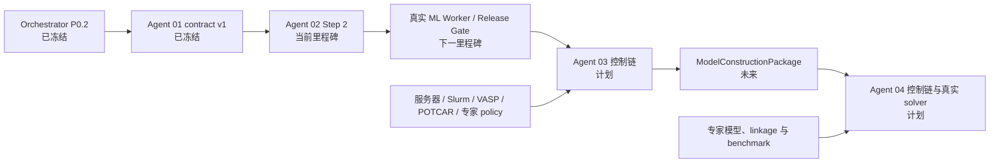

# Material Screening Agent：主实施计划

> **职责：** 本文档是项目管理真源，只维护当前里程碑、任务状态、两周计划、验收、工程评测、依赖、风险、阻塞项和下一步；长期目标与科学政策见系统蓝图，稳定技术设计见技术架构。
>
> **文档导航：** [系统蓝图](../docs/system-plan.md) · [技术架构](../docs/architecture.md) · [原始总方案](../docs/system-plan-original.md)
>
> **来源说明：** 本计划由原始总方案的项目管理章节拆分而来，并根据
> [README](../README.md)、[Orchestrator 计划](subagents/material-screening-orchestrator-plan.md)、
> [Agent 01 计划](subagents/material-screening-agent01-plan.md)和
> [Agent 02 计划](subagents/material-screening-ml-agent-plan.md)中明确记录的状态更新。当前可运行能力以 README、源码、配置和测试为准。
> 只有这些仓库文档明确确认完成的事项才标为 `[x]`；无法确认的事项保持 `[ ]`。

状态基准日期：2026-07-27

## 1. 当前里程碑

当前主里程碑：

> **Agent 02 Step 2：实现 P0.2 Adapter、审批和恢复；生产 ML capability 在全部发布 Gate 通过前保持未注册。**

### 1.1 已确认基线

| 组件 | 状态 | 仓库依据 |
|---|---|---|
| Orchestrator | P0.2 已完成；控制、阶段计划和报告契约已冻结 | [`Orchestrator 计划`](subagents/material-screening-orchestrator-plan.md) |
| Agent 01 | P0 与增强 Gate 已完成；`agent01-contract-v1` 已冻结 | [`Agent 01 计划`](subagents/material-screening-agent01-plan.md) |
| Agent 02 | Step 1/1.1 原生契约、确定性骨架、Fake Adapter/Worker 和 fixture 已完成 | [`Agent 02 计划`](subagents/material-screening-ml-agent-plan.md) |
| Agent 02 生产接入 | P0.2 Adapter、真实独立 worker、真实 CHGNet 和生产注册尚未完成 | [`Agent 02 计划`](subagents/material-screening-ml-agent-plan.md) |
| Agent 03 | 详细计划已存在；生产科学 Runner/真实 DFT backend 尚未实现或注册 | [`Agent 03 计划`](subagents/material-screening-agent-dft-plan.md) |
| Agent 04 | 详细计划已存在；生产科学 Runner/真实多体 backend 尚未实现或注册 | [`Agent 04 计划`](subagents/material-screening-agent04-plan.md) |
| 联网 LLM | Parser Protocol 与离线默认已存在；联网 Provider 尚未接入 | [`README.md`](../README.md) |

当前 README 记录的 P0.2 发布基线为：

- 默认回归：`129 passed, 2 skipped`；
- 两个跳过项为显式 opt-in 的 `live_mp` Gate；
- `pip check` 无破损依赖；
- Agent 01 standalone 与 Orchestrator restart 的真实 Materials Project Gate 已通过；
- Agent 01 是当前唯一生产科学 Runner；
- Agent 02–04 未注册生产 capability，不得用测试 fixture 冒充科学结果。

Agent 02 分计划记录了后续 Step 1 基线 `242 passed, 2 skipped`，但 Step 2 仍未完成。测试数字用于标识已有记录，不替代本计划下方的系统级退出条件。

### 1.2 当前 v1 验收目标

v1 的系统级退出目标是：

> 一个新环境可以按 README 复现需求确认、真实 Materials Project 检索、确定性筛选、报告与恢复；Agent 02 可以通过已冻结 P0.2 接口完成受控真实 ML 小批量；Agent 03/04 可以严格校验输入、审批、执行可信测试生命周期且不产生伪科研证据。

与长期科学边界相关的要求只在[系统蓝图](../docs/system-plan.md)维护；控制契约、状态和数据真源只在[技术架构](../docs/architecture.md)维护。

## 2. 两周实施计划

本节保留原始两周计划，并按仓库中明确证据更新状态。它是初始 84–98 小时范围的跟踪表，不表示仍按原日历日期执行。

### Day 1：工程骨架

- [x] 建立 Python 3.11 项目环境和依赖锁定基线。
- [x] 建立代码、日志和测试结构。
- [x] 定义核心 Pydantic Schema。
- [x] 建立 SQLite 业务状态、checkpoint 与本地 Artifact Store。
- [x] 建立可运行的 pytest 基线。

交付目标：Schema、项目创建、状态持久化。

### Day 2：Stage 0

- [x] 保存原始输入。
- [x] 实现 Offline Parser。
- [x] 抽象可替换 Parser Protocol。
- [x] 实现澄清问题、Requirement revision 和 CLI 人工确认。
- [ ] 接入并发布真实联网 LLM Provider。

交付目标：自然语言/固定语法到已确认、不可变的 `requirement.json`。

### Day 3–4：Agent 01 查询与规范化

- [x] 实现 Materials Project Adapter 和离线 fixture Adapter。
- [x] 实现查询参数生成、能力/数据库版本快照和受控重试。
- [x] 保存原始响应、来源和 provenance。
- [x] 保存 source JSON、canonical CIF 和稳定结构身份。
- [x] 规范化 Candidate、Property 和缺失字段语义。

交付目标：真实 Materials Project 候选集。

### Day 5：筛选、去重与报告

- [x] 执行确定性硬约束。
- [x] 实现 candidate/structure ID 和结构 hash。
- [x] 实现 `PASS/REJECT/UNCERTAIN/FAILED`。
- [x] 实现精确重复标注、非破坏性结构聚类和确定性排序。
- [x] 生成 JSON/Markdown 报告和下游 manifest。

交付目标：P0 端到端检索结果。

### Day 6：LangGraph 串联

- [x] 实现顶层状态图与四阶段路由。
- [x] 实现 checkpoint/resume。
- [x] 实现需求和昂贵任务审批节点。
- [x] 实现错误分类、幂等 operation ledger 和外部任务对账。
- [x] 实现 `run/status/respond/approve/resume/retry/cancel/report/run-stage`。

交付目标：可中断恢复的 P0 控制面。

### Day 7：P0 验收与缓冲

- [x] 完成固定 Si/O 离线验收。
- [x] 完成 Agent 01 standalone 与 Orchestrator restart 的真实 MP opt-in Gate。
- [x] 增加 API、Parser、结构、Artifact 和恢复失败测试。
- [x] 在 README 中记录可复现演示和已知限制。

交付目标：冻结可复现的 P0 基线。

### Day 8–9：Agent 02 最小实现

- [x] 实现 Agent 02 原生严格契约和确定性 pre-filter。
- [x] 实现 Model Registry、适用域、证据和结构 lineage 纯函数。
- [x] 实现 Fake Model Adapter/Fake Worker 与冻结 fixture。
- [x] 保证 mock/fixture 不能晋级 L2。
- [ ] 实现 `Agent02RunnerAdapter` 的 P0.2 五方法生命周期。
- [ ] 实现候选级 operation ledger、重复 start、跨 attempt 恢复和篡改检测。
- [ ] 完成 1–5 自动、6–20 审批、超过 20 阻塞的真实 Adapter E2E。
- [ ] 建立独立 Python 3.11 ML worker 环境并锁定依赖。
- [ ] 完成真实 CHGNet CPU 小样例、Mac Gate 和真实 Top-5。
- [ ] 通过全部 Gate 后显式注册生产 ML capability。

交付目标：L2 接口、可解释筛选漏斗和受控真实 ML 基础能力。

### Day 10：Agent 03 Adapter

- [x] Orchestrator 已提供通用昂贵任务审批、`WaitingExternal`、reconcile 和 cancel 控制能力。
- [ ] 实现 Agent 03 原生 `DFTRequest`、claim、workflow plan 和结果契约。
- [ ] 实现 DFT 输入校验、方法 policy、参数 diff 和资源估计。
- [ ] 实现 `MockDFTBackend` 的 submit/status/cancel/fetch。
- [ ] 实现 Agent 03 Runner/Adapter、幂等、审批和恢复。
- [ ] 冻结不产生伪科研数值的 DFT fixture、报告和测试。
- [ ] 实现并评审 VASPilot structured bridge mapping；真实接入属于未来 P2。

交付目标：不冒充真实计算的 DFT 状态链路。

### Day 11：Agent 04 Adapter

- [x] Orchestrator 已提供 many-body capability descriptor、输入阻塞和测试生命周期控制能力。
- [ ] 实现 `EffectiveModelPackage` 与多体原生契约。
- [ ] 实现物理完整性、linkage 和证据范围校验。
- [ ] 实现 Solver Capability Registry、路由和资源估计。
- [ ] 实现 `MockManyBodyBackend` 和缺输入/不适用演示。
- [ ] 实现 Agent 04 Runner/Adapter、审批、恢复和报告。
- [ ] 冻结 1D Hubbard 与 2D 小格点 fixture。

交付目标：多体阶段接口、输入边界和不晋级伪 L4 的控制链。

### Day 12：审计、安全和恢复

- [x] 实现审批、operation、external job 和 event 的持久化审计。
- [x] 实现 secret redaction、路径保护和 Artifact hash。
- [x] 实现有限 retry、状态倒退和 backend 不一致防线。
- [x] 实现 Project 级推进锁和 status 只读语义。
- [ ] 完成 Agent 02 阶段专用 worker sandbox、输出大小和超时恢复 Gate。
- [ ] 完成 Agent 03/04 原生 Artifact、安全和失败注入 Gate。

### Day 13：综合测试与文档

- [x] 完成 P0 的 unit、contract、integration、E2E 和 opt-in live Gate。
- [ ] 完成 Agent 02 生产接入后的分层 Fake/real CPU/Mac/E2E Gate。
- [ ] 完成 Agent 03/04 控制链 contract/integration/E2E Gate。
- [ ] 完成四阶段综合回归和任意阶段启动矩阵。
- [ ] 更新 README 中最终 v1 配置、演示脚本和限制。

### Day 14：缓冲与展示

- [ ] 只修复 v1 阻塞缺陷。
- [ ] 冻结最终 demo 数据与 fixture。
- [ ] 生成最终架构说明、运行证据和结果报告。
- [ ] 列出并确认下一阶段资源申请清单。

## 3. 当前第一批任务

当前第一批任务只覆盖 Agent 02 Step 2，不提前扩展真实 CHGNet、DFT 或多体后端：

- [ ] 从 `StageExecutionContext` 安全加载 Requirement、Agent 01 manifest、来源结构和可选 `stage_request`。
- [ ] 重算并验证全部 Artifact URI/hash、Schema、revision 和结构引用。
- [ ] 实现 `Agent02RunnerAdapter.validate_input()`，区分缺失、完整性失败和 21+ 候选硬上限。
- [ ] 实现幂等 `prepare()`，依次冻结 `MLStagePlan` 与 `PreparedStagePlan`。
- [ ] 将 1–5 无审批、显式 6–20 审批、超过 20 阻塞映射到控制面。
- [ ] 实现 `start()` 的双计划复核、Fake Worker 调用和 Adapter 权威 Artifact finalization。
- [ ] 实现候选级和阶段级 `operation-complete.json`，覆盖重复 start 与跨 attempt 复用。
- [ ] 对完成记录缺失、篡改或冲突返回 `BACKEND_INCONSISTENT`，不得静默重算。
- [ ] 为同步 v1 的 `reconcile/cancel` 返回明确 unsupported 语义。
- [ ] 完成显式 `run-stage ml` Fake CLI E2E 和要求 L2 的整图 fixture E2E。
- [ ] 确认默认生产 `StageId.ML` 仍为 `registered=false`。
- [ ] 将 Agent 02 Step 2 代码/测试形成独立、可回退提交后，再进入真实 worker 阶段。

详细输入、Artifact 和退出条件见
[Agent 02 计划第 8.2 节](subagents/material-screening-ml-agent-plan.md#82-step-2p02-adapter审批和恢复)。

## 4. v1 Definition of Done

### 4.1 当前已确认

- [x] 能创建项目并持久化。
- [x] 能接收自然语言或离线演示请求。
- [x] 能生成结构化 Requirement 并要求用户确认。
- [x] 能真实查询 Materials Project。
- [x] 能保存来源结构、数据库版本和 provenance。
- [x] 能执行确定性筛选并生成候选报告。
- [x] 能区分 `PASS/REJECT/UNCERTAIN/FAILED`。
- [x] 能跨进程中断并 `resume`。
- [x] 能从任意阶段以显式输入启动，并在缺输入时给出可审计阻塞。
- [x] 所有通用审批、operation 和 external job 生命周期均有记录。
- [x] 控制面与 Agent 01 已完成操作具备幂等性与 Artifact 完整性检查。
- [x] secret 不进入源码、fixture 或项目 Artifact。
- [x] P0 核心 unit、contract、integration、E2E 和真实 MP Gate 已通过。
- [x] README 能让另一名开发者复现 P0。

### 4.2 尚未满足

- [ ] Agent 02 P0.2 Adapter 完成并通过 Fake E2E。
- [ ] 独立真实 ML worker、CHGNet CPU/Mac Gate 和 Top-5 E2E 通过。
- [ ] 生产 ML capability 仅在全部真实与安全 Gate 后显式注册。
- [ ] Agent 03 的输入、计划、claim、Mock backend、审批、恢复和报告链完成。
- [ ] Agent 04 的 EffectiveModel、路由、Mock backend、审批、恢复和报告链完成。
- [ ] DFT/多体测试结果明确 `is_mock=true`、无伪科研数值且无法晋级 L3/L4。
- [ ] 四阶段综合测试、失败注入和报告措辞 Gate 通过。
- [ ] 最终 v1 README、演示、已知限制和资源申请清单冻结。

只有第 4.1 与第 4.2 节全部完成，系统 v1 才可宣告完成。

## 5. 工程指标、评测集与失败注入

### 5.1 交付工程指标

- [x] P0 固定 Requirement 和检索契约具有严格 Schema 与回归测试。
- [x] 固定 Si/O 用例的查询参数与确认后的 Requirement 一致。
- [x] Agent 01 每个发布候选具有来源 ID、结构引用/hash 和 provenance。
- [x] Agent 01 API 瞬时失败可重试，完成操作可从 checkpoint/Artifact 恢复。
- [x] Agent 01 同一请求重复执行不会重复查询或创建候选。
- [x] Orchestrator 的审批、计划和输入快照通过不可变 hash 绑定。
- [x] `status` 只读；只有 `resume` 对账外部任务。
- [x] fixture/mock 不得提升真实证据的控制面测试已存在。
- [ ] Agent 02 真实与 Fake 路径通过同一 Adapter/Worker 契约和恢复矩阵。
- [ ] Agent 03/04 原生 mock 不产生科学数值，并通过各自 evidence ceiling 测试。
- [ ] 全系统 Requirement Schema 校验通过率在冻结评测集达到 100%。
- [ ] 全系统硬约束翻译在冻结回归集达到 100%。
- [ ] 四阶段所有人工审批都具有不可变记录和过期快照测试。
- [ ] 四阶段核心单元、契约、集成和 E2E 测试全部通过。

### 5.2 初始评测集

工程回归集：

- [x] 简单半导体检索；
- [x] 元素包含/排除；
- [x] 缺失阈值与澄清；
- [x] 数据库无结果；
- [x] API 失败与重试；
- [x] 重复结构与稳定身份；
- [x] 从 ML/DFT/Many-Body 启动但缺少输入；
- [x] 用户拒绝审批；
- [x] 测试外部 backend 的超时、失败、取消与状态倒退；
- [ ] Agent 02 真实模型适用域、数值和恢复集；
- [ ] Agent 03 原生 DFT 控制链评测集；
- [ ] Agent 04 原生多体控制链评测集。

科学数据集：

- [ ] 为四类强关联目标建立若干已知材料的 silver set，只验证需求表示、路由和证据缺口。
- [ ] 由课题组共同维护正式 gold set，包括正例、负例、边界案例、来源论文和判定理由。
- [ ] 为 ML 建立与冻结 DFT 层级一致的 benchmark。
- [ ] 为真实 DFT 和多体 backend 建立专家批准的数值/claim benchmark。

### 5.3 失败注入

P0/控制面已明确覆盖：

- [x] Materials Project API 超时、限流和临时错误；
- [x] Parser/响应非法；
- [x] CIF/结构解析失败和候选字段缺失；
- [x] 用户长时间未审批、拒绝审批和旧审批失效；
- [x] backend 状态不一致与状态倒退；
- [x] 重复 submit/start；
- [x] Artifact 缺失、hash 篡改和报告中断恢复；
- [x] checkpoint/业务状态不兼容的显式拒绝。

仍需补齐：

- [ ] Agent 02 模型不支持元素、健康快照过期、worker handshake/路径/大小/超时失败；
- [ ] Agent 02 第 N 个候选中断后的候选级恢复；
- [ ] Agent 03 backend completed 但科学 validator 拒绝；
- [ ] Agent 03 submit 响应丢失、取消竞态和结果不完整；
- [ ] Agent 04 模型缺字段、solver 不适用、资源拒绝和 mock 证据上限；
- [ ] 最终四阶段报告生成中断和重建。

## 6. 跨模块依赖

依赖规则：

- Agent 02 只消费冻结的 Agent 01 manifest、结构和 provenance，不修改 Agent 01 契约。
- Agent 02 Adapter 只接入现有 P0.2 控制流，不修改图拓扑、checkpoint 或业务 SQLite schema。
- Agent 03 依赖明确的候选结构、claim、方法 policy、预算和审批；真实 VASP 后端还依赖服务器资源与许可。
- Agent 04 不以普通 Candidate 或 DFT band structure 代替 `EffectiveModelPackage`。
- 正式 Agent 03 → Agent 04 交付需要未来的模型构建/downfolding 包，而不是隐式参数猜测。
- 任何生产 capability 都必须在自身 contract、安全、恢复和科学 Gate 全部通过后注册。

## 7. 当前风险、阻塞项与待确认事项

| 类型 | 事项 | 当前处理 |
|---|---|---|
| 当前工程风险 | Agent 02 Step 2 尚未建立真实 Artifact ledger 和 Adapter E2E | 当前第一批任务只聚焦该窄范围 |
| 当前工程阻塞 | 真实 CHGNet 独立环境、lock、checkpoint 与 Mac health snapshot 尚未建立 | Step 2 完成后进入 Step 3/4 |
| 能力缺口 | Agent 03/04 生产 Runner 未实现或注册 | 保持 `CAPABILITY_UNAVAILABLE`，不得用 fixture 代替 |
| 基础设施阻塞 | 当前无可用 Slurm、合法 VASP/POTCAR 和通过安全 Gate 的 bridge | 真实 DFT 延后到服务器 P2 |
| 科学阻塞 | 课题组 DFT 方法 profile、POTCAR mapping、U/J、磁序等未冻结 | 真实 DFT backend 不得执行 |
| 科学阻塞 | 多体模型构建链、材料 linkage 和首个真实材料目标未冻结 | Agent 04 只能接受完整专家输入；不自动猜测 |
| 评测缺口 | 尚无课题组正式 gold set | 先维持工程回归，逐步建立 silver/gold set |
| 产品限制 | 联网 LLM Provider 尚未接入 | Offline Parser 继续作为默认，不阻塞确定性链路 |
| 迁移风险 | 本地 SQLite/同步 CLI 不适合多用户和长后台任务 | 服务器阶段迁移 Postgres、worker、RBAC 和监控 |

需要课题组或用户后续确认的科学事项：

- [ ] 默认 VASP 版本、POTCAR family/release 与每元素 mapping。
- [ ] bulk/2D functional、vdW、ENCUT、k-point 和收敛标准。
- [ ] 磁矩、磁序、U/J、SOC 和高级方法政策。
- [ ] 真实 DFT 的队列、partition、walltime、memory 和 retention。
- [ ] 首个真实多体材料目标、模型构建方法和专家审查人。
- [ ] gold set 的维护人、来源与判定流程。

这些事项不阻塞当前 Agent 02 Step 2，但会阻塞真实 DFT、多体和科学验收。

## 8. 下一步

1. [ ] 完成第 3 节 Agent 02 Step 2，并形成独立代码/测试基线。
2. [ ] 在独立 Python 3.11 环境实现已冻结 JSON worker 协议和真实 CHGNet CPU Gate。
3. [ ] 完成目标 Mac health、CPU/MPS parity、真实 Top-5、崩溃恢复和安全 Gate。
4. [ ] 审核文档、model card、许可和限制后，显式注册生产 ML capability。
5. [ ] 回到系统 v1 范围，实现 Agent 03 原生契约、Mock backend 和控制链。
6. [ ] 实现 Agent 04 EffectiveModel、Mock backend 和控制链。
7. [ ] 执行四阶段综合失败注入、报告措辞和新环境复现 Gate。
8. [ ] 冻结 v1 演示与资源申请清单，再决定服务器 P2 和真实科学后端排期。
