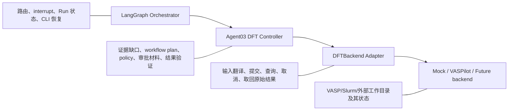
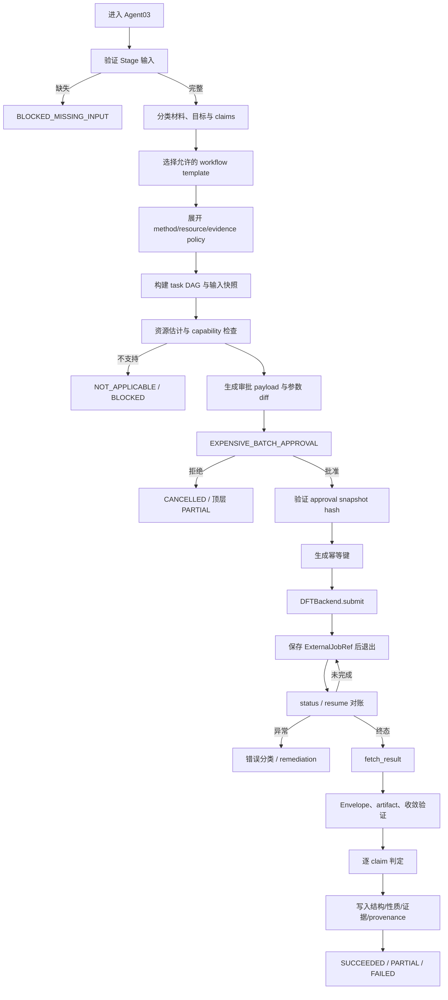
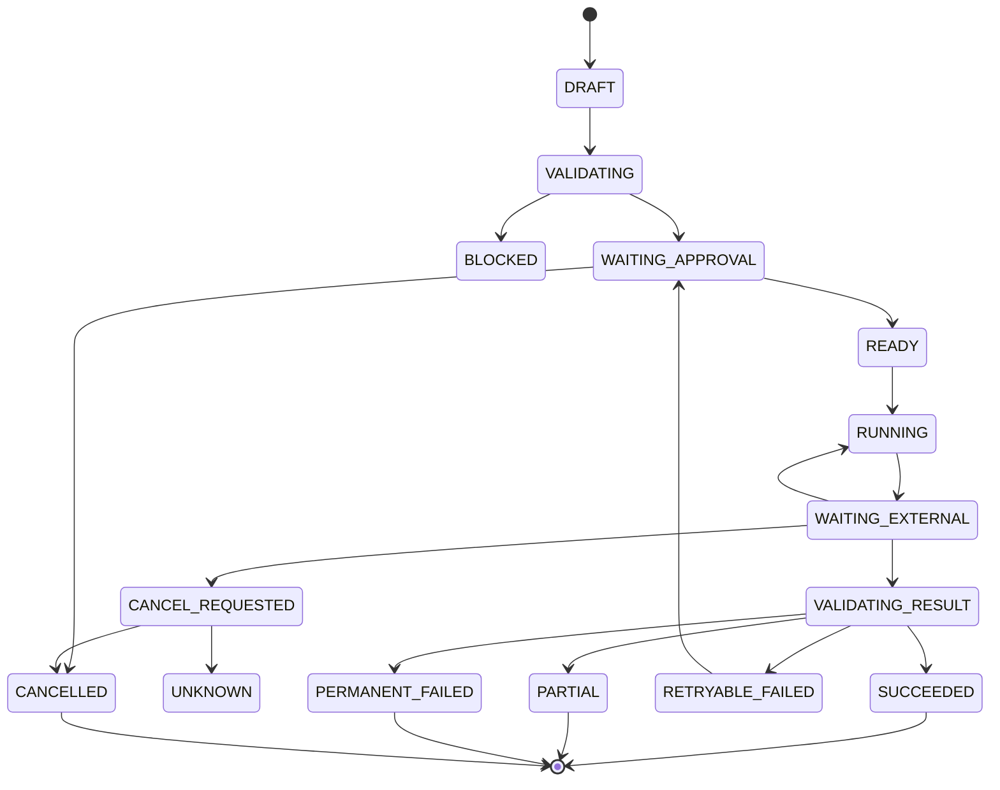
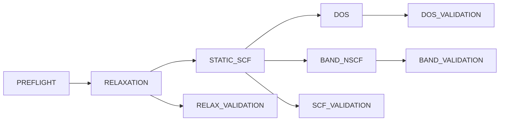
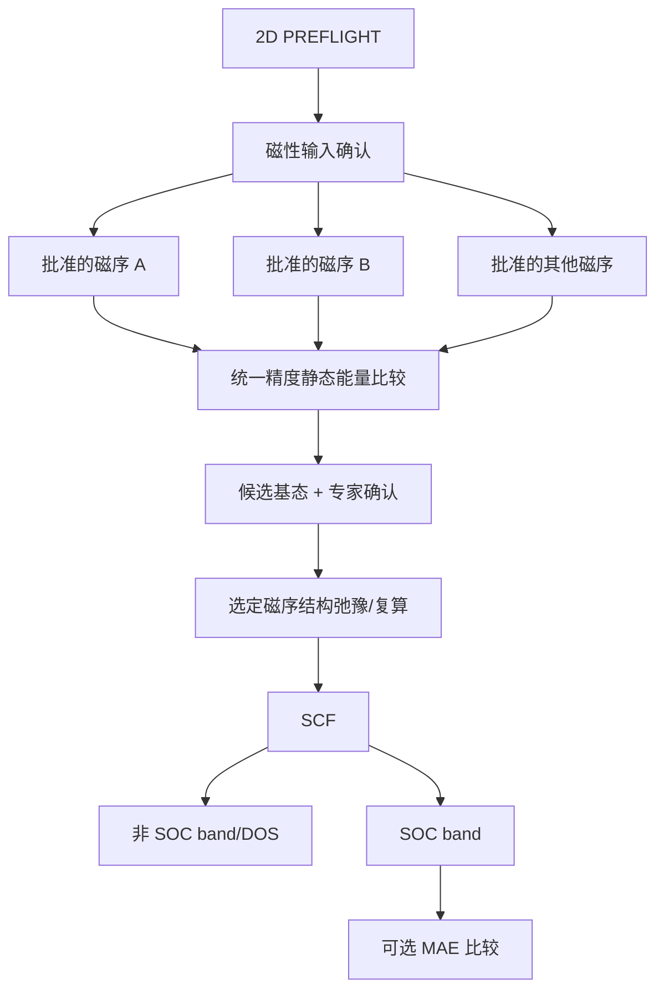

# 材料筛选 Agent：Agent03 DFT Controller 详细实施计划

版本：v0.1  
日期：2026-07-25  
依据：[`docs/system-plan.md`](../../docs/system-plan.md)、[`docs/architecture.md`](../../docs/architecture.md)、[`Orchestrator 计划`](material-screening-orchestrator-plan.md)
适用路线：v1 Mock → P2 单体系真实计算 → P3 固定 DFT 工作流  

## 开始开发前必读

- [README](../../README.md)：当前实现状态、默认离线 Gate、Artifact 和已知限制。
- [系统蓝图](../../docs/system-plan.md)：L3 证据边界、科学 policy、审批和安全原则。
- [技术架构 Agent03 边界](../../docs/architecture.md#55-agent-03-dft-controller)：StageRunner、Artifact、证据和后端所有权。
- [技术架构后端集成](../../docs/architecture.md#11-vaspilot与未来后端集成)：VASPilot/外部后端的集成拓扑和 Gate。
- [主计划](../master.md)：当前里程碑、依赖、阻塞和系统 DoD。
- [Orchestrator 计划](material-screening-orchestrator-plan.md)：控制面输入、审批、恢复和 `PreparedStagePlan`。
- [原始系统总方案](../../docs/system-plan-original.md)：仅用于历史追溯。

### 模块职责与边界

- **职责：** DFT claim/workflow 规划、方法 policy 快照、输入校验、资源估计、审批材料、唯一 `DFTBackend` 生命周期、结果验证、claim 级证据和 provenance。
- **输入：** 候选与结构 Artifact、目标/证据缺口、冻结 policy、backend capability、预算和审批上下文。
- **输出：** `DFTRequest`/workflow plan、backend job/artifact 引用、验证结果、claim 级 `L3_DFT_VALIDATED` 或明确未支持状态、StageResultEnvelope。
- **不负责：** 自由发明泛函/U/磁序/求解器、直接管理 LangGraph/Slurm、保存 POTCAR、自动构造缺失结构或把 mock 数值写成科研证据。
- **不可修改范围：** Orchestrator 控制契约、Agent01/02 权威输入、课题组未冻结的科学 policy、外部 backend 状态真源、其他 agent 计划。

仓库没有单独的 integration Markdown；涉及 VASPilot 或未来 DFT 后端时，以[技术架构后端集成章节](../../docs/architecture.md#11-vaspilot与未来后端集成)和本计划第 16 节为准。

### 当前下一步、依赖与阻塞

1. 先实现 v1 的契约/枚举、`StageInputValidator`、确定性 planner 和最小 policy snapshot 测试。
2. 分别实现 `MockDFTBackend` 的幂等 submit/status/cancel/fetch 与失败注入，不产生科学数值。
3. 接入 `StageRunner`/Orchestrator 的审批、等待外部任务、恢复、Envelope 校验和报告测试。
4. 只有 v1 mock 控制链通过后，才为 P2 单体系冻结课题组方法 policy、资源和 VASPilot bridge Gate。

跨 agent 依赖：输入依赖 Agent01/02 的结构与 provenance；控制面依赖 Orchestrator 的阶段计划、审批和外部任务契约；Agent04 只能消费经验证且明确 scope 的 DFT Artifact。当前阻塞为尚无 DFT 源码、Slurm/合法 VASP/POTCAR bridge 及课题组 functional/U/J/磁序等科学 policy，不能用 mock 越过这些阻塞。

完成每个 v1/P2 任务后，只更新本计划的完成证据、测试、限制、方法/后端版本和待专家确认项；公共 claim/Artifact 契约变更须同步 Orchestrator、下游 Agent04 计划及相应 contract/integration/E2E 设计，不得修改外部后端状态真源。

## 0. 执行结论

Agent03 不应被实现成一个能够自由写 INCAR、自由修改参数并直接运行 VASP 的 LLM Agent。它应当是一个以确定性代码为核心、由版本化科学政策约束、在关键节点要求人工审批的 DFT 控制器。

Agent03 的唯一核心职责是：

> 将“需要哪些 DFT 证据”转换为可审计的计算计划，冻结输入与方法，获得人工批准，通过唯一的 `DFTBackend` 提交和对账任务，独立验证返回结果，并把“真正得到的证据”写回候选材料。

本计划冻结以下决策：

| 事项 | 决定 |
|---|---|
| 设计周期 | 同一套契约覆盖 v1、P2 和 P3，分阶段启用能力 |
| v1 后端 | `MockDFTBackend` |
| 首条真实链路 | 小体系 `relaxation → static SCF → band/DOS` |
| 首个目标专用链路 | 二维铁磁半导体 |
| 真实后端 | 优先评估 VASPilot，但必须先通过集成 Gate；不预设一定上线 |
| 编排边界 | LangGraph 管控制流；Agent03 管 DFT 计划与证据；backend 管执行 |
| 输入生成 | Agent03 选择并冻结 policy；backend 将批准后的规范化参数翻译成 VASP 输入 |
| LLM 权限 | 只允许解释、摘要和形成待审建议；不能决定或静默修改关键科学参数 |
| 方法参数 | 来自版本化 `DFTMethodPolicy`，未冻结的课题组标准必须显式标为待专家确认 |
| 审批 | 所有真实 DFT、批量任务、方法升级和改变科学参数的重算都必须审批 |
| 证据 | 保留顶层 `L3_DFT_VALIDATED`，同时增加 claim 级证据 |
| 自动重试 | 只自动重试明确的传输/查询故障；计算失败后的参数修改必须形成新方案和新审批 |
| mock 结果 | 模拟生命周期和故障，不生成伪造科研数值，不提升真实证据等级 |

一个 Slurm 作业退出码为 0、VASP 写出了 `vasprun.xml`、或者 backend 返回 `completed`，都不自动等于：

- 电子自洽已经达到项目规定阈值；
- 离子弛豫满足力或能量收敛条件；
- 能带、带隙、磁基态或拓扑性质已经得到可信验证；
- 候选材料已经达到 `L3_DFT_VALIDATED`。

Agent03 必须依次区分：

1. 任务是否成功提交；
2. 外部程序是否成功结束；
3. 输出是否完整且可解析；
4. 数值计算是否满足收敛政策；
5. 结果是否足以支持某个具体 scientific claim；
6. 多个 task 的组合是否足以支持 workflow 结论；
7. 是否仍需要人工科学审查。

## 1. 目标、非目标与 Definition of Done

### 1.1 长期目标

Agent03 最终应支持：

- 从候选材料、目标性质和证据缺口生成 DFT 请求；
- 为不同材料类别选择允许的固定 workflow template；
- 将结构、方法、赝势、磁性、SOC、k 点和资源参数冻结为不可变快照；
- 给出有依据且带不确定度的资源估计；
- 生成人可读的计算计划和参数 diff；
- 在提交真实计算前进入人工审批；
- 通过一个且仅一个 execution backend 管理外部任务；
- 跨进程、跨机器恢复和对账；
- 独立解析、校验和归档计算结果；
- 以 claim 为单位更新证据，而不是对候选材料笼统盖章；
- 为 Agent04 提供受控、完整、可追溯的 DFT 派生输入。

### 1.2 v1 目标

两周 MVP 中，Agent03 只交付工程真实性：

- 完整的 Pydantic v2 数据契约；
- `StageInputValidator`；
- 确定性的 workflow planner；
- 方法 policy 引用与参数 diff；
- 资源估计外壳；
- DFT 审批 payload；
- `DFTBackend` 契约；
- `MockDFTBackend`；
- submit/status/cancel/fetch 生命周期；
- 幂等 operation ledger；
- 外部任务运行中退出、随后 `status/resume` 恢复；
- mock success、timeout、计算失败、结果不完整、用户拒绝、取消和重试；
- `StageResultEnvelope`；
- mock 永远不能产生真实 L3 证据的测试。

### 1.3 P2 目标

P2 只允许一个经过人工选择的小体系进入真实后端，完成：

> 输入预检 → relaxation → static SCF → band/DOS → 独立结果检查 → 专家复核

P2 不以高通量为目标。默认并发为 1，所有输入和输出逐项人工审核。

### 1.4 P3 目标

P3 在 P2 稳定后增加：

- 固定 workflow DAG；
- 小批量受控执行；
- 历史资源数据校准；
- 二维铁磁半导体 workflow；
- 人工指定的磁序比较；
- 经审批的 SOC；
- 更完整的 claim validator；
- 失败分类与确定性 remediation proposal；
- 结果报告与候选排序回写。

### 1.5 非目标

以下内容明确不属于 Agent03：

- 从自然语言自由发明泛函、U 值、磁序或收敛阈值；
- 自动搜索任意 VASP 参数组合；
- 自动生成并执行 Python 修复脚本；
- 在 Mac v1 上实际运行 VASP；
- 保存或分发 POTCAR 文件；
- 重新实现 VASPilot 内部 Crew；
- 同时让 LangGraph、VASPilot 和 AiiDA 管同一个任务的主状态；
- 以单次 DFT+U 结果证明 Mott 物理；
- 仅凭 SOC 能带图宣称拓扑不变量已验证；
- 仅凭总能差宣称有限温度磁性得到确认；
- 自动构造缺失的双层堆垛、缺陷、掺杂或超胞；
- 取代课题组专家对科学参数和最终结论的审查。

### 1.6 v1 完成标准

只有同时满足以下条件，Agent03 v1 才完成：

- 从 Orchestrator 接收合法 stage context，并生成合法、冻结的 `DFTRequest`；
- 缺输入时准确列出字段、原因和补充方式；
- 相同输入生成相同的 workflow plan hash；
- 真实计算标志为 false 时仍完整经过计划、审批、提交、对账和结果接收流程；
- 同一幂等键重复 submit 不生成第二个 external job；
- `RUNNING` 状态下终止 CLI，重启后能继续对账；
- mock 不输出 band gap、总能、磁矩等伪数值；
- mock 结果带 `is_mock=true`、backend/version/fixture/hash；
- 审批拒绝后阶段为 `CANCELLED`，已有上游结果保留；
- 结果 Envelope 非法时不会写入 Candidate；
- 所有 artifact 都有 URI、SHA-256、大小、类型和生产者；
- 所有状态转换和审批都有不可变事件记录；
- 单元、契约、集成和 E2E 测试全部通过。

## 2. Agent03 的责任边界

### 2.1 三层职责



### 2.2 Orchestrator 负责

- 判断是否进入 Agent03；
- 检查 `allow_dft` 和项目预算；
- 创建 stage run；
- 执行 LangGraph `interrupt()`；
- 接收 approve/reject；
- 保存顶层 checkpoint；
- 调用 Agent03 的 `validate_input/prepare/start/reconcile`；
- 根据 Agent03 outcome 决定退出、继续或生成部分报告；
- 不解析 OUTCAR，不写 INCAR，不轮询 Slurm。

### 2.3 Agent03 负责

- 验证候选、结构、目标、预算和方法政策是否完整；
- 将目标性质拆成 scientific claims；
- 根据 capability registry 和 workflow template 生成 DAG；
- 冻结输入结构、policy、backend 和资源快照；
- 生成审批展示材料；
- 计算幂等键；
- 调用 `DFTBackend`；
- 将 backend 状态映射为内部状态；
- 独立验证 result envelope 和 artifact；
- 调用确定性的 claim validators；
- 生成新的 structure revision 和 property records；
- 更新阶段结果，但不直接修改 LangGraph checkpoint 表。

### 2.4 Backend 负责

- 将已批准 `DFTTaskSpec` 转换成 backend 输入；
- 在隔离的工作目录生成输入文件；
- 使用合法、配置好的 POTCAR；
- 提交、查询和取消 Slurm/VASP 任务；
- 保存 backend 自己的任务记录；
- 返回稳定 external reference；
- 返回原始输出和解析摘要；
- 不决定候选是否达到 L3；
- 不替 Agent03 修改 requirement、routing policy 或 Candidate decision。

### 2.5 专家负责

- 冻结课题组 DFT 方法 profile；
- 审核 POTCAR family/release 和元素映射；
- 审核泛函、U、磁序、SOC、vdW、收敛阈值；
- 批准真实计算和方法升级；
- 处理 backend 无法确定性修复的收敛失败；
- 对最终科研结论执行 `L5_EXPERT_REVIEWED`。

## 3. 不可违反的设计不变量

1. 一个 DFT task 只能有一个 execution backend 作为外部状态真源。
2. `candidate_id` 在结构演化中不变；DFT 弛豫后必须产生新的 `structure_id`。
3. 已批准的 input snapshot 不可修改；任何参数变化产生新 revision、新 hash 和必要的新审批。
4. `submit` 必须幂等；无法证明幂等的真实 backend 不得上线。
5. transport retry 和 scientific retry 必须分开。
6. backend `COMPLETED` 只触发结果验证，不能直接触发 L3。
7. 每个 PropertyValue 必须包含值、单位、方法、来源 task、结构 revision 和证据。
8. mock 不能生成会被误读为科研结果的数值。
9. LLM 输出不能直接进入 backend request；必须先通过 Schema、policy 和人工 Gate。
10. POTCAR 内容不得进入项目 Artifact Store、日志、prompt 或报告。
11. Agent03 不能在未经批准时改变泛函、U、磁序、SOC、k 点、ENCUT 或收敛条件。
12. 一个计算结果只支持其明确声明并通过 validator 的 claims。
13. 上游缺失数据必须导致 `BLOCKED_MISSING_INPUT`，不能由 Agent03 伪造。
14. Artifact 必须按 hash 寻址或至少带内容 hash；逻辑 URI 不依赖 Mac 绝对路径。
15. 取消动作必须区分“请求已发送”“Slurm 已确认取消”和“最终状态未知”。

## 4. 领域模型与标识符

### 4.1 实体层级

```text
Project
└── Run
    └── StageRun(agent03)
        └── DFTRequest(revision)
            ├── CandidateDFTWorkflow
            │   ├── DFTTask
            │   │   └── DFTAttempt
            │   │       └── ExternalJobRef
            │   └── ScientificClaimResult
            └── StageResultEnvelope
```

### 4.2 为什么必须区分 Task 与 Attempt

`DFTTask` 表示科学上希望完成的不可变计算规格，例如“对结构 S 使用 policy P 做 static SCF”。  
`DFTAttempt` 表示该规格的一次实际执行。

以下情况只增加 Attempt，不改变 Task：

- backend 提交响应丢失后，通过幂等键找回原任务；
- 集群节点故障；
- Slurm preemption；
- 文件系统短时故障；
- 使用完全相同 input hash 重新执行。

以下情况必须生成新 Task revision：

- 修改 INCAR；
- 修改 KPOINTS；
- 修改 POTCAR 元素映射或 release；
- 修改结构；
- 修改总电荷；
- 修改磁序或初始磁矩；
- 开启/关闭 SOC、DFT+U、vdW；
- 修改收敛阈值；
- 修改依赖 task 或继承的 CHGCAR/WAVECAR。

### 4.3 ID 规则

建议使用带类型前缀的 UUIDv7 或等价可排序 ID：

```text
dftreq_<id>
dftwf_<id>
dfttask_<id>
dftattempt_<id>
extjob_<id>
claim_<id>
struct_<id>
approval_<id>
```

ID 只标识实体；相同性由内容 hash 和幂等键判断，不能通过 ID 猜测。

### 4.4 Hash 规则

所有可审批对象使用 canonical JSON：

- UTF-8；
- key 字典序；
- 禁止 NaN/Infinity；
- 明确单位；
- 时间戳和随机 ID 不进入科学 input hash；
- artifact URI 不稳定时，使用 artifact content hash；
- 默认值在 hash 前显式展开；
- policy 使用 policy ID + version + content hash；
- backend 使用 backend ID + adapter version + capability snapshot hash。

核心 hash：

```text
structure_hash = sha256(canonical_structure)
method_hash = sha256(expanded_method_spec)
task_input_hash = sha256(structure_hash + method_hash + task_type + dependencies)
workflow_plan_hash = sha256(canonical_workflow_plan)
approval_snapshot_hash = sha256(plan_hash + resource_estimate + backend_snapshot)
result_hash = sha256(canonical_result_envelope)
```

## 5. 输入、输出与前置条件

### 5.1 最低输入

从任意阶段直接启动 Agent03 时，至少需要：

- `project_id`、`run_id`；
- 一个或多个 `candidate_id`；
- 每个候选的 `structure_id`；
- 可访问的结构 artifact URI；
- 结构 artifact SHA-256；
- DFT 目标或待验证 scientific claims；
- 所需证据等级；
- `DFTMethodPolicy` ID/version；
- `DFTResourcePolicy` ID/version；
- backend ID；
- 项目预算；
- 真实/模拟执行模式；
- 有效审批，或足以创建审批的完整 plan。

### 5.2 可选输入

- 上游 MP/ML properties；
- ML 弛豫结构及不确定度；
- 初始电荷态；
- 初始磁矩建议；
- 用户指定磁序集合；
- 对称性和维度标签；
- previous calculation artifact；
- 允许复用的 CHGCAR/WAVECAR 引用；
- 优先级和截止时间；
- 资源上限；
- 目标工作流模板。

可选输入缺失不能被静默填入科学默认值。如果 policy 中存在默认值，必须在审批页面展开显示。

### 5.3 输出

Agent03 输出：

- `dft_request.vN.json`；
- `input_validation.json`；
- `workflow_plan.vN.json`；
- `workflow_plan.vN.md`；
- `resource_estimate.json`；
- `approval_payload.json`；
- `parameter_diff.json`；
- `external_job_refs.jsonl`；
- `task_results.jsonl`；
- `claim_results.jsonl`；
- `dft_result_envelope.json`；
- `stage_result_envelope.json`；
- `dft_report.md`；
- 可选的新结构 artifact；
- PropertyValue records；
- error/remediation records；
- 完整 provenance。

### 5.4 缺输入响应

缺输入时返回结构化列表：

```json
{
  "valid": false,
  "status": "BLOCKED_MISSING_INPUT",
  "issues": [
    {
      "path": "candidates[0].structure_artifact_sha256",
      "code": "MISSING_STRUCTURE_HASH",
      "message": "结构内容尚未冻结，不能生成可审批的 DFT 计划。",
      "how_to_resolve": "由上游 Artifact Store 计算 SHA-256，并重新提交同一 structure_id。"
    }
  ]
}
```

## 6. Agent03 端到端流程



### 6.1 `validate_input`

必须是无副作用操作：

- Schema 校验；
- artifact 存在性和 hash 校验；
- candidate/structure 关联校验；
- 目标与 policy 的兼容性；
- budget 和 backend 存在性；
- mock/real 模式一致性；
- 直接启动时的最低输入校验。

### 6.2 `prepare`

允许写入不可变计划 artifact，但不得提交外部任务：

- claim decomposition；
- workflow template selection；
- policy expansion；
- task DAG；
- capability check；
- resource estimate；
- approval payload；
- plan hash；
- `WAITING_APPROVAL`。

### 6.3 `start`

只在 approval 有效后执行：

- 复核 snapshot hash；
- 创建 operation record；
- 调用 backend submit；
- 原子保存 ExternalJobRef；
- 返回 `WaitingExternal` 或立即终态；
- 不在 CLI 进程中长时间阻塞。

### 6.4 `reconcile`

- 读取本地 operation 和 ExternalJobRef；
- 向 backend 查询真实状态；
- 检查状态是否倒退或冲突；
- 终态时 fetch；
- 进行结果验证；
- 幂等写入结果；
- 生成下一个 task 或结束 workflow。

## 7. 状态机

### 7.1 Agent03 Stage 状态

沿用系统统一状态：

- `PENDING`
- `VALIDATING_INPUT`
- `BLOCKED_MISSING_INPUT`
- `WAITING_APPROVAL`
- `READY`
- `RUNNING`
- `RETRYABLE_FAILED`
- `PERMANENT_FAILED`
- `PARTIAL`
- `SUCCEEDED`
- `CANCELLED`

### 7.2 Workflow 内部状态



### 7.3 外部 Job 状态

规范化状态：

- `CREATED`
- `SUBMITTING`
- `QUEUED`
- `RUNNING`
- `COMPLETING`
- `SUCCEEDED`
- `FAILED`
- `TIMEOUT`
- `PREEMPTED`
- `NODE_FAILED`
- `OUT_OF_MEMORY`
- `CANCEL_REQUESTED`
- `CANCELLED`
- `UNKNOWN`

backend 原始状态必须同时保留，例如 Slurm `PD/R/CG/CD/F/TO/PR/NF/OOM/CA`，不能只保存映射后状态。

### 7.4 禁止的状态跳转

- `SUCCEEDED → RUNNING`；
- `CANCELLED → SUCCEEDED`，除非证明取消请求未到达外部系统且记录 reconciliation incident；
- 无 approval 从 `WAITING_APPROVAL → RUNNING`；
- result 未验证从 `WAITING_EXTERNAL → SUCCEEDED`；
- mock workflow 将 Candidate evidence 提升到真实 L3；
- 旧 plan hash 的 approval 启动新 plan。

## 8. Scientific Claim 模型

### 8.1 为什么不能只使用 L3

`L3_DFT_VALIDATED` 是候选材料的阶段级摘要，不足以说明验证了什么。Agent03 必须同时保存 claim 级状态。

建议的 claim 类型：

- `structure_relaxed`
- `electronic_ground_state_converged`
- `total_energy_computed`
- `band_gap_computed`
- `band_structure_computed`
- `density_of_states_computed`
- `orbital_projection_computed`
- `magnetic_moment_computed`
- `magnetic_order_compared`
- `soc_band_structure_computed`
- `magnetic_anisotropy_compared`
- `charge_density_computed`
- `charge_transfer_metric_computed`
- `topological_invariant_computed`
- `dft_plus_u_sensitivity_checked`
- `convergence_robustness_checked`

### 8.2 Claim 状态

每个 claim 使用：

- `REQUESTED`
- `PLANNED`
- `COMPUTED`
- `VALIDATED`
- `VALIDATED_WITH_WARNINGS`
- `NOT_SUPPORTED`
- `NOT_APPLICABLE`
- `INCONCLUSIVE`
- `FAILED`
- `NOT_EVALUATED_MOCK`

### 8.3 Claim 结果最低字段

```json
{
  "claim_id": "claim_...",
  "candidate_id": "cand_...",
  "structure_id": "struct_...",
  "claim_type": "band_gap_computed",
  "status": "VALIDATED",
  "statement": "在已记录的方法与结构上得到带隙结果。",
  "supporting_task_ids": ["dfttask_..."],
  "property_artifact_uri": "artifact://...",
  "method_policy_id": "dft-method-...",
  "method_policy_version": "1.0.0",
  "validation_policy_version": "1.0.0",
  "limitations": [
    "该结果是特定泛函下的计算值，不等同于实验带隙。"
  ],
  "evidence_level": "L3_DFT_VALIDATED",
  "is_mock": false
}
```

`evidence_level=L3_DFT_VALIDATED` 只允许在：

- `is_mock=false`；
- 所有 supporting tasks 为真实任务；
- task 输入和输出 hash 完整；
- 输出通过 claim 对应 validator；
- 方法适用于该 claim；
- 没有未处理的 fatal warning；
- 结论语言不超出计算覆盖范围；

时写入。

### 8.4 候选级 L3 汇总规则

候选的顶层 evidence level 不能因为任意一个 DFT task 成功就直接提升。建议：

- 若至少一个用户要求的核心 claim 达到真实 `VALIDATED`，可以将候选标记为“包含 L3 证据”；
- 报告中必须列出哪些 claims 达到 L3，哪些仍停留在 L1/L2；
- 若用户要求的核心 claim 未验证，Candidate decision 仍可为 `UNCERTAIN`；
- 若只完成 relaxation，不得把电子、磁性或拓扑目标标记为已验证；
- 顶层 `evidence_level` 如只能保存单值，应保存已真实获得的最高等级，同时通过 `missing_evidence[]` 防止误读。

## 9. Workflow Template Registry

### 9.1 设计

workflow 选择必须来自版本化 registry，而不是 LLM 临场编排：

```text
WorkflowTemplate
├── template_id
├── version
├── supported_target_classes
├── required_inputs
├── task_graph
├── produced_claims
├── required_capabilities
├── mandatory_approvals
├── method_policy_constraints
├── validation_policy_id
├── known_limitations
└── content_hash
```

模板只能声明任务类型、依赖和所需能力。具体参数由 policy 展开。

### 9.2 v1 模板

v1 只实现 lifecycle 模板：

```text
mock_dft_lifecycle_v1
└── MOCK_TASK
```

模板可以模拟多 task DAG，但不得产生科学数值。

### 9.3 P2：通用小体系基线模板

`generic_relax_scf_band_dos_v1`：



任务说明：

1. `PREFLIGHT`
   - 结构可解析；
   - 元素均有批准的 POTCAR 映射；
   - 原子距离和晶胞合理；
   - 电荷和磁性输入明确；
   - policy/backend capability 完整；
   - 不执行 VASP。

2. `RELAXATION`
   - 使用批准的结构优化 policy；
   - 体材料和二维材料使用不同允许模板；
   - 是否放松晶格由 policy 明确；
   - 不因收敛慢而静默改变算法。

3. `STATIC_SCF`
   - 输入必须绑定已验证的 relaxed structure；
   - 使用批准的静态自洽 policy；
   - 输出总能、费米能、磁矩等允许性质；
   - 若 relaxation 不合格，默认阻塞，不继续。

4. `DOS`
   - 依赖合格 static SCF；
   - k 点、投影、能量窗来自 policy；
   - 大型投影输出按 retention policy 保存。

5. `BAND_NSCF`
   - 依赖合格 static SCF；
   - 高对称路径来源和工具版本必须记录；
   - 普通 line-mode NSCF 与 hybrid/SOC workflow 不可混淆；
   - 不把“画出能带”自动等同于“拓扑已验证”。

P2 的首个体系由专家指定，不由 Agent03 自动从全部候选中挑选。

### 9.4 P3：二维铁磁半导体模板

`fm_2d_semiconductor_v1` 采用分段设计：



强制规则：

- “二维”必须来自明确结构判定或用户确认；
- 真空方向和周期边界必须明确；
- 是否固定真空方向晶格参数必须写入 policy；
- 初始磁矩和磁性原子集合必须显式；
- 磁序集合由专家或批准的枚举 policy 给出；
- 不进行无限制磁序穷举；
- 各磁序比较必须使用可比较的结构和方法；
- 若结构、k 点或 ENCUT 不一致，不得直接比较总能；
- 磁基态比较必须报告能量差、数值精度和未覆盖的磁序；
- SOC 属于独立已批准步骤；
- MAE 对数值精度高度敏感，进入 `ADVANCED_METHOD_APPROVAL`；
- DFT 得到的基态能量比较不自动证明有限温度铁磁性；
- Curie temperature 不在该模板内，除非未来有明确模型和 validator。

### 9.5 `simple_semiconductor`

允许使用通用 P2 模板，重点 claims：

- 结构弛豫；
- 电子自洽；
- 特定方法下带隙；
- band/DOS。

报告必须明确：

- 数据库带隙与本次 DFT 带隙属于不同来源；
- 不能默认将 PBE 类带隙当作实验带隙；
- 若方法不足以支持用户所需精度，claim 为 `VALIDATED_WITH_WARNINGS` 或 `INCONCLUSIVE`。

### 9.6 `topological_flat_band`

P3 之前只进行路由和证据缺口表示。未来最少需要：

- 合格结构；
- SCF；
- SOC band structure；
- 轨道/自旋投影；
- 与费米能相关的能带窗口；
- 平带 operational definition；
- 拓扑不变量或等价验证路径；
- 必要时 Wannier 化及其独立质量检查。

关键边界：

- `soc_band_structure_computed` 不等于 `topological_invariant_computed`；
- “看起来有 band inversion”不能自动成为拓扑结论；
- 平带宽度、隔离带隙和能量窗口必须在 requirement 中操作化；
- Wannier、Wilson loop 或其他拓扑分析需要独立模板和高级方法审批。

### 9.7 `mott_candidate`

Agent03 可以为 Mott 候选提供：

- 自旋极化 DFT；
- 专家批准的磁序比较；
- 专家批准的 DFT+U 单点或有限扫描；
- 局域轨道、band/DOS 和后续有效模型所需数据。

Agent03 不允许：

- 自动选择 U；
- 仅因 DFT+U 打开带隙就宣称 Mott；
- 将一个磁性绝缘 DFT 解自动解释为强关联基态；
- 绕过 Agent04 的有效模型和多体证据。

对应 claim 应写成：

- `dft_plus_u_sensitivity_checked`；
- `insulating_solution_found_under_method`；
- `many_body_validation_missing`。

### 9.8 `charge_transfer_bilayer`

进入 DFT 前必须已有：

- 确定的双层结构；
- 堆垛和相对取向；
- 应变处理；
- 真空厚度；
- 层标签；
- 电荷分析定义；
- reference calculations 定义。

Agent03 不自动生成堆垛。未来模板至少包括：

- bilayer relaxation；
- bilayer SCF；
- 两个匹配参考单层计算；
- 电荷密度差；
- 经批准的电荷分区方法；
- 层分辨 DOS/势；
- 数值一致性检查。

“电荷转移”必须绑定明确 metric，不能只看一张差分电荷图。

## 10. Policy Registry

### 10.1 Policy 类型

Agent03 至少依赖：

- `DFTMethodPolicy`
- `DFTResourcePolicy`
- `DFTEvidencePolicy`
- `DFTRetryPolicy`
- `DFTRetentionPolicy`
- `DFTBackendPolicy`
- `DFTSecurityPolicy`
- `DFTReportingPolicy`

每个 policy 必须包含：

- `policy_id`
- `version`
- `status`：`DRAFT/APPROVED/DEPRECATED`
- `approved_by`
- `approved_at`
- `effective_from`
- `content_hash`
- `change_log`
- `supersedes`

只有 `APPROVED` policy 能用于真实计算。

### 10.2 DFTMethodPolicy

不能把所有目标塞进一个大字典。建议按计算族拆分：

```text
method-policy/
├── common
├── bulk_relax
├── two_dimensional_relax
├── static_scf
├── band_nscf
├── dos
├── magnetic_order
├── soc
├── mae
├── dft_plus_u
└── future_wannier
```

字段至少包括：

- VASP major/minor/build；
- functional；
- dispersion correction；
- POTCAR family/release；
- per-element POTCAR symbol map；
- ENCUT 策略；
- precision；
- electronic convergence；
- ionic convergence；
- ionic optimizer；
- maximum ionic/electronic steps；
- k-point generation strategy；
- smearing；
- spin mode；
- initial magnetic moment source；
- symmetry policy；
- charge state；
- SOC/noncollinear settings；
- DFT+U settings and source；
- dipole correction；
- output flags；
- parallelization constraints；
- allowed overrides；
- forbidden combinations；
- validator thresholds；
- scientific rationale/reference。

计划文件不替课题组填入尚未确认的数值。初始 profile 必须由专家审核后从 `DRAFT` 变为 `APPROVED`。

### 10.3 参数来源优先级

从高到低：

1. 当前 DFTRequest 中经专家显式批准的 override；
2. 目标专用 approved policy；
3. 通用 approved policy；
4. backend 必要的非科学运行配置。

禁止来源：

- LLM 猜测；
- 上一次无关项目的参数；
- backend 在失败后未经记录的自动修改；
- 未展示给用户的库默认值；
- VASP/pymatgen 版本升级后悄然变化的默认值。

### 10.4 参数 diff

审批必须展示 fully expanded 参数及相对基准 policy 的 diff：

```json
{
  "base_policy": "static-scf@1.0.0",
  "changes": [
    {
      "path": "magnetism.initial_magmoms",
      "before": null,
      "after": "artifact://...",
      "source": "expert_override",
      "reason": "比较指定磁序"
    }
  ],
  "forbidden_changes": [],
  "requires_advanced_method_approval": false
}
```

### 10.5 POTCAR 政策

- POTCAR 只存在于受控服务器路径；
- 项目 artifact 只保存 `POTCAR.spec` 等非受限元数据；
- 记录 family、release、symbol、header hash/官方 hash；
- 不记录或传输 POTCAR 正文；
- 元素顺序必须与 POSCAR 一致；
- 元素 → POTCAR symbol map 必须版本化；
- 任何映射变化都改变 method hash；
- 不把 backend 的“按元素名直接取默认 POTCAR”作为生产默认；
- 新元素首次出现必须通过 policy review；
- 对赝势敏感的目标应增加小体系敏感性测试。

VASP 官方文档说明 POTCAR 中包含势函数信息、版本信息与校验信息，且 POTCAR 顺序必须与 POSCAR 一致；pymatgen 的 `VaspInput(..., potcar_spec=True)` 也提供了只共享 POTCAR spec 的方式。实现时应利用这一点保存可复现元数据，而不是复制受限文件。

### 10.6 K-point 政策

必须记录：

- generator 和版本；
- reciprocal density 或显式 mesh；
- Gamma/Monkhorst-Pack；
- dimensionality treatment；
- symmetry reduction；
- line path convention；
- path labels；
- 是否与 parent SCF 兼容；
- 收敛依据。

band path 改变时必须生成新 Task。

### 10.7 磁性政策

必须区分：

- `non_spin_polarized`
- `collinear_spin`
- `noncollinear_spin`
- `spin_orbit`

记录：

- 磁性原子判定来源；
- 每个 site 的初始磁矩；
- 磁序标签和 site mapping；
- 总磁矩约束；
- 是否关闭/保留对称性；
- 比较的磁序集合；
- 未比较的合理磁序；
- 结果是否落入不同局域极小值。

### 10.8 DFT+U 政策

U/J 必须包含：

- 元素和轨道；
- 数值与单位；
- 形式；
- 来源论文/数据库/课题组标准；
- 适用的 POTCAR 和 functional；
- 批准人；
- 扫描范围；
- 是否只用于敏感性分析。

禁止 Agent03 根据元素名称自动猜 U。

### 10.9 SOC 与高级方法政策

以下默认进入 `ADVANCED_METHOD_APPROVAL`：

- SOC；
- noncollinear magnetism；
- MAE；
- HSE；
- meta-GGA；
- phonon；
- Wannier；
- 大规模参数扫描；
- 任何显著增加资源或改变科学解释的方法。

## 11. 计算请求与计划契约

### 11.1 `DFTRequest`

这里的 `DFTRequest` 是 Agent03 完成计划后生成、提交给 backend 的正式请求，不是原始自然语言意图。它必须包含精确 workflow plan、task specs、method snapshot 和 approval snapshot。Orchestrator 的输入意图保存在 stage context 和上游 artifact 中。

建议 Schema：

```json
{
  "schema_version": "1.0.0",
  "request_id": "dftreq_...",
  "revision": 1,
  "project_id": "proj_...",
  "run_id": "run_...",
  "stage_run_id": "stage_...",
  "execution_mode": "MOCK",
  "backend_id": "mock-dft",
  "candidates": [
    {
      "candidate_id": "cand_...",
      "structure_id": "struct_...",
      "structure_artifact_uri": "artifact://...",
      "structure_artifact_sha256": "...",
      "source_stage": "agent02",
      "charge": 0,
      "dimensionality": "2D",
      "initial_magnetism_artifact_uri": null
    }
  ],
  "requested_claims": [
    {
      "claim_type": "band_gap_computed",
      "required_evidence_level": "L3_DFT_VALIDATED",
      "operational_definition": "artifact://...",
      "priority": "CORE"
    }
  ],
  "workflow_template_id": "generic_relax_scf_band_dos_v1",
  "workflow_plan_uri": "artifact://...",
  "workflow_plan_hash": "...",
  "task_spec_uris": ["artifact://..."],
  "method_policy_refs": ["common@1.0.0"],
  "resource_policy_ref": "local-mock@1.0.0",
  "evidence_policy_ref": "dft-evidence@1.0.0",
  "budget": {
    "max_candidates": 1,
    "max_core_hours": null,
    "max_walltime_seconds": null,
    "max_storage_bytes": null
  },
  "approval_id": "approval_...",
  "approval_snapshot_hash": "...",
  "requested_by": "user_...",
  "created_at": "...",
  "upstream_snapshot_hash": "..."
}
```

### 11.2 核心校验

- `execution_mode=REAL` 时 backend 不能是 mock；
- `execution_mode=MOCK` 时结果不能设置 `is_mock=false`；
- candidate ID 不重复；
- structure URI 与 hash 成对出现；
- claim 必须在 registry 中；
- workflow 必须能产生所需 claim 或明确返回 `NOT_SUPPORTED`；
- max_candidates 不得小于请求候选数；
- 真实模式必须存在 approved method/resource/backend policies；
- 结构改变后旧 request 失效；
- policy 被 deprecated 后，未提交的 plan 失效。

### 11.3 `DFTWorkflowPlan`

```json
{
  "schema_version": "1.0.0",
  "workflow_id": "dftwf_...",
  "request_id": "dftreq_...",
  "candidate_id": "cand_...",
  "input_structure_id": "struct_...",
  "template": {
    "id": "generic_relax_scf_band_dos_v1",
    "version": "1.0.0",
    "hash": "..."
  },
  "tasks": [],
  "claims": [],
  "expanded_policies_uri": "artifact://...",
  "resource_estimate_uri": "artifact://...",
  "capability_snapshot_uri": "artifact://...",
  "plan_hash": "...",
  "requires_approval": true,
  "created_at": "..."
}
```

### 11.4 `DFTTaskSpec`

```json
{
  "task_id": "dfttask_...",
  "task_revision": 1,
  "task_type": "STATIC_SCF",
  "candidate_id": "cand_...",
  "input_structure": {
    "structure_id": "struct_...",
    "artifact_uri": "artifact://...",
    "sha256": "..."
  },
  "parent_task_ids": ["dfttask_relax_..."],
  "input_artifacts": [],
  "method_spec_uri": "artifact://...",
  "method_hash": "...",
  "resource_spec": {
    "resource_class": "SMALL_CPU",
    "nodes": null,
    "tasks": null,
    "cpus_per_task": null,
    "memory_bytes": null,
    "walltime_seconds": null,
    "partition": null
  },
  "expected_outputs": [
    "vasprun.xml",
    "OUTCAR",
    "CONTCAR"
  ],
  "validator_ids": [
    "scf-output-completeness@1",
    "electronic-convergence@1"
  ],
  "task_input_hash": "...",
  "is_mock": false
}
```

### 11.5 Task 类型

初始枚举：

- `PREFLIGHT`
- `RELAXATION`
- `STATIC_SCF`
- `DOS`
- `BAND_NSCF`
- `MAGNETIC_STATIC`
- `SOC_STATIC`
- `SOC_BAND`
- `MAE_STATIC`
- `CHARGE_DENSITY`
- `MOCK_TASK`

新增 task 类型必须同时增加：

- capability；
- method policy；
- result schema；
- validator；
- artifact policy；
- test fixture；
- report language policy。

## 12. 资源估计

### 12.1 目标

资源估计用于：

- 审批；
- 拒绝明显超预算任务；
- 选择允许的 queue/resource class；
- 预测存储和 walltime；
- 后续校准；
- 不用于给出虚假的精确成本承诺。

### 12.2 v1

Mock 阶段只返回分级估计：

- `TRIVIAL`
- `SMALL`
- `MEDIUM`
- `LARGE`
- `UNSUPPORTED`

并标记：

```json
{
  "estimate_mode": "MOCK_RULE_BASED",
  "confidence": "LOW",
  "is_mock": true,
  "scientific_cost_values": null
}
```

### 12.3 P2 初始估计

真实估计输入至少包括：

- 原子数；
- 元素和 POTCAR valence；
- 预估 bands；
- k 点数；
- task 类型；
- functional；
- spin/SOC；
- projected DOS；
- 预估 ionic steps；
- cores/nodes；
- backend/cluster/resource class。

输出使用区间：

```json
{
  "estimate_id": "estimate_...",
  "basis": "HEURISTIC_V1",
  "confidence": "LOW",
  "core_hours": {
    "low": null,
    "expected": null,
    "high": null
  },
  "walltime_seconds": {
    "low": null,
    "expected": null,
    "high": null
  },
  "peak_memory_bytes": {
    "low": null,
    "expected": null,
    "high": null
  },
  "storage_bytes": {
    "low": null,
    "expected": null,
    "high": null
  },
  "assumptions": [],
  "unsupported_factors": []
}
```

服务器配置未知时，数值保持 `null`，不能为了展示而编造。

### 12.4 P3 历史校准

从通过验证的真实任务和 Slurm accounting 建立校准数据：

- `Elapsed`
- `CPUTime`
- `TotalCPU`
- `MaxRSS`
- `AllocCPUS`
- `NNodes`
- `State`
- `ExitCode`

模型可以从简单分桶/分位数回归开始。所有 estimate 保留：

- estimator version；
- training snapshot hash；
- feature values；
- 预测区间；
- 后验实际值；
- 误差。

不能让资源估计 ML 影响科学参数；它只能建议资源申请。

## 13. 审批设计

### 13.1 审批类型

Agent03 涉及：

1. `EXPENSIVE_BATCH_APPROVAL`
   - 所有真实 DFT；
   - 超过 policy 阈值的 batch；
   - 参数扫描。

2. `ADVANCED_METHOD_APPROVAL`
   - SOC、HSE、meta-GGA、DFT+U 扫描、noncollinear、MAE、phonon、Wannier 等。

3. `REMEDIATION_APPROVAL`
   - 计算失败后修改科学参数；
   - 改变资源之外的 input hash；
   - 切换 backend。

4. `RESULT_ACCEPTANCE`
   - P2 人工小体系验证；
   - 不替代 L5，但记录专家是否接受结果进入后续流程。

### 13.2 审批 payload

必须包含：

- approval ID；
- gate 类型；
- project/run/stage/workflow；
- candidate、formula、structure ID；
- structure preview URI 和 hash；
- requested claims；
- workflow DAG；
- 完整 method summary；
- 相对 policy 的 diff；
- POTCAR spec，不含 POTCAR 正文；
- k 点摘要；
- 磁性/SOC/U/vdW 摘要；
- 资源区间；
- backend 和 capability snapshot；
- 预计输出和 retention；
- 风险和限制；
- plan hash；
- approval snapshot hash；
- 到期时间；
- approve/reject 所需输入 Schema。

### 13.3 审批失效

以下任一变化使审批失效：

- structure hash；
- workflow plan；
- method policy；
- scientific override；
- requested claims；
- backend；
- resource request 超过已批准上限；
- capability snapshot 出现不兼容变化；
- approval 已过期或被撤销。

只减少非科学资源上限是否需要新审批，由 `DFTResourcePolicy` 决定；不能默认复用。

### 13.4 审批展示语言

审批页必须使用具体表述：

- “计划运行一个 mock 生命周期，不会执行 VASP，也不会产生科研数值。”
- “计划对结构 `struct_x` 使用 policy `p@v` 做 static SCF。”
- “这一步将开启 SOC，预计增加资源，并只支持 `soc_band_structure_computed`。”
- “该 DFT+U 参数来自何处，尚不能证明 Mott 基态。”

禁止：

- “AI 将自动找到最佳参数”；
- “此计算会确认材料具有拓扑性”；
- “backend 会自动修复所有收敛问题”。

## 14. DFTBackend 契约

### 14.1 Protocol

与系统总 plan 对齐：

```python
class DFTBackend(Protocol):
    def validate_input(
        self,
        request: DFTRequest,
    ) -> ValidationResult: ...

    def estimate(
        self,
        request: DFTRequest,
    ) -> ResourceEstimate: ...

    def submit(
        self,
        request: DFTRequest,
        idempotency_key: str,
    ) -> ExternalJobRef: ...

    def status(
        self,
        job: ExternalJobRef,
    ) -> JobStatus: ...

    def cancel(
        self,
        job: ExternalJobRef,
    ) -> CancelResult: ...

    def fetch_result(
        self,
        job: ExternalJobRef,
    ) -> DFTResultEnvelope: ...
```

capability 和 health 不必破坏既有 Protocol，可通过独立 registry 提供：

```python
class DFTBackendRegistry(Protocol):
    def descriptor(self, backend_id: str) -> BackendDescriptor: ...
    def health(self, backend_id: str) -> BackendHealth: ...
```

这样保留了系统总 plan 的 `DFTBackend` 方法签名。默认 `VASPilot-as-workflow-backend` 一次接收完整 `DFTRequest`；如果未来采用 task-level backend，Agent03 为每个已批准的 `DFTTaskSpec` 派生一个 task-scoped `DFTRequest`，仍不改变公共 Protocol。

### 14.2 `BackendDescriptor`

至少包含：

- backend ID/type/version；
- adapter version；
- supported task types；
- VASP versions；
- supported workflow features；
- Slurm availability；
- POTCAR policy IDs；
- maximum atoms/tasks；
- SOC/noncollinear/DFT+U 能力；
- structured submit；
- server-side idempotency；
- cancel semantics；
- artifact retrieval；
- authentication；
- path isolation；
- dynamic code execution status；
- health check；
- last validated time；
- capability hash。

### 14.3 `ExternalJobRef`

```json
{
  "external_job_ref_id": "extjob_...",
  "backend_id": "vaspilot-prod",
  "backend_version": "...",
  "adapter_version": "...",
  "backend_task_id": "...",
  "scheduler_job_ids": [],
  "idempotency_key": "...",
  "task_input_hash": "...",
  "remote_workdir_ref": "backend://...",
  "submitted_at": "...",
  "raw_submit_response_uri": "artifact://...",
  "is_mock": false
}
```

Global State 不保存真实服务器绝对路径，只保存 opaque remote reference。

### 14.4 提交语义

`submit(request, key)` 必须满足：

- 第一次调用创建至多一个外部任务；
- 相同 key + 相同 input hash 返回同一 external ref；
- 相同 key + 不同 input hash 返回冲突；
- 客户端超时后可通过 key 对账；
- 外部任务创建与本地 operation record 可恢复；
- submit 响应原文脱敏后归档。

如果 backend 不能服务端查询 idempotency key，则存在“外部已提交但客户端未收到 ID”的重复计算窗口。真实 backend 上线前必须通过桥接层补齐，不能仅依赖本地 SQLite 唯一约束。

### 14.5 查询语义

`status` 必须返回：

- normalized status；
- raw status；
- observed_at；
- scheduler IDs；
- exit code；
- reason；
- progress，如有；
- backend record version；
- source；
- warnings。

对 Slurm：

- `squeue` 适合活动队列状态；
- `sacct` 用于已结束作业及 accounting；
- 任务不在 `squeue` 中不等于成功；
- 必须查询 `sacct`、退出码和输出；
- accounting 延迟要映射为 `UNKNOWN/COMPLETING`，不能抢先失败或成功。

### 14.6 取消语义

`cancel` 返回：

```text
NOT_FOUND
ALREADY_TERMINAL
CANCEL_REQUESTED
CANCEL_CONFIRMED
CANCEL_FAILED
UNKNOWN
```

规则：

- 用户请求取消后先记 `CANCEL_REQUESTED`；
- backend 确认 scheduler 状态后才记 `CANCELLED`；
- 取消 Controller/Crew 进程不自动证明 Slurm job 被取消；
- 多 job workflow 必须列出每个 child job 的取消结果；
- 已完成 task 的 artifact 不删除；
- material deletion 另走明确的 retention 操作。

### 14.7 Result Envelope

公共 Protocol 返回与系统总 plan 一致的 workflow/request 级 `DFTResultEnvelope`。每个 child task 的细节放入 `DFTTaskResultEnvelope`：

```json
{
  "schema_version": "1.0.0",
  "request_id": "dftreq_...",
  "workflow_id": "dftwf_...",
  "external_job_ref": {},
  "terminal_status": "SUCCEEDED",
  "workflow_plan_hash": "...",
  "task_results": [
    {
      "task_id": "dfttask_...",
      "attempt_id": "dftattempt_...",
      "task_input_hash": "...",
      "terminal_status": "SUCCEEDED",
      "input_artifacts": [],
      "output_artifacts": [],
      "parsed_summary": {},
      "backend_validation": {},
      "raw_status": {},
      "resource_usage": {},
      "warnings": [],
      "errors": []
    }
  ],
  "output_artifacts": [],
  "warnings": [],
  "errors": [],
  "provenance": {},
  "is_mock": false,
  "started_at": "...",
  "finished_at": "..."
}
```

backend 不得直接在此声明 Candidate 达到 L3。它只能报告 task 事实；Agent03 运行 claim validator。

## 15. MockDFTBackend

### 15.1 目标

Mock 的目标是验证：

- 状态机；
- 审批；
- 幂等；
- checkpoint/resume；
- cancel；
- error classification；
- Envelope validation；
- artifact/provenance；
- 证据不升级规则。

它不是生成漂亮演示科研数据的工具。

### 15.2 禁止产生的内容

Mock 不得产生：

- 总能；
- band gap；
- 力；
- 应力；
- 磁矩；
- DOS；
- 能带；
- 电荷密度；
- 任何看似来自 VASP 的收敛数值；
- 伪造的 OUTCAR、vasprun.xml、CHGCAR、WAVECAR。

### 15.3 允许产生的内容

- mock job ID；
- 生命周期状态；
- poll 次数；
- fixture/scenario ID；
- deterministic timestamps；
- mock resource class；
- structured warnings/errors；
- 明确写有 `MOCK – NO SCIENTIFIC RESULT` 的文本 artifact；
- 状态机测试所需的空 result envelope。

### 15.4 Scenario Registry

```text
mock_success
mock_queued_then_running_then_success
mock_submit_timeout_before_creation
mock_submit_timeout_after_creation
mock_transient_status_failure
mock_backend_failed
mock_convergence_failed
mock_result_missing_artifact
mock_result_hash_mismatch
mock_invalid_envelope
mock_cancel_queued
mock_cancel_running
mock_cancel_race_completed
mock_status_regression
mock_never_finishes
```

scenario 只允许测试配置选择，不允许生产用户通过任意字段注入状态。

### 15.5 Determinism

- 不使用真实 sleep；
- 使用 injectable clock；
- 状态按 `poll_count` 或显式 test clock 推进；
- 相同 request hash + scenario + seed 产生相同结果；
- mock external ref 由幂等键确定性派生；
- 重启后从 SQLite/fixture 状态恢复。

### 15.6 Mock 成功结果

Mock success 应表现为：

```json
{
  "terminal_status": "SUCCEEDED",
  "parsed_summary": {
    "scientific_results": null,
    "message": "Mock lifecycle completed; no DFT calculation was executed."
  },
  "claim_results": [
    {
      "claim_type": "band_gap_computed",
      "status": "NOT_EVALUATED_MOCK",
      "evidence_level": "L2_ML_SCREENED"
    }
  ],
  "is_mock": true
}
```

若候选此前只有 L1，则保持 L1；示例中的 L2 只能来自真实上游状态，不由 mock 自行赋予。

### 15.7 Mock contract tests

同一组 backend contract tests 应运行于：

- `MockDFTBackend`；
- future `VASPilotBackend` 的 fake server；
- 未来其他 backend。

必须验证：

- submit 幂等；
- status 映射；
- cancel 终态；
- fetch 只对终态开放；
- input hash 一致；
- 不泄露绝对路径；
- errors 可序列化；
- artifact hash 有效；
- mock 标记不可丢失。

## 16. VASPilotBackend 集成计划

### 16.1 当前能力判断

截至本计划日期，对 VASPilot `main` 分支的只读核对显示：

- 项目使用 CrewAI + MCP，包含结构、VASP 和结果验证 Agent；
- README 声明支持 relaxation、SCF、NSCF、Slurm 提交、状态监控和结果分析；
- Quart `/submit` 当前接收自由文本 `task_description`，并生成随机 `conversation_id`；
- 提供 task status、logs、files、stop 等接口；
- MCP/VASP 工具使用 `sbatch`、`squeue`、`sacct` 和 `scancel`；
- relaxation/SCF/NSCF 工具能写 VASP 输入并解析 `vasprun.xml`；
- 当前可见代码中未发现 request idempotency 机制；
- Quart 文件服务存在绝对路径处理分支；
- `python_plot` 使用 `exec()` 执行传入代码；
- 当前可见 Quart server 代码中未发现 Authorization 处理。

因此 VASPilot 只能视为“具备有价值执行能力、但尚未满足本项目生产集成契约的候选 backend”。

### 16.2 唯一允许的编排模式

不能同时采用：

- Agent03 拆 relaxation/SCF/NSCF；
- VASPilot Crew 又自行重新规划相同步骤。

二选一：

1. `VASPilot-as-workflow-backend`
   - Agent03 提交完整、冻结的 workflow；
   - VASPilot 内部 Crew 负责其执行；
   - Agent03 只对账顶层和 child job；
   - 推荐作为与系统总 plan 最一致的路线。

2. `VASPilot-MCP-as-task-backend`
   - Agent03 自己管理 task DAG；
   - 只调用 VASPilot 的确定性 MCP tools；
   - 实质上绕过其内部 Crew；
   - 只有在明确修改总体架构决策后才能采用。

本计划默认模式 1。

### 16.3 不直接使用自由文本 `/submit`

生产 `VASPilotBackend` 不应把 `DFTWorkflowPlan`拼成自然语言后调用现有 `/submit`，原因：

- 参数可能在 prompt 中丢失或被改写；
- 无法可靠进行 Schema 校验；
- 无法证明 exact input hash；
- 无法实现强幂等；
- 难以约束 Crew 的自动参数调整；
- 审批快照无法与真实 VASP 输入一一对应。

必须新增或部署 sidecar bridge：

```text
POST /integration/v1/dft-workflows
GET  /integration/v1/dft-workflows/{id}
POST /integration/v1/dft-workflows/{id}/cancel
GET  /integration/v1/dft-workflows/by-idempotency-key/{key}
GET  /integration/v1/dft-workflows/{id}/artifacts
```

submit body 必须是结构化、版本化 Schema，并包含：

- idempotency key；
- plan hash；
- input structure hash；
- approved method spec；
- resource limits；
- callback/poll 模式；
- artifact policy；
- requested child job metadata。

### 16.4 Bridge 必须提供

- API authentication；
- TLS 或仅可信内网/localhost；
- server-side idempotency unique constraint；
- 请求体大小限制；
- exact Schema version；
- content hash verification；
- immutable submitted snapshot；
- child calculation IDs；
- Slurm IDs；
- 规范化状态与原始状态；
- cancel propagation；
- artifact manifest；
- no absolute path exposure；
- no POTCAR exposure；
- audit log；
- health/capability endpoint；
- 并发 1 的初始配置。

### 16.5 禁用能力

生产 profile 中必须禁用或隔离：

- `python_plot` 动态代码执行；
- 任意路径文件读取；
- 任意用户上传后直接作为计算输入；
- 未经 policy 的结构生成/修改；
- Crew 自动修改关键科学参数；
- Crew 自动重复提交；
- 对公网绑定；
- 无认证的 API；
- 将内部 memory 作为本系统 provenance 真源。

### 16.6 VASPilot 字段映射

| Agent03 | VASPilot/Bridge | 规则 |
|---|---|---|
| `workflow_id` | integration workflow ID | 一对一 |
| `task_id` | calculation ID | 每个 child task 一对一 |
| `ExternalJobRef.backend_task_id` | workflow/conversation ID | 不使用为本地实体 ID |
| `scheduler_job_ids` | Slurm IDs | 原样保留 |
| `task_input_hash` | integration input hash | 必须一致 |
| `QUEUED/RUNNING/...` | VASPilot + Slurm raw status | 通过显式映射表 |
| `output_artifacts` | artifact manifest | 不接收未列入 manifest 的路径 |
| `result summary` | parsed calculation record | Agent03 再验证 |

### 16.7 上线前 Gate

全部通过才允许 `execution_mode=REAL`：

- [ ] 合法 VASP；
- [ ] 合法 POTCAR 和受控目录；
- [ ] 可用 Slurm；
- [ ] 独立锁定环境；
- [ ] 专用低权限账号；
- [ ] API 认证；
- [ ] localhost/可信内网；
- [ ] 并发 1；
- [ ] 结构化 bridge；
- [ ] server-side idempotency；
- [ ] input/plan hash；
- [ ] 提交后可按 key 找回；
- [ ] child calculation/Slurm ID 一致；
- [ ] 绝对路径不可外泄；
- [ ] `python_plot` 禁用/沙箱；
- [ ] POTCAR 不进入 artifact；
- [ ] cancel 确实传播到所有 Slurm jobs；
- [ ] result envelope 符合契约；
- [ ] 一个小体系手工跑通；
- [ ] 进程崩溃后可对账；
- [ ] 重复 submit 不产生第二个 job；
- [ ] backend 状态与 Slurm 状态冲突时停止推进；
- [ ] Agent03 validator 能拒绝 backend 的假阳性 completed；
- [ ] 安全审查和课题组专家签字。

### 16.8 若 VASPilot 未通过 Gate

- 保持 `MockDFTBackend`；
- 不降低安全或幂等要求；
- 记录未通过项和 remediation；
- 可评估一个最小 `DirectSlurmVASPBackend` 或 AiiDA；
- 变更 backend 需架构决策记录；
- 不允许为了赶进度直接调用自由文本接口做真实高通量。

## 17. 结果验证

### 17.1 五层验证

结果必须依序通过：

1. `EnvelopeValidation`
2. `ArtifactValidation`
3. `ExecutionValidation`
4. `NumericalValidation`
5. `ClaimValidation`

后层失败不抹掉前层事实。例如 Slurm job 可以真实完成，但 numerical validation 失败。

### 17.2 EnvelopeValidation

检查：

- Schema version；
- task/attempt/external ref 一致；
- input hash 与批准快照一致；
- backend ID/version；
- mock/real 标志；
- terminal status；
- timestamps；
- artifact manifest；
- warnings/errors 格式；
- 不包含密钥和 POTCAR 内容；
- 不包含本地不可迁移的裸路径。

### 17.3 ArtifactValidation

每个 artifact 检查：

- URI 可解析；
- size 与 manifest 一致；
- SHA-256 一致；
- MIME/type；
- producer task；
- created_at；
- 完整性；
- retention class；
- 是否允许保存；
- 是否来自批准工作目录。

关键 artifact 缺失的示例：

- relaxation 没有可解析 CONTCAR；
- static SCF 没有完整 vasprun.xml/OUTCAR；
- band task 没有 KPOINTS path metadata；
- claim 依赖 projected data，但 PROCAR/投影摘要缺失。

### 17.4 ExecutionValidation

检查：

- Slurm terminal state；
- exit code；
- stdout/stderr；
- VASP 正常终止标记；
- 是否 walltime/OOM/node failure/preemption；
- backend 和 scheduler 状态一致；
- 任务目录与 calculation ID 一致；
- 输入文件 hash 与批准 spec 一致；
- 实际 VASP version；
- 实际 POTCAR spec；
- 实际 INCAR/KPOINTS/POSCAR 摘要；
- 是否出现未经批准的参数修改。

若实际输入与批准输入不一致：

- task 立即 `PERMANENT_FAILED` 或 `BACKEND_INCONSISTENT`；
- 结果不得写入科学证据；
- 保存 incident；
- 禁止用“结果看起来合理”绕过。

### 17.5 NumericalValidation

通用检查：

- electronic convergence；
- ionic convergence；
- SCF/ionic step count；
- NaN/Inf；
- 最后一步是否完整；
- force/stress；
- charge/spin consistency；
- energy consistency；
- symmetry warnings；
- parser warnings；
- output truncation；
- 是否达到 policy 阈值。

具体阈值来自 approved policy。VASP 官方分别用 EDIFF 和 EDIFFG 定义电子与离子停止条件；Agent03 不能只读取“程序结束”而忽略实际收敛条件。

### 17.6 Relaxation validator

至少验证：

- `electronic_converged`；
- `ionic_converged`；
- final structure 可解析；
- composition 不变；
- site count 符合预期；
- 最小原子距离；
- 体积/晶格变化是否超 policy；
- 二维真空方向是否被错误压缩；
- 最大力；
- stress policy；
- final structure hash；
- warning 列表。

输出新 `structure_id`，并建立：

```text
parent_structure_id → relaxed_structure_id
```

即使最终结构与输入结构数值相同，也生成 provenance 完整的新 structure revision，是否去重由结构层决定。

### 17.7 Static SCF validator

至少验证：

- 依赖的结构 revision；
- 电子收敛；
- 总能存在且单位正确；
- Fermi level；
- spin/magnetization 输出完整；
- 实际方法参数；
- k-point/ENCUT 与 policy；
- CHGCAR/WAVECAR 是否按预期生成；
- band gap parser 的适用性；
- metallic/insulating 判定 policy；
- warnings。

### 17.8 Band validator

至少验证：

- parent SCF 合格；
- 路径和 labels 完整；
- k 点顺序；
- electron count/band count；
- Fermi reference；
- spin/SOC 模式；
- eigenvalue completeness；
- band gap/CBM/VBM parser 状态；
- 能带图只能作为派生可视化，原始数据和 parser 版本才是证据。

### 17.9 DOS validator

至少验证：

- parent SCF；
- energy grid；
- Fermi reference；
- total/projected DOS 完整性；
- site/orbital mapping；
- spin/SOC；
- 积分一致性或允许的 sanity check；
- 数据量与 retention。

### 17.10 磁序比较 validator

只有在以下条件一致时才允许比较：

- composition；
- 可比较的 structure policy；
- POTCAR spec；
- functional；
- U/J；
- ENCUT；
- k-point precision；
- convergence thresholds；
- spin/SOC mode；
- energy normalization。

结果必须报告：

- 每个磁序的 task；
- 收敛状态；
- 每原胞/每磁性原子的能量差定义；
- 数值精度；
- 磁矩是否保持目标磁序；
- 是否坍缩到相同解；
- 未覆盖磁序；
- 是否足以形成 `magnetic_order_compared`。

### 17.11 Validator 结果

统一状态：

- `VALID`
- `VALID_WITH_WARNINGS`
- `INCOMPLETE`
- `INVALID`
- `NOT_APPLICABLE`

每项 issue：

```json
{
  "severity": "ERROR",
  "code": "ELECTRONIC_NOT_CONVERGED",
  "scope": "dfttask_...",
  "observed": null,
  "expected": "policy://...",
  "message": "...",
  "remediation_class": "SCIENTIFIC_PARAMETER_CHANGE_REQUIRED"
}
```

### 17.12 报告措辞

允许：

- “该真实 VASP task 正常结束，输出完整，但电子自洽未达到批准阈值，因此带隙 claim 未验证。”
- “在 method policy X 下得到一个绝缘解；该结果不足以单独证明 Mott 物理。”
- “SOC 能带已计算；拓扑不变量尚未计算。”

禁止：

- “DFT 成功，因此材料已被确认。”
- “VASPilot validation agent 通过，因此科研结论正确。”
- “看起来收敛。”

## 18. 错误分类与恢复

### 18.1 错误分类

沿用 Orchestrator 分类，并细化 DFT subcode：

| 顶层类别 | DFT 示例 | 默认处理 |
|---|---|---|
| `TRANSIENT_EXTERNAL` | 网络超时、429/5xx、临时 DB lock | 原操作有限重试 |
| `MISSING_INPUT` | 结构 hash、policy、磁序缺失 | 阻塞 |
| `PERMANENT_CONFIGURATION` | 无 POTCAR、VASP/Slurm 配置错误 | 停止 |
| `BACKEND_INCONSISTENT` | backend 与 Slurm 状态冲突 | 停止并人工检查 |
| `INVALID_RESPONSE` | Envelope 非法、artifact hash 错 | 一次重新 fetch，随后停止 |
| `NOT_APPLICABLE` | backend 不支持 SOC/元素 | 不执行 |
| `SCIENTIFIC_NO_MATCH` | 合格 DFT 结果不满足目标 | 正常科学结果 |
| `CALCULATION_NOT_CONVERGED` | SCF/ionic 未收敛 | remediation proposal |
| `SCHEDULER_FAILURE` | OOM、timeout、node failure | 按 subcode 处理 |
| `APPROVAL_DECLINED` | 用户拒绝 | 取消阶段 |

### 18.2 Transport retry

可自动：

- `status` 网络失败；
- `fetch_result` 临时失败；
- submit 在能够按 idempotency key 查回的条件下重试；
- SQLite busy；
- 短时 artifact read 错误。

默认最多三次，指数退避 + jitter。v1 测试使用 fake clock。

### 18.3 Scheduler retry

允许 policy 对以下情况创建“同 Task 新 Attempt”建议：

- `NODE_FAILED`；
- `PREEMPTED`；
- 明确基础设施故障；
- 与输入无关的 filesystem failure。

是否自动重新提交必须由 resource/retry policy 明确。P2 默认仍需人工确认。

### 18.4 Scientific retry

以下不允许自动：

- 增加 NELM；
- 改 ALGO/mixing；
- 改 smearing；
- 改 ENCUT/k 点；
- 改结构；
- 改初始磁矩/磁序；
- 改 U；
- 开关 symmetry/SOC/vdW；
- 换 functional/POTCAR。

Agent03 只能生成：

```text
FailureAnalysis
└── RemediationProposal[]
    ├── proposed_change
    ├── rationale
    ├── scientific_impact
    ├── resource_impact
    ├── new_task_hash
    └── required_approval
```

专家选择后生成新 Task revision 和审批。

### 18.5 不静默 fallback

禁止：

- VASPilot 失败后自动切换 AiiDA/DirectSlurm；
- HSE 失败后自动改 PBE；
- SOC 失败后用非 SOC 结果替代；
- 磁序失败后只保留 FM 并宣称基态；
- projected DOS 失败后用 total DOS 支持轨道 claim；
- parser 失败后从日志文本让 LLM猜结果。

### 18.6 崩溃恢复

关键 crash points：

1. 写 operation 前；
2. 写 operation 后、submit 前；
3. backend 已创建任务但响应丢失；
4. 收到 external ref 但本地未持久化；
5. 任务运行中；
6. backend 终态但未 fetch；
7. artifact 已下载但未登记；
8. claim 已验证但 Candidate 未回写。

恢复规则：

- operation ledger 先记录 intent；
- submit 使用 key；
- backend 支持 `find_by_idempotency_key`；
- external ref 原子持久化；
- artifact content-addressed，重复写无副作用；
- result hash 唯一；
- Candidate property 写入使用 origin task + claim 唯一约束；
- 每一步可安全重放。

### 18.7 状态不一致

遇到：

- 本地 `CANCELLED`、Slurm `RUNNING`；
- backend `COMPLETED`、Slurm `FAILED`；
- external ref 指向不同 input hash；
- task status 倒退；
- 同 key 多个 external jobs；

必须：

- 标记 `BACKEND_INCONSISTENT`；
- 停止下游 task；
- 保存两个状态源快照；
- 生成 incident report；
- 不自动选一个“看起来对”的状态；
- 等待人工 reconcile。

## 19. 幂等、并发和锁

### 19.1 幂等键

与 Orchestrator 规则一致：

```text
<project_id>:<run_id>:agent03:<operation>:<input_snapshot_hash>
```

task submit 可进一步使用：

```text
<project_id>:<run_id>:agent03:submit:<task_input_hash>
```

### 19.2 Operation Ledger

至少记录：

- operation ID；
- idempotency key，唯一；
- operation type；
- input hash；
- state；
- attempt count；
- external ref；
- response hash；
- error；
- started/finished；
- lease owner/expiry。

### 19.3 并发

v1：

- 单用户；
- 单项目串行；
- 同一 Run 只允许一个 CLI 推进；
- mock 可以有多个 logical jobs，但由确定性 fake clock 驱动。

P2：

- backend 并发 1；
- 一个 candidate；
- 一个 active task；
- 不使用 Slurm array。

P3：

- 增加项目配额；
- workflow 内按 DAG 有限并行；
- candidate 级并发需单独 policy；
- 同一个 task hash 仍只允许一个 active external job；
- 使用数据库 lease，不依赖内存锁。

### 19.4 SQLite 约束

建议唯一约束：

- `operations.idempotency_key`
- `(backend_id, backend_task_id)`
- `(task_id, attempt_no)`
- `(task_input_hash, active_execution_marker)`，通过事务实现；
- `(candidate_id, claim_type, origin_task_id)`
- `artifact.sha256`

v1 不因全局 Git 仓库布局异常改变 SQLite 业务边界；项目数据仍限制在本项目 workspace。

## 20. Artifact 与 provenance

### 20.1 Agent03 目录

```text
stages/agent03/
├── requests/
│   ├── dft_request.v1.json
│   └── input_validation.json
├── plans/
│   ├── workflow_plan.v1.json
│   ├── workflow_plan.v1.md
│   ├── expanded_method_spec.json
│   ├── parameter_diff.json
│   └── resource_estimate.json
├── jobs/
│   ├── external_job_refs.jsonl
│   ├── status_snapshots.jsonl
│   └── attempts.jsonl
├── results/
│   ├── task_results.jsonl
│   ├── claim_results.jsonl
│   └── dft_result_envelope.json
├── structures/
├── reports/
├── incidents/
└── stage_result_envelope.json
```

目录按需创建，不预先铺空文件。

### 20.2 Artifact manifest

每项：

- artifact ID；
- logical URI；
- SHA-256；
- size；
- type；
- media type；
- producing stage/task/attempt；
- input hashes；
- created_at；
- retention class；
- confidentiality；
- backend source；
- local cache status；
- remote opaque ref；
- validation status。

### 20.3 大文件策略

默认分类：

1. `KEEP_ALWAYS`
   - expanded input specs；
   - POSCAR/CONTCAR 或 canonical structure；
   - INCAR/KPOINTS；
   - POTCAR.spec；
   - vasprun.xml/OUTCAR 的必要归档；
   - result envelopes；
   - logs；
   - claim data。

2. `KEEP_IF_REQUIRED`
   - PROCAR；
   - DOSCAR；
   - LOCPOT；
   - CHGCAR。

3. `REMOTE_ONLY_BY_DEFAULT`
   - WAVECAR；
   - 大型 CHGCAR；
   - 中间临时文件。

4. `NEVER_STORE`
   - POTCAR 正文；
   - secrets；
   - 未经批准的生成代码。

具体清单由 `DFTRetentionPolicy` 冻结。

### 20.4 Provenance 最低内容

- 代码 commit；
- Agent03 version；
- Schema versions；
- policy IDs/versions/hashes；
- workflow template；
- backend/adapter version；
- VASP version；
- pymatgen/ASE/parser versions；
- structure lineage；
- exact input hashes；
- POTCAR specs/hashes；
- scheduler job IDs；
- resource request/usage；
- approvals；
- retries/attempts；
- raw/normalized statuses；
- output hashes；
- validator versions；
- claim decisions；
- user/expert reviews；
- timestamps；
- host/cluster logical ID，不保存敏感主机细节到公开报告。

### 20.5 PropertyValue 回写

例如真实带隙：

```json
{
  "name": "band_gap",
  "value": "<parsed numeric value>",
  "unit": "eV",
  "source": "agent03_dft",
  "method": "artifact://expanded_method_spec",
  "evidence_level": "L3_DFT_VALIDATED",
  "uncertainty": null,
  "origin_task_id": "dfttask_...",
  "structure_id": "struct_relaxed_...",
  "validation_status": "VALID",
  "computed_at": "...",
  "is_mock": false
}
```

Schema 示例中的占位符不是测试 fixture 数值；实现时只接受真实 parser 输出。

### 20.6 向 Agent04 交付

Agent04 需要的数据必须以显式 bundle 交付：

- parent candidate/structure；
- DFT method；
- orbital/band window；
- spin/SOC basis；
- Wannier/Hamiltonian artifact，如有；
- interaction parameters，不得由 Agent03 猜测；
- filling；
- double-counting assumption，如适用；
- validation；
- missing fields。

如果有效模型输入不完整，Agent03 只报告缺口，不伪造 Hamiltonian。

## 21. 安全

### 21.1 Secret

- VASP/cluster/API 凭据只从服务器 secret store、环境变量或受控 Keychain；
- 配置快照脱敏；
- request/prompt/artifact 禁止包含 secret；
- 日志 redaction；
- 测试使用假 token；
- backend URL 的凭据部分不落盘。

### 21.2 路径

- 所有本地写入限制在 project workspace；
- remote path 只保存 opaque ref；
- resolve 后检查 containment；
- 拒绝 `..`、符号链接逃逸和绝对路径输入；
- 上传文件先进入 quarantine，再解析和重新序列化；
- 不把用户文件名直接作为工作目录；
- VASPilot 的绝对路径能力必须关闭或由 bridge 封装。

### 21.3 代码执行

- v1/P2 禁止 Agent03 生成或执行任意 Python/shell；
- Slurm script 来自受审模板，不来自 LLM；
- 模板变量白名单；
- `python_plot` 禁用；
- 结果图由固定 plotting code 生成；
- 未来如启用 generated code，必须走 `GENERATED_CODE_EXECUTION`、隔离沙箱和 diff 审批。

### 21.4 服务

- VASPilot/bridge 只绑定 localhost 或可信内网；
- API token/mTLS；
- 最小权限 Unix 账号；
- 不允许跨项目读写；
- request rate/concurrency limit；
- artifact 下载鉴权；
- audit log；
- 定期 dependency/security review。

### 21.5 VASP/POTCAR

- 不在 Mac MVP 安装或假定存在；
- 服务器验证 license；
- POTCAR 不上传外部 LLM；
- 不提交 Git；
- 不放入一般 artifact tarball；
- 备份和访问遵守课题组许可。

## 22. Global State、SQLite 与 Orchestrator 集成

### 22.1 Global State 只保存

- Agent03 stage status；
- DFTRequest URI/hash；
- workflow plan URI/hash；
- approval ID/hash；
- active task ID；
- external job refs；
- task result URI；
- claim result URI；
- retry counters；
- warnings/errors；
- timestamps。

不保存：

- VASP 大文件；
- DataFrame；
- pymatgen Object；
- POTCAR；
- 完整 OUTCAR/vasprun；
- remote absolute paths；
- backend memory。

### 22.2 SQLite 表

在 shared business DB 中建议增加：

```text
dft_requests
dft_workflows
dft_tasks
dft_attempts
dft_external_jobs
dft_claim_results
dft_validation_results
```

共享：

```text
projects
runs
stage_runs
approvals
operations
artifacts
events
errors
```

### 22.3 状态真源

| 内容 | 真源 |
|---|---|
| LangGraph 控制位置 | Checkpoint |
| project/run/stage/approval/operation | SQLite 业务表 |
| 文件内容 | Artifact Store |
| 已提交外部任务当前状态 | execution backend/Slurm |
| 规范化 DFT 结果与 claim | Agent03 validated records |

VASPilot `record.db` 是 backend 内部真源之一，不直接成为本系统 Global State。

### 22.4 `StageRunner` 映射

```python
class DFTStageRunner:
    def validate_input(self, context) -> StageInputValidation: ...
    def prepare(self, context) -> StagePlan: ...
    def start(self, plan, idempotency_key) -> StageOutcome: ...
    def reconcile(self, external_job_ref) -> StageOutcome: ...
```

返回：

- `Completed`
- `WaitingExternal`
- `Blocked`
- `Failed`

`WaitingExternal` 必须携带：

- workflow/task；
- external job ref；
- next recommended poll time；
- current status；
- status snapshot URI。

### 22.5 顶层状态映射

| Agent03 outcome | Stage | Run |
|---|---|---|
| 缺输入 | `BLOCKED_MISSING_INPUT` | `PAUSED` |
| 等审批 | `WAITING_APPROVAL` | `PAUSED` |
| 用户拒绝 | `CANCELLED` | 有上游结果则 `PARTIAL` |
| 外部运行 | `RUNNING` | 保存后退出，逻辑仍运行/可恢复 |
| 可重试外部失败 | `RETRYABLE_FAILED` | `PAUSED` |
| 核心结果无效 | `PERMANENT_FAILED` | 视阶段可选性为 `FAILED/PARTIAL` |
| 部分 claims 有效 | `PARTIAL` | `PARTIAL` |
| 所有请求 claims 有效 | `SUCCEEDED` | 继续路由 |
| 科学上不满足目标 | `SUCCEEDED` | 正常继续/报告 |

## 23. CLI

沿用顶层 CLI：

```bash
material-agent run-stage dft --project <id>
material-agent status --project <id> --run <id>
material-agent approve --project <id> --run <id> \
  --approval <id> --decision approve
material-agent resume --project <id> --run <id>
material-agent retry --project <id> --run <id> --stage dft
material-agent cancel --project <id> --run <id>
material-agent report --project <id> --run <id>
```

建议 status 展示：

```text
Agent03: RUNNING
Workflow: dftwf_...
Candidate: cand_...
Current task: STATIC_SCF
Backend: mock-dft
External job: mockjob_...
Raw status: running
Last observed: ...
Requested claims:
  - band_gap_computed: NOT_EVALUATED_MOCK
Next action:
  material-agent resume --project ... --run ...
```

### 23.1 直接启动

```bash
material-agent run-stage dft --project <id>
```

若存在多个候选而无 selection artifact：

- 不自动选择第一个；
- 返回缺失 `candidate_selection`；
- 给出创建选择清单的方法。

### 23.2 Retry

`retry --stage dft` 不能等于“复制上一次 submit”：

- 显示失败分类；
- 若仅 transport reconcile，安全重放；
- 若需新 Attempt，说明 input hash 未变；
- 若需新 Task，要求 remediation approval；
- 已终态成功的 task 不重跑。

## 24. 推荐代码结构

```text
src/material_agent/
├── domain/
│   ├── dft_requests.py
│   ├── dft_workflows.py
│   ├── dft_tasks.py
│   ├── dft_results.py
│   ├── dft_claims.py
│   └── resources.py
├── stages/
│   └── dft/
│       ├── runner.py
│       ├── input_validator.py
│       ├── classifier.py
│       ├── claim_planner.py
│       ├── workflow_planner.py
│       ├── policy_resolver.py
│       ├── capability_checker.py
│       ├── resource_estimator.py
│       ├── approval_builder.py
│       ├── reconciler.py
│       ├── result_validator.py
│       ├── claim_validator.py
│       ├── evidence_writer.py
│       └── reporter.py
├── adapters/
│   └── dft/
│       ├── protocol.py
│       ├── registry.py
│       ├── mock_backend.py
│       ├── mock_scenarios.py
│       ├── vaspilot_backend.py
│       ├── vaspilot_client.py
│       └── status_mapping.py
├── policies/
│   └── dft/
│       ├── registry.py
│       ├── method/
│       ├── resources/
│       ├── evidence/
│       ├── retries/
│       ├── retention/
│       ├── backends/
│       └── reporting/
├── storage/
│   └── dft_repository.py
└── reporting/
    └── dft_report.py

tests/
├── unit/
│   └── dft/
├── contract/
│   └── dft_backends/
├── integration/
│   └── dft/
├── e2e/
│   └── dft/
├── fixtures/
│   └── dft/
└── eval_cases/
    └── dft/
```

### 24.1 依赖方向

```text
domain ← policies ← stages/dft ← orchestrator
   ↑          ↑          ↑
   └──── adapters ───────┘
   └──── storage/reporting
```

规则：

- domain 不依赖 LangGraph、VASPilot 或 SQLite；
- backend adapter 不直接修改 Candidate；
- policy resolver 不执行外部副作用；
- result validator 不调用 LLM；
- reporter 不重新解释原始数值；
- tests 可替换 clock、ID generator、backend 和 store。

## 25. 测试计划

### 25.1 Schema 单元测试

覆盖：

- 合法/非法 `DFTRequest`；
- mock/real backend 冲突；
- structure URI/hash 缺一；
- 重复 candidate；
- 未知 claim/task；
- budget 越界；
- policy 非 approved；
- NaN/Infinity；
- 单位缺失；
- absolute path 拒绝；
- POTCAR 内容字段拒绝。

### 25.2 Planner 单元测试

- 相同输入产生相同 plan hash；
- task DAG 无环；
- parent 输出满足 child 输入；
- 通用模板 claims 映射；
- 2D FM 必须有磁性输入；
- topo 只算 SOC band 时 topology claim 仍缺失；
- Mott 候选不会自动声明已验证；
- 双层缺 stack/layer labels 时阻塞；
- unsupported backend 返回 `NOT_APPLICABLE`；
- policy 展开后默认值全部显式。

### 25.3 Approval 测试

- plan hash 改变使旧审批失效；
- resource 超过批准上限；
- 用户拒绝；
- approval 重放；
- 过期；
- advanced method 双 Gate；
- remediation 新 Task 必须新审批；
- mock 审批文案明确无科研数值。

### 25.4 Backend contract tests

所有实现共同运行：

- validate；
- estimate；
- submit 幂等；
- key/hash 冲突；
- status；
- status unknown；
- cancel queued/running/terminal；
- fetch before terminal 拒绝；
- result input hash；
- artifact manifest；
- path redaction；
- error serialization。

### 25.5 Mock failure injection

- submit 前超时；
- submit 后响应丢失；
- status 两次临时失败；
- 永久失败；
- queue → running → success；
- running → timeout；
- cancel race；
- envelope 非法；
- hash mismatch；
- status 倒退；
- 永不结束；
- CLI crash/restart。

### 25.6 Result validator 测试

v1 使用结构化 fixture，不伪造其为真实执行：

- 关键文件缺失；
- output hash 错；
- input hash 不同；
- electronic convergence false；
- ionic convergence false；
- structure composition 改变；
- 2D vacuum collapse；
- band path labels 缺失；
- DOS projection 缺失；
- backend completed 但 validator invalid；
- parser warning；
- unknown VASP version；
- POTCAR spec 不一致。

### 25.7 Claim validator 测试

- relaxation 只支持 structure claim；
- SCF 合格但 band task 缺失，band structure claim 不通过；
- SOC band 不支持 topology invariant；
- 只比较一个磁序不支持 magnetic order comparison；
- DFT+U 开隙不支持 Mott validation；
- mock 全部为 `NOT_EVALUATED_MOCK`；
- 部分 claims 有效时 workflow `PARTIAL`。

### 25.8 Storage/幂等测试

- 相同 artifact hash 去重；
- atomic write；
- operation key unique；
- duplicate submit；
- result replay；
- Candidate property 不重复；
- crash 后恢复；
- SQLite transaction rollback；
- checkpoint 与业务表不一致时告警；
- remote opaque ref 不含绝对路径。

### 25.9 Orchestrator 集成测试

路径：

```text
Agent02 result
→ route Agent03
→ prepare
→ WAITING_APPROVAL
→ approve
→ submit
→ WaitingExternal
→ 进程退出
→ resume
→ terminal
→ validate
→ StageResultEnvelope
→ report
```

变体：

- 缺输入；
- 审批拒绝；
- timeout；
- cancel；
- retry；
- PARTIAL；
- 从 Agent03 直接启动；
- 上游 structure hash 变化；
- mock 无 L3。

### 25.10 P2 VASPilot 验收测试

只在隔离测试环境：

1. health/capability；
2. auth 拒绝；
3. path traversal 拒绝；
4. dynamic code disabled；
5. submit 一个小体系；
6. 重复同 key；
7. submit response 丢失后按 key 找回；
8. status 映射；
9. cancel queued；
10. cancel running 并核对 Slurm；
11. backend restart；
12. Agent03 restart；
13. artifact manifest/hash；
14. 实际输入与 approved spec；
15. relaxation → SCF → band/DOS；
16. backend completed 但故意制造不收敛，Agent03 必须拒绝 claim；
17. 全部记录可追溯。

### 25.11 科学 benchmark

正式高通量前建立小型 gold/silver set：

- 至少一个简单非磁性半导体；
- 至少一个金属；
- 至少一个磁性体系；
- 至少一个二维体系；
- 一个已知难收敛/边界案例；
- 一个 POTCAR mapping 边界；
- 一个 SOC 案例。

每个 benchmark 由专家维护：

- 结构；
- 允许方法；
- 期望的工程行为；
- 可接受数值区间；
- 已知限制；
- 参考来源；
- 不应得出的结论。

## 26. 分阶段实施计划

### 26.1 v1：Day 10 的 6–7 小时

在系统总 plan 的 Day 10 范围内严格控制：

#### Task 1：契约与枚举，约 1.0 小时

- `DFTRequest`
- `DFTTaskSpec`
- `ResourceEstimate`
- `ExternalJobRef`
- `JobStatus`
- `CancelResult`
- `DFTTaskResultEnvelope`
- claim 状态
- mock 标志 validator

验收：Schema tests 通过。

#### Task 2：InputValidator 与最小 planner，约 1.0 小时

- 最低输入；
- mock lifecycle template；
- plan hash；
- capability check；
- 不支持 claim 表示；
- approval payload。

验收：同输入同 hash；缺输入准确。

#### Task 3：MockDFTBackend，约 1.5 小时

- deterministic external ref；
- submit/status/cancel/fetch；
- success/failure/timeout/cancel fixtures；
- no sleep；
- no scientific values；
- contract tests。

验收：幂等和 scenario tests。

#### Task 4：Runner 与 Orchestrator 接入，约 1.5 小时

- `validate_input/prepare/start/reconcile`；
- approval hash；
- operation ledger；
- `WaitingExternal`；
- resume；
- StageResultEnvelope。

验收：跨进程恢复 E2E。

#### Task 5：错误与报告，约 0.75 小时

- error mapping；
- mock report；
- `NOT_EVALUATED_MOCK`；
- PARTIAL/CANCELLED。

验收：报告不冒充真实 DFT。

#### Task 6：缓冲与文档，约 1.25 小时

- failure injection；
- CLI 演示；
- README；
- fixture freeze；
- 已知限制。

若时间不足，优先顺序：

1. Schema；
2. mock 标记不可丢；
3. 幂等 submit；
4. approval；
5. resume；
6. cancel；
7. 报告美化。

### 26.2 v1 暂不实现

- pymatgen/VASP input；
- VASPilot 网络调用；
- 真实资源数值；
- 科学 parser；
- 磁序；
- SOC/DFT+U；
- VASP fixture 文件；
- 高通量 batch。

### 26.3 P2.0：环境与标准冻结

交付：

- VASP/license/POTCAR/Slurm 清单；
- 集群 resource profile；
- 课题组 method policy 草案；
- 专家审批人；
- benchmark structure；
- data retention；
- security review；
- VASPilot commit/version pin；
- bridge 设计评审。

Gate：无批准 method profile 不进入真实计算开发。

### 26.4 P2.1：VASPilot Bridge

交付：

- structured Schema；
- auth；
- idempotency；
- by-key lookup；
- workflow/child jobs；
- status/cancel；
- artifact manifest；
- capability/health；
- audit；
- tests。

Gate：重复 submit、崩溃恢复、路径和 dynamic code 测试通过。

### 26.5 P2.2：通用真实链路

顺序：

1. preflight；
2. input rendering and hash；
3. relaxation；
4. relaxation validation；
5. static SCF；
6. SCF validation；
7. band；
8. DOS；
9. claim validation；
10. report；
11. expert review。

初始限制：

- 1 个 candidate；
- 并发 1；
- 不含 SOC；
- 不含 DFT+U；
- 不含 HSE；
- 不含自动 remediation；
- 不含高通量。

### 26.6 P2.3：可靠性

- 节点失败；
- preemption；
- walltime；
- OOM；
- backend restart；
- DB/file inconsistency；
- artifact remote-only；
- resource actuals；
- monitoring；
- backup；
- incident runbook。

### 26.7 P3.0：小批量

前置：

- P2 benchmark 稳定；
- 资源估计有历史数据；
- 配额；
- retention；
- 并发 lease；
- cluster 运维同意。

初始批量上限由 policy 配置，不在此文档硬编码。

### 26.8 P3.1：二维铁磁半导体

交付：

- 2D preflight；
- magnetic input Schema；
- expert-approved order list；
- comparable-energy validator；
- non-SOC band/DOS；
- SOC approval/workflow；
- claim language；
- benchmark；
- limitations。

### 26.9 P3.2：后续目标

严格一次增加一个：

1. topology prerequisites；
2. DFT+U sensitivity；
3. charge-transfer bundle；
4. Wannier/ManyBody handoff。

每个新增能力都要走：

```text
scientific definition
→ policy
→ workflow template
→ backend capability
→ validator
→ benchmark
→ approval
→ documentation
```

## 27. 观测、报告与运维

### 27.1 事件

至少记录：

- request created/revised；
- plan created；
- approval requested/decided/expired；
- submit intent；
- submit recovered by key；
- external status observed；
- cancel requested/confirmed；
- result fetched；
- artifact validated；
- claim decided；
- remediation proposed/approved；
- stage finalized；
- inconsistency incident。

### 27.2 Metrics

v1：

- workflows by status；
- mock scenarios；
- submit dedup count；
- resume count；
- approval latency；
- errors by class；
- invalid envelopes；
- forbidden evidence upgrades。

P2/P3：

- queue wait；
- walltime；
- core-hours；
- MaxRSS；
- storage；
- convergence rate；
- validation rejection rate；
- retries by cause；
- estimate error；
- candidate throughput；
- cost per validated claim；
- backend/Slurm inconsistency；
- expert rejection rate。

### 27.3 告警

真实阶段至少：

- 同 idempotency key 多 job；
- backend unreachable；
- status unknown 超阈值；
- state regression；
- task input mismatch；
- artifact hash mismatch；
- POTCAR spec mismatch；
- unauthorized path；
- secret detected；
- cancel 未确认；
- storage quota；
- validation fatal。

### 27.4 Runbook

必须形成：

- backend outage；
- Slurm accounting delay；
- duplicate job；
- orphan job；
- cancel failure；
- corrupted artifact；
- input mismatch；
- POTCAR mapping error；
- parser regression；
- VASP version change；
- SQLite/bridge DB recovery；
- project export。

## 28. 风险与缓解

| 风险 | 影响 | 缓解 |
|---|---|---|
| LLM 自由改参数 | 科学不可复现 | policy + diff + approval + actual input hash |
| backend completed 被当作科研成功 | 假阳性 L3 | 五层验证 + claim validator |
| submit 响应丢失 | 重复昂贵任务 | server-side idempotency + by-key lookup |
| 双重编排 | 状态冲突 | 每个 task 唯一 execution backend |
| VASPilot 自由文本接口 | 参数漂移 | structured bridge |
| VASPilot dynamic code | 远程执行风险 | 禁用/隔离 `python_plot` |
| 绝对路径访问 | 越权读文件 | opaque ref + path containment |
| POTCAR 泄露 | 许可和安全问题 | 只保存 spec/hash |
| 磁序空间不完整 | 错判基态 | expert-approved set + limitation |
| DFT+U 被当作 Mott 证明 | 科学误导 | claim language + Agent04 缺口 |
| SOC band 被当作拓扑验证 | 科学误导 | topology invariant 独立 claim |
| 资源估计虚假精确 | 审批误导 | 区间 + confidence + 后验校准 |
| 自动收敛修复改变方法 | 结果不可比 | remediation proposal + 新 Task/审批 |
| WAVECAR/CHGCAR 爆存储 | 系统不可用 | retention classes + remote-only |
| parser/version 漂移 | 结果变化 | 版本 pin + benchmark |
| mock 数值进入报告 | 伪科研结果 | null scientific results + invariant tests |

## 29. 分阶段 Definition of Done

### 29.1 v1 DoD

- [ ] Schema 完整；
- [ ] lifecycle template；
- [ ] mock deterministic；
- [ ] submit/status/cancel/fetch；
- [ ] operation ledger；
- [ ] approval；
- [ ] resume；
- [ ] error classification；
- [ ] claim `NOT_EVALUATED_MOCK`；
- [ ] 无伪科研数值；
- [ ] StageResultEnvelope；
- [ ] contract/integration/E2E tests；
- [ ] CLI demo。

### 29.2 P2 DoD

- [ ] environment/licensing；
- [ ] approved policies；
- [ ] structured/authenticated/idempotent backend；
- [ ] one real candidate；
- [ ] relaxation；
- [ ] SCF；
- [ ] band/DOS；
- [ ] actual input hash；
- [ ] independent validation；
- [ ] crash recovery；
- [ ] cancel propagation；
- [ ] provenance；
- [ ] expert review；
- [ ] no unapproved parameter changes。

### 29.3 P3 DoD

- [ ] fixed DAG；
- [ ] controlled small batch；
- [ ] quotas/concurrency；
- [ ] calibrated estimates；
- [ ] magnetic-order workflow；
- [ ] SOC workflow；
- [ ] claim-level reports；
- [ ] benchmark；
- [ ] operations runbook；
- [ ] monitored production-like deployment。

## 30. 必须由课题组后续确认的科学事项

以下内容不能由本计划代替专家决定：

- 默认 VASP 版本；
- POTCAR family/release 和每元素 mapping；
- bulk/2D 默认 functional；
- vdW 方法；
- ENCUT strategy；
- k-point density 和 convergence benchmark；
- EDIFF/EDIFFG 等阈值；
- relaxation 是否放松晶格；
- 2D 真空和 dipole correction；
- 磁性元素和初始磁矩政策；
- 磁序枚举范围；
- U/J 来源；
- SOC/MAE 精度政策；
- metallicity/band gap 判定阈值；
- 允许的最大原子数和 batch；
- queue/partition/account；
- walltime/memory；
- CHGCAR/WAVECAR retention；
- 哪些 claims 必须专家签字。

在确认前，policy 为 `DRAFT`，真实 backend 不得执行。

## 31. 资料与实现依据

本计划的架构边界以本仓库两份上位计划为准，并参考以下一手资料：

- [VASPilot repository](https://github.com/JiaxuanLiu-Arsko/VASPilot)
- [VASPilot README：架构、依赖和启动方式](https://github.com/JiaxuanLiu-Arsko/VASPilot/blob/main/README.md)
- [VASPilot Quart server：submit/status/files/stop](https://github.com/JiaxuanLiu-Arsko/VASPilot/blob/main/src/vaspilot/server/quart_server/quart_server.py)
- [VASPilot VASP/Slurm tools](https://github.com/JiaxuanLiu-Arsko/VASPilot/blob/main/src/vaspilot/tools/mcp/vasp_calculate.py)
- [VASPilot dynamic plotting tool](https://github.com/JiaxuanLiu-Arsko/VASPilot/blob/main/src/vaspilot/tools/mcp/python_plot.py)
- [VASP Wiki：EDIFF](https://vasp.at/wiki/EDIFF)
- [VASP Wiki：EDIFFG](https://vasp.at/wiki/EDIFFG)
- [VASP Wiki：POTCAR](https://vasp.at/wiki/index.php/POTCAR)
- [VASP Wiki：Choosing pseudopotentials](https://vasp.at/wiki/Choosing_pseudopotentials)
- [pymatgen VASP input/output documentation](https://pymatgen.org/pymatgen.io.vasp.html)
- [Slurm sbatch](https://slurm.schedmd.com/sbatch.html)
- [Slurm squeue](https://slurm.schedmd.com/squeue.html)
- [Slurm sacct](https://slurm.schedmd.com/sacct.html)
- [Slurm scancel](https://slurm.schedmd.com/scancel.html)

外部依赖在真正实现 P2 时必须 pin 到具体版本或 commit，并重新审计；不能把本计划日期的 `main` 分支观察永久当作契约。

## 32. 最终验收原则

Agent03 的质量不由“自动提交了多少 VASP 任务”衡量，而由以下问题是否都能得到可靠回答衡量：

1. 为什么需要这次计算？
2. 它具体要支持哪个 claim？
3. 使用了哪一个结构 revision？
4. 谁批准了哪些参数？
5. backend 实际执行的输入是否与批准输入完全一致？
6. 是否只提交了一次？
7. 外部状态和本地状态是否一致？
8. 输出是否完整、可解析并满足数值收敛政策？
9. 该结果真正支持了什么，又没有支持什么？
10. 另一名研究者能否用记录的版本、政策和 artifact 复核整个过程？

如果其中任一问题无法回答，Agent03 就不应把结果升级为可信的 DFT 证据。

## 附录 A：Backend 状态映射建议

| Slurm/raw | Normalized | 可否 fetch | 说明 |
|---|---|---:|---|
| pending | `QUEUED` | 否 | 记录 reason |
| running | `RUNNING` | 否 | 可记录 elapsed |
| completing | `COMPLETING` | 否 | 等待 accounting/output |
| completed | `SUCCEEDED` | 是 | 仍需结果验证 |
| failed | `FAILED` | 是 | fetch logs/errors |
| timeout | `TIMEOUT` | 是 | 可生成资源/remediation |
| preempted | `PREEMPTED` | 是 | 可能新 Attempt |
| node_fail | `NODE_FAILED` | 是 | 可能新 Attempt |
| out_of_memory | `OUT_OF_MEMORY` | 是 | 资源变化需审批策略 |
| cancelled | `CANCELLED` | 可选 | 保存部分输出 |
| not in squeue + sacct delayed | `UNKNOWN` | 否 | 不提前判定 |

## 附录 B：一个 v1 Mock 示例

```text
1. Orchestrator 路由到 Agent03
2. InputValidator 检查 candidate/structure/claims
3. Planner 生成 mock lifecycle plan
4. ApprovalBuilder 明确展示“不会运行 VASP”
5. 用户批准
6. operation ledger 写 submit intent
7. MockDFTBackend 返回确定性 mock job ref
8. StageOutcome = WaitingExternal
9. CLI 退出
10. 用户执行 status/resume
11. mock 状态从 queued → running → succeeded
12. fetch 返回 scientific_results=null
13. claim = NOT_EVALUATED_MOCK
14. Candidate evidence 不提升
15. Stage = SUCCEEDED，含“工程链路完成、科学验证未执行”
```

## 附录 C：一个 P2 真实示例的审批检查单

- [ ] candidate/structure/formula 正确；
- [ ] structure hash；
- [ ] 结构来源和 lineage；
- [ ] workflow；
- [ ] requested claims；
- [ ] VASP version；
- [ ] functional；
- [ ] POTCAR specs；
- [ ] ENCUT strategy；
- [ ] k points；
- [ ] electronic/ionic thresholds；
- [ ] relaxation degrees of freedom；
- [ ] spin/magnetic initialization；
- [ ] charge；
- [ ] SOC/U/vdW；
- [ ] Slurm resources；
- [ ] estimate confidence；
- [ ] storage；
- [ ] backend capability；
- [ ] plan/input hashes；
- [ ] limitations；
- [ ] cancel/retry policy；
- [ ] approval signer。

## 附录 D：Agent03 最终报告骨架

```text
# DFT Stage Report

## Execution status
- real/mock
- backend
- workflow
- tasks and attempts

## Approved inputs
- candidate/structure
- method policy
- parameter diff
- resource limits

## Execution record
- external refs
- scheduler states
- resource actuals
- retries/cancellations

## Validation
- envelope
- artifacts
- execution
- numerical convergence

## Scientific claims
- validated
- validated with warnings
- inconclusive
- not supported
- missing evidence

## New structures and properties
- lineage
- values/methods/units/origin

## Limitations
- method limitations
- untested magnetic orders
- missing SOC/topology/many-body evidence

## Provenance
- hashes, versions, approvals, artifact URIs
```
