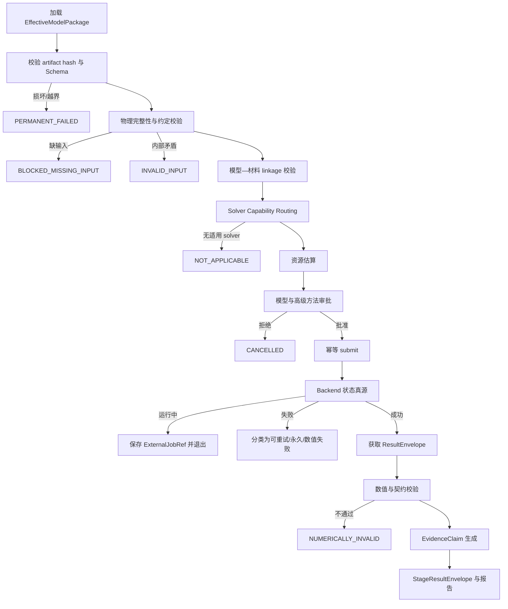

# Agent 04：多体数值计算控制器与首个真实 ED Backend 实施计划

版本：v0.1  
日期：2026-07-25  
适用范围：总计划 Day 11 的可实施 MVP，以及后续首个真实多体求解器  
依据：[`docs/system-plan.md`](../../docs/system-plan.md)、[`docs/architecture.md`](../../docs/architecture.md)、[`Orchestrator 计划`](material-screening-orchestrator-plan.md)

## 开始开发前必读

- [README](../../README.md)：当前仅有控制链/fixture 的实现边界和默认 Gate。
- [系统蓝图](../../docs/system-plan.md)：L4 证据边界、专家审批、安全和科学措辞约束。
- [技术架构 Agent04 边界](../../docs/architecture.md#56-agent-04many-body-controller)：模型输入、数值验证、材料映射和证据边界。
- [技术架构后端规则](../../docs/architecture.md#7-adapter-与-backend-规则)：ManyBodyBackend 的所有权、幂等、恢复和错误语义。
- [主计划](../master.md)：当前状态、跨 agent 依赖、阻塞和系统 DoD。
- [Orchestrator 计划](material-screening-orchestrator-plan.md)：阶段输入、审批、恢复和统一 StageRunner 契约。
- [原始系统总方案](../../docs/system-plan-original.md)：仅用于历史追溯。

### 模块职责与边界

- **职责：** `EffectiveModelPackage` 校验、solver capability/routing、资源估计、ManyBodyRequest、审批、backend 生命周期、数值验证、模型—材料 linkage 和 claim 级证据。
- **输入：** 专家提供且带 hash 的有效模型、参数/provenance、目标 claim、solver registry、预算和上游 DFT/材料引用（如适用）。
- **输出：** 路由/阻塞结果、冻结请求、backend job/artifact 引用、数值验证报告、模型级与材料映射级证据及 StageResultEnvelope。
- **不负责：** 从结构/能带/自然语言猜模型或 U/J、自动生成 solver 代码、静默更换方法、热力学极限外推或把 mock/fixture 晋级 L4。
- **不可修改范围：** Agent01/02/03 权威 Artifact、Orchestrator 控制契约、专家未确认的模型/方法 policy、外部 backend 状态真源和其他 agent 计划。

仓库没有单独的 integration Markdown；真实 solver/backend 依照[技术架构后端规则](../../docs/architecture.md#7-adapter-与-backend-规则)接入，本计划第 8–10、13 节保留具体契约与实施边界。

### 当前下一步、依赖与阻塞

1. P0 收口复核已完成的 `EffectiveModelPackage`、输入/Artifact 完整性校验、
   deterministic registry/routing、资源估算和审批 payload。
2. 复核 `MockManyBodyBackend` 与 `ManyBodyStageRunner` 的幂等 lifecycle、失败注入、
   跨进程恢复、结果 hash 校验和不提升 L4 的 contract/integration/E2E。
3. 确认默认 production many-body capability 未注册，fixture/mock 始终
   `is_mock=true`、空 observables，且不生成真实 solver 结果。
4. P0 收口后，真实 ED 仍是独立 P1：先冻结科学规格和 benchmark，再逐项实现
   basis/operator/Hamiltonian/solver/observable。

本次 P0 收口验收：不修改公共 Orchestrator/checkpoint schema、数据库迁移或
Agent01/02/03 权威 Artifact；不实现 ED/DMFT/DMRG；完整离线 Gate、`pip check`
与 `git diff --check` 通过。

跨 agent 依赖：模型必须由专家或上游明确提供；Agent03 仅提供有 scope 的 DFT 派生输入，不能替代模型构建；Orchestrator 提供统一阶段审批、恢复和 Artifact 引用。当前阻塞为真实材料模型 linkage、首个科学目标、solver policy 和高级方法审批尚未冻结，且尚无生产多体 backend；fixture/mock 不得解除这些阻塞。

完成每个 MVP/P1 任务后，只更新本计划的实际状态、benchmark/测试证据、数值限制、provenance 和待专家确认项；公共契约或 evidence ceiling 变更须同步 Orchestrator、Agent03 计划及冻结 contract/integration/E2E 设计。

当前状态：**Agent04 MVP mock 控制链（任务 1–6）已完成；默认 production
many-body capability 未注册，真实 ED/DMFT/DMRG 均未实现。**

P2 系统 v1 收尾验证（2026-07-28）：四阶段综合安全回归确认固定 route 顺序和默认
production many-body capability 未注册。完整离线 Gate 为 `337 passed, 7 skipped`（两个
live MP、五个 real-ML/Metal opt-in）；`pip check` 和 `git diff --check` 通过。
fixture/mock 继续显式 `is_mock=true`、空 observables、不得晋级 L4；未运行 live MP、
网络或真实多体求解。benchmark 与真实 solver/backend 不属于本次 P2 系统收尾。

## 0. 执行结论

Agent 04 不应被设计成“LLM 看一眼材料，然后自动选择并运行 DMFT/DMRG/ED”的自治科研 Agent。它应当是一个受版本化科学政策、严格数据契约、能力注册表和人工审批约束的多体计算控制器。

本计划冻结以下决定：

| 事项 | 决定 |
|---|---|
| MVP 目标 | 可直接实现的输入 Schema、验证器、路由 Schema、solver registry、mock backend、审批和恢复链路 |
| 有效模型来源 | v1 由用户或专家提供完整 `EffectiveModelPackage`；测试可使用仓库 fixture |
| 禁止行为 | 不从晶体结构、普通 band structure 或自然语言自动猜测 Hamiltonian、轨道基、\(U/J\) |
| MVP fixture | 同时包含一维 Hubbard 链和二维 \(2\times2\) Hubbard 小格点 |
| 首个真实 backend | 有限尺寸、零温、固定粒子数扇区的精确对角化 `ExactDiagonalizationBackend` |
| 首个真实 backend 定位 | 系统校准与小模型参考求解器，不宣称直接解决热力学极限下的真实材料问题 |
| 后续 solver | 物理目标确定后，再通过方法选择 Gate 决定 DMFT 或 DMRG |
| 首批真实 observables | 基态能量、低激发、占据、双占据、静态自旋/电荷关联、结构因子、组合任务 charge gap |
| 暂不支持 | 实频谱函数、解析延拓、有限温、动力学关联、自动相图扫描、热力学极限外推 |
| 证据设计 | 求解器数值可信度与模型—材料映射可信度分开记录 |
| L4 原则 | fixture、mock 或来源不完整的模型不得把材料候选提升到 `L4_MANY_BODY_VALIDATED` |
| 代码生成 | MVP 和首个 ED backend 均不生成或执行任意 solver 代码 |

因此，Agent 04 的纵向路线是：

```text
专家提供 EffectiveModelPackage
    → 确定性 Schema 校验
    → 物理完整性与 provenance 校验
    → solver capability 匹配
    → 资源估算
    → 模型/高级方法/昂贵计算审批
    → ManyBodyBackend
    → 数值验证
    → 模型级科学结果
    → 模型—材料 linkage 复核
    → claim 级证据晋级
```

## 1. 定位、目标与边界

### 1.1 核心职责

Agent 04 负责：

1. 接收不可变、带 hash 的 `EffectiveModelPackage`；
2. 验证晶格或有限图、轨道基、自由度顺序和单位约定；
3. 验证 hopping、相互作用、填充、温度、边界条件和求解目标是否完整；
4. 检查模型参数及模型—材料映射的 provenance；
5. 依据确定性的 solver capability registry 判断方法适用性；
6. 给出所有可用方法、推荐方法、阻塞原因和局限；
7. 生成资源估算和 `ManyBodyRequest`；
8. 生成并等待人工审批；
9. 通过 `ManyBodyBackend` 执行、轮询、取消和获取结果；
10. 检查 Hermiticity、守恒量、残差、正交性、收敛和 benchmark；
11. 将模型求解证据与材料映射证据分别写入结果；
12. 只对满足严格条件的具体 claim 提升证据等级；
13. 保存所有输入、输出、版本、hash、审批和失败信息；
14. 向 Orchestrator 返回统一 `StageResultEnvelope`。

### 1.2 Agent 04 不负责

Agent 04 不负责：

- 从 Materials Project 记录自动构造 Hubbard 模型；
- 从普通 DFT band structure 自动选择相关轨道；
- 自动执行 Wannierization、downfolding 或 disentanglement；
- 自动计算或猜测 \(U\)、\(J\)、\(V\)；
- 静默选取 double-counting correction；
- 根据自然语言直接拼装任意二次量子化表达式；
- 自动生成并执行 DMFT、DMRG 或 ED 代码；
- 在方法不适用时静默换 solver、改模型或缩小参数范围；
- 把 mock、fixture、未收敛或仅模型级结果描述成真实材料结论；
- 用有限尺寸 ED 自动推断热力学极限相图；
- 代替科研人员完成模型定义和最终科学审查。

### 1.3 MVP 完成标准

Day 11 MVP 必须可以真实执行以下控制链：

1. 导入一份版本化 `EffectiveModelPackage`；
2. 对完整的一维或二维 Hubbard fixture 返回 `READY`；
3. 对缺少 \(U\)、填充、边界条件或自由度顺序的输入返回 `BLOCKED_MISSING_INPUT`；
4. 对多轨道、SOC、非局域相互作用等当前 mock/ED 能力不支持的模型返回 `NOT_APPLICABLE`；
5. 生成结构化路由结果、资源估算和审批 payload；
6. 审批后向 `MockManyBodyBackend` 幂等 submit；
7. 模拟 `RUNNING/SUCCEEDED/FAILED/CANCELLED/TIMEOUT`；
8. 跨进程通过 `status/resume` 恢复；
9. mock 结果中不包含伪造的科研数值；
10. StageResult 明确记录 `is_mock=true`，且不产生 L4 证据；
11. 所有 artifact 可通过 URI、SHA-256 和 manifest 追溯；
12. 单元、契约、集成和 E2E 测试通过。

### 1.4 首个真实 ED backend 完成标准

P1 的 `ExactDiagonalizationBackend` 必须：

- 使用固定、受测试的代码路径，不使用 LLM 生成求解代码；
- 支持有限图上的实数 hopping 单带 Hubbard 模型；
- 支持 OBC/PBC、零温、canonical ensemble、固定 \(N_\uparrow,N_\downarrow\)；
- 利用 \(N_\uparrow,N_\downarrow\) 守恒量分块；
- 在资源上限内构造稀疏 Hamiltonian；
- 计算基态和配置数量的低激发态；
- 输出已冻结定义的静态 observables；
- 对解析极限、Hubbard dimer、dense/sparse 交叉结果通过测试；
- 对未收敛、近简并、资源超限和不支持输入显式失败或阻塞；
- 不因真实 ED 成功就自动把模型对应材料提升到 L4；
- 在 Mac 上对固定小模型可重复运行；
- 为未来服务器 backend 保持相同的 `ManyBodyBackend` 契约。

## 2. 科学证据模型

### 2.1 为什么不能只用单一 evidence level

多体阶段至少存在三个不同问题：

1. 输入的数学模型是否定义完整；
2. solver 是否正确、收敛并通过数值验证；
3. 该模型是否可信地代表某个具体材料及某项科学 claim。

ED 可以把一个 toy Hubbard 模型求解得非常精确，但这不证明某个 Materials Project 候选是 Mott insulator。反过来，模型来源完整也不代表一次未收敛的 solver 运行有效。因此，Agent 04 必须保留三个维度。

### 2.2 `ModelDefinitionStatus`

允许值：

- `UNVALIDATED`
- `INVALID_SCHEMA`
- `MISSING_REQUIRED_PHYSICS`
- `INTERNALLY_INCONSISTENT`
- `VALIDATED_MODEL`

`VALIDATED_MODEL` 仅表示模型在其声明的约定下数学上完整，不表示与材料对应。

### 2.3 `SolverValidationStatus`

允许值：

- `NOT_RUN`
- `MOCK_ONLY`
- `NOT_APPLICABLE`
- `RESOURCE_REJECTED`
- `RUNNING`
- `NUMERICALLY_UNCONVERGED`
- `NUMERICALLY_INVALID`
- `NUMERICALLY_VALIDATED`
- `BENCHMARK_VALIDATED`

含义：

- `NUMERICALLY_VALIDATED`：本次真实运行通过 residual、正交性、Hermiticity 和守恒量检查；
- `BENCHMARK_VALIDATED`：除本次运行检查外，所用 backend 版本还通过固定 benchmark suite；
- mock 永远只能是 `MOCK_ONLY`。

### 2.4 `MaterialLinkageStatus`

允许值：

- `NONE`
- `DECLARED_ONLY`
- `PARTIAL_PROVENANCE`
- `TRACEABLE_UNREVIEWED`
- `EXPERT_APPROVED`
- `INVALIDATED`

判断依据包括：

- `candidate_id` 和 `structure_id`；
- 上游结构 artifact URI/hash；
- DFT calculation ID、代码和参数；
- Wannier/downfolding 工具、版本和输入输出 hash；
- 相关子空间、轨道投影和能量窗口；
- disentanglement 和 gauge 约定；
- 相互作用参数来源；
- double-counting policy；
- 专家审批记录。

### 2.5 `EvidenceScope`

每项结果 claim 必须声明作用域：

- `SOLVER_BENCHMARK`
- `ABSTRACT_MODEL`
- `FINITE_CLUSTER`
- `EFFECTIVE_MODEL_FOR_CANDIDATE`
- `MATERIAL_CANDIDATE`

禁止把 `FINITE_CLUSTER` claim 自动泛化为 `MATERIAL_CANDIDATE` claim。

### 2.6 L4 晋级规则

现有 Candidate 顶层 `evidence_level` 保留用于兼容，但新增 `EvidenceClaim[]` 作为真源。每个 claim 单独保存性质、范围、条件和证据。

只有同时满足以下条件时，具体 claim 才可标记为 `L4_MANY_BODY_VALIDATED`：

1. `is_mock=false`；
2. 输入不是 fixture；
3. `ModelDefinitionStatus=VALIDATED_MODEL`；
4. `SolverValidationStatus` 至少为 `NUMERICALLY_VALIDATED`；
5. 所用 backend 版本通过对应 benchmark；
6. `MaterialLinkageStatus=EXPERT_APPROVED`；
7. candidate、structure、Hamiltonian 和 interaction 参数都有不可变引用和 hash；
8. solver capability 与输入特征完全匹配；
9. 所有 approximation 和未覆盖范围进入 claim；
10. 高级方法审批与结果审查均完成；
11. claim 没有从有限尺寸结果无依据外推；
12. 报告语言通过 evidence policy。

如果任何条件不满足，仍可发布模型级结果，但不得提升材料级 L4。

### 2.7 Candidate 顶层等级的派生

`candidate.evidence_level` 只表示该候选所拥有的最高证据等级，不代表所有性质均达到该等级。报告必须使用类似：

> “对模型 M 的有限尺寸 ED 结果在给定参数下通过数值验证；该结果的材料映射状态为 PARTIAL_PROVENANCE，因此不构成材料级 L4 结论。”

禁止使用：

> “该材料已经被多体计算证实为 Mott 绝缘体。”

除非相关 Mott claim 本身满足全部 L4 条件。

## 3. 总体架构

### 3.1 内部组件

```text
ManyBodyStageRunner
├── EffectiveModelLoader
├── EffectiveModelValidator
│   ├── SchemaValidator
│   ├── ConventionValidator
│   ├── HamiltonianValidator
│   ├── InteractionValidator
│   ├── StatePointValidator
│   └── MaterialLinkageValidator
├── SolverCapabilityRegistry
├── SolverRouter
├── ResourceEstimator
├── ApprovalPlanner
├── ManyBodyBackend
│   ├── MockManyBodyBackend
│   └── ExactDiagonalizationBackend
├── ResultEnvelopeValidator
├── NumericalValidationSuite
├── EvidenceEvaluator
└── ManyBodyReporter
```

所有 LLM 能力只能用于把结构化错误解释成自然语言或辅助报告措辞，不得参与：

- Hamiltonian 数值构造；
- 参数补全；
- solver capability 判断；
- 数值收敛判定；
- L4 晋级；
- 自动 fallback。

### 3.2 阶段流程



### 3.3 公共 StageRunner 契约

Agent 04 实现：

```text
validate_input(context) -> StageInputValidation
prepare(context) -> ManyBodyStagePlan
start(plan, idempotency_key) -> StageOutcome
reconcile(external_job_ref) -> StageOutcome
```

职责划分：

- `validate_input` 不产生外部副作用；
- `prepare` 冻结输入快照、路由和资源估算，并创建审批需求；
- `start` 只能在审批通过且快照 hash 未变化时 submit；
- `reconcile` 只以 backend 为外部任务状态真源；
- `fetch_result` 只有在 backend 报告 terminal success 后调用；
- 每一步都必须可幂等重放。

## 4. `EffectiveModelPackage` 数据契约

### 4.1 顶层结构

建议 Pydantic v2 模型至少包含：

```json
{
  "schema_version": "effective-model/v1",
  "model_id": "em_...",
  "revision": 1,
  "name": "2x2 Hubbard fixture",
  "model_family": "SINGLE_BAND_HUBBARD",
  "fixture": true,
  "geometry": {},
  "basis": {},
  "one_body": {},
  "interactions": [],
  "state_points": [],
  "conventions": {},
  "material_linkage": {},
  "parameter_provenance": [],
  "artifacts": [],
  "created_by": {},
  "created_at": "...",
  "package_hash": "sha256:..."
}
```

不可变规则：

- `model_id` 表示逻辑模型；
- 修改任何物理字段必须增加 `revision`；
- 每个 revision 内容不可变；
- `package_hash` 由 canonical JSON 和全部引用 artifact hash 共同计算；
- display name、备注等非物理字段若修改，也生成新 revision，避免审计歧义；
- 禁止覆盖旧模型文件。

### 4.2 `model_family`

首版枚举：

- `SINGLE_BAND_HUBBARD`
- `MULTI_ORBITAL_HUBBARD_KANAMORI`
- `EXTENDED_HUBBARD`
- `SPIN_MODEL`
- `IMPURITY_MODEL`
- `CUSTOM_DECLARED`

MVP 可以解析这些枚举，但只有 `SINGLE_BAND_HUBBARD` fixture 进入 mock 演示；P1 ED 只支持声明的单带子集。`CUSTOM_DECLARED` 必须附带机器可读 term schema，不能是自然语言公式，但当前返回 `NOT_APPLICABLE`。

### 4.3 `Geometry`

需要支持两类表示：

1. `FINITE_GRAPH`
   - `num_sites`
   - `site_ids`
   - 可选坐标；
   - edge 列表；
   - `boundary_condition=OPEN|PERIODIC`
   - 周期边的明确 wrap 标记；
   - 图连通性；
   - 图和 edge canonical ordering。

2. `PERIODIC_LATTICE`
   - 空间维度；
   - primitive vectors；
   - unit-cell site；
   - lattice translations；
   - reciprocal convention；
   - 默认不展开为 ED cluster；
   - 必须另有显式 cluster construction 才能路由到 ED。

严禁仅写 `"square lattice"`、`"1D chain"` 等自然语言名称而不保存机器可读连接关系。

### 4.4 `BasisDefinition`

至少包含：

- basis ID；
- site → orbital 映射；
- orbital label；
- spin convention；
- Fock basis ordering；
- creation/annihilation operator ordering；
- index base；
- complex phase/gauge 说明；
- 是否包含 SOC；
- 是否存在 Nambu doubling；
- frozen orbital；
- active orbital；
- 与 Wannier orbital 的映射引用。

P1 ED 固定采用：

```text
all spin-up orbitals ordered by site,
followed by all spin-down orbitals ordered by site
```

或另一种被实现代码明确选择的顺序。具体顺序必须冻结到 `conventions_version`，不能只写在注释中。

### 4.5 `OneBodyHamiltonian`

至少包含：

- energy unit，v1 只允许 `eV` 输入或可无歧义转换到 eV；
- onsite energy；
- hopping term；
- 是否为实数或复数；
- directed/undirected storage convention；
- 是否同时存储 Hermitian conjugate；
- double-count 防重复规则；
- chemical potential 是否进入 Hamiltonian；
- matrix artifact URI/hash；
- sparse format 与 dtype；
- numerical zero tolerance。

推荐 artifact 使用无 object dtype 的 `.npz` 或确定性 JSON/JSONL COO 表示。加载 NumPy artifact 时必须显式 `allow_pickle=False`；NumPy 官方文档说明加载 pickle 可执行任意代码，因此项目禁止 object array 和 pickle。[NumPy `load` 文档](https://numpy.org/doc/stable/reference/generated/numpy.load.html)

P1 ED 限制：

- 实数 hopping；
- spin-independent；
- 无 SOC；
- 无 pairing；
- 无时间依赖；
- 有限图；
- hopping term 在 canonicalization 后满足 Hermiticity。

### 4.6 `InteractionTerm`

采用 discriminated union，不使用自由字符串：

- `ONSITE_HUBBARD_U`
- `KANAMORI`
- `DENSITY_DENSITY`
- `NONLOCAL_DENSITY_V`
- `HEISENBERG_J`
- `CUSTOM_TENSOR`

每个 term 至少包含：

- term ID；
- 作用 site/orbital；
- 参数值与单位；
- index convention；
- 是否 density-density；
- 是否包含 spin-flip/pair-hopping；
- provenance ID；
- uncertainty 或取值范围；
- double-counting relation；
- 当前请求使用的冻结值。

P1 ED 只支持：

- 每个 site 一个 `ONSITE_HUBBARD_U`；
- \(U_i\) 可统一或逐 site 指定；
- 不支持 \(V\)、Kanamori、spin-flip、pair-hopping 或频率依赖 \(U(\omega)\)。

不支持的 interaction 必须在路由阶段返回结构化 reason code，不允许静默丢弃。

### 4.7 `StatePoint`

至少包含：

- `state_point_id`
- `ensemble=CANONICAL|GRAND_CANONICAL`
- `temperature_definition=ZERO_T|BETA|KELVIN`
- temperature/beta 及单位；
- `n_up`、`n_down`；
- 或 `n_total`、`sz`；
- filling；
- chemical potential；
- 外场；
- state point 的参数来源；
- 是否属于扫描。

一致性规则：

- canonical ensemble 中必须能唯一确定粒子数扇区；
- `n_up+n_down=n_total`；
- \(S_z=(N_\uparrow-N_\downarrow)/2\)；
- filling 必须与 active spin-orbital 数定义一致；
- `ZERO_T` 不得同时给有限 beta；
- grand canonical 必须提供 chemical potential；
- temperature 必须非负且单位明确；
- 不得同时提供互相冲突的 filling 和粒子数。

P1 ED 只接受：

- `ensemble=CANONICAL`
- `temperature_definition=ZERO_T`
- 明确 `n_up,n_down`

其他 state point 返回 `NOT_APPLICABLE`，不自动近似为零温。

### 4.8 `ModelConventions`

必须冻结：

- Hamiltonian 符号，例如 hopping 是否写作 \(-t\)；
- chemical potential 项符号；
- Fourier transform convention；
- spin operator 定义；
- charge correlation 是否 connected；
- structure factor 归一化；
- lattice distance 和 reciprocal vector convention；
- observables 的 site/orbital ordering；
- 浮点与复数序列化规则；
- `conventions_version`。

报告中的每个 observable 引用 `observable_definition_id`，避免同名量采用不同定义。

### 4.9 `ParameterProvenance`

每个关键参数必须指向 provenance record：

- `parameter_id`
- 参数名、值、单位；
- `source_type`
- source URI/DOI/artifact；
- 方法；
- 软件和版本；
- 输入/输出 hash；
- candidate/structure revision；
- 不确定度；
- 专家备注；
- 是否经过审批。

`source_type` 至少包括：

- `FIXTURE`
- `USER_ASSUMPTION`
- `LITERATURE`
- `FITTED`
- `DFT_DERIVED`
- `CONSTRAINED_DFT`
- `CRPA`
- `EXPERIMENT`

`USER_ASSUMPTION` 可以运行模型计算，但不能单独支撑材料级 L4。

### 4.10 `ModelMaterialLinkage`

至少包含：

- `candidate_id`
- `source_material_id`
- `structure_id`
- structure artifact URI/hash；
- DFT run/task ID；
- electronic structure artifact；
- Wannier/downfolding artifact；
- orbital projection；
- energy/frozen/disentanglement window；
- Hamiltonian artifact；
- interaction source；
- double-counting policy；
- linkage policy version；
- review status；
- approval ID。

MVP 允许整个对象为 `null`，此时模型仍可作为 `ABSTRACT_MODEL` 或 `SOLVER_BENCHMARK` 运行。

## 5. 请求、路由与结果契约

### 5.1 `ManyBodyRequest`

建议字段：

```json
{
  "request_id": "mbr_...",
  "model_id": "em_...",
  "model_revision": 1,
  "model_package_uri": "artifact://...",
  "model_package_hash": "sha256:...",
  "state_point_ids": ["sp_..."],
  "requested_observables": [],
  "requested_claims": [],
  "solver_preference": null,
  "solver_parameters": {},
  "resource_budget": {},
  "approval_policy_version": "many-body-approval/v1",
  "routing_policy_version": "many-body-routing/v1",
  "created_at": "..."
}
```

规则：

- request 只能引用一个不可变模型 revision；
- 多个 state point 默认拆为多个子任务；
- 参数扫描不能伪装成单任务；
- `solver_preference` 只是用户偏好，不覆盖 capability 检查；
- solver-specific 参数必须通过对应的 discriminated Schema；
- 不接受任意命令行字符串、Python 表达式或脚本路径。

### 5.2 `RequestedObservable`

字段：

- `observable_name`
- `definition_id`
- target site/orbital/momentum；
- absolute/connected；
- precision request；
- required evidence scope；
- required evidence level；
- 是否允许缺失；
- reason。

P1 ED 支持：

- `ground_state_energy`
- `low_lying_energies`
- `particle_number`
- `total_sz`
- `site_density`
- `double_occupancy`
- `spin_correlation_zz`
- `charge_correlation_connected`
- `spin_structure_factor_zz`
- `charge_structure_factor`

`charge_gap` 是组合结果，由多个 sector task 聚合，不是单个 eigenproblem 的原生 observable。

### 5.3 `SolverCapability`

每个 solver/backend 版本在 registry 中记录：

- solver ID、backend ID 和版本；
- `is_mock`；
- 支持的 model family；
- geometry；
- spatial dimension；
- orbital 数；
- real/complex hopping；
- SOC；
- interaction types；
- ensemble；
- temperature；
- boundary condition；
- symmetries；
- observables；
- resource estimator；
- dependency versions；
- license；
- supported platforms；
- smoke test 状态；
- benchmark suite/version/status；
- 已知限制；
- capability policy version。

registry 必须是版本控制的静态配置加启动时 health check，不由 LLM 动态编写。

### 5.4 `SolverRoutingDecision`

包含：

- `routing_decision_id`
- 输入 model/request hash；
- `applicable_solvers[]`
- `inapplicable_solvers[]`
- 每个 solver 的 match/mismatch 维度；
- recommended solver；
- recommendation reason codes；
- approximation warnings；
- missing input；
- resource estimate；
- required approvals；
- policy version；
- registry snapshot hash。

典型 reason code：

- `MODEL_FAMILY_UNSUPPORTED`
- `GEOMETRY_UNSUPPORTED`
- `COMPLEX_HOPPING_UNSUPPORTED`
- `SOC_UNSUPPORTED`
- `INTERACTION_TERM_UNSUPPORTED`
- `FINITE_T_UNSUPPORTED`
- `ENSEMBLE_UNSUPPORTED`
- `OBSERVABLE_UNSUPPORTED`
- `HILBERT_SPACE_LIMIT`
- `MISSING_PARTICLE_SECTOR`
- `MISSING_PARAMETER_PROVENANCE`
- `MODEL_LINKAGE_INCOMPLETE`

路由结果不等于求解结果；报告必须明确写“适用/推荐”，不能写“已验证”。

### 5.5 确定性路由规则

路由顺序：

1. 校验输入完整性；
2. 提取模型 feature vector；
3. 与每个 solver capability 做逐字段匹配；
4. 对每个适用 solver 运行其 resource estimator；
5. 排除超出 hard budget 的 solver；
6. 按版本化 policy 排序；
7. 输出推荐和备选；
8. 由用户/专家审批最终 solver。

禁止：

- 因 ED 不支持 SOC 而自动删除 SOC；
- 因资源超限而自动减小格点；
- 因有限温不支持而自动取 \(T=0\)；
- 因相互作用形式不支持而只保留 density-density；
- solver 失败后未经审批静默换 solver。

### 5.6 `ManyBodyResultEnvelope`

建议结构：

```json
{
  "schema_version": "many-body-result/v1",
  "job_ref": {},
  "request_id": "mbr_...",
  "model_snapshot_uri": "artifact://...",
  "model_snapshot_hash": "sha256:...",
  "backend": {},
  "is_mock": false,
  "execution_status": "SUCCEEDED",
  "model_definition_status": "VALIDATED_MODEL",
  "solver_validation_status": "NUMERICALLY_VALIDATED",
  "material_linkage_status": "NONE",
  "evidence_scope": "FINITE_CLUSTER",
  "observables": [],
  "numerical_validation": {},
  "convergence": {},
  "resource_usage": {},
  "warnings": [],
  "errors": [],
  "artifacts": [],
  "provenance": {},
  "started_at": "...",
  "finished_at": "..."
}
```

### 5.7 `ObservableValue`

每个 observable 至少包含：

- name；
- definition ID/version；
- scalar/array/artifact URI；
- unit；
- shape、axis 和 labels；
- value hash；
- state point；
- sector；
- solver/backend；
- numerical uncertainty；
- finite-size metadata；
- evidence scope；
- warnings；
- derived/from task IDs。

大数组不得直接进入 Global State。

### 5.8 `NumericalValidation`

至少包含：

- Hamiltonian Hermiticity error；
- eigenpair residual norms；
- eigenvector orthogonality error；
- conserved \(N_\uparrow,N_\downarrow,S_z\)；
- requested/converged eigenpair count；
- convergence tolerance；
- max iteration；
- degeneracy tolerance；
- detected degeneracy；
- dense/sparse cross-check 状态；
- benchmark suite ID；
- validation policy version；
- overall pass/fail。

## 6. 输入验证设计

### 6.1 分层验证顺序

验证必须按由便宜到昂贵、由结构到科学的顺序执行：

1. URI 和路径边界；
2. artifact 是否存在、大小是否超限；
3. SHA-256；
4. JSON Schema/Pydantic；
5. ID、revision 和 package hash 一致性；
6. 单位和有限浮点数；
7. geometry/basis 索引；
8. hopping 和 interaction term；
9. state point；
10. observable request；
11. parameter provenance；
12. material linkage；
13. solver capability；
14. resource estimate。

前一层失败时不执行依赖它的后一层，但应尽可能一次返回同一层的全部错误，减少用户反复修改。

### 6.2 结构化验证输出

`StageInputValidation` 中每个问题包含：

- `issue_id`
- `severity=ERROR|WARNING|INFO`
- `category`
- `field_path`
- `reason_code`
- 面向用户的解释；
- 期望格式；
- observed 摘要；
- 修复方式；
- 是否阻塞；
- 相关 policy version。

禁止只返回 Python traceback。

### 6.3 基础数值检查

所有数值必须：

- 不是 `NaN`；
- 不是正负无穷；
- 单位明确；
- 转换后仍在允许范围；
- 复数使用明确的 real/imag 表示；
- 不使用 locale 相关数字字符串；
- 不依赖 JSON 对对象顺序的偶然处理。

所有索引必须：

- 为整数；
- 在声明范围内；
- 不存在重复 ID；
- canonical ordering 可确定；
- basis、geometry、hopping、interaction 使用同一 index convention。

### 6.4 Geometry 校验

至少检查：

- `num_sites` 与 site 列表一致；
- site ID 唯一；
- edge endpoint 存在；
- self-loop 是否只用于 onsite；
- OBC 中不得出现未声明 wrap edge；
- PBC 中 wrap/vector 信息完整；
- 图是否为空；
- 图是否连通；不连通可允许，但生成 warning；
- 坐标维度与 spatial dimension 一致；
- 周期晶格 primitive vectors 不奇异；
- finite ED cluster 不能只靠 periodic unit cell 隐式生成。

### 6.5 Basis 校验

至少检查：

- 每个 active orbital 有唯一全局 index；
- orbital → site 映射完整；
- spin label 合法；
- Fock ordering 明确；
- SOC/Nambu flag 与 one-body matrix 维度一致；
- frozen orbital 不出现在 active interaction 中；
- model family 所需自由度均存在；
- material linkage 中的 Wannier orbital 数与 active basis 一致。

### 6.6 Hamiltonian 校验

至少检查：

- matrix shape 与 basis 一致；
- sparse index 不越界；
- 重复 COO entry 按明示规则合并；
- onsite 与 hopping 不重复计算；
- \(H=H^\dagger\) 在版本化 tolerance 内成立；
- 若只存一半矩阵，storage convention 明确；
- directed hopping 和 Hermitian conjugate 规则一致；
- hopping unit 可转换为 eV；
- matrix 不包含 object dtype；
- artifact 实际 hash 与 manifest 一致；
- 模型标记 real 时虚部在 tolerance 内为零。

如果 Hermiticity 超差：

- 不自动对称化；
- 返回 `HAMILTONIAN_NON_HERMITIAN`；
- 可在报告中给出最大误差位置；
- 只有用户生成新模型 revision 后才能继续。

### 6.7 Interaction 校验

至少检查：

- term type 与 model family 匹配；
- site/orbital index 合法；
- 参数单位与物理量一致；
- \(U/J/V\) provenance 存在；
- full Kanamori 与 density-density approximation 被明确区分；
- 频率依赖参数有频率网格和插值约定；
- 不能同时以两个 term 重复表示同一 interaction；
- double-counting policy 与模型来源相符；
- solver 不支持的 term 不会被丢弃。

负 \(U\) 在数学上可以合法，但必须：

- model 明确声明 attractive interaction；
- 触发 warning；
- 不被当作输入错误自动改成正数。

### 6.8 State point 校验

除第 4.7 节一致性规则外，还应检查：

- \(0\leq N_\uparrow,N_\downarrow\leq L\)；
- sector Hilbert dimension 非零；
- state point 与 requested observable 兼容；
- charge gap 的 \(N\pm1\) sector 在有效粒子数范围内；
- field、chemical potential 是否已经包含在 one-body Hamiltonian；
- 避免 chemical potential 被计算两次。

### 6.9 模型—材料 linkage 校验

linkage validator 不能判断某个模型“科学上一定正确”，但必须机械检查：

- 所有引用 artifact 存在且 hash 匹配；
- structure revision 没有被上游新 revision 替代；
- Wannier basis 数目与模型 basis 一致；
- interaction 参数对应同一结构/模型 revision；
- 参数来源不是另一个 candidate；
- review approval 的 snapshot hash 与当前 linkage 相同；
- 模型修改后旧审批自动失效。

### 6.10 缺失输入与不适用的区分

示例：

- 缺少 `n_up`：`BLOCKED_MISSING_INPUT`；
- 提供 finite-temperature state point，但 ED v1 不支持：`NOT_APPLICABLE`；
- `n_up > num_sites`：`INVALID_INPUT`；
- artifact hash 错误：`PERMANENT_FAILED`；
- Hilbert dimension 超过批准预算：`RESOURCE_REJECTED`；
- solver 运行未收敛：`NUMERICALLY_UNCONVERGED`。

这些状态不得统一成 `FAILED`。

## 7. Solver Capability Registry 与方法路由

### 7.1 Registry 文件

建议文件：

```text
src/material_agent/stages/many_body/registry/
├── schema.py
├── registry.v1.yaml
└── policies/
    ├── routing.v1.yaml
    ├── resource.v1.yaml
    └── evidence.v1.yaml
```

YAML 仅保存静态声明，启动时必须由 Pydantic 校验。运行结果保存 registry snapshot URI/hash，防止日后 registry 更新后无法解释历史路由。

### 7.2 MVP registry

至少注册：

1. `mock-many-body/v1`
   - `is_mock=true`
   - `execution_mode=CONTROL_FLOW_SIMULATOR`；
   - 接受经过校验的模型快照来演示生命周期；
   - 只演示生命周期；
   - observables 为空；
   - 不产生科研数值；
   - 不进入科学方法的 `applicable_solvers` 列表。

2. `exact-diagonalization/v1-planned`
   - `availability=PLANNED`；
   - 描述未来 capability；
   - MVP 不能把它路由成可执行；
   - 用于展示输入与未来能力差距。

因此 MVP 的路由输出应区分：

- `scientific_capability_matches`：哪些真实/规划中 solver 在物理上匹配；
- `available_scientific_solvers`：当前可以真实提交的 solver；
- `control_flow_simulators`：只用于测试编排的 mock。

mock 不能因为“可以接收请求”而被描述为一个科学上适用的方法。

### 7.3 P1 ED registry

`exact-diagonalization/v1` 声明：

- model family：`SINGLE_BAND_HUBBARD`；
- geometry：`FINITE_GRAPH`；
- dimension：0D/1D/2D finite cluster；
- hopping：real、spin-independent；
- interaction：onsite \(U_i\)；
- ensemble：canonical；
- temperature：zero；
- boundary：open/periodic；
- symmetry sector：\(N_\uparrow,N_\downarrow\)；
- observables：第 5.2 节清单；
- hard resource bound：Hilbert dimension、estimated nnz、memory；
- platform：macOS/Linux；
- dependencies：锁定的 Python/NumPy/SciPy；
- benchmark status。

### 7.4 方法适用性矩阵

为以后选型保留如下逻辑，但尚未启用真实 backend：

| 问题特征 | ED | DMRG | 单站点/簇 DMFT |
|---|---|---|---|
| 小有限 cluster | 强 | 可用但通常非首选 | 不适用 |
| 一维、短程、低能/基态 | 尺寸受限 | 强 | 通常非首选 |
| 二维大体系 | 很快指数爆炸 | 受 entanglement 限制 | 适合局域关联近似 |
| 多轨道周期材料 | 仅极小模型 | 取决于映射 | 常见目标 |
| 有限温 | 小空间 full diagonalization 可行 | 需要专门算法 | 常见能力 |
| 实频谱 | Lehmann 小模型 | 动力学方法复杂 | 常需解析延拓 |
| 结果角色 | 基准/小模型精确结果 | 低维高精度 | 热力学极限局域自能近似 |

这个矩阵只用于生成选型问题，不作为当前自动路由。

### 7.5 后续 solver 选择 Gate

在新增 DMFT 或 DMRG 前，必须冻结：

1. 首个真实科学问题；
2. 模型维度、轨道数和相互作用形式；
3. 需要的 observables；
4. 零温或有限温；
5. 是否需要材料特定谱函数；
6. 目标尺寸和参数扫描规模；
7. 可用服务器、CPU/GPU、内存和调度系统；
8. 许可与依赖；
9. benchmark 文献和 gold/silver cases；
10. 专家维护者。

如果目标是一维短程基态与关联函数，优先评估 DMRG；如果目标是周期多轨道材料、有限温和局域谱性质，优先评估 DMFT。没有这些输入时不做伪精确选型。

## 8. `ManyBodyBackend` 契约

### 8.1 Protocol

与 DFT backend 对齐：

```python
class ManyBodyBackend(Protocol):
    def capabilities(self) -> SolverCapability: ...
    def health(self) -> BackendHealth: ...
    def validate_input(
        self, request: ManyBodyRequest
    ) -> BackendValidationResult: ...
    def estimate(
        self, request: ManyBodyRequest
    ) -> ResourceEstimate: ...
    def submit(
        self, request: ManyBodyRequest, idempotency_key: str
    ) -> ExternalJobRef: ...
    def status(self, job: ExternalJobRef) -> JobStatus: ...
    def cancel(self, job: ExternalJobRef) -> CancelResult: ...
    def fetch_result(
        self, job: ExternalJobRef
    ) -> ManyBodyResultEnvelope: ...
```

可选扩展：

- `fetch_logs(job, cursor)`；
- `heartbeat(job)`；
- `backend_version()`。

### 8.2 契约规则

- backend 不修改原始 model package；
- `validate_input` 无副作用；
- `estimate` 不提交任务；
- 相同 idempotency key 和输入 hash 返回同一 job；
- 相同 key 但不同输入 hash 返回冲突；
- `submit` 后 external backend 是任务状态真源；
- `fetch_result` 只返回已完成 job；
- cancel 是幂等操作；
- terminal 状态不可倒退；
- backend 结果必须引用原 request/model hash；
- backend 不自行提升 evidence level。

### 8.3 ExternalJobRef

至少包含：

- backend ID；
- backend version；
- external job ID；
- submit operation ID；
- idempotency key；
- request hash；
- backend config snapshot hash；
- submit time；
- workspace URI；
- scheduler ID，可为空；
- status endpoint/ref；
- `is_mock`。

### 8.4 JobStatus

允许：

- `QUEUED`
- `RUNNING`
- `SUCCEEDED`
- `FAILED`
- `CANCEL_REQUESTED`
- `CANCELLED`
- `TIMED_OUT`
- `UNKNOWN`

本地 `UNKNOWN` 不能直接推断为 `FAILED`。先对账；若多次无法确认，标为 `BACKEND_INCONSISTENT` 并暂停。

## 9. `MockManyBodyBackend`

### 9.1 目标

mock 只验证：

- Adapter contract；
- 生命周期；
- 幂等 submit；
- 审批；
- checkpoint/resume；
- cancel；
- 错误分类；
- artifact 与 provenance；
- evidence 防误晋级。

mock 不验证：

- Hamiltonian 求解；
- 物理 observable；
- solver 精度；
- L4 科学结论。

### 9.2 禁止伪造科研数值

mock success result 应包含：

```json
{
  "is_mock": true,
  "execution_status": "SUCCEEDED",
  "solver_validation_status": "MOCK_ONLY",
  "observables": [],
  "warnings": [
    {
      "code": "MOCK_NO_SCIENTIFIC_RESULT",
      "message": "本结果只验证控制流，不包含多体数值结论。"
    }
  ]
}
```

不得为了“报告看起来完整”生成假的 ground-state energy、gap 或 double occupancy。

### 9.3 可配置场景

用固定 fixture 配置：

- `immediate_success`
- `queued_then_running_then_success`
- `retryable_submit_failure`
- `permanent_submit_failure`
- `numerical_failure`
- `timeout`
- `cancelled`
- `status_regression`
- `result_hash_mismatch`

状态序列由 scenario 配置和 reconcile 次数确定，不依赖 wall-clock sleep，使测试稳定。

### 9.4 Mock artifact

可以产生：

- request snapshot；
- mock job metadata；
- state transition log；
- result envelope；
- validation report；
- provenance report。

不得产生伪 eigenvector、伪 spectral function 或伪图像。

## 10. 首个真实 `ExactDiagonalizationBackend`

### 10.1 科学范围

Hamiltonian：

\[
H =
\sum_{ij,\sigma} t_{ij} c^\dagger_{i\sigma} c_{j\sigma}
+ \sum_i U_i n_{i\uparrow}n_{i\downarrow}
+ \sum_{i,\sigma}\epsilon_i n_{i\sigma}
\]

实际代码使用 EffectiveModelPackage 中冻结的 hopping 符号约定，不在 backend 内假设用户的 \(t\) 一定为正或自动添加负号。

P1 支持：

- 一个 active orbital/site；
- 自旋 \(1/2\) fermion；
- number-conserving hopping；
- 实数 hopping；
- onsite energy；
- onsite Hubbard \(U_i\)；
- finite graph；
- OBC/PBC；
- 零温；
- 固定 \(N_\uparrow,N_\downarrow\)。

### 10.2 明确不支持

- complex hopping 或磁通；
- SOC；
- superconducting pairing；
- nonlocal \(V\)；
- Kanamori；
- spin-flip/pair-hopping；
- boson；
- time dependence；
- grand canonical；
- finite temperature；
- frequency-dependent interaction；
- dynamical correlator；
- arbitrary custom term；
- 自动 cluster tiling；
- 热力学极限外推。

### 10.3 Fock basis

每个 basis state 由两个长度为 \(L\) 的 bitstring 表示：

```text
(up_bits, down_bits)
```

只枚举满足：

```text
popcount(up_bits) == N_up
popcount(down_bits) == N_down
```

的状态。

Hilbert-space 维度：

\[
D =
\binom{L}{N_\uparrow}
\times
\binom{L}{N_\downarrow}.
\]

实现中直接使用整数精确计算，不用浮点近似决定资源上限。

### 10.4 Basis canonicalization

必须冻结：

- bit 0 对应哪个 site；
- up/down 自旋的全局 operator ordering；
- basis state 排序；
- state → row index 的映射算法；
- fermionic sign 的计算约定；
- serialization ordering。

相同模型、sector 和 backend version 必须得到相同 basis hash。

### 10.5 Fermionic sign

对 hopping \(c^\dagger_i c_j\)：

1. 检查 \(j\) 已占据；
2. 检查 \(i\) 未占据；
3. 计算 annihilation 和 creation 之间的 fermion parity；
4. 生成目标 bitstring；
5. 累加 hopping matrix element；
6. 通过 unit test 覆盖所有短 bitstring 和跨 up/down ordering 情况。

sign 实现是高风险核心，不应把 correctness 只寄托在端到端结果上。

### 10.6 Hamiltonian assembly

推荐步骤：

1. 预生成 sector basis；
2. 构造 state → index 字典；
3. 对每个 basis state 计算 diagonal onsite/\(U\)；
4. 对每个 hopping term 和 spin 生成允许跃迁；
5. 追加 COO row/column/value；
6. 合并重复 entry；
7. 转为 CSR；
8. 计算 Hermiticity error；
9. 记录 shape、nnz、dtype、hash；
10. 再进入 eigensolver。

不得先分配 \(D\times D\) dense matrix，除非 `D` 低于版本化 dense threshold。

### 10.7 资源估算

在构造 basis 前计算：

- \(D\)；
- edge/hopping term 数；
- `nnz_upper_bound`；
- basis memory；
- state-index memory；
- COO 临时内存；
- CSR 内存；
- eigenvector memory；
- 预计 peak memory；
- 预计运行档位。

保守上界可按每个 basis state 的 diagonal 和所有可能 spin hopping 估算：

```text
nnz_upper_bound ≈ D × (1 + 2 × number_of_directed_hops)
```

实际估算公式和安全系数必须版本化，并通过真实运行校准。

默认 policy 同时设置：

- `max_hilbert_dimension`
- `max_estimated_nnz`
- `max_estimated_peak_memory_bytes`
- `max_requested_eigenpairs`
- `max_walltime_seconds`

为使 P1 可以直接开始实现，建议采用以下保守 bootstrap 值：

```yaml
dense_dimension_threshold: 512
max_hilbert_dimension: 100000
max_estimated_nnz: 5000000
max_estimated_peak_memory_bytes: 1073741824  # 1 GiB
default_requested_eigenpairs: 4
max_requested_eigenpairs: 8
soft_walltime_seconds: 600
max_walltime_seconds: 1800
```

这些值是安全起点，不是科学或硬件定律。首次 benchmark 后必须用实测 peak memory/runtime 校准并发布 `many-body-resource/v2`；不得在同一 policy version 下静默修改。

不能只按“最多 12 个 site”限制，因为不同 filling 的 Hilbert dimension 差异巨大。

### 10.8 Dense 与 sparse 路径

建议：

- 小于 `dense_dimension_threshold`：用 `numpy.linalg.eigh` 完整对角化，作为稳定参考；
- 大于 threshold 且在 resource budget 内：用 `scipy.sparse.linalg.eigsh` 求最低若干本征对；
- threshold、`k`、`ncv`、`tol`、`maxiter` 和初始向量 seed 全部写入 solver policy。

SciPy 官方 `eigsh` 面向实对称/复 Hermitian 稀疏问题，并在 ARPACK 未收敛时抛出 `ArpackNoConvergence`，异常可携带部分收敛本征对。P1 对 complex hopping 返回不适用，避免把复杂 Hermitian 路径隐藏为不同算法。[SciPy `eigsh` 文档](https://docs.scipy.org/doc/scipy/reference/generated/scipy.sparse.linalg.eigsh.html)

部分收敛结果：

- 可以保存用于诊断；
- 不能自动当作 `SUCCEEDED`；
- 状态为 `NUMERICALLY_UNCONVERGED`；
- 报告收敛了多少本征对；
- 只有显式 retry policy 才能修改 `ncv/maxiter` 后重试；
- 修改参数必须生成新 attempt，保留旧结果。

### 10.9 数值验证阈值

首版建议作为 policy 默认值，而不是散落在代码中的 magic number：

- Hamiltonian Hermiticity max norm：`1e-12 eV`；
- eigenpair relative residual：`1e-10`；
- orthogonality max error：`1e-10`；
- conserved number expectation error：`1e-10`；
- dense/sparse energy agreement：`1e-9 eV`；
- benchmark energy absolute tolerance：`1e-8 eV`；
- degeneracy detection tolerance：`1e-8 eV`。

阈值需由 benchmark 校准。若将来模型尺度或 dtype 改变，应发布新 validation policy，不能静默放宽旧运行的标准。

### 10.10 近简并处理

若 \(E_1-E_0\) 小于 degeneracy tolerance：

- 标记 `GROUND_STATE_NEAR_DEGENERATE`；
- 检查请求的 eigenpair 数是否足以覆盖简并子空间；
- 若最后一个已计算态仍与基态近简并，自动扩大 `k` 只能在原审批预算内进行；
- 超出预算则返回 `DEGENERACY_UNRESOLVED`；
- 对依赖单一 eigenvector 的 observable 发出 basis-dependence warning；
- 可在完整简并子空间已解析时输出等权子空间平均，但必须标记定义。

### 10.11 首批 observables 的定义

固定：

\[
n_i=n_{i\uparrow}+n_{i\downarrow},
\qquad
D_i=\langle n_{i\uparrow}n_{i\downarrow}\rangle,
\qquad
S_i^z=(n_{i\uparrow}-n_{i\downarrow})/2.
\]

connected charge correlation：

\[
C^{n}_{ij}
=
\langle n_i n_j\rangle
-
\langle n_i\rangle\langle n_j\rangle.
\]

spin-\(z\) correlation：

\[
C^{s}_{ij}
=
\langle S_i^z S_j^z\rangle.
\]

structure factor 的 Fourier 符号、归一化和允许动量由 `observable_definition_version` 冻结。若 geometry 没有足够坐标/reciprocal 信息，则只能输出实空间关联，structure factor 返回缺失而不是猜测。

### 10.12 Charge gap 组合任务

有限尺寸 charge gap 定义：

\[
\Delta_c(N)
=
E_0(N+1)
+
E_0(N-1)
-
2E_0(N).
\]

实现规则：

- 由一个 `CompositeObservablePlan` 创建三个或更多明确 sector task；
- 每个 sector 有独立 request、job ref 和结果；
- 所有任务必须引用同一 model revision 和 solver policy；
- 对 \(N\pm1\) 的 \(N_\uparrow,N_\downarrow\) 分配规则必须明确；
- 聚合器只在全部依赖任务数值有效时计算；
- 任一 sector 失败时 charge gap 为 `UNAVAILABLE`，不以零或部分值代替；
- 输出 finite-size scope；
- 不自动将有限 cluster charge gap 称为材料体能隙。

### 10.13 Eigenvector artifact policy

默认报告不复制大 eigenvector 到 JSON。

- 小测试可将 eigenvector 保存为无 pickle 的数值 artifact；
- 默认只在 observables 需要且预算允许时持久化；
- artifact 包含 basis hash、sector、dtype、shape、normalization 和 solver version；
- 报告中只保存 URI/hash；
- 可配置保留策略；
- 删除或压缩必须通过 artifact 生命周期政策，不由 backend 临时决定。

## 11. ED Benchmark Suite

### 11.1 测试层级

1. 算子级；
2. basis 级；
3. Hamiltonian matrix 级；
4. eigensolver 级；
5. observable 级；
6. backend contract；
7. StageRunner 集成；
8. evidence/report E2E。

### 11.2 一 site 原子极限

无 chemical potential、onsite energy 为零：

- 空态能量 \(0\)；
- 单占据能量 \(0\)；
- 双占据能量 \(U\)；
- 粒子数和双占据精确；
- 用于检查 interaction diagonal 和 sector 构造。

### 11.3 Hubbard dimer

两 site、两个电子、对称 hopping。半填充 singlet 基态能量采用固定符号约定下的解析结果：

\[
E_0=\frac{U-\sqrt{U^2+16t^2}}{2}.
\]

必须测试：

- \(U=0\)；
- 中等 \(U/t\)；
- 大 \(U/t\)；
- hopping 符号/gauge 不改变谱；
- singlet/triplet 低能关系；
- dense 与 sparse 路径一致。

解析公式必须与项目 Hamiltonian 符号和常数项约定一起冻结，避免“公式正确但比较了不同 Hamiltonian”。

### 11.4 非相互作用极限

\(U=0\) 时：

- many-body ground-state energy 与 one-body orbital 填充之和一致；
- 占据总和等于粒子数；
- 不同 sector 结果与单粒子谱一致；
- 用于发现 fermion sign、hopping 重复和 onsite 计数问题。

### 11.5 原子/无 hopping 极限

\(t=0\) 时：

- energy 可由 onsite 和 double occupancy 直接枚举；
- Hamiltonian 必须为 diagonal；
- ED 结果与直接枚举一致。

### 11.6 一维 fixture

至少包含：

- \(L=4\) OBC；
- \(L=4\) PBC；
- 半填充；
- 一个掺杂 sector；
- \(U=0\) 与 \(U>0\)；
- 检查 wrap edge、boundary convention、site correlation shape。

### 11.7 二维 fixture

至少包含：

- \(2\times2\) square cluster；
- 明确 edge 去重规则；
- OBC/PBC 至少一种主 fixture，另一种用于边界测试；
- 半填充；
- \(U=0\) 和有限 \(U\)；
- 检查坐标、动量点和 structure factor 定义。

### 11.8 变换不变量测试

在物理等价条件下检查：

- basis state 重编号后谱不变；
- site permutation 后谱不变；
- 实 hopping 的允许 gauge/sign 变换后谱不变；
- COO term 顺序改变后 canonical hash 和结果稳定；
- JSON key 顺序不改变 package hash。

### 11.9 错误 benchmark

必须拒绝：

- non-Hermitian hopping；
- 重复 site ID；
- basis 维度不匹配；
- \(N_\uparrow>L\)；
- interaction 指向不存在 orbital；
- 缺少单位；
- object dtype/pickle artifact；
- complex hopping 路由到 ED v1；
- finite-temperature request 路由到 ED v1；
- 超 resource cap；
- hash mismatch。

## 12. 资源、批处理和参数扫描

### 12.1 ResourceEstimate

字段：

- Hilbert dimension；
- basis count；
- estimated nnz；
- estimated matrix bytes；
- estimated basis/index bytes；
- estimated eigenvector bytes；
- estimated peak memory；
- requested eigenpair count；
- estimated runtime class；
- hard/soft limits；
- estimation formula version；
- calibration data version；
- uncertainty band；
- approval threshold。

### 12.2 参数扫描

MVP 和 P1 不自动生成相图。若用户请求多个 \(U/t\)、filling 或 boundary：

- 先生成显式 `ParameterSweepPlan`；
- 列出每个 state/model revision；
- 每个点拥有独立 idempotency key；
- 给出总资源上界；
- 进入 `EXPENSIVE_BATCH_APPROVAL`；
- 支持逐点取消和恢复；
- 汇总器不掩盖失败点；
- 不用插值填充缺失计算；
- 不自动识别相边界并提升证据。

### 12.3 Mac 本地策略

- 默认单 job 串行；
- BLAS/线程数显式配置并记录；
- 不在 CLI 前台用 sleep 等待长任务；
- 达到外部等待点后保存 job ref 并退出；
- ED P1 可采用子进程 backend，便于取消和隔离；
- peak memory 估算超过安全预算时提交前阻塞；
- 不以操作系统 OOM 作为正常资源控制手段。

### 12.4 服务器迁移

保持同一 backend 契约，新增：

- scheduler job ID；
- Slurm resource request；
- stdout/stderr artifact；
- heartbeat；
- queue timeout；
- preemption 状态；
- scratch → artifact store 原子发布；
- node/CPU/BLAS 信息；
- container/environment hash。

Agent 04 不直接把 Slurm 状态和 LangGraph 状态混为一体。

## 13. Orchestrator 集成

### 13.1 阶段最低输入

从 Agent 04 单独启动时至少需要：

- project/run ID；
- `EffectiveModelPackage` URI/hash；
- 至少一个完整 state point；
- requested observable/claim；
- resource budget；
- solver policy version；
- approval policy；
- 用户或专家身份信息。

material linkage 可以为空，但必须因此降低 evidence scope，而不是伪造上游结果。

### 13.2 `ManyBodyStagePlan`

包含：

- stage plan ID；
- model request snapshot URI/hash；
- validation result；
- routing decision；
- selected solver；
- resource estimate；
- expected outputs；
- evidence ceiling；
- approval IDs；
- backend config snapshot；
- idempotency key；
- retry policy；
- created time。

`evidence_ceiling` 在 submit 前确定。例如：

- fixture → 最高 `SOLVER_BENCHMARK`；
- 无 linkage 的用户模型 → 最高 `ABSTRACT_MODEL`；
- partial provenance → 最高 `FINITE_CLUSTER` 或 `EFFECTIVE_MODEL_FOR_CANDIDATE`，不能到材料 L4；
- 完整且专家批准 linkage → 具备 L4 资格，但仍需真实运行和结果审查。

### 13.3 幂等键

格式：

```text
<project_id>:<run_id>:agent04:<operation>:<input_snapshot_hash>
```

对 composite charge-gap task：

```text
<project_id>:<run_id>:agent04:ed:<model_hash>:<sector_hash>:<solver_policy_hash>
```

唯一约束必须同时存 idempotency key 和 input hash。

### 13.4 Reconcile

`resume/status` 时：

1. 加载本地 operation 和 external job ref；
2. 校验 backend ID/version；
3. 查询 backend；
4. 检查状态是否违反单调性；
5. 若运行中，更新时间并退出；
6. 若成功，fetch result；
7. 校验 request/model hash；
8. 发布 artifact；
9. 执行数值/evidence 校验；
10. 更新 stage/run 状态。

不得因为本地 checkpoint 写着 `RUNNING` 就跳过 backend 对账。

### 13.5 StageResultEnvelope

Agent 04 返回公共外壳，并在 `metrics` 中至少保存：

- validated model count；
- applicable/inapplicable solver count；
- submitted job count；
- completed/failed/cancelled count；
- Hilbert dimension；
- runtime；
- peak memory；
- numerical validation status；
- evidence claim count；
- L4 eligible claim count；
- mock count。

## 14. 审批设计

### 14.1 `MODEL_DEFINITION_REVIEW`

新增推荐 Gate。payload 至少展示：

- model family；
- geometry、site/orbital 数；
- basis ordering；
- hopping/interaction 摘要；
- \(U/J/V\) 值、单位、来源和不确定度；
- filling/temperature/boundary；
- material linkage 状态；
- 缺失/警告；
- package hash；
- 最高可达到的 evidence scope。

批准只绑定当前 model revision/hash。任何物理字段修改使批准失效。

### 14.2 `ADVANCED_METHOD_APPROVAL`

沿用总 plan 的强制 Gate。payload 包含：

- 推荐 solver 与备选；
- capability match；
- approximation；
- 不支持的 physics；
- observables；
- numerical policy；
- solver/backend version；
- benchmark status；
- evidence ceiling。

路由到 ED 也应经过此 Gate，因为总 plan 将 ED 列为高级方法。

### 14.3 `EXPENSIVE_BATCH_APPROVAL`

触发条件：

- 多个 state point；
- 参数扫描；
- 组合 charge gap；
- resource estimate 超 soft threshold；
- 请求 eigenvector 保留；
- 自动增加 eigenpair 数；
- retry 将显著增加成本。

### 14.4 `EVIDENCE_PROMOTION_REVIEW`

材料 claim 进入 L4 前再进行一次结果审查：

- 数值验证；
- benchmark status；
- material linkage；
- approximation；
- finite-size；
- 结果稳定性；
- claim 原文；
- 报告措辞；
- 所有 artifact hash。

审批不修改原始 solver result，只创建新的 evidence decision record。

### 14.5 审批记录

保存：

- approval ID；
- Gate 类型；
- actor；
- role；
- decision；
- reason；
- input snapshot URI/hash；
- policy version；
- created/decided time；
- expiration；
- superseded_by。

MVP 单用户也要保存 actor；服务器阶段再接 RBAC。

## 15. 错误、重试与恢复

### 15.1 错误分类

- `MISSING_INPUT`
- `INVALID_MODEL_SCHEMA`
- `INVALID_MODEL_PHYSICS`
- `ARTIFACT_CORRUPT`
- `NOT_APPLICABLE`
- `RESOURCE_LIMIT`
- `APPROVAL_DECLINED`
- `TRANSIENT_BACKEND`
- `PERMANENT_BACKEND_CONFIG`
- `BACKEND_INCONSISTENT`
- `NUMERICAL_NONCONVERGENCE`
- `NUMERICAL_VALIDATION_FAILED`
- `RESULT_CONTRACT_INVALID`
- `EVIDENCE_INSUFFICIENT`
- `CANCELLED`

### 15.2 自动重试

只对明确瞬时错误自动重试：

- backend 暂时不可用；
- 文件系统短暂错误；
- scheduler 查询超时。

不自动重试：

- Schema/模型错误；
- 不适用；
- 资源超限；
- Hermiticity 错误；
- evidence 不足；
- 科学结果“不符合预期”。

### 15.3 数值 retry

ARPACK 未收敛等数值问题不按普通网络重试处理。允许的确定性 retry ladder：

1. 使用相同参数重放，仅用于确认外部中断；
2. 增加 `maxiter`；
3. 调整 `ncv`；
4. 更换初始向量 seed；
5. 小维度下切换 dense；
6. 停止并请求专家。

每一步必须：

- 在 solver policy 中预先允许；
- 不超过原审批资源；
- 创建新 attempt；
- 保留旧日志和部分结果；
- 不将多次尝试中“最符合预期”的结果挑出来冒充无偏结果。

### 15.4 结果契约错误

backend 报成功但出现以下情况时，stage 不成功：

- model hash 不一致；
- request ID 不一致；
- artifact 缺失；
- observable shape/axis 不一致；
- residual 缺失；
- `is_mock` 标记不一致；
- backend version 未记录；
- success 但没有要求的 mandatory observable。

状态为 `RESULT_CONTRACT_INVALID` 或 `BACKEND_INCONSISTENT`。

### 15.5 Checkpoint 损坏

- 不从 backend 重新 submit；
- 先通过 operation ledger 和 idempotency key 查找已有 job；
- 从 SQLite 和 artifact manifest 重建最小 stage state；
- 如果无法确认是否已提交，暂停并请求人工检查；
- 禁止“保险起见再提交一个”。

## 16. Artifact 与 provenance

### 16.1 推荐目录

```text
stages/agent04/
├── inputs/
│   ├── effective_model.v1.json
│   ├── hopping.npz
│   └── model_snapshot.manifest.json
├── validation/
│   ├── input_validation.json
│   └── linkage_validation.json
├── routing/
│   ├── registry_snapshot.json
│   ├── routing_decision.json
│   └── resource_estimate.json
├── approvals/
├── jobs/
│   └── <job_id>/
│       ├── request.json
│       ├── backend_config.json
│       ├── status_history.jsonl
│       ├── stdout.log
│       ├── stderr.log
│       ├── result_envelope.json
│       ├── eigenvalues.npz
│       ├── observables/
│       └── numerical_validation.json
├── evidence/
│   └── evidence_claims.jsonl
└── reports/
    ├── many_body_report.json
    └── many_body_report.md
```

目录按需创建，不预建空文件。

### 16.2 必存 provenance

- git commit；
- dirty state 摘要；
- Python、NumPy、SciPy 版本；
- OS、architecture；
- CPU/BLAS/thread 配置；
- solver/backend version；
- model/request/policy hash；
- registry snapshot；
- random seed；
- numerical tolerance；
- resource estimate/usage；
- approval；
- start/finish time；
- job/attempt lineage；
- artifact manifest。

### 16.3 Artifact 安全

- 项目路径 guard；
- 文件大小上限；
- SHA-256；
- 临时文件 + fsync + 原子 rename；
- 禁止 pickle；
- 禁止动态 import 用户模块；
- 禁止执行上传脚本；
- JSON parser 限制深度/大小；
- zip/npz 解包检查条目大小，防止压缩炸弹；
- 日志脱敏；
- 不把 token、路径外数据或集群凭据写入 artifact。

## 17. 报告设计

### 17.1 报告结构

1. 执行摘要；
2. 输入模型与 revision；
3. 模型完整性；
4. 模型—材料 linkage；
5. solver 路由与未选方法；
6. 资源估计和实际消耗；
7. 审批；
8. 数值收敛与验证；
9. observables；
10. finite-size/approximation；
11. evidence claims；
12. 未满足证据；
13. 失败与重试；
14. provenance 和 artifact 链接。

### 17.2 状态措辞

推荐：

- “该模型定义完整并通过 Schema 与 Hermiticity 检查。”
- “ED v1 对此模型适用，但尚未执行。”
- “真实 ED 运行已通过 residual 与 benchmark 检查。”
- “该结论作用域为有限 cluster。”
- “模型—材料映射来源不完整，因此不构成材料级 L4。”

禁止：

- “Agent 选择 DMFT，所以材料是强关联的。”
- “mock 结果显示存在 Mott gap。”
- “ED 精确证明了热力学极限相。”
- “参数来自 DFT”但没有 DFT artifact/hash。

### 17.3 可视化

P1 可绘制：

- low-energy spectrum；
- site density/double occupancy；
- correlation matrix；
- structure factor；
- \(U/t\) 扫描结果。

图必须：

- 由结构化 observable artifact 生成；
- 带单位、state point、model revision；
- 标记 finite size；
- 不运行任意用户绘图代码；
- 保存绘图代码版本和输入 hash。

## 18. 推荐代码结构

```text
src/material_agent/
├── domain/
│   ├── many_body_models.py
│   ├── many_body_requests.py
│   ├── many_body_results.py
│   ├── evidence_claims.py
│   └── solver_capabilities.py
├── stages/
│   └── many_body/
│       ├── runner.py
│       ├── loader.py
│       ├── validator.py
│       ├── routing.py
│       ├── resource_estimator.py
│       ├── approvals.py
│       ├── result_validator.py
│       ├── evidence.py
│       ├── reporter.py
│       ├── observables.py
│       └── registry/
│           ├── schema.py
│           ├── registry.v1.yaml
│           └── policies/
├── adapters/
│   └── many_body/
│       ├── base.py
│       ├── mock.py
│       └── exact_diagonalization/
│           ├── backend.py
│           ├── basis.py
│           ├── operators.py
│           ├── hamiltonian.py
│           ├── solver.py
│           ├── observables.py
│           ├── validation.py
│           └── resources.py
└── reporting/
    └── many_body.py

tests/
├── unit/
│   └── many_body/
│       ├── test_schema.py
│       ├── test_model_validator.py
│       ├── test_linkage_validator.py
│       ├── test_routing.py
│       ├── test_resource_estimator.py
│       ├── test_basis.py
│       ├── test_fermion_sign.py
│       ├── test_hamiltonian.py
│       ├── test_observables.py
│       └── test_evidence_policy.py
├── contract/
│   └── test_many_body_backend_contract.py
├── integration/
│   ├── test_many_body_mock_stage.py
│   └── test_ed_stage.py
├── e2e/
│   ├── test_many_body_blocked_missing_input.py
│   ├── test_many_body_approval_resume.py
│   └── test_many_body_evidence_ceiling.py
├── fixtures/
│   └── many_body/
│       ├── hubbard_1d_l4_obc/
│       ├── hubbard_1d_l4_pbc/
│       ├── hubbard_2x2/
│       ├── hubbard_dimer/
│       └── invalid_models/
└── benchmarks/
    └── many_body/
```

### 18.1 模块依赖方向

固定：

```text
domain
  ↑
validator / routing / evidence
  ↑
StageRunner
  ↑
Orchestrator

ManyBodyBackend adapters → 只依赖 domain contract
```

ED 算法模块不能导入 LangGraph、CLI 或 SQLite。这样可以独立 benchmark，也避免控制平面污染科学核心。

### 18.2 纯函数边界

优先纯函数：

- package canonicalization；
- feature extraction；
- Schema/physics validation；
- capability match；
- routing ranking；
- Hilbert dimension；
- resource estimate；
- evidence ceiling；
- observable definitions；
- Hamiltonian term generation。

副作用集中在：

- artifact load/write；
- SQLite operation ledger；
- backend submit/status/cancel；
- report 发布。

## 19. CLI 设计

在总 CLI 基础上增加：

```bash
material-agent model import \
  --project <id> \
  --file <effective-model.json>

material-agent model validate \
  --project <id> \
  --model <model_id> \
  --revision <n>

material-agent many-body plan \
  --project <id> \
  --model <model_id> \
  --request <request.json>

material-agent run-stage many-body \
  --project <id> \
  --model <model_id> \
  --request <request.json>

material-agent status \
  --project <id> \
  --run <run_id>

material-agent approve \
  --project <id> \
  --run <run_id> \
  --approval <approval_id> \
  --decision approve

material-agent resume \
  --project <id> \
  --run <run_id>

material-agent cancel \
  --project <id> \
  --run <run_id>

material-agent report \
  --project <id> \
  --run <run_id>
```

### 19.1 CLI 行为

- `model import` 只导入、hash 和 Schema 校验，不自动提交；
- `model validate` 输出结构化缺失项和 capability；
- `many-body plan` 无副作用，不创建 external job；
- `run-stage` 运行到审批或外部等待点后退出；
- `approve` 只接受当前 snapshot；
- `resume` 不重新 submit 已有 job；
- 默认输出简明摘要，`--json` 输出完整结构化结果；
- CLI 不允许用 `--solver-args "..."` 传任意字符串。

## 20. Day 11 MVP 实施计划

原总计划只给 Agent 04 一天。必须把 P0 和增强项分开，避免在一天内假装完成真正的多体算法。

### 20.1 Day 11 P0，约 6–7 小时

#### 任务 1：领域 Schema，约 1.5 小时

- `EffectiveModelPackage`
- `Geometry`
- `BasisDefinition`
- `OneBodyHamiltonian`
- `InteractionTerm`
- `StatePoint`
- `ModelMaterialLinkage`
- `ManyBodyRequest`
- `SolverCapability`
- `SolverRoutingDecision`
- `ManyBodyResultEnvelope`

交付：

- Pydantic 模型；
- canonical JSON/hash；
- 两个合法 fixture；
- 一组非法 fixture。

**实际状态（2026-07-28）：已完成。** 新增 `material_agent.many_body` 的 Agent04
原生 Pydantic v2 领域模型、canonical JSON/hash 工具和
`tests/fixtures/contracts/agent04-v1/` 的 1D/2×2 Hubbard 结构化 fixture 及非法
fixture。契约测试覆盖 schema 校验、严格数值/单位/ID/URI、JSON round-trip、稳定
canonical hash、manifest hash 和 mock/fixture evidence ceiling；没有生成 solver
结果、observable、运行产物或 L4 证据。模型只记录独立的 model definition、solver
validation、material linkage 和 evidence scope/level 状态。

测试证据：
`PYTHONDONTWRITEBYTECODE=1 MPLCONFIGDIR=/tmp/material-agent-mpl .venv/bin/python -m pytest -q -p no:cacheprovider tests/contract/test_agent04_domain_schema.py`
（12 passed）。本任务没有修改 Agent01/02/03、Orchestrator 公共契约、数据库或依赖。
限制：artifact 内容读取、实际 hash 对账、capability routing 和缺失输入 reason
code 属于任务 2 及后续任务，尚未实现。

下一步：任务 2“最小输入验证”。

#### 任务 2：最小输入验证，约 1.5 小时

- artifact/hash；
- 必填字段；
- geometry/basis index；
- hopping Hermiticity；
- onsite \(U\)；
- \(N_\uparrow,N_\downarrow\)；
- zero-T canonical；
- 缺失输入 reason code；
- mock/ED capability feature extraction。

交付：

- 完整 fixture 为 `READY`；
- 缺 \(U\)/sector/boundary 的 fixture 为 `BLOCKED_MISSING_INPUT`；
- SOC/finite-T 等为 `NOT_APPLICABLE`。

**实际状态（2026-07-28）：已完成任务 2范围。** 新增纯验证模块
`material_agent.many_body.validation`，只读校验 schema/必填字段、canonical
package hash、artifact URI 与实际 SHA-256、revision/model identity（可选期望值）、
provenance 引用、geometry/basis/hopping/onsite-U/sector、零温 canonical 和边界条件，
并提取后续 capability routing 所需的确定性模型特征。验证器拒绝绝对路径、路径穿越、
symlink、pickle/npz/可执行或任意表达式输入；验证失败不创建审批、operation、backend
job 或其他控制面对象。任务 1 的两个 Agent04 fixture 的 package hash 已按既有
`package_content_hash` 规则改为真实 canonical hash，并同步 fixture manifest 文件哈希。

测试证据：
`PYTHONDONTWRITEBYTECODE=1 MPLCONFIGDIR=/tmp/material-agent-mpl .venv/bin/python -m pytest -q -p no:cacheprovider tests/unit/test_many_body_validation.py tests/contract/test_agent04_domain_schema.py`
（18 passed）。验证覆盖 1D/2×2 Hubbard、缺 U/sector/boundary、非法 index、非
Hermitian hopping、非有限数值/单位、artifact hash mismatch、SOC/finite-T/多轨道/
非局域相互作用、稳定重复结果和无控制面副作用。

限制：本任务只返回 `READY`、`BLOCKED_MISSING_INPUT`、`PERMANENT_FAILED` 或
`NOT_APPLICABLE` 及特征，不实现 registry/routing、资源估算、审批、StageRunner、
backend、solver 或任何 observable；未产生 L4 或科学数值。artifact 内容校验需要调用方
提供受信任 artifact root；没有 root 时不能声称已验证外部 artifact 内容。

下一步：任务 3“Registry、routing 与 evidence ceiling”。

#### 任务 3：Registry、routing 与 evidence ceiling，约 1 小时

- 注册 mock；
- 注册 planned ED；
- 逐字段 capability match；
- routing result；
- fixture/mock evidence ceiling；
- L4 防误晋级。

**实际状态（2026-07-28）：已完成任务 3范围。** 新增不可变、版本化的内置
`many-body-capability-registry/v1`，注册可执行但仅用于控制链的
`mock-many-body/v1`，以及可匹配但未注册、不可执行的
`exact-diagonalization/v1-planned`。registry 以 canonical JSON 和 SHA-256 snapshot
固定 capability 内容，不能由用户偏好或 LLM 改写。

新增纯函数 routing：基于任务 2 的 `ModelFeatures` 对 model family、geometry/dimension、
hopping、SOC、interaction、ensemble/temperature、boundary、claim 和资源上限逐字段匹配，
输出科学匹配、可执行科学 solver、control-flow simulator、推荐项、状态、审批要求、reason
code、field path、限制、remediation 和 registry snapshot hash。mock 只可作为显式控制链
route；planned ED 只展示物理匹配，不表示 ED 已运行，也不会静默 fallback 或自动换 solver。

新增 evidence ceiling guard：fixture/mock 最高保持低级检索/控制链证据，planned ED、缺失或
不完整 material linkage、未完成真实数值验证均拒绝直接声明
`L4_MANY_BODY_VALIDATED`。本任务未生成 backend、observable、科学数值或 L4 证据。

测试证据：Agent04 定向测试 `27 passed`；完整离线 Gate `306 passed, 2 skipped`（仅两个
显式 live Materials Project Gate）；`.venv/bin/python -m pip check` 通过；`git diff --check`
通过。未运行 live MP，因未获用户批准且本任务不需要网络或 secret。下一步：任务 4“Mock
backend”。

#### 任务 4：Mock backend，约 1 小时

- submit/status/cancel/fetch；
- 幂等 key；
- success/running/failure/cancel scenario；
- 空 observables；
- `is_mock=true`；
- status history。

**实际状态（2026-07-28）：已完成任务 4 范围。** 新增离线、无 sleep、确定性的
`MockManyBodyBackend`，沿用 `submit/status/cancel/fetch_result` 方法名。backend 以
`idempotency_key` 绑定 canonical request hash 和冻结 model artifact hash，重复提交复用同一
external job reference；冲突、未知引用、早期 fetch、状态倒退和结果 hash 不一致均返回结构化
错误。scenario 覆盖立即成功、queued/running/success、retryable/permanent submit failure、
numerical failure、timeout、cancelled、status regression 和 result hash mismatch，并保留可查询
的无时间戳状态历史。

mock success 仅生成 `ManyBodyResultEnvelope` 的控制链元数据：`is_mock=true`、
`MOCK_ONLY`、空 observables、backend/version、scenario、request/input hash、external job
reference、状态历史和“无多体科学结论”警告；结果固定为 L1，不能生成或接受 L4。未接入
StageRunner、Orchestrator、数据库、Artifact Store 或真实 solver。

测试证据：`tests/contract/test_many_body_mock_backend.py`（10 passed）；Agent04 定向回归
（含任务 1–3）`37 passed`；完整离线 Gate `316 passed, 2 skipped`（仅两个显式 live
Materials Project Gate）；`.venv/bin/python -m pip check` 通过；`git diff --check` 通过。
限制：状态 ledger 仅为单进程内存，跨进程
持久化和恢复仍属于任务 5；submit response loss 测试在内存 ledger 中模拟幂等重试，未实现真实
网络传输层。下一步：任务 5“StageRunner 与 Orchestrator 接口”。

#### 任务 5：StageRunner 与 Orchestrator 接口，约 1 小时

- validate/prepare/start/reconcile；
- approval payload；
- StageResultEnvelope；
- artifact snapshot；
- operation ledger。

**实际状态（2026-07-28）：已完成任务 5范围。** 新增
`material_agent.many_body.runner.ManyBodyStageRunner`，精确复用 P0.2
`StageExecutionContext`、`PreparedStagePlan`、`ControlStageOutcome`、
`WaitingExternal`、operation key 和 `LocalArtifactStore`。`validate_input()` 只读校验
`model_package` artifact、任务 2 完整性/最小物理输入和任务 3 mock routing；缺失输入、
完整性失败和不适用分别保留结构化错误语义，失败前不创建 plan/approval/operation/job。

`prepare()` 原子冻结 Agent04 native request、model artifact ref、routing、registry
snapshot、resource estimate、mock scenario 和 approval payload，并以 immutable URI/hash
复用重复 prepare；payload 明确模型 ID/revision/hash、routing、backend、资源、evidence
ceiling 及“仅 mock 控制链、无科学数值、不会产生 L4”的限制。`start()` 只使用既有冻结
plan，在 Orchestrator 审批通过后经 operation artifact 和 idempotency key 调用
`MockManyBodyBackend.submit()`；重复 start 不重复提交。`reconcile()` 以 mock backend
为状态真源，追加状态 snapshot，检测 status regression，terminal success 后才 fetch，
验证 request/input/result hash 和 `ManyBodyResultEnvelope`，失败/timeout/cancel/hash
mismatch 映射到既有控制错误语义。补充的 `restore_job()` 只从 operation ledger
rehydrate 新进程内存 backend，不提交第二个 job。

测试证据：
`tests/integration/test_many_body_runner_orchestrator.py`（4 passed）覆盖 1D/2×2
fixture、冻结与重复复用、缺失/篡改输入、queued→running→success、重复 start、结果
hash mismatch 和 mock envelope；
`tests/e2e/test_many_body_cross_process.py`（1 passed）覆盖审批后退出进程、status、
resume、恢复同一 job 和最终 envelope。mock 结果保持 `is_mock=true`、`MOCK_ONLY`、
空 observables、L1/native control-only 限制，Orchestrator summary 使用 L0 parsed
控制记录以避免误称科学证据；没有生成科学数值或 L4。生产 many-body capability
registry 未修改，仍未注册。

限制：任务 5 仍只提供显式测试 registry 下的 mock backend；没有真实 ED/DMFT/DMRG、
科学 observable、CLI 新命令或生产 capability。backend rehydrate 是确定性 mock 的
进程恢复适配，不是持久化科学计算 backend。下一步：任务 6“核心测试与演示”。

#### 任务 6：核心测试与演示，约 1 小时

- 1D/2D fixture；
- missing input；
- mock lifecycle；
- approval reject；
- resume；
- mock 不提升 L4。

**实际状态（2026-07-28）：已完成。** 本任务只补充离线、确定性的 Agent04
unit/integration/E2E 验收，复用任务 1–5 已冻结的 fixture、显式测试 registry、
`ManyBodyStageRunner` 和 `MockManyBodyBackend`，不新增 CLI 参数、不注册生产
many-body capability，也不实现真实 ED。演示采用现有 `OrchestratorRuntime`
的 `start_stage_run`/`approve`/`status`/`resume`/`read_report` API；CLI 的
`run-stage many_body` 在默认 registry 下仍保持 `CAPABILITY_UNAVAILABLE`，因此
不把测试 registry 描述为生产 CLI 演示。

已知 fixture 差异：计划固定验收文字描述的 1D (L=4) 与 36 维 sector 尚未落在
当前已合入 fixture；`one-dimensional-hubbard.json` 当前是 2-site、
`N_up=N_down=1` 的最小链，测试以仓库实际 fixture 与其 hash 为准，不在任务 6
静默修改模型或资源估算。P1 真实 ED 的边界和前置条件保持不变。

测试证据：Agent04 定向回归
`tests/unit/test_many_body_validation.py`、
`tests/contract/test_agent04_domain_schema.py`、
`tests/contract/test_many_body_mock_backend.py`、
`tests/integration/test_many_body_runner_orchestrator.py`、
`tests/e2e/test_many_body_cross_process.py` 共 `36 passed`。覆盖合法 1D/2D
fixture、冻结 plan 与审批 payload、缺失 U 的无副作用阻塞、拒绝审批、跨
runtime `status/resume`、幂等 job 复用、结果报告以及 mock evidence ceiling。
README 已加入同一离线测试命令的复现入口。完整离线 Gate、`pip check` 和
`git diff --check` 在任务收尾时运行。

如果当天不足，优先级为：

```text
Schema/Validator
  > Evidence Ceiling
  > Mock Contract
  > Routing
  > Markdown Report
```

不得删掉 evidence 防误晋级来换取更漂亮的 mock 输出。

### 20.2 Day 12 共享增强，约 2–3 小时

与总计划的审计、安全和恢复日合并：

- path guard；
- npz/pickle 限制；
- secret redaction；
- artifact manifest/hash；
- approval/event JSONL；
- status regression；
- result hash mismatch；
- checkpoint 重建测试。

### 20.3 MVP 演示脚本

演示 A：合法 fixture

```text
导入 1D Hubbard fixture
→ 校验通过
→ ED planned capability 匹配
→ 当前只有 mock 可执行
→ 展示模型审批
→ 批准
→ mock queued/running
→ 退出
→ resume
→ mock success
→ 报告无科研数值且无 L4
```

演示 B：缺输入

```text
导入缺少 filling 的 2D fixture
→ BLOCKED_MISSING_INPUT
→ 返回 field path、reason code 和修复方法
→ 不创建审批
→ 不提交 backend
```

演示 C：方法不适用

```text
导入含 SOC 或 finite-T 的模型
→ 模型本身可合法
→ ED v1 capability mismatch
→ NOT_APPLICABLE
→ 明确指出不能静默删除 SOC 或取 T=0
```

## 21. P1：真实 ED Backend 实施计划

预计 36–48 小时，约 6–8 个有效开发日；不挤入两周 MVP。

### 21.1 Milestone 0：冻结 ED 科学规格，3–4 小时

- Hamiltonian 符号；
- basis/operator ordering；
- edge 和 boundary convention；
- observable 定义；
- numerical tolerance；
- resource policy；
- benchmark 预期；
- fixture hash。

退出条件：

- 科学规格文档经专家审核；
- dimer 公式与代码 convention 一致；
- 任何歧义有明确测试。

### 21.2 Milestone 1：Basis 与算子内核，5–6 小时

- bitstring sector enumeration；
- state index；
- popcount/parity；
- creation/annihilation；
- hopping transition；
- diagonal occupancy；
- canonical basis hash。

测试：

- 小 \(L\) 穷举；
- 所有 sector dimension；
- sign table；
- invalid operator；
- ordering stability。

退出条件：

- 算子级测试 100% 通过；
- 不依赖 eigensolver 验证 sign。

### 21.3 Milestone 2：Hamiltonian assembly，6–8 小时

- onsite；
- hopping；
- Hubbard \(U\)；
- COO → CSR；
- duplicate merge；
- Hermiticity；
- matrix hash；
- resource instrumentation。

测试：

- 1 site；
- dimer matrix；
- \(U=0\)；
- \(t=0\)；
- OBC/PBC；
- site permutation。

退出条件：

- 手工/解析矩阵一致；
- non-Hermitian 输入被 submit 前拒绝。

### 21.4 Milestone 3：Dense/Sparse solver，5–6 小时

- dense `eigh`；
- sparse `eigsh`；
- deterministic initial vector；
- solver config；
- ARPACK exception；
- partial result；
- retry attempt；
- residual/orthogonality。

退出条件：

- dense/sparse 在交叠尺寸达到 policy tolerance；
- 未收敛不误报 success；
- result 可重复。

### 21.5 Milestone 4：Observables，6–8 小时

- ground/low energies；
- particle number；
- \(S_z\)；
- density；
- double occupancy；
- real-space charge/spin correlation；
- structure factor；
- near-degenerate policy。

退出条件：

- sum rule 通过；
- shape/axis/unit/definition 完整；
- observable artifact 与 basis/model hash 对齐。

### 21.6 Milestone 5：Composite charge gap，3–4 小时

- sector planner；
- child task lineage；
- idempotency；
- partial failure；
- aggregation；
- finite-size claim。

退出条件：

- 三 sector 结果一致引用同一模型；
- 边界粒子数正确阻塞；
- 失败不生成 gap 数值。

### 21.7 Milestone 6：Backend 与恢复，4–5 小时

- subprocess execution；
- submit/status/cancel/fetch；
- stdout/stderr；
- timeout；
- atomic result publish；
- crash/reconcile；
- operation ledger。

退出条件：

- kill/restart/resume 不重复提交；
- cancel 后状态单调；
- result contract 校验。

### 21.8 Milestone 7：Benchmark、报告和文档，5–7 小时

- atomic；
- dimer；
- noninteracting；
- 1D；
- 2D；
- dense/sparse；
- resource calibration；
- known limitation；
- reproducible demo。

退出条件：

- benchmark suite 在 CI 的小规模子集通过；
- 本地扩展 benchmark 可选运行；
- backend registry 标为 `AVAILABLE`；
- benchmark status 为 `BENCHMARK_VALIDATED`；
- README 可由另一开发者复现。

## 22. 测试矩阵

### 22.1 Schema

- 合法最小模型；
- 缺 schema version；
- revision 非正数；
- hash 不一致；
- 非法单位；
- `NaN/inf`；
- object dtype；
- duplicate ID；
-未知 enum；
- future schema 明确拒绝而不是错误解析。

### 22.2 输入物理

- Hermitian/non-Hermitian；
- interaction 缺来源；
- geometry/basis mismatch；
- OBC wrap edge；
- PBC 缺 translation；
- conflicting filling；
- canonical 缺 sector；
- zero-T 与 finite beta 冲突；
- chemical potential double count；
- negative \(U\) warning。

### 22.3 Routing

- single-band finite real zero-T → ED applicable；
- complex hopping → ED inapplicable；
- SOC → inapplicable；
- nonlocal \(V\) → inapplicable；
- finite T → inapplicable；
- grand canonical → inapplicable；
- resource exceeded → resource rejected；
- user preference 不能覆盖 mismatch；
- registry snapshot hash 稳定。

### 22.4 Mock contract

- repeat submit same key；
- same key/different hash conflict；
- cancel twice；
- fetch before success；
- state regression；
- timeout；
- result hash mismatch；
- mock observables 非空时 contract 拒绝；
- mock L4 claim 拒绝。

### 22.5 ED correctness

- sector dimension；
- basis ordering；
- fermion sign；
- atomic energies；
- dimer analytic energy；
- noninteracting energy；
- \(t=0\)；
- dense/sparse；
- residual；
- orthogonality；
- number/Sz；
- density sum；
- double occupancy bound；
- correlation symmetry；
- structure factor sum/convention；
- degeneracy。

### 22.6 Orchestrator

- direct stage start；
- missing input；
- approval stale hash；
- approval reject；
- process kill before submit；
- process kill after submit；
- resume；
- retry；
- cancel；
- backend inconsistency；
- artifact corruption；
- report partial。

### 22.7 Evidence

- fixture real ED → benchmark scope，不是 material L4；
- user model without linkage → abstract model；
- partial linkage → no material L4；
- full linkage + mock → no L4；
- full linkage + unconverged real solver → no L4；
- full linkage + validated solver + approval → claim-specific L4 eligible；
- 一个 L4 claim 不让所有 candidate properties 自动变 L4。

## 23. 固定验收用例

### 23.1 MVP 用例 A：1D Hubbard chain

输入：

- \(L=4\)；
- OBC；
- nearest-neighbor hopping；
- onsite \(U\)；
- \(N_\uparrow=N_\downarrow=2\)；
- zero T；
- fixture provenance。

预期：

- Schema 和物理完整性通过；
- mock 可执行；
- ED planned capability 匹配；
- resource estimate 包含
  \(\binom{4}{2}^2=36\)；
- mock 无 observable；
- evidence scope 为 solver benchmark；
- candidate L4 不变化。

### 23.2 MVP 用例 B：2D \(2\times2\)

输入：

- 4 site square cluster；
- 显式 edge；
- 明确 boundary；
- \(U/t\)；
- half filling；
- zero T。

预期：

- edge 无重复；
- geometry/basis 一致；
- 路由和审批 payload 可读；
- mock lifecycle 可 resume。

### 23.3 MVP 用例 C：缺少模型字段

依次删除：

- \(U\)；
- filling/sector；
- temperature；
- boundary；
- basis ordering；
- parameter unit。

预期：

- 精确 `field_path`；
- `BLOCKED_MISSING_INPUT` 或 `INVALID_INPUT`；
- 不生成 job；
- 不生成审批。

### 23.4 P1 ED 用例

对 dimer、1D \(L=4\)、2D \(2\times2\)：

- real ED；
- numerical validation；
- observables；
- dense/sparse 对比；
- report；
- claim scope；
- fixture 不提升 L4。

## 24. 与上游 Agent 的接口

### 24.1 Agent 01

Agent 01 只提供候选、结构和数据库 provenance。它不能提供多体模型。Agent 04 不能把 MP band gap 或磁矩字段自动转换为 \(U/t\) 或 Hubbard 参数。

### 24.2 Agent 02

Agent 02 的 ML 结果可用于：

- 候选优先级；
- 发现需要多体证据的缺口；
- 未来提供经过验证的模型参数预测。

但 ML 预测的 \(U/J\) 必须：

- 有模型/version/applicability/uncertainty；
- 在 `ParameterProvenance` 中标记 `ML_PREDICTED`；
- 经专家确认；
- 默认不能单独支撑材料级 L4。

如果需要该来源，应在枚举中新增 `ML_PREDICTED`，而不是伪装为 DFT derived。

### 24.3 Agent 03

未来的正式接口不是普通 `DFTResult`，而是独立 `ModelConstructionPackage`：

```text
Candidate Structure
→ DFT electronic structure
→ Wannier/downfolding
→ active subspace validation
→ interaction parameters
→ double-counting policy
→ EffectiveModelPackage
```

每一步都要有 task ID、artifact URI/hash、方法、版本和审查状态。Agent 04 只消费已经冻结的 package，不在内部隐式补做这些步骤。

### 24.4 Orchestrator

Orchestrator：

- 根据 requirement 中 `allow_many_body` 和 evidence gap 决定是否进入 Agent 04；
- 不决定具体 solver 参数；
- 保存审批和 control state；
- 验证 StageResultEnvelope；
- 不读取大 Hamiltonian/eigenvector；
- 不覆盖 Agent 04 的 evidence ceiling。

## 25. 风险与缓解

| 风险 | 后果 | 缓解 |
|---|---|---|
| 把材料结构直接当作多体模型 | 物理结论无意义 | 强制 EffectiveModelPackage 与专家提供 |
| Schema 过度通用 | 无法严格验证 | 通用 envelope + P1 窄 capability |
| 参数 \(U/J\) 无来源 | 结果不可解释 | 每个关键参数独立 provenance |
| basis/gauge 约定缺失 | 同一矩阵含义不同 | 冻结 conventions 与 basis hash |
| hopping 重复/符号错误 | 谱完全错误 | canonicalization、Hermiticity、解析 benchmark |
| fermion sign bug | 数值看似合理但错误 | 算子级穷举与不变量测试 |
| Hilbert space 爆炸 | OOM/长时间占用 | 维度/nnz/内存预估和提交前 Gate |
| ARPACK 部分收敛被当成功 | 错误低能谱 | 独立 numerical status，partial 只诊断 |
| 基态简并未解析 | observable 依赖任意向量 | 扩大 k、子空间检查、显式 warning |
| mock 伪装科研结果 | 证据污染 | mock observables 为空、evidence ceiling |
| ED 有结果就标 L4 | 材料映射过度宣称 | solver/linkage 双证据轴和 claim scope |
| 有限 cluster 外推体相 | 过度科学结论 | finite-size 元数据和措辞 policy |
| 自动参数扫描 | 成本失控/挑结果 | sweep plan、批量审批、全点报告 |
| silent fallback | 模型被偷换 | 参数/method diff + 新审批 |
| 上传 artifact 执行代码 | 安全问题 | no pickle、no dynamic import、path/size guard |
| 后续同时接多个 solver | 维护和状态混乱 | 一个科学问题、一个新 solver、一个 backend 真源 |

## 26. 后续 DMFT/DMRG 决策模板

物理目标确定后，创建 `solver-selection-decision.md`，至少回答：

1. 要验证的候选材料和 claim 是什么？
2. EffectiveModelPackage 如何生成？
3. 模型是一维、二维还是周期三维？
4. 单轨道还是多轨道？
5. interaction 是 Hubbard、Kanamori 还是 nonlocal？
6. 是否包含 SOC？
7. 零温还是有限温？
8. 需要 ground state、谱函数、自能、关联长度还是相图？
9. 允许哪些 approximation？
10. 目标误差和 benchmark 是什么？
11. 单点还是参数扫描？
12. 服务器资源是什么？
13. 谁负责专家审查和长期维护？

选择 solver 时必须比较：

- 科学适用性；
- 输入契约；
- numerical failure modes；
- license；
- macOS/Linux/Slurm 支持；
- Python/API 稳定性；
- checkpoint；
- provenance；
- benchmark；
- 社区维护；
- 课题组已有经验。

没有明确 target 时，本计划不预先承诺具体 DMFT/DMRG 库。

## 27. 版本化政策

至少维护：

- `effective-model-schema/v1`
- `many-body-routing/v1`
- `many-body-resource/v1`
- `many-body-approval/v1`
- `many-body-numerical-validation/v1`
- `many-body-evidence/v1`
- `ed-basis-conventions/v1`
- `ed-observables/v1`
- `ed-retry/v1`

任何会改变结果解释的更新：

- 发布新 policy version；
- 不回写历史运行；
- 在报告中显示 before/after；
- 需要时使旧审批失效；
- 保留迁移工具，但不静默迁移。

## 28. Definition of Done

### 28.1 Agent 04 MVP DoD

- `EffectiveModelPackage` Schema 实现并文档化；
- 一维和二维 Hubbard fixture 均可加载；
- artifact hash、单位、index、Hermiticity、interaction、sector 验证可用；
- 缺失、不适用、无效、资源拒绝能正确区分；
- solver capability registry 与确定性 routing 可用；
- mock backend 满足统一 contract；
- mock 不产生科研 observable；
- model、solver、material linkage 三类状态可独立记录；
- evidence scope 和 L4 ceiling 生效；
- 模型、高级方法和昂贵批量审批可审计；
- submit/status/cancel/fetch 幂等；
- external job 可跨进程 resume；
- StageResultEnvelope 通过公共校验；
- secret、pickle、越界路径被拒绝；
- 单元、contract、integration 和 E2E 测试通过；
- README 能让另一开发者复现三个 MVP 演示。

### 28.2 首个真实 ED Backend DoD

- 固定单带 Hubbard capability；
- sector basis 和 fermion sign 通过穷举测试；
- sparse Hamiltonian 通过 Hermiticity；
- dense/sparse 双路径；
- atomic、dimer、\(U=0\)、\(t=0\)、1D、2D benchmark 通过；
- residual、正交性、守恒量和简并检查实现；
- 首批 observables 定义冻结且测试通过；
- charge gap composite task 可恢复；
- 资源估算在提交前生效；
- 未收敛、超限和不适用不误报成功；
- backend contract、幂等和 cancel/resume 通过；
- fixture 真实 ED 仍不提升材料 L4；
- registry 将 ED 从 `PLANNED` 更新为 `AVAILABLE`；
- benchmark status 为 `BENCHMARK_VALIDATED`；
- Mac 固定演示可复现；
- 所有已知限制出现在报告。

## 29. 已确认决定与仍待决定事项

### 29.1 已确认

- 范围为可实施 MVP + 首个真实 solver 详细路线；
- 有效模型由用户/专家提供；
- 测试使用仓库 fixture；
- 一维链和二维小格点都进入测试；
- 首个真实 solver 为 ED；
- ED 首批为零温、固定粒子数；
- 首批输出不含实频谱和有限温；
- solver 数值证据与材料 linkage 证据分离；
- 只有 claim-specific 条件全部满足才允许 L4。

### 29.2 延后到 solver selection Gate

- 第一个真实材料物理目标；
- DMFT 或 DMRG 谁作为 ED 后的第二个 backend；
- 具体第三方 solver 库；
- 多轨道/SOC/finite-T 的优先级；
- 服务器资源与 Slurm 接入；
- 模型构建链中的 Wannier/cRPA 工具；
- 正式材料级 gold set。

## 30. 参考依据

- 本项目系统总 plan；
- 本项目 Orchestrator plan；
- [SciPy `eigsh` 官方文档](https://docs.scipy.org/doc/scipy/reference/generated/scipy.sparse.linalg.eigsh.html)；
- [SciPy sparse linear algebra 官方文档](https://docs.scipy.org/doc/scipy/reference/sparse.linalg.html)；
- [NumPy `load` 官方文档](https://numpy.org/doc/stable/reference/generated/numpy.load.html)。

第三方 DMFT/DMRG 框架、版本和许可在物理目标确定后单独调研，不在本计划中以未经验证的库名替代选型过程。
