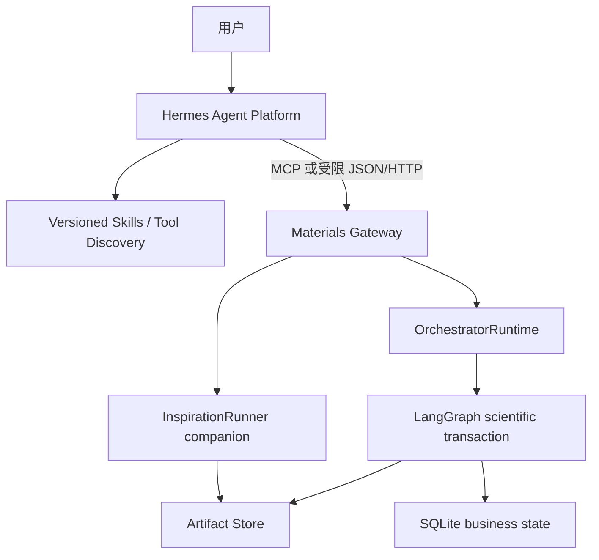

# Hermes 与灵感生成器实施计划

- 版本：v0.3
- 日期：2026-08-08
- 状态：P0.3 fixed-request pilot 已完成；P3.x local beta 实施中
- 依据：[`docs/system-plan.md`](../../docs/system-plan.md)、
  [`docs/architecture.md`](../../docs/architecture.md)、
  [`ADR-0001`](../../docs/adr/0001-hermes-platform-and-inspiration-boundary.md) 与
  [`plans/master.md`](../master.md)

## 开始开发前必读

- [README](../../README.md)：当前可运行能力、CLI、环境和已知限制。
- [系统蓝图](../../docs/system-plan.md)：科学证据、安全、LLM 与结构生成边界。
- [技术架构](../../docs/architecture.md)：状态真源、Artifact、Hermes Gateway 和
  companion capability 边界。
- [主计划](../master.md)：当前里程碑、全局优先级、验收与阻塞项。
- [Orchestrator 计划](material-screening-orchestrator-plan.md)：现有 Runtime、审批、恢复和
  StageRunner 契约。
- [Agent01 计划](material-screening-agent01-plan.md)：候选、结构、检索、去重和来源证据边界。

## 0. 当前任务与真实基线

用户已明确将项目范围升级为一项持续的系统工程：

1. 按分层架构引入 Hermes，作为统一 Agent/Skill/Tool 平台；
2. 完成“灵感生成器”阶段；
3. 在当前 Mac 上运行真实流程并持续调试，直到 Hermes 能驱动实际流程产生首批可审计结果；
4. 将计划、实现、测试和实机证据持续形成小步 Git 提交并推送 GitHub。

实施起点为 Git `909d074`。该基线已有冻结的四阶段 LangGraph 控制面、Agent01 多来源
检索、Agent02 条件生产能力和 Agent03/04 mock 控制链，但有两个与新目标直接冲突的历史
边界：

- 系统蓝图明确写有“首版不生成新结构”；
- Orchestrator `StageId` 固定为 `retrieval → ml → dft → many_body`，不存在 inspiration
  stage，也不存在 Hermes Gateway。

本计划不假装这些能力已经实现。引入采用 companion + gateway 路线，避免直接破坏冻结
四阶段契约；待真实闭环与契约 Gate 通过后，再决定 inspiration 是否升级为顶层 Stage。

### 0.1 当前状态

- [x] 已确认 Hermes 作为统一上层 Agent 平台的产品决策；
- [x] 已确认现有 LangGraph/SQLite/Artifact Store 继续作为科学事务真源；
- [x] 已确认本阶段不实现 novelty/prior-art 判定；
- [x] 已完成现有仓库、Hermes v0.20.0 和灵感生成器缺口的只读审计；
- [x] Hermes 固定 profile distribution、版本化 Skill 与 bootstrap 已提交并通过静态校验；
- [x] 灵感生成器严格对象契约、离线 policy、证据引用闭包和 metadata fixture 搜索已提交；
- [x] Hermes 独立 `.venv-hermes` 已按 tag/commit 安装，`hermes --version` 实机通过；
- [x] 协议无关 Materials Gateway service、严格 DTO、幂等和报告 hash 校验已实现；
- [x] metadata/HTML/JATS 抽取、passage-only signed hashing、内部去重与多样性选择已实现；
- [x] 无密钥 Crossref metadata adapter 已通过一次真实固定查询，返回 5 条带 abstract 的结果；
- [x] 白名单结构变换、完整 Artifact runner、冻结 fixture 与 MCP binding 已收敛；
- [x] Hermes profile 已实机发现唯一四个 Tool，真实 MCP stdio、operator 审批、进程重启和
  非空结果 Gate 已通过；
- [x] 用户完成一次性 Provider 设备授权；Hermes 自然语言 session 已经真实四工具链路停在
  审批点、消费 MCP 外 grant 并返回非空 hash-verified bundle；MCP smoke 未被用来冒充该项。

## 1. 目标、边界与完成标准

### 1.1 定位

Hermes 是上层 Agent 控制面，负责：

- 用户意图与会话；
- 版本化 Skill；
- 工具发现、模型 Provider 和 subagent 协作；
- 通过窄接口提交、查询和展示材料任务；
- 将必须由人作出的批准路由到真实用户，而不是由 LLM 代签。

`materials_screening_agent` 是材料科学执行与证据引擎，继续负责：

- Requirement、科学 policy、审批、运行状态和幂等；
- 检索、证据、结构、候选、ML/DFT/多体执行；
- Artifact、SHA-256、provenance 与证据等级；
- 对 Hermes 输出执行严格 Schema、安全和科学边界校验。

灵感生成器是独立 companion capability，负责：

> 可追溯搜索 → 小段证据抽取 → 跨领域机制桥接 → 白名单结构变换 →
> 运行内部去重 → 多样性 Top-K。

### 1.2 明确非目标

- 不执行 novelty、专利、prior-art 或“数据库未见”判断；
- 不输出“新材料”结论；
- 不让 Hermes Memory、会话历史或自改 Skill 成为科学状态真源；
- 不让 LLM 自由写 CIF、坐标、Python 或 shell；
- 不让 Hermes 直接读写 checkpoint、业务 SQLite 或任意 Artifact 路径；
- 不让 Hermes 直接提交 ML、DFT 或 many-body 底层任务；
- 不修改冻结的 Agent01/02 原生公共契约；
- 不在当前单用户试点中宣称具备多用户、RBAC 或公网服务能力。

### 1.3 Definition of Done

只有以下条件全部满足，本目标才完成：

- [x] Hermes 固定版本能在独立环境启动，profile、Skill 和 Tool 配置均由 Git 管理；
- [x] Hermes 与材料引擎使用进程外协议，不能因 Pydantic/运行时依赖互相污染；
- [x] Gateway 只暴露冻结的粗粒度工具，状态、审批和报告读取均 fail closed；
- [x] 灵感生成器离线 fixture 能逐字节或逐 hash 重放；
- [x] 至少一个真实公共文献 API 搜索运行成功，并保留原始响应、稳定文献身份和成本账本；
- [x] 默认不下载 PDF 全文，不把全文发送给 embedding/LLM；
- [x] 每个 EvidenceCard 都可追溯到具体 Passage 和原始响应 hash；
- [x] 至少生成一个带 invariant、成立条件和失效条件的跨领域 BridgePacket；
- [x] 至少一个白名单 transformation 在真实 pymatgen Structure 上执行并通过结构校验；
- [x] 运行内部重复候选只占一个 Top-K 名额，多样性排序可确定性重放；
- [x] Hermes 实机调用该 capability，最终得到非空、可审计 `InspirationBundle`；
- [x] 完整离线 Gate、相关 live Gate、`pip check` 和 `git diff --check` 通过；
- [x] README、主计划、本计划和实机运行记录与当前源码一致；
- [x] 所有里程碑提交已推送到 `hermes-origin/main`。

以上 checkbox 是 P0.3 的历史完成标准。2026-08-08 用户继续授权后，新增的 P3.x 完成标准
见 [ADR-0002](../../docs/adr/0002-inspiration-generalization-completion-scope.md)、仓库根目录
[`PLAN.md`](../../PLAN.md) 与 [`CHECKLIST.md`](../../CHECKLIST.md)。P0.3 保持可信 baseline，
不得把其单一 fixed-request 结果写成 P3.x 已完成证据。

## 2. 分层架构与状态所有权



| 状态 | 唯一真源 |
|---|---|
| 对话、临时上下文、用户偏好 | Hermes Session/Memory |
| Skill、Tool 使用方式和 profile | Git 中的 `integrations/hermes/` |
| Requirement、审批、Run/Stage 状态 | 现有 LangGraph + 业务 SQLite |
| 文献响应、Passage、EvidenceCard、TagGraph | Inspiration Artifact |
| 结构、proposal、内部身份和 Top-K | Inspiration Artifact |
| 原始网页/API/PDF 与向量缓存 | 受限 Artifact/索引存储 |
| ML/DFT/Many-body 运行 | 现有 Agent/Backend 状态真源 |

分层编排不等于双重编排：Hermes 只决定调用哪个粗粒度 capability；一旦材料引擎接受
请求，科学事务的计划、审批、推进、恢复和取消只由材料引擎拥有。

## 3. Hermes 接入计划

### 3.1 版本与环境

首个兼容基线固定为：

```text
repository: https://github.com/NousResearch/hermes-agent
release tag: v2026.8.3
resolved commit: 3c27eb6234bf91b8ceee9e9071591b31e9b148cb
package version: 0.20.0
```

Hermes 与本项目必须使用独立 Python 环境或容器。原因包括：本项目固定
`pydantic==2.12.5`，该 Hermes release 使用不同精确版本；两者不得安装到同一个
`.venv`。仓库不 vendor Hermes，只提交 bootstrap、profile、Skill、Tool 配置和兼容测试。

建议仓库布局：

```text
integrations/hermes/
├── README.md
├── hermes.lock.json
├── profiles/
│   └── materials-inspiration/
│       ├── distribution.yaml
│       ├── config.yaml
│       ├── SOUL.md
│       └── skills/materials-inspiration/
│           ├── SKILL.md
│           └── references/gateway-contract.md
└── scripts/
    ├── bootstrap_runtime.py
    └── verify_bundle.py
```

`.external/hermes-agent/` 与 `.venv-hermes/` 仅为本机安装目录，必须进入 `.gitignore`。

### 3.2 Gateway 公共工具

生产 profile 首版只暴露：

| Tool | 作用 | 禁止内容 |
|---|---|---|
| `materials_inspiration_run` | 提交冻结的灵感生成请求 | 不接受任意路径、任意代码或底层 stage DAG |
| `materials_run_get` | 只读查询状态和下一步 | 不自动 resume、不轮询外部 backend |
| `materials_run_act` | 类型化处理澄清、批准、拒绝、恢复或取消 | 不接受自由 `dict`、不允许 LLM 代替人批准 |
| `materials_result_get` | 返回 hash-verified、大小受限的报告或 bundle 摘要 | 不开放任意 Artifact read |

Gateway 返回契约固定为 `materials-gateway-v1`，只输出安全 DTO：运行 ID、状态、当前阶段、
类型化下一步、有限候选摘要、报告可用性以及脱敏 warning/error。绝对路径、原始 traceback、
凭据、任意 Artifact 内容和无限候选列表不得暴露。

### 3.3 审批与幂等

- Hermes 的 tool call 不等于人工审批；Requirement freeze、昂贵计算、取消外部任务和
  受控 retry 必须通过用户可见 elicitation/confirmation；
- 客户端不支持 elicitation、无人在线、超时或拒绝时 fail closed，并保留 CLI fallback；
- `submission_id` 由 Hermes host 注入，Gateway 由其派生稳定 run ID；
- 同一 `submission_id` + 同一 canonical payload 返回已有状态；
- 同一 `submission_id` + 不同 payload 返回冲突，不覆盖旧请求；
- 每次 Tool 调用最多完成一次显式状态转换，不能在一个调用内隐藏完整自治循环。

### 3.4 Hermes profile 安全下限

生产 profile 默认：

- 只启用材料 Gateway Tool；
- 禁用通用 terminal、任意 file write、browser automation、cron 和 delegation；
- 禁止 memory/skill 自动写入；
- Skill 更新只形成 Git diff，经测试和人工审阅后发布；
- Web 内容视为不可信数据，页面指令不得进入系统控制；
- 分别设置 Gateway materials-service 与 Hermes host 的调用、网络字节、模型 token、walltime
  和并发上限；两套成本账本不得合并；
- Hermes 版本、profile hash、Skill hash、模型/provider、host usage 和 Tool Schema 版本进入
  运行审计。

## 4. 灵感生成器设计

### 4.1 输入与输出

`InspirationInputV1` 至少包含：

- 已确认 Requirement URI/hash/revision；
- 一个或多个已校验 parent candidate/structure URI/hash；
- 冻结 `InspirationPolicyV1` URI/hash；
- 运行 ID、请求 ID和预算；
- Search Adapter 与可选 LLM/Vectorizer 的版本快照。

输出为 `InspirationStageResultV1`，引用非空或明确 `SCIENTIFIC_NO_MATCH` 的
`InspirationBundleV1`、报告、成本账本和全部中间 Artifact。生成 proposal 固定
`scientific_conclusion=false`，不能继承 parent 的性质证据等级。

### 4.2 模块布局

```text
src/material_agent/inspiration/
├── models.py
├── policy.py
├── search.py
├── fetch.py
├── extractors.py
├── passages.py
├── vectorizer.py
├── evidence.py
├── tag_graph.py
├── bridge.py
├── transformations.py
├── identity.py
├── selection.py
├── runner.py
└── reporting.py
```

### 4.3 核心契约

首版必须冻结：

- `InspirationPolicyV1`：搜索、fetch、passage、embedding、LLM、operator 和 Top-K 预算；
- `SearchQueryV1` / `SearchHitV1`：provider 响应、DOI/arXiv/URL 身份和原始响应引用；
- `PassageV1`：具体 API 字段、JSON path、HTML meta/CSS selector 或 JATS XPath；
- `EvidenceCardV1`：来源声称、机制、条件、反证和 passage 引用；
- `TagGraphV1`：材料、性质、机制、motif、process、measurement 和 analogy domain；
- `BridgePacketV1`：shared invariant、transferable control、required/breaking conditions；
- `TransformationPlanV1`：parent、operator、参数、保留/改变项、证伪测试和结构输出；
- `InspirationCandidateV1`：内部 identity、全部生成路线和证据；
- `InspirationBundleV1`：多样性 Top-K、限制和下一验证步骤；
- `CostLedgerV1`：仅记录 Gateway materials-service 的请求、字节、passage、embedding、
  内部 LLM token、拒绝与耗时；Hermes provider usage 由 host 独立审计。

所有 Pydantic 模型使用 `extra="forbid"`；数值拒绝 NaN/Infinity；ID、路径、URI 和长度有
明确上限。Schema 中不得出现 `novelty`、`is_novel` 或等价结论字段。

### 4.4 低成本搜索、提取与向量化

成本漏斗固定为：

1. **Tier 0：搜索 API metadata**——优先 OpenAlex/Crossref 等公开 JSON API 的 title、
   abstract、concept、DOI、作者、日期和 citation metadata；abstract 足够时不 fetch 页面；
2. **Tier 1：网页结构化 metadata**——JSON-LD `ScholarlyArticle`、Highwire、Dublin Core、
   OpenGraph 和 description；
3. **Tier 2：JATS/XML**——只读 abstract、keyword 和与目标 tag 命中的 section/p；
4. **Tier 3：普通 HTML**——清除 script/nav/footer/reference，只选择命中 section 和句子窗口；
5. **Tier 4：PDF**——MVP 默认 `allow_pdf_fulltext=false`，无其他证据时记录预算内不可抽取。

只把以下内容交给 vectorizer/LLM：

```text
title + section heading + selected 80–220 token passage + normalized tags
```

每个 hit 默认最多 3 段；先用本地词项/Tag/Entity/Section/ClaimCue 分数选段，再用 passage
级 MMR 去重。离线基线使用确定性的 signed hashing vector；生产向量模型必须通过 Adapter
固定 model/version/hash，并以规范化 passage hash 缓存。不得把完整网页平均成一个不可定位的
document vector。

### 4.5 跨领域 Tag 与 BridgePacket

Tag 生成遵循：

```text
observable
→ candidate mechanism
→ controlling invariant
→ structural/process knob
→ measurable signature
→ breaking condition
```

LLM 只能提出 `BridgePacket`，不能直接修改 curated TagGraph。Bridge 必须同时给出 shared
invariant、transferable control、required conditions、breaking conditions 和建议查询；缺任一
项即拒绝。首版图搜索最大 2 hop、每层 beam ≤6；查询预算建议 direct/bridge/counter =
50%/30%/20%。

每个 tag/bridge 记录搜索收益、EvidenceCard yield、目标支持数、专家接受/拒绝、下载字节和
Gateway embedding/LLM 成本。Hermes 对话 provider usage 单独记录。首版不在线训练，只积累
可复核反馈；后续才评估 pairwise reranker。

### 4.6 白名单 Transformation

MVP 首个 operator 为：

```text
SUBSTITUTE_EQUIVALENT_SITE_V1
```

它只接受 ordered periodic parent structure、明确等价 site、版本化允许替换集合和确定性参数。
验证顺序：operator schema → deterministic replay → Requirement composition constraints →
occupancy → finite lattice/coordinates → positive volume → minimum distance → 可判定的 charge/
oxidation check → `process_structure()` → dimensionality/max-sites 复核。

LLM 不产生坐标，只能选择 registry 中的 operator 和受限参数。charge 无法判断时标记
`UNKNOWN`，不能伪装为通过；违反硬约束或结构无效的 proposal 明确 `REJECTED`。

### 4.7 运行内部去重与多样性

本阶段只处理同一次运行内部重复：

- route hash：parent + operator/version + site mapping + canonical parameters；
- exact structure ID：复用 canonical structure hash；
- strict StructureMatcher：用于晶体等价确认；
- hypothesis signature：target + mechanism + intervention + conditions + falsifier。

不同路线产生同一结构时合并为一个 candidate，但保留全部 proposal/evidence lineage。
Top-K 采用多视图 MMR；首版 pilot 权重为 structure/composition/route/mechanism =
0.40/0.20/0.20/0.20，质量/coverage/redundancy = 0.60/0.15/0.25。阈值与权重必须在 fixture
和专家反馈上校准，不能解释为科学真值。

配额：strict structure group 最多 1；同 parent/prototype family 最多 2；池中存在多个机制
时 Top-5 至少覆盖 2 个 mechanism；候选不足时少输出，不以重复项凑数。

### 4.8 Artifact 布局

```text
stages/inspiration/<run_id>/
├── input_snapshot.json
├── policy.json
├── query_plans.jsonl
├── raw_search/
├── search_hits.jsonl
├── fetch_manifest.jsonl
├── passages.jsonl
├── passage_vectors.jsonl
├── evidence_cards.jsonl
├── tag_graph.json
├── bridge_packets.jsonl
├── transformation_proposals.jsonl
├── internal_duplicate_groups.jsonl
├── inspiration_bundle.json
├── cost_ledger.json
├── report.md
└── stage_result.json
```

全部文件通过 `LocalArtifactStore` 原子写入并登记 SHA-256；完成记录只有在每个引用 Artifact
重新校验通过后才可复用。

## 5. 实施里程碑与提交策略

### M0：计划与架构冻结

- [x] 新增本计划和 Hermes ADR；
- [x] 更新主计划、系统蓝图、技术架构和 AGENTS 导航；
- [x] 记录基线 Git SHA、Hermes pin、状态真源与验收门槛；
- [x] 文档检查、链接检查、`git diff --check` 后提交并推送。

### M1：灵感生成器契约与离线纵切

- [x] 实现严格 models/policy、deterministic IDs、schema freeze 和科学边界；
- [x] 实现完整 Artifact 持久化布局与 hash-verified replay；
- [x] 实现 fixture SearchAdapter、metadata/HTML/JATS extractor、passage selector 和 hashing vector；
- [x] 实现 EvidenceCard、curated BridgeRule/TagGraph 与 BridgePacket 跨对象引用闭包校验；
- [x] 实现一个白名单 substitution operator；
- [x] 实现仅限本次运行的 exact identity、路线合并和多视图 MMR；
- [x] 冻结 `tests/fixtures/inspiration/`；
- [x] 完成 unit/contract/offline E2E 并提交推送。

### M2：Materials Gateway 与 Hermes Skill

- [x] 实现协议无关 Gateway service 和严格 v1 DTO；
- [x] 实现粗粒度 Tool binding；
- [x] 补齐 report hash verification、submission idempotency、大小限制、脱敏与
  interaction/action 校验；
- [x] 提交 Hermes development profile 和 `materials-inspiration` Skill；
- [x] 完成 Tool Schema、跨进程恢复、审批 fail-closed 和 stdio/MCP E2E；
- [x] 提交推送。

### M3：真实公共文献搜索与局部证据

- [x] 实现至少一个无密钥公共学术 API Adapter。2026-08 的 OpenAlex 文档已把 API key
  列为必填，因此 keyless release Gate 改用 Crossref v1；OpenAlex parser/fixture 继续保留；
- [x] 运行固定 flat-band 用例，保存 API metadata/abstract 而非默认全文；
- [x] 验证 DOI/URL 去重、预算、schema drift、raw-response hash 与 provenance；
- [ ] provider-specific 429/backoff 仍属从单机 pilot 扩展到长期公共服务调用前的加固项，
  live Gate 不主动制造公共服务限流；
- [x] 得到非空 Passage、EvidenceCard 和 BridgePacket；
- [x] 记录真实成本/失败与产出，提交代码、脱敏 fixture 和运行摘要。

### M4：真实 parent 结构、候选生成和 Top-K

- [x] 从明确、hash-pinned fixture parent 读取真实 pymatgen Structure；
- [x] 执行 substitution registry 并生成非空结构 proposal；
- [x] 运行硬约束、结构 QC、内部 exact/strict 去重和 MMR；
- [x] 输出非空 `InspirationBundle` 和最便宜证伪步骤；
- [x] 完成 replay、篡改、无效结构、重复路线和多样性测试并提交推送。

### M5：Hermes 真机端到端与 Debug

- [x] 按固定 commit 安装独立 Hermes runtime；
- [x] 用仓库 profile 启动 Hermes 并发现限定 Tool/Skill；
- [x] 从自然语言请求触发灵感生成、查询状态并读取最终 bundle；
- [x] 对真实失败进行分类和修复，重复运行直至非空首批产出；
- [x] 保存命令、环境、版本、运行 ID、Artifact hash、成本和报告；
- [x] 完整离线 Gate、相关 live Gate、`pip check`、secret/diff 检查通过；
- [x] 更新 README/计划并推送 MCP pilot 文档里程碑；
- [x] 自然语言 turn 通过后补充证据并合并到公开 `hermes-origin/main`。

### M6：P3.x 范围与报告制度冻结

- [x] 区分 P0.3 fixed-request pilot 与 P3.x local beta；
- [x] 新增 ADR-0002、`PLAN.md`、`CHECKLIST.md` 和不可变工作报告制度；
- [x] 提交并推送 scope/report checkpoint。

### M7：P3.1 请求通用化与真实搜索可靠性

- [x] 实现受支持 flat/narrow-band 同义请求的确定性 compiler，其他输入 fail closed；
- [x] 保留 fixture replay，并把 production Hermes profile 切换到同一 Gateway run 的 Crossref；
- [x] 实现 typed transient error、`Retry-After`、有界 retry 和 attempt Artifact/ledger；
- [x] 文档/passage/vector 层运行内去重且保留全部 query/raw-hit lineage；
- [x] 扩充权威报告并通过 unit/contract/integration/live Gate；
- [x] 发布工作报告并提交、推送。

### M8：P3.2 多候选去重与多样性

- [x] 引入 SHA-pinned operator-owned parent catalog，不开放任意路径；
- [x] 多 parent/multi-route runner 生成至少 5 个结构有效 proposal；
- [x] 同结构多路线合并，Top-5 exact/strict duplicate 为 0；
- [x] 机制可用时 Top-5 至少覆盖 2 个 mechanism；候选不足时诚实少输出；
- [x] `require_diverse_routes` 进入 policy、报告和回归语义；
- [x] 发布工作报告并提交、推送。

### M9：P3.3 多格式 Passage 与 Tag feedback

- [ ] 将 JSON metadata、JSON-LD/Highwire、JATS/XML、HTML extractor 接入受限 runner seam；
- [ ] metadata 足够时不 fetch，默认 PDF 0，只向量化 selected passage package；
- [ ] 持久化 query/tag/bridge yield、字节和成本 feedback；运行不能在线改 TagGraph；
- [ ] 校准 fixture 覆盖现有 3 条 bridge rule，无专家结论时显式 `UNKNOWN`；
- [ ] 发布工作报告并提交、推送。

### M10：P3.x 真实 release closeout

- [ ] 完整离线、故障注入、dependency、secret、diff、MCP/profile/Skill Gate 通过；
- [x] live Crossref runner 与 Gateway lifecycle 通过；
- [ ] 真实 Hermes 自然语言 session 在同一 run 中使用 Crossref，经真实用户授权后得到非空结果；
- [ ] 最终 run record、工作报告、PR/check/merge/公开读取证据闭合；
- [ ] P3.x 状态只在上述全部完成后改为已完成。

提交原则：每个 M 至少一个可回退提交；跨越多个 M 的大提交禁止。代码与契约、测试、
文档可以分开提交，但任何提交不得把未实现 roadmap 写成当前能力。

## 6. 测试与实机验收

### 6.1 离线 Gate

至少覆盖：

- JSON API、JSON-LD、Highwire、JATS、普通 HTML 与无法提取；
- 页面 prompt injection 只作为数据，不改变 Tool/Skill 行为；
- abstract 足够时不 fetch 正文；
- 每 hit/每 run 字节、passage、embedding、LLM 和 walltime 预算；
- SearchHit 文献身份与 passage 去重；
- 每个 EvidenceCard 都有有效 Passage；
- BridgePacket 缺 invariant/成立/失效条件时拒绝；
- transformation 确定性重放和硬约束拒绝；
- 同结构多路线合并并保留 lineage；
- MMR 固定输入得到固定排序；
- Artifact 缺失/hash 篡改 fail closed；
- 所有结果 `scientific_conclusion=false`；
- Schema 不含 novelty 结论。

### 6.2 真实 release Gate

固定问题首选：

> 为层状过渡金属材料寻找可能产生窄带/平带的机制与可控结构替换；允许检索光子、声子、
> 机械超材料等类比领域，但必须说明共享 invariant、成立条件、失效条件和最便宜证伪计算。

一次通过的真实运行必须记录：

- Hermes tag/commit、profile/Skill/Tool Schema hash；
- material-agent commit、Python 和直接依赖版本；
- run/submission ID；
- 搜索 provider、查询、响应 URI/hash、重试和限流；
- Gateway hits、fetch、bytes、passage/embedding/内部 LLM token 和 walltime；
- Hermes host provider API calls、input/cache/output/reasoning token 与可用的计费状态；
- EvidenceCard/BridgePacket/proposal/unique candidate/Top-K 数量；
- 所有最终 proposal 的 parent、operator、output structure hash、evidence 和 falsifier；
- 网络或模型失败时的结构化状态；
- 无 secret、绝对路径或原始 traceback 泄露。

### 6.3 初始量化门槛

- Provenance 完整率：100%；
- 最终 EvidenceCard 无孤立引用：100%；
- 默认 PDF 全文下载数：0；
- 提交给 embedding/LLM 的文本仅为被选 Passage：100%；
- Gateway Schema 成功率：≥95%，正式 fixture 为 100%；
- 相同冻结输入的确定性 Artifact hash 一致率：100%；
- Top-K 内 exact/strict duplicate：0；
- 非空真实产出：至少 1 个 `SEARCH_SUPPORTED` BridgePacket、1 个结构有效 proposal、
  1 个最终 selected candidate；
- novelty 或已发现声明：0。

这些门槛只证明工程闭环与可审计性，不证明候选真实性质。

## 7. 风险与当前决策

| 风险 | 当前处理 |
|---|---|
| Hermes 高变动 | 固定 release tag + resolved commit；不依赖 `main` 或内部私有 API |
| 双 Orchestrator | Hermes 只调用粗粒度 capability；科学状态仍只有一个真源 |
| 依赖冲突 | 独立 Python 环境/进程；不把 Hermes 加入主 `pyproject` |
| Web prompt injection | 页面只作为不可信数据；抽取器不执行页面指令 |
| 全文与 token 成本失控 | metadata-first、passage-only、PDF 默认关闭、硬预算账本 |
| 跨领域 tag 变成空泛联想 | 强制 invariant、成立/失效条件和搜索反馈 |
| 结构生成产生伪科学 | 仅白名单确定性 operator；性质证据不随结构继承 |
| 重复 proposal 占满 Top-K | selection 前完成 route/structure/hypothesis identity resolution |
| 用户批准被 Agent 代替 | MCP 外 one-time operator grant；完整 interaction/manifest/action 绑定；无 grant fail closed |
| 单用户 SQLite 暴露为服务 | 当前只允许本机单实例试点；多用户另立 v2/Postgres/RBAC |

## 8. 运行记录

### 2026-08-08：实施启动

- 基线：`909d07459fd1bc6b43f1acf64c55ba642b5b85d8`；
- Hermes pin：`v2026.8.3` → `3c27eb6234bf91b8ceee9e9071591b31e9b148cb`；
- 已完成：仓库/架构/Hermes/灵感缺口只读审计；
- M0 提交：`f2a7f07 Plan Hermes inspiration architecture`，已推送并建立 draft PR #1；
- 已提交方向：固定状态边界、Gateway seam、成本门槛和不做 novelty 的范围；
- 当时执行：M1 离线契约纵切与 M2 Hermes/Gateway 骨架并行；后续完成情况见本节末尾的
  release checkpoint。

### 2026-08-08：Hermes profile/Skill 静态检查点

- 固定 `v2026.8.3`、resolved commit 与独立 `.venv-hermes` bootstrap；
- 按 Hermes config schema v33 提交单 profile distribution；
- `platform_toolsets` 使用源码要求的原始 server 名 `materials`，四个 MCP tools 使用非空白名单；
- 禁用 terminal/file/web/browser/delegation/memory 等原生 toolset，API server 仅监听 loopback；
- 版本化 `materials-inspiration` Skill 通过 Skill Creator `quick_validate.py`；
- 为避免开放不可拆分的 `skill_manage`，将固定 Skill 确定性镜像进 `SOUL.md`，`verify_bundle.py` 已通过；
- `git diff --check` 与 YAML/JSON/Python 静态解析通过；该检查点当时尚未声称 runtime/MCP
  通过，后续实机结果见 release checkpoint。

### 2026-08-08：灵感契约与 metadata 搜索检查点

- `f7c2595`：提交严格 `InspirationInput/Policy/SearchHit/Passage/Evidence/TagGraph/BridgeRule/`
  `Transformation/Candidate/Bundle/CostLedger` 契约及 schema freeze；
- `67111a6`：提交 runner 级证据引用闭包；rule/packet、tag 类型、query/hit/passage/card
  任一篡改或孤立引用均 fail closed；
- `c3f3935`：提交无网络 fixture adapter、OpenAlex metadata/abstract 解析、稳定 DOI/URL
  文献身份与运行内分组；接口没有 PDF/全文入口；
- 最小隔离环境验证：inspiration models/validation/contract 共 33 passed；metadata search
  10 passed；完整仓库 Gate 仍等待主 `.venv` 首次依赖安装，不以最小环境替代最终 Gate；
- `235fde5`：根据 Hermes Skill 前向测试，将 action 参数真源收敛到 live MCP schema，
  Skill/SOUL bundle verifier 通过；
- 该检查点之后继续完成 Hermes 固定运行时、Gateway service、局部网页/JATS passage
  抽取与 signed-hashing vectorizer；最终状态见 release checkpoint。

### 2026-08-08：Gateway、选择与真实 metadata 检查点

- Hermes 源码 checkout 已验证 `v2026.8.3` 对应
  `3c27eb6234bf91b8ceee9e9071591b31e9b148cb`，隔离环境实机输出
  `Hermes Agent v0.20.0 (2026.8.3)`；本条记录的是 MCP server 完成前的历史状态；
- `64d79fe`：严格 Gateway core 只接受四类粗粒度操作，包含 submission 幂等、状态机、
  报告固定 URI/hash/size 与显式确认；`6b44e76` 补齐现有 Orchestrator 报告读取完整性；
- `0c3ca51`：同一运行内 exact structure 合并保留全部 route/evidence/mechanism lineage；
  多样性选择使用四视图距离和硬配额，代表路线的质量/coverage 不跨路线拼接；78 项相关
  inspiration 测试与 82 项 Orchestrator 测试通过；
- `4e926aa`：新增 Crossref v1 keyless metadata-only adapter、HTTPS host/redirect guard、
  单响应 10 MB 绝对上限、固定 metadata 字段与 opt-in live Gate；固定跨域查询真实返回
  5 hits、9,126 bytes，raw SHA-256 为
  `2acd09af5d9155935023a56d06ce1444e544b307a98302e7b904bb7cf27f5928`；
- 上述 live smoke 只证明公共 metadata 检索与解析，不等于 BridgePacket、结构 proposal 或
  Hermes E2E 已完成；真实响应保存在临时测试 Artifact 中，后续 runner 必须以同样的
  URI/hash 规则持久化每次运行响应和成本账本。

### 2026-08-08：Hermes/MCP 非空 release checkpoint

- `74059b0`：提交持久化四工具 MCP Gateway、真实 `InspirationRunner` adapter、SQLite v2
  状态、报告与 canonical result 双 hash、完整执行 manifest、默认拒绝 action 和 MCP 外
  one-time operator grant；grant 绑定 request、interaction、manifest 和 exact action；
- 审批后 engine/policy/parent/tag/registry/adapter/vectorizer 任一漂移均在 runner 前拒绝；
  grant 消费后的崩溃只能在确认原进程停止、重新校验 immutable manifest 并提供新确认引用后
  由 operator CLI 显式恢复；
- `290cafe`：新增可复现的真实 MCP stdio pilot client；submit 阶段证明无 grant 的
  `confirmed_by_user=true` 被拒且状态不变；
- Hermes profile 已安装并更新，`mcp test materials` 实机连接成功，只发现四个 allowlisted
  tools；Hermes compatibility 精确固定 `==0.20.0`；
- 固定发布运行 `inspiration-403006308fdce7fa4e27bc56` 通过：3 passages、2 EvidenceCards、
  1 BridgePacket、1 `STRUCTURE_VALID` proposal、1 selected candidate、fetch/PDF/LLM 均为 0；
- Gateway 状态为诚实的 `PARTIAL`（两个 bridge rule 缺 required tags），bundle outcome 为
  `SUCCEEDED`，性质保持 `UNKNOWN`，`scientific_conclusion=false`；
- 报告 SHA `395342e7fd48730dc1496d3238186063012718907509133e2e2a08f7044d914d`，
  canonical result SHA `80f82f689c843cd4e27da1d922abc7fe1ca7e30c0fd8b1fb17628e86a0e47b1b`；
- 真实公共 Crossref full-run Gate 两次通过：3 requests、7,944 bytes、2 passages、
  2 EvidenceCards、1 bridge、1 proposal、1 candidate，fetch/PDF/LLM 为 0；
- 该 MCP 检查点当时的非 Provider Gate：完整离线 suite
  `666 passed, 13 skipped, 362 warnings`，三个环境
  dependency check、bundle verifier、四工具 MCP discovery 和 Crossref live `2 passed`
  全部通过；最终 live capture 的 bundle/stage SHA 分别为
  `61aa3fa520987ed8cacfccf51550acbc31c59f1a6cb9be2a6908c236a28dbbd5` /
  `9b06a81557f17d9de5f998476a85d96e2d21f0425ec2d8a463f13263182f8338`；
- 完整命令、版本、成本、告警和 Artifact hashes 见
  [`docs/runs/2026-08-08-hermes-inspiration-pilot.md`](../../docs/runs/2026-08-08-hermes-inspiration-pilot.md)；
- 此检查点当时唯一未通过的是 Hermes 自然语言 turn；后续用户完成授权且该 Gate 已通过，
  不能把本段历史状态误读为当前阻塞。完整证据见下一检查点和运行记录。

### 2026-08-08：Hermes 自然语言与提示契约 release checkpoint

- OpenAI Codex device authorization 成功，凭据仅保存在 ignored Hermes runtime；未读取、
  打印或提交 token；Hermes provider/model 为 `openai-codex` / `gpt-5.6-sol`；
- session `20260808_165305_c8f7ed` 首次调用把 `budget` 错放顶层，严格 MCP schema 在创建
  run 前拒绝；同一 submission ID 修正为 `constraints.budget` 后创建
  `inspiration-132cd2868dadf6674c2809f4` 并停在 `INTERACTION_REQUIRED`；
- 用户明确继续授权后，operator grant `grant-c7f278598445db5a88bcac06` 绑定 request、完整
  interaction、execution manifest 与 exact action；Hermes 随后按 `get → act → result`
  完成，Gateway 为 `PARTIAL`，bundle 为 `SUCCEEDED`，候选性质仍为 `UNKNOWN`；
- 报告 SHA 为 `9f5dc5bd4cf5f01218236cb3418ff0bfd25dcd01fde4fd2e5431fdaa79bec600`，
  canonical result SHA 为
  `6b1bb9c2df0bcd2ab7e8f48b7d03ba074646aa3ab15b49b63041b5c81526bfa2`；
- Hermes 主 session 的 host 审计为 11 provider API calls、36,240 non-cached input、80,384
  cache-read、2,584 output、213 reasoning tokens；Gateway materials-service ledger 则为
  0 LLM calls/input/output tokens。两套账本严格分开，provider cost `0.0` 仅表示无可靠
  计费值，不能解释为免费；
- 提示前向回归先暴露 goal paraphrase，再由精确冻结 request 修复；session
  `20260808_170431_6f2b15` 的首个 run call 得到标准 request SHA
  `e45c8f641a21411c0cb60c78ee9597243cabd17a954ee769c897876008147cba` 和
  `INTERACTION_REQUIRED`，未获新授权、未继续执行；
- `d95579c` 将完整固定 request、嵌套 budget、`PARTIAL` warnings、有限多样性语义和两套
  ledger 边界写入版本化 Skill，并以 verifier/unit/MCP schema 回归固定；Skill/SOUL SHA
  分别为 `6149f3a666d3123bc8c3327d000184fd97717c08835464ce180fc83a010870ba` /
  `7935f28be25ebb7d12c39bce6b9d483aecddc30ff1b1d016458ccefbdeffcf24`；
- 主链通过后的三次附加只读报告回归均成功执行 `run_get/result_get`，但 provider 在生成最终
  文字报告前遇到 `Broken pipe`；数据库保持 1 run/1 result 且无 `run/act` 写操作。该传输
  失败作为生产化加固项保留，不回写或否定已完成主链证据；
- 最终回归：主环境 `668 passed, 13 skipped, 362 warnings`，隔离 Gateway MCP
  `4 passed`，三环境 dependency check、Skill quick validation、bundle verifier、四工具 MCP
  discovery 与 `git diff --check` 均通过。

### 2026-08-08：公开发布 closeout

- 公开仓库：`chimeraHHH/materials_screening_agent_hermes`，visibility `PUBLIC`，默认分支
  `main`；
- PR `#1` 从 Draft 切为 Ready，GitGuardian 成功后以 merge commit
  `e044df1605b8f3711f6ab9af4e6c7d37f2967d35` 合入；
- 合并内容包含所有 M0–M5 实现、`d95579c` Skill 回归和 `1184d56` 授权运行证据；
- 本 closeout 只更新发布事实，不扩大单用户 fixed-request pilot 的能力或科学 claim。

### 2026-08-08：P3.2 parent-catalog Top-5 checkpoint

- Catalog manifest SHA-256 为
  `09d563732717e05ccf216d3b8572b1bcd1d855dd3f5d0106a4cdbc15b9197b99`；
  loader 不接受外部 path/payload，并冻结 6 个工程校准 parent、route、bridge assignment 与
  operator 输出；
- approval-bound Gateway calibration run
  `inspiration-0c0f19ecf5984e6c8e0da92e` 产生 6 个 `STRUCTURE_VALID` route，exact merge
  后为 5 个 identity，Top-5 满额；
- selection audit 记录 4 个 achieved mechanism、6 个 selected physical route、0 exact/strict
  duplicate，mechanism/route quota 均为 `MET`，无 underfill；
- 两个独立 workspace 的 catalog、plans、duplicate groups、selection audit、report、bundle 与
  stage-result hashes 一致；完整记录见
  [`docs/runs/2026-08-08-p32-parent-catalog-top5.md`](../../docs/runs/2026-08-08-p32-parent-catalog-top5.md)；
- 主环境回归为 `732 passed, 14 skipped`；P3.2 `PASSED`，P3.3 与最终 release Gate 仍为
  `IN_PROGRESS`。
