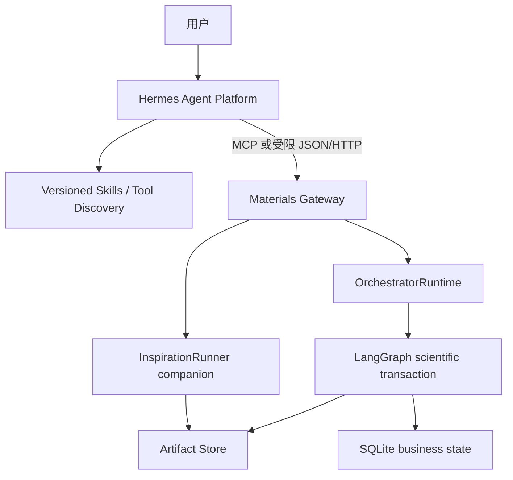

# Hermes 与灵感生成器实施计划

- 版本：v0.1
- 日期：2026-08-08
- 状态：实施中
- 依据：[`docs/system-plan.md`](../../docs/system-plan.md)、
  [`docs/architecture.md`](../../docs/architecture.md)、
  [`ADR-0001`](../../docs/adr/0001-hermes-platform-and-inspiration-boundary.md) 与
  [`plans/master.md`](../master.md)

## 开始开发前必读

- [README](../../README.md)：当前可运行能力、CLI、环境和已知限制。
- [系统蓝图](../../docs/system-plan.md)：科学证据、安全、LLM 与结构生成边界。
- [技术架构](../../docs/architecture.md)：状态真源、Artifact、Hermes Gateway 和
  companion capability 边界。
- [主计划](../master.md)：当前里程碑、全局优先级、验收与阻塞项。
- [Orchestrator 计划](material-screening-orchestrator-plan.md)：现有 Runtime、审批、恢复和
  StageRunner 契约。
- [Agent01 计划](material-screening-agent01-plan.md)：候选、结构、检索、去重和来源证据边界。

## 0. 当前任务与真实基线

用户已明确将项目范围升级为一项持续的系统工程：

1. 按分层架构引入 Hermes，作为统一 Agent/Skill/Tool 平台；
2. 完成“灵感生成器”阶段；
3. 在当前 Mac 上运行真实流程并持续调试，直到 Hermes 能驱动实际流程产生首批可审计结果；
4. 将计划、实现、测试和实机证据持续形成小步 Git 提交并推送 GitHub。

实施起点为 Git `909d074`。该基线已有冻结的四阶段 LangGraph 控制面、Agent01 多来源
检索、Agent02 条件生产能力和 Agent03/04 mock 控制链，但有两个与新目标直接冲突的历史
边界：

- 系统蓝图明确写有“首版不生成新结构”；
- Orchestrator `StageId` 固定为 `retrieval → ml → dft → many_body`，不存在 inspiration
  stage，也不存在 Hermes Gateway。

本计划不假装这些能力已经实现。引入采用 companion + gateway 路线，避免直接破坏冻结
四阶段契约；待真实闭环与契约 Gate 通过后，再决定 inspiration 是否升级为顶层 Stage。

### 0.1 当前状态

- [x] 已确认 Hermes 作为统一上层 Agent 平台的产品决策；
- [x] 已确认现有 LangGraph/SQLite/Artifact Store 继续作为科学事务真源；
- [x] 已确认本阶段不实现 novelty/prior-art 判定；
- [x] 已完成现有仓库、Hermes v0.20.0 和灵感生成器缺口的只读审计；
- [ ] Hermes 独立运行环境和固定 profile 尚未提交；
- [ ] Materials Gateway 尚未实现；
- [ ] 灵感生成器源码、fixture 和真实运行产物尚未实现；
- [ ] Hermes 驱动的实机端到端 Gate 尚未通过。

## 1. 目标、边界与完成标准

### 1.1 定位

Hermes 是上层 Agent 控制面，负责：

- 用户意图与会话；
- 版本化 Skill；
- 工具发现、模型 Provider 和 subagent 协作；
- 通过窄接口提交、查询和展示材料任务；
- 将必须由人作出的批准路由到真实用户，而不是由 LLM 代签。

`materials_screening_agent` 是材料科学执行与证据引擎，继续负责：

- Requirement、科学 policy、审批、运行状态和幂等；
- 检索、证据、结构、候选、ML/DFT/多体执行；
- Artifact、SHA-256、provenance 与证据等级；
- 对 Hermes 输出执行严格 Schema、安全和科学边界校验。

灵感生成器是独立 companion capability，负责：

> 可追溯搜索 → 小段证据抽取 → 跨领域机制桥接 → 白名单结构变换 →
> 运行内部去重 → 多样性 Top-K。

### 1.2 明确非目标

- 不执行 novelty、专利、prior-art 或“数据库未见”判断；
- 不输出“新材料”结论；
- 不让 Hermes Memory、会话历史或自改 Skill 成为科学状态真源；
- 不让 LLM 自由写 CIF、坐标、Python 或 shell；
- 不让 Hermes 直接读写 checkpoint、业务 SQLite 或任意 Artifact 路径；
- 不让 Hermes 直接提交 ML、DFT 或 many-body 底层任务；
- 不修改冻结的 Agent01/02 原生公共契约；
- 不在当前单用户试点中宣称具备多用户、RBAC 或公网服务能力。

### 1.3 Definition of Done

只有以下条件全部满足，本目标才完成：

- [ ] Hermes 固定版本能在独立环境启动，profile、Skill 和 Tool 配置均由 Git 管理；
- [ ] Hermes 与材料引擎使用进程外协议，不能因 Pydantic/运行时依赖互相污染；
- [ ] Gateway 只暴露冻结的粗粒度工具，状态、审批和报告读取均 fail closed；
- [ ] 灵感生成器离线 fixture 能逐字节或逐 hash 重放；
- [ ] 至少一个真实公共文献 API 搜索运行成功，并保留原始响应、稳定文献身份和成本账本；
- [ ] 默认不下载 PDF 全文，不把全文发送给 embedding/LLM；
- [ ] 每个 EvidenceCard 都可追溯到具体 Passage 和原始响应 hash；
- [ ] 至少生成一个带 invariant、成立条件和失效条件的跨领域 BridgePacket；
- [ ] 至少一个白名单 transformation 在真实 pymatgen Structure 上执行并通过结构校验；
- [ ] 运行内部重复候选只占一个 Top-K 名额，多样性排序可确定性重放；
- [ ] Hermes 实机调用该 capability，最终得到非空、可审计 `InspirationBundle`；
- [ ] 完整离线 Gate、相关 live Gate、`pip check` 和 `git diff --check` 通过；
- [ ] README、主计划、本计划和实机运行记录与当前源码一致；
- [ ] 所有里程碑提交已推送到 `hermes-origin/main`。

## 2. 分层架构与状态所有权



| 状态 | 唯一真源 |
|---|---|
| 对话、临时上下文、用户偏好 | Hermes Session/Memory |
| Skill、Tool 使用方式和 profile | Git 中的 `integrations/hermes/` |
| Requirement、审批、Run/Stage 状态 | 现有 LangGraph + 业务 SQLite |
| 文献响应、Passage、EvidenceCard、TagGraph | Inspiration Artifact |
| 结构、proposal、内部身份和 Top-K | Inspiration Artifact |
| 原始网页/API/PDF 与向量缓存 | 受限 Artifact/索引存储 |
| ML/DFT/Many-body 运行 | 现有 Agent/Backend 状态真源 |

分层编排不等于双重编排：Hermes 只决定调用哪个粗粒度 capability；一旦材料引擎接受
请求，科学事务的计划、审批、推进、恢复和取消只由材料引擎拥有。

## 3. Hermes 接入计划

### 3.1 版本与环境

首个兼容基线固定为：

```text
repository: https://github.com/NousResearch/hermes-agent
release tag: v2026.8.3
resolved commit: 3c27eb6234bf91b8ceee9e9071591b31e9b148cb
package version: 0.20.0
```

Hermes 与本项目必须使用独立 Python 环境或容器。原因包括：本项目固定
`pydantic==2.12.5`，该 Hermes release 使用不同精确版本；两者不得安装到同一个
`.venv`。仓库不 vendor Hermes，只提交 bootstrap、profile、Skill、Tool 配置和兼容测试。

建议仓库布局：

```text
integrations/hermes/
├── README.md
├── VERSION
├── profiles/
│   ├── development.yaml
│   └── production.yaml
├── skills/
│   └── materials-inspiration/SKILL.md
├── mcp/
│   └── materials-screening.json
└── evals/
```

`.external/hermes-agent/` 与 `.venv-hermes/` 仅为本机安装目录，必须进入 `.gitignore`。

### 3.2 Gateway 公共工具

生产 profile 首版只暴露：

| Tool | 作用 | 禁止内容 |
|---|---|---|
| `materials_inspiration_run` | 提交冻结的灵感生成请求 | 不接受任意路径、任意代码或底层 stage DAG |
| `materials_run_get` | 只读查询状态和下一步 | 不自动 resume、不轮询外部 backend |
| `materials_run_act` | 类型化处理澄清、批准、拒绝、恢复或取消 | 不接受自由 `dict`、不允许 LLM 代替人批准 |
| `materials_result_get` | 返回 hash-verified、大小受限的报告或 bundle 摘要 | 不开放任意 Artifact read |

Gateway 返回契约固定为 `materials-gateway-v1`，只输出安全 DTO：运行 ID、状态、当前阶段、
类型化下一步、有限候选摘要、报告可用性以及脱敏 warning/error。绝对路径、原始 traceback、
凭据、任意 Artifact 内容和无限候选列表不得暴露。

### 3.3 审批与幂等

- Hermes 的 tool call 不等于人工审批；Requirement freeze、昂贵计算、取消外部任务和
  受控 retry 必须通过用户可见 elicitation/confirmation；
- 客户端不支持 elicitation、无人在线、超时或拒绝时 fail closed，并保留 CLI fallback；
- `submission_id` 由 Hermes host 注入，Gateway 由其派生稳定 run ID；
- 同一 `submission_id` + 同一 canonical payload 返回已有状态；
- 同一 `submission_id` + 不同 payload 返回冲突，不覆盖旧请求；
- 每次 Tool 调用最多完成一次显式状态转换，不能在一个调用内隐藏完整自治循环。

### 3.4 Hermes profile 安全下限

生产 profile 默认：

- 只启用材料 Gateway Tool；
- 禁用通用 terminal、任意 file write、browser automation、cron 和 delegation；
- 禁止 memory/skill 自动写入；
- Skill 更新只形成 Git diff，经测试和人工审阅后发布；
- Web 内容视为不可信数据，页面指令不得进入系统控制；
- 设置总调用数、网络字节、模型 token、walltime 和并发上限；
- Hermes 版本、profile hash、Skill hash、模型/provider 和 Tool Schema 版本进入运行审计。

## 4. 灵感生成器设计

### 4.1 输入与输出

`InspirationInputV1` 至少包含：

- 已确认 Requirement URI/hash/revision；
- 一个或多个已校验 parent candidate/structure URI/hash；
- 冻结 `InspirationPolicyV1` URI/hash；
- 运行 ID、请求 ID和预算；
- Search Adapter 与可选 LLM/Vectorizer 的版本快照。

输出为 `InspirationStageResultV1`，引用非空或明确 `SCIENTIFIC_NO_MATCH` 的
`InspirationBundleV1`、报告、成本账本和全部中间 Artifact。生成 proposal 固定
`scientific_conclusion=false`，不能继承 parent 的性质证据等级。

### 4.2 模块布局

```text
src/material_agent/inspiration/
├── models.py
├── policy.py
├── search.py
├── fetch.py
├── extractors.py
├── passages.py
├── vectorizer.py
├── evidence.py
├── tag_graph.py
├── bridge.py
├── transformations.py
├── identity.py
├── selection.py
├── runner.py
└── reporting.py
```

### 4.3 核心契约

首版必须冻结：

- `InspirationPolicyV1`：搜索、fetch、passage、embedding、LLM、operator 和 Top-K 预算；
- `SearchQueryV1` / `SearchHitV1`：provider 响应、DOI/arXiv/URL 身份和原始响应引用；
- `PassageV1`：具体 API 字段、JSON path、HTML meta/CSS selector 或 JATS XPath；
- `EvidenceCardV1`：来源声称、机制、条件、反证和 passage 引用；
- `TagGraphV1`：材料、性质、机制、motif、process、measurement 和 analogy domain；
- `BridgePacketV1`：shared invariant、transferable control、required/breaking conditions；
- `TransformationPlanV1`：parent、operator、参数、保留/改变项、证伪测试和结构输出；
- `InspirationCandidateV1`：内部 identity、全部生成路线和证据；
- `InspirationBundleV1`：多样性 Top-K、限制和下一验证步骤；
- `CostLedgerV1`：请求、字节、passage、embedding、LLM token、拒绝与耗时。

所有 Pydantic 模型使用 `extra="forbid"`；数值拒绝 NaN/Infinity；ID、路径、URI 和长度有
明确上限。Schema 中不得出现 `novelty`、`is_novel` 或等价结论字段。

### 4.4 低成本搜索、提取与向量化

成本漏斗固定为：

1. **Tier 0：搜索 API metadata**——优先 OpenAlex/Crossref 等公开 JSON API 的 title、
   abstract、concept、DOI、作者、日期和 citation metadata；abstract 足够时不 fetch 页面；
2. **Tier 1：网页结构化 metadata**——JSON-LD `ScholarlyArticle`、Highwire、Dublin Core、
   OpenGraph 和 description；
3. **Tier 2：JATS/XML**——只读 abstract、keyword 和与目标 tag 命中的 section/p；
4. **Tier 3：普通 HTML**——清除 script/nav/footer/reference，只选择命中 section 和句子窗口；
5. **Tier 4：PDF**——MVP 默认 `allow_pdf_fulltext=false`，无其他证据时记录预算内不可抽取。

只把以下内容交给 vectorizer/LLM：

```text
title + section heading + selected 80–220 token passage + normalized tags
```

每个 hit 默认最多 3 段；先用本地词项/Tag/Entity/Section/ClaimCue 分数选段，再用 passage
级 MMR 去重。离线基线使用确定性的 signed hashing vector；生产向量模型必须通过 Adapter
固定 model/version/hash，并以规范化 passage hash 缓存。不得把完整网页平均成一个不可定位的
document vector。

### 4.5 跨领域 Tag 与 BridgePacket

Tag 生成遵循：

```text
observable
→ candidate mechanism
→ controlling invariant
→ structural/process knob
→ measurable signature
→ breaking condition
```

LLM 只能提出 `BridgePacket`，不能直接修改 curated TagGraph。Bridge 必须同时给出 shared
invariant、transferable control、required conditions、breaking conditions 和建议查询；缺任一
项即拒绝。首版图搜索最大 2 hop、每层 beam ≤6；查询预算建议 direct/bridge/counter =
50%/30%/20%。

每个 tag/bridge 记录搜索收益、EvidenceCard yield、目标支持数、专家接受/拒绝、下载字节和
embedding/LLM 成本。首版不在线训练，只积累可复核反馈；后续才评估 pairwise reranker。

### 4.6 白名单 Transformation

MVP 首个 operator 为：

```text
SUBSTITUTE_EQUIVALENT_SITE_V1
```

它只接受 ordered periodic parent structure、明确等价 site、版本化允许替换集合和确定性参数。
验证顺序：operator schema → deterministic replay → Requirement composition constraints →
occupancy → finite lattice/coordinates → positive volume → minimum distance → 可判定的 charge/
oxidation check → `process_structure()` → dimensionality/max-sites 复核。

LLM 不产生坐标，只能选择 registry 中的 operator 和受限参数。charge 无法判断时标记
`UNKNOWN`，不能伪装为通过；违反硬约束或结构无效的 proposal 明确 `REJECTED`。

### 4.7 运行内部去重与多样性

本阶段只处理同一次运行内部重复：

- route hash：parent + operator/version + site mapping + canonical parameters；
- exact structure ID：复用 canonical structure hash；
- strict StructureMatcher：用于晶体等价确认；
- hypothesis signature：target + mechanism + intervention + conditions + falsifier。

不同路线产生同一结构时合并为一个 candidate，但保留全部 proposal/evidence lineage。
Top-K 采用多视图 MMR；首版 pilot 权重为 structure/composition/route/mechanism =
0.40/0.20/0.20/0.20，质量/coverage/redundancy = 0.60/0.15/0.25。阈值与权重必须在 fixture
和专家反馈上校准，不能解释为科学真值。

配额：strict structure group 最多 1；同 parent/prototype family 最多 2；池中存在多个机制
时 Top-5 至少覆盖 2 个 mechanism；候选不足时少输出，不以重复项凑数。

### 4.8 Artifact 布局

```text
stages/inspiration/<run_id>/
├── input_snapshot.json
├── policy.json
├── query_plans.jsonl
├── raw_search/
├── search_hits.jsonl
├── fetch_manifest.jsonl
├── passages.jsonl
├── passage_vectors.jsonl
├── evidence_cards.jsonl
├── tag_graph.json
├── bridge_packets.jsonl
├── transformation_proposals.jsonl
├── internal_duplicate_groups.jsonl
├── inspiration_bundle.json
├── cost_ledger.json
├── report.md
└── stage_result.json
```

全部文件通过 `LocalArtifactStore` 原子写入并登记 SHA-256；完成记录只有在每个引用 Artifact
重新校验通过后才可复用。

## 5. 实施里程碑与提交策略

### M0：计划与架构冻结

- [x] 新增本计划和 Hermes ADR；
- [x] 更新主计划、系统蓝图、技术架构和 AGENTS 导航；
- [x] 记录基线 Git SHA、Hermes pin、状态真源与验收门槛；
- [ ] 文档检查、链接检查、`git diff --check` 后提交并推送。

### M1：灵感生成器契约与离线纵切

- [ ] 实现严格 models/policy、deterministic IDs 和 Artifact 布局；
- [ ] 实现 fixture SearchAdapter、metadata/HTML/JATS extractor、passage selector 和 hashing vector；
- [ ] 实现 EvidenceCard、curated TagGraph、BridgePacket validation；
- [ ] 实现一个白名单 substitution operator、内部 identity 和 MMR；
- [ ] 冻结 `tests/fixtures/inspiration-v1/`；
- [ ] 完成 unit/contract/offline E2E 并提交推送。

### M2：Materials Gateway 与 Hermes Skill

- [ ] 实现协议无关 Gateway service 和严格 v1 DTO；
- [ ] 实现粗粒度 Tool binding，补齐 report hash verification；
- [ ] 增加 submission idempotency、大小限制、脱敏与 interaction/action 校验；
- [ ] 提交 Hermes development/production profiles 和 `materials-inspiration` Skill；
- [ ] 完成 Tool Schema、跨进程恢复、审批 fail-closed 和 stdio/MCP E2E；
- [ ] 提交推送。

### M3：真实公共文献搜索与局部证据

- [ ] 实现至少一个无密钥公共学术 API Adapter，优先 OpenAlex，Crossref 为 metadata fallback；
- [ ] 运行固定 flat-band 用例，保存 API metadata/abstract 而非默认全文；
- [ ] 验证 DOI/URL 去重、预算、重试、限流、schema drift 与 provenance；
- [ ] 得到非空 Passage、EvidenceCard 和 BridgePacket；
- [ ] 记录真实成本/延迟/失败与产出，提交代码、脱敏 fixture 和运行摘要。

### M4：真实 parent 结构、候选生成和 Top-K

- [ ] 从 hash-verified Agent01 manifest 或明确 fixture parent 读取真实 pymatgen Structure；
- [ ] 执行 substitution registry 并生成非空结构 proposal；
- [ ] 运行硬约束、结构 QC、内部 exact/strict 去重和 MMR；
- [ ] 输出非空 `InspirationBundle` 和最便宜证伪步骤；
- [ ] 完成 replay、篡改、无效结构、重复路线和多样性测试并提交推送。

### M5：Hermes 真机端到端与 Debug

- [ ] 按固定 commit 安装独立 Hermes runtime；
- [ ] 用仓库 profile 启动 Hermes 并发现限定 Tool/Skill；
- [ ] 从自然语言请求触发灵感生成、查询状态并读取最终 bundle；
- [ ] 对真实失败进行分类和修复，重复运行直至非空首批产出；
- [ ] 保存命令、环境、版本、运行 ID、Artifact hash、成本和报告；
- [ ] 完整离线 Gate、相关 live Gate、`pip check`、secret/diff 检查通过；
- [ ] 更新 README/计划并推送最终里程碑。

提交原则：每个 M 至少一个可回退提交；跨越多个 M 的大提交禁止。代码与契约、测试、
文档可以分开提交，但任何提交不得把未实现 roadmap 写成当前能力。

## 6. 测试与实机验收

### 6.1 离线 Gate

至少覆盖：

- JSON API、JSON-LD、Highwire、JATS、普通 HTML 与无法提取；
- 页面 prompt injection 只作为数据，不改变 Tool/Skill 行为；
- abstract 足够时不 fetch 正文；
- 每 hit/每 run 字节、passage、embedding、LLM 和 walltime 预算；
- SearchHit 文献身份与 passage 去重；
- 每个 EvidenceCard 都有有效 Passage；
- BridgePacket 缺 invariant/成立/失效条件时拒绝；
- transformation 确定性重放和硬约束拒绝；
- 同结构多路线合并并保留 lineage；
- MMR 固定输入得到固定排序；
- Artifact 缺失/hash 篡改 fail closed；
- 所有结果 `scientific_conclusion=false`；
- Schema 不含 novelty 结论。

### 6.2 真实 release Gate

固定问题首选：

> 为层状过渡金属材料寻找可能产生窄带/平带的机制与可控结构替换；允许检索光子、声子、
> 机械超材料等类比领域，但必须说明共享 invariant、成立条件、失效条件和最便宜证伪计算。

一次通过的真实运行必须记录：

- Hermes tag/commit、profile/Skill/Tool Schema hash；
- material-agent commit、Python 和直接依赖版本；
- run/submission ID；
- 搜索 provider、查询、响应 URI/hash、重试和限流；
- hits、fetch、bytes、passage/embedding/LLM token 和 walltime；
- EvidenceCard/BridgePacket/proposal/unique candidate/Top-K 数量；
- 所有最终 proposal 的 parent、operator、output structure hash、evidence 和 falsifier；
- 网络或模型失败时的结构化状态；
- 无 secret、绝对路径或原始 traceback 泄露。

### 6.3 初始量化门槛

- Provenance 完整率：100%；
- 最终 EvidenceCard 无孤立引用：100%；
- 默认 PDF 全文下载数：0；
- 提交给 embedding/LLM 的文本仅为被选 Passage：100%；
- Gateway Schema 成功率：≥95%，正式 fixture 为 100%；
- 相同冻结输入的确定性 Artifact hash 一致率：100%；
- Top-K 内 exact/strict duplicate：0；
- 非空真实产出：至少 1 个 `SEARCH_SUPPORTED` BridgePacket、1 个结构有效 proposal、
  1 个最终 selected candidate；
- novelty 或已发现声明：0。

这些门槛只证明工程闭环与可审计性，不证明候选真实性质。

## 7. 风险与当前决策

| 风险 | 当前处理 |
|---|---|
| Hermes 高变动 | 固定 release tag + resolved commit；不依赖 `main` 或内部私有 API |
| 双 Orchestrator | Hermes 只调用粗粒度 capability；科学状态仍只有一个真源 |
| 依赖冲突 | 独立 Python 环境/进程；不把 Hermes 加入主 `pyproject` |
| Web prompt injection | 页面只作为不可信数据；抽取器不执行页面指令 |
| 全文与 token 成本失控 | metadata-first、passage-only、PDF 默认关闭、硬预算账本 |
| 跨领域 tag 变成空泛联想 | 强制 invariant、成立/失效条件和搜索反馈 |
| 结构生成产生伪科学 | 仅白名单确定性 operator；性质证据不随结构继承 |
| 重复 proposal 占满 Top-K | selection 前完成 route/structure/hypothesis identity resolution |
| 用户批准被 Agent 代替 | 必须真实 elicitation；失败或无人在线时 fail closed |
| 单用户 SQLite 暴露为服务 | 当前只允许本机单实例试点；多用户另立 v2/Postgres/RBAC |

## 8. 运行记录

### 2026-08-08：实施启动

- 基线：`909d07459fd1bc6b43f1acf64c55ba642b5b85d8`；
- Hermes pin：`v2026.8.3` → `3c27eb6234bf91b8ceee9e9071591b31e9b148cb`；
- 已完成：仓库/架构/Hermes/灵感缺口只读审计；
- 当前执行：M0 计划与架构冻结；
- 未完成：尚无新源码、测试结果、Hermes runtime 或真实 inspiration 产出；
- 下一检查点：M0 文档提交推送后，进入 M1 最小离线纵切。
