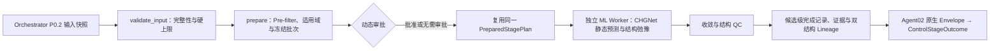

# Agent02 机器学习筛选 Subagent 实施方案

版本：v0.4

日期：2026-07-26

上位设计：[`docs/system-plan.md`](../../docs/system-plan.md)、[`docs/architecture.md`](../../docs/architecture.md)、[`Orchestrator 计划`](material-screening-orchestrator-plan.md)

## 开始开发前必读

- [README](../../README.md)：当前轻量默认环境、测试、worker 限制和运行方式。
- [系统蓝图](../../docs/system-plan.md)：L2 证据边界、审批、安全和科学措辞约束。
- [技术架构 Agent02 边界](../../docs/architecture.md#54-agent-02机器学习筛选)：主环境/独立 worker、Artifact 和 StageRunner 关系。
- [主计划](../master.md)：当前 Step 2 状态、依赖、阻塞和发布 Gate。
- [Orchestrator 计划](material-screening-orchestrator-plan.md)：`orchestrator-p0.2-v3`、PreparedStagePlan 和动态审批桥接。
- [原始系统总方案](../../docs/system-plan-original.md)：仅用于历史追溯。

### 模块职责与边界

- **职责：** 防御性 pre-filter、模型适用域、冻结候选批次、独立 JSON worker 边界、结构 QC、双轨 lineage、候选级完成记录和 Agent02 原生 Envelope。
- **输入：** Agent01 不可变 manifest/结构/性质 provenance、StageExecutionContext、版本化 request/policy/model registry 和 health snapshot。
- **输出：** `PreparedStagePlan`、worker 结果、QC/适用域状态、ML Artifact、`PASS/REJECT/UNCERTAIN/FAILED` 和可审计的 L2 资格信息。
- **不负责：** 重新查询或翻转 Agent01 的 `REJECT`、生成新结构、DFT/多体结论、模型/阈值的 LLM 选择或修改 Orchestrator 通用控制流/schema。
- **不可修改范围：** Agent01 权威记录、Orchestrator 控制契约、主环境重型依赖、冻结 fixture、科学 policy 和其他 agent 计划。

当前没有独立 integration Markdown；真实 CHGNet 通过独立 worker/JSON 边界接入，相关通用后端规则见[技术架构](../../docs/architecture.md#7-adapter-与-backend-规则)。

### 当前下一步、依赖与阻塞

1. 完成第 8.2 节 P0.2 Adapter：逐候选完成记录、stage artifact 布局、幂等 ledger 和恢复语义。
2. 用 Fake worker 覆盖 1–5 自动、显式 6–20 审批、超过 20 阻塞，并完成 `run-stage ml` 与要求 L2 的整图 fixture E2E。
3. 在独立 Python 3.11 环境冻结 worker protocol、依赖 lock、模型/health snapshot 和 CPU smoke test。
4. 通过真实 CPU、目标 Mac health、CPU/MPS parity、Top-5、崩溃恢复和安全 Gate 后，才评估生产 capability 注册。

跨 agent 依赖：输入依赖 Agent01 的不可变 manifest 和 lineage；控制面依赖 Orchestrator P0.2 的 PreparedStagePlan/审批契约；Agent03 只能消费通过 QC 的 ML 结构。当前阻塞为真实 CHGNet/Torch/ASE 环境、checkpoint/model card hash 和目标 Mac Gate 尚未完成；Fake 不得解除该阻塞或提升真实证据。

完成每个 Step 后，只更新本计划的状态、测试数字、fixture/hash、限制和跨 agent 影响；涉及 Agent02 原生契约时同步更新 Orchestrator 计划、冻结 fixture 和 contract test，涉及长期架构时才更新主计划/架构文档。

当前状态：**第 8.1 节与第 8.1.1 节已完成：Agent02 原生契约、Fake Adapter/Fake Worker、确定性策略、契约加固和冻结 fixture 已形成代码基线 `408cec3`，默认回归为 `242 passed, 2 skipped`。下一步为第 8.2 节的 P0.2 Adapter、审批和恢复；生产 capability 仍未注册，真实 CHGNet/Torch/ASE 仍未安装或接入。**

## 1. 执行摘要

Agent02 是一个确定性、可恢复、可审计的机器学习筛选阶段，不是让 LLM 自主选择模型或科学阈值的对话 Agent。

v1 采用三段式漏斗：



v1 必须真实跑通一个最多 5 个候选的 CHGNet 小批量；fixture/mock 仅用于离线测试和失败注入，不能提升证据等级。Agent02 的科学作用是：

- 复核确定性硬约束；
- 判断候选是否处于模型适用域；
- 为体相无机晶体执行低成本结构预弛豫；
- 识别不收敛、结构大幅漂移和异常模型输出；
- 为 Agent03 同时提供来源结构和 ML 弛豫结构；
- 提升“经过真实 MLIP 预弛豫检查”这一项证据到 `L2_ML_SCREENED`。

Agent02 不得把 CHGNet 能量、弛豫收敛或磁矩描述为：

- formation energy；
- energy above hull；
- 热力学稳定性证明；
- 磁基态、Mott、拓扑或平带证明；
- DFT 验证结果；
- 带有校准概率的置信度。

## 2. 冻结决策与范围

| 项目 | v1 决策 |
|---|---|
| 首个真实能力 | 结构弛豫、能量/力/应力预测和结构异常检查 |
| 模型 | CHGNet MPtrj checkpoint `0.3.0` |
| 代码包 | 独立 Python 3.11 ML 环境，首选固定 `chgnet==0.4.2` 并锁定完整传递依赖 |
| 运行边界 | Orchestrator 主环境不安装 Torch/CHGNet；通过同步 JSON worker 子进程调用独立 ML 环境 |
| 编排契约 | `orchestrator-p0.2-v3`、`orchestrator-stage-plan-v2` |
| Agent02 原生契约 | `agent02-contract-v1`、`agent02-stage-plan-v1`、`agent02-worker-protocol-v1` |
| 适用结构 | 周期性、体相、无机晶体 |
| 非适用结构 | 2D 真空层、双层/界面、分子、明显域外结构、超过原子数上限的结构 |
| 自动真实批次 | 上游排序 Top-5，每结构最多 100 个原子 |
| 候选选择 | 按冻结的上游 L1 排名；并列时按 `candidate_id` 排序 |
| 弛豫参数 | FIRE，离子与晶胞共同优化，`fmax=0.1 eV/Å`，最多 200 步 |
| 晶胞 Filter | `FrechetCellFilter` |
| 候选淘汰 | 仅确定性 pre-filter 可以 `REJECT`；ML 只能 `PASS`、`UNCERTAIN` 或 `FAILED` |
| 下游结构 | 保留来源结构和 ML 结构；ML 通过 QC 时推荐 Agent03 使用 ML 结构 |
| 不确定性 | v1 固定为 `NOT_AVAILABLE`，禁止生成伪概率 |
| L2 提升 | 真实模型、适用域通过、弛豫成功、QC 通过时允许提升 |
| LLM 权限 | 不参与模型选择、阈值、适用域、候选决策或排序 |
| P1 优先级 | 先建立 DFT benchmark、OOD 和不确定性校准，再扩展性质模型 |

CHGNet 官方接口支持 checkpoint `0.3.0`、CPU/MPS、静态能量/力/应力/磁矩预测及 `StructOptimizer` 弛豫；当前包声明 Python ≥3.10、Modified BSD 许可证。PyPI 当前提供 `chgnet==0.4.2` 的 CPython 3.11 macOS universal2 wheel，因此 v1 先以 `0.4.2` 作为待验证锁定版本；若目标 Mac smoke test 不通过，只能通过有记录的兼容性决策回退，不允许静默漂移版本。[CHGNet 官方仓库](https://github.com/CederGroupHub/chgnet)、[API 文档](https://chgnet.lbl.gov/api)、[PyPI](https://pypi.org/project/chgnet/)

选择 CHGNet 的理由是其训练数据来自 Materials Project 的 GGA/GGA+U 轨迹，与 Agent01 的首个数据源较一致；这不代表模型对所有 MP 材料同样可靠，也不能替代体系相关 DFT 验证。[CHGNet 原始论文](https://www.nature.com/articles/s42256-023-00716-3)

### v1 非目标

- 不训练或微调神经网络；
- 不接入 ALIGNN、DeepH、MACE、MatGL 等第二模型；
- 不进行 MD、声子、弹性或相图计算；
- 不从单个结构能量计算凸包；
- 不处理新结构生成、掺杂或元素替换；
- 不为强关联目标生成专用分类概率；
- 不允许 LLM 动态改变模型、设备或弛豫参数；
- 不把 CHGNet 预测磁矩用于确认磁序或磁性基态。
- 不修改 Orchestrator P0.2 通用控制流或业务 SQLite schema 来保存候选级 ML 进度；
- 不在默认 Orchestrator 环境中安装 Torch、CHGNet 或 ASE；
- 不在用户批准昂贵批次前加载模型或执行真实推理。
- 不在 v1 提供异步 external job 或运行中用户取消；stage timeout 负责终止同步 worker。

## 3. 输入、输出与公共契约

### 3.1 最低输入

Orchestrator 以 `StageExecutionContext` 提供身份和引用，Agent02 不在原生 request
中重复声明这些字段。`validate_input(context)` 必须验证：

- 已确认且不可变的 `requirement.json` 及 SHA-256；
- `candidate_manifest.jsonl` 及 SHA-256；
- 每个待处理候选的来源结构 URI、结构 hash 和 `structure_id`；
- `allow_ml=true`；
- 上游候选排名或可重现的排序字段；
- 固定的 `ml-screening-policy-v1` 及 SHA-256；
- 固定的 `model-registry-v1` 及 SHA-256；
- 可选的 `input_artifacts["stage_request"]` 及 SHA-256。

Orchestrator 自有 `attempt-N.input.json` 是控制面输入快照；Agent02 不再创建同名
副本。缺少 requirement、manifest 或结构时返回：

- `StageInputValidation.valid=false`；
- `error_code=MISSING_INPUT`；
- `failure_status=BLOCKED_MISSING_INPUT`；
- 返回缺失字段、候选 ID 和补充方式；
- 不生成替代结构，不猜测缺失属性，不启动模型。

hash 不一致、不安全 URI、非法 JSON 或错误 schema version 返回
`INPUT_INTEGRITY_ERROR`/`PERMANENT_FAILED`，要求以正确 artifact 创建新 Run。
显式请求超过 20 个候选时，必须在 `prepare()` 前返回
`BATCH_LIMIT_EXCEEDED`/`BLOCKED_MISSING_INPUT`；此时不得创建原生计划、审批或
operation。

### 3.2 `MLScreeningRequest`

`stage_request` 是可选、不可变且严格拒绝额外字段的 Agent02 原生 artifact：

```text
schema_version = "agent02-request-v1"
selection_mode = POLICY_TOP_N | EXPLICIT_IDS
requested_candidate_ids[] | null
max_candidates = 1..20
requested_tasks = ["static_prediction", "structure_relaxation"]
model_ref = "chgnet-mptrj-0.3.0"
relaxation_profile = "bulk-standard-v1"
allow_real_inference = true
```

规则冻结为：

- 无 `stage_request`：等价于 policy 默认 `POLICY_TOP_N`、Top-5；
- `POLICY_TOP_N`：`requested_candidate_ids=null` 且 `max_candidates=1..5`；
  `max_candidates` 是实际选择上限，不是仅用于输入校验的提示值；默认值为 5；
- `EXPLICIT_IDS`：ID 必须唯一、存在于冻结 manifest，数量不得超过
  `max_candidates`；1–5 个无需审批，6–20 个需要动态审批；
- 显式 ID 仍须通过 pre-filter 和适用域；审批不会使域外候选变为可执行；
- `project_id`、`run_id`、requirement/manifest URI/hash 只取自
  `StageExecutionContext`，request 不得覆盖它们；
- `allow_real_inference=false` 仅生成可审计的 dry-run/`UNCERTAIN` 结果，不调用
  worker、不提升 L2，也绝不隐式换用 Fake Worker；
- v1 不接受用户自定义 checkpoint、任意模型路径或任意弛豫参数。

### 3.3 `MLModelSpec`

Model Registry 中的 `MLModelSpec` 是不可变科学声明：

```text
model_id
adapter_type
package_name
package_version
checkpoint_name
checkpoint_artifact_uri
checkpoint_sha256
package_lock_uri
package_lock_sha256
license
training_dataset
training_method
supported_tasks
supported_properties
supported_elements
supported_elements_source
supported_dimensionalities
input_requirements
max_num_sites_policy
supported_devices
native_uncertainty
known_limitations
model_card_uri
model_card_sha256
is_mock
```

CHGNet v1 固定记录：

- `model_id=chgnet-mptrj-0.3.0`；
- `package_name=chgnet`；
- `package_version=0.4.2`，最终以目标 Mac 兼容性 Gate 冻结；
- `checkpoint_name=0.3.0`；
- 输出为 energy、forces、stress、site magnetic moments；
- `native_uncertainty=false`；
- 训练方法标记为 MP GGA/GGA+U；
- 许可证标记为 Modified BSD；
- checkpoint 和 model card 必须保存 SHA-256。

支持元素集合必须来自可审计的官方训练域数据，并作为版本化 registry artifact 提交。不能用“网络结构能编码该原子序数”代替“训练数据覆盖该元素”。若无法确认某元素是否被训练数据覆盖，适用域结果必须是 `UNKNOWN`。

机器和时间相关信息单独写入不可变 `ModelHealthSnapshot`：

```text
schema_version = "agent02-model-health-v1"
model_id
checkpoint_sha256
package_lock_sha256
worker_protocol_version
python_version
platform
architecture
device_policy
available_devices
smoke_test_status = PASS | FAIL
parity_metrics | null
tested_at
expires_at
installed_package_versions
environment_fingerprint_sha256
is_mock
```

`prepare()` 只读取已冻结且 hash 匹配的 health snapshot，不加载真实模型。health
snapshot 缺失、失败、已过期或环境指纹不一致时，生产计划不得开始推理。
`environment_fingerprint_sha256` 对 Python、CHGNet、Torch、Pymatgen、ASE、
NumPy 版本、平台、架构、可用设备能力集合和 package lock hash 的 canonical JSON
计算 SHA-256；不得包含绝对可执行文件路径、用户名或其他机器隐私信息。候选实际
使用的 `cpu|mps` 和 fallback trace 单独进入 relaxation provenance，不改变同一已
验证环境的 fingerprint。

health 有效期由 `ml-screening-policy-v1.health_snapshot_validity_seconds` 冻结，
发布 Gate 必须给出非空正值。`prepare()` 验证
`expires_at == tested_at + health_snapshot_validity_seconds` 且
`tested_at <= plan.created_at < expires_at`；worker 启动时重新计算实际环境指纹并
在 handshake 中复核。仅修改 `tested_at` 或复制旧 snapshot 不得延长有效期。
真实 health snapshot 的 `installed_package_versions` v1 必填键为 `chgnet`、
`torch`、`pymatgen`、`ase` 和 `numpy`，版本值必须和 lock 及真实环境一致。Fake
snapshot 只记录实际存在的轻量 Fake Adapter 版本且必须 `is_mock=true`，不得填充
虚构的 CHGNet/Torch 版本来冒充真实环境。

### 3.4 `ApplicabilityAssessment`

```text
candidate_id
structure_id
model_id
status = APPLICABLE | NOT_APPLICABLE | UNKNOWN
eligible_for_real_inference
eligible_for_l2
checks[]
reasons[]
warnings[]
policy_version
```

每个 `checks[]` 项包含：

```text
check_id
status = PASS | FAIL | UNKNOWN
severity
expected
observed
source
message
```

v1 顺序执行以下检查：

1. 结构文件可解析且 hash 匹配；
2. 结构为周期性晶体；
3. 化学组分满足 `inorganic-composition-policy-v1`；
4. 原子数不超过 100；
5. 所有元素位于 registry 的训练覆盖集合；
6. 结构维度为 3D；
7. 晶格、坐标、占位和物种均可被 Pymatgen/ASE 表示；
8. 无无穷值、NaN、零体积或明显原子重叠；
9. 模型和设备 smoke test 已通过。

维度优先读取有 provenance 的上游结果；缺失时使用固定版本的 Pymatgen dimensionality 算法并记录算法版本。结果不是 3 或无法确定时不得真实弛豫，不得提升 L2。

“无机体系”在 v1 使用保守的操作定义，不由模型名称或 LLM 判断：

1. 上游若提供不可变、带来源和版本的材料类别，直接按
   `inorganic-composition-policy-v1` 映射；
2. 无碳且不是离散分子的周期性体系可判为 `PASS`；
3. 含碳体系不能仅凭化学式判为有机或无机；碳化物、碳酸盐、氰化物、MOF、
   有机盐等必须有受信任分类或固定结构规则，否则为 `UNKNOWN`；
4. 明确的分子、有机或金属有机体系为 `FAIL`；
5. 每次判断记录 classifier version、输入来源、reason code 和是否使用上游分类。

`UNKNOWN` 按适用域保守规则停止真实推理。Agent01 → Agent02 转换器不得根据是否出现
某一个元素临时猜测 `is_inorganic`。

### 3.5 `MLRelaxationResult`

```text
candidate_id
input_structure_id
input_structure_uri
input_structure_sha256
output_structure_id | null
output_structure_uri | null
output_structure_sha256 | null
model_id
checkpoint_sha256
adapter_version
device
relaxation_profile
status = CONVERGED | MAX_STEPS | INVALID_OUTPUT | RUNTIME_FAILED
num_steps
initial_energy_ev
final_energy_ev
initial_energy_ev_atom
final_energy_ev_atom
delta_energy_ev_atom
initial_max_force_ev_angstrom
final_max_force_ev_angstrom
final_stress_gpa_3x3
magmom_summary
structure_drift
uncertainty
warnings[]
errors[]
wall_time_seconds
provenance
```

`uncertainty` 固定为：

```json
{
  "kind": "NOT_AVAILABLE",
  "value": null,
  "unit": null,
  "calibrated": false,
  "reason": "CHGNet v1 uses a single pretrained checkpoint without calibrated predictive uncertainty."
}
```

磁矩只能存为 `diagnostic_prediction`，不得满足磁性、Mott 或磁序目标的 required evidence。

能量语义必须按 API 来源区分：

- `predict_structure()` 的 energy 是 `eV/atom`；
- relaxation trajectory 的 energy 是结构总势能 `eV`；
- 总能量只除以实际原子数一次来得到 `eV/atom`，禁止重复归一化；
- force 固定为 `eV/Å`；
- `predict_structure()["s"]` 的原始 stress 是 `GPa`、形状为 `3x3`；
- `StructOptimizer` trajectory 经 ASE calculator 取得的 stress 是
  `eV/ų`；规范化时必须使用
  `stress_gpa = stress_ase_ev_angstrom3 / ase.units.GPa` 恰好转换一次；
- 所有公开 stress 统一保存为有限的对称 `3x3`、单位 `GPa`。若第三方接口返回 ASE
  Voigt 六分量，先按 ASE 顺序 `xx, yy, zz, yz, xz, xy` 转成 `3x3`；
- 固定 fixture 必须比较 direct prediction 与 ASE calculator 路径，验证单位因子、
  分量顺序和符号约定，防止约 160 倍换算错误。

### 3.6 Agent02 原生阶段契约

Agent02 不导入或修改 Agent01 冻结的 `PropertyValue`、`CandidateAuditRecord` 或
`StageResultEnvelope`。新增独立版本化模型：

- `MLStagePlan`，`schema_version=agent02-stage-plan-v1`；
- `MLStageResultEnvelope`，`schema_version=agent02-contract-v1`；
- `MLCandidateResult` 和 `MLCandidateManifestRecord`；
- `MLPropertyValue` 与 ML 专用 provenance；
- `MLStageOutcome`，仅在 Agent02 原生层表达执行结果。

`MLStagePlan` 至少冻结：

```text
project_id / run_id / requirement_revision / attempt
orchestrator_input_snapshot_uri / sha256
requirement、candidate_manifest、stage_request、policy、registry、health 引用及 hash
selection_mode、selection_limit、manifest_candidate_count
requested_candidate_ids、requested_candidate_count
inference_candidate_ids、not_selected_candidate_ids
每个候选的 input_structure_id / uri / hash、pre-filter 和 applicability 决定
model_id / checkpoint_sha256 / package_lock_sha256
device_policy / relaxation_profile / requested_tasks / execution_identity
resource_estimate / approval_required / policy_version / created_at
```

`selection_limit` 对 `POLICY_TOP_N` 等于 request 的 `max_candidates`，范围为 1–5；
对 `EXPLICIT_IDS` 等于 request 的 `max_candidates`，范围为 1–20。
`manifest_candidate_count == len(planned_candidates)`。
`requested_candidate_count` 对 policy 模式等于
`min(manifest_candidate_count, selection_limit)`，对显式模式等于显式 ID 数。计划
模型必须验证 `len(inference_candidate_ids) <= requested_candidate_count`。

所有执行层对象复用强类型身份，而不是从自由格式 provenance 推断：

```text
MLExecutionIdentity:
  model_id
  checkpoint_sha256
  package_lock_sha256
  adapter_version
  worker_protocol_version
  environment_fingerprint_sha256
  is_mock
```

registry model spec 与 health snapshot 的 `is_mock` 必须相同；
`MLStagePlan.execution_identity.is_mock` 等于二者共同值。标记不一致时计划无效。
worker 实际 handshake 必须与计划身份逐字段一致。

`MLCandidateManifestRecord` 必须保留上游 `candidate_id`、上游 manifest 引用和来源
结构，不覆盖 Agent01 记录；Agent02 新增的 `MLPropertyValue` 必须逐性质保存值、单位、
方法、模型、checkpoint、输入/输出结构引用、证据等级和 provenance。

```text
MLCandidateResult:
  candidate_id / upstream_manifest_uri / upstream_manifest_sha256
  source_structure_id / source_structure_uri / source_structure_sha256
  pre_filter_decision / applicability / selection_status / execution_status
  decision / evidence_level / ml_properties[] / relaxation_result
  execution_identity
  recommended_downstream_structure_id / warnings[] / errors[]

MLPropertyValue:
  property_name / value_or_numeric_artifact_ref / unit
  evidence_level / method / model_id / checkpoint_sha256
  input_structure_id / output_structure_id | null
  is_mock / provenance

MLNumericArtifactRef:
  uri / sha256 / size_bytes / media_type
  array_key / dtype / shape[] / allow_pickle=false
```

`MLStageResultEnvelope` 至少包含 plan URI/hash、execution identity、候选结果
manifest URI/hash、输出 artifact 引用、候选级状态计数、stage 状态、
warning/error、开始/结束时间和 provenance。Envelope 必须重新计算候选 ID、计数和
mock 一致性，不能信任 worker 自报的汇总。只有经过真实 worker 且 QC 通过的 ML 性质可以标记
`L2_ML_SCREENED`。

### 3.7 模型 Adapter

统一协议：

```python
class MLModelAdapter(Protocol):
    def describe(self) -> MLModelSpec: ...
    def healthcheck(self, device: str) -> ModelHealthSnapshot: ...
    def predict_static(
        self,
        structure: StructureRef,
        request: StaticPredictionRequest,
    ) -> StaticPredictionResult: ...
    def relax(
        self,
        structure: StructureRef,
        request: RelaxationRequest,
    ) -> MLRelaxationResult: ...
```

Adapter 负责：

- 模型加载和 checkpoint 校验；
- Pymatgen/ASE 转换；
- raw tensor 到 JSON 可序列化类型转换；
- 单位显式归一化；
- CPU/MPS 设备处理；
- 捕获第三方库异常；
- 输出完整 provenance；
- 禁止把 Numpy、Torch 对象、Pymatgen 对象或 pickle 放入跨进程协议和 Global
  State。

CHGNet 固定使用 `CHGNet.load(model_name="0.3.0")`。`on_isolated_atoms="error"`
传给 `StructOptimizer` 构造函数；`assign_magmoms=true` 和
`ase_filter="FrechetCellFilter"` 传给 `relax()`，不得混淆参数层级。

### 3.8 Orchestrator Adapter 与 Worker 边界

`Agent02RunnerAdapter` 精确实现仓库现有 P0.2 `StageRunner`：

```text
validate_input(context) -> StageInputValidation
prepare(context) -> PreparedStagePlan
start(context, prepared_plan, idempotency_key) -> ControlStageOutcome
reconcile(context, prepared_plan, external_job_ref, idempotency_key)
    -> ControlStageOutcome
cancel(external_job_ref, idempotency_key) -> CancelOutcome
```

职责分离：

- Agent02 原生 planner 生成并保存 `MLStagePlan`；
- Adapter 将其 URI/hash、资源估算和动态审批结论映射为
  `PreparedStagePlan(orchestrator-stage-plan-v2)`；
- `start()` 校验两层 plan 和输入 hash，逐候选调用 worker、提交候选 ledger，由
  Adapter 汇总并校验 `MLStageResultEnvelope`，再映射为 `ControlStageOutcome`；
- `ControlStageOutcome.summary` 只发布候选计数、`ml_candidate_manifest` 和推荐结构
  manifest 的 URI/hash，不复制科学明细；
- 不修改 Orchestrator 控制契约、图拓扑、checkpoint schema 或业务 SQLite schema。

Agent02 v1 是同步本地 stage，永不返回 `WaitingExternal`。因此正常控制流不会调用
`reconcile()`；若被误调用，它必须返回明确的 `UNSUPPORTED_OPERATION`，不能伪造
external job。`cancel()` 仅保留协议兼容性，不承担运行中子进程取消；v1 的超时和
终止由同步 `start()` 负责并写入原生结果。

主 Orchestrator 环境只运行轻量 Adapter。真实执行使用配置的 Python 3.11
可执行文件直接启动 JSON worker，不经 shell：

```text
stdin:  agent02-worker-request-v1 JSON
stdout: agent02-worker-response-v1 JSON
stderr: 受控诊断日志
```

artifact root 是 Adapter runtime config 中的受信任路径，通过无 shell 的固定 argv
传给 worker，不得由 JSON request 或 stage artifact 覆盖。JSON 只携带 root-relative
路径。`agent02-worker-request-v1` 至少包含：

```text
schema_version
expected_handshake: MLExecutionIdentity
plan
candidate_id
candidate_operation_key
inputs[]:
  artifact_uri / root_relative_path / sha256 / size_bytes
output_sandbox_relative_path
limits:
  wall_time_seconds
  max_stdout_bytes
  max_single_artifact_bytes
  max_total_output_bytes
```

`agent02-worker-response-v1` 至少包含：

```text
schema_version
actual_handshake: MLExecutionIdentity
candidate_id
candidate_operation_key
status
candidate_result
produced_artifacts[]:
  root_relative_path / sha256 / size_bytes / media_type
  numeric_metadata: array_key / dtype / shape[] / allow_pickle=false | null
warnings[] / errors[]
```

v1 每个 `SELECTED` 候选启动一次同步 worker 请求，严格按计划顺序串行执行；一个
request/response 不处理整批候选。Adapter 在每次成功 response 后立即校验并提交该
候选的权威 completion ledger，再启动下一个候选。因此第 N 个进程崩溃时，前 N-1
个候选仍可安全恢复，且不依赖 stdout 流式协议或 worker 自写权威 ledger。每候选
重新加载模型产生的成本必须在 release Gate 测量；若未来引入常驻进程或 framed
streaming，必须发布新的 worker protocol version，不能改变 v1 语义。

worker 只能在 Adapter 预创建的候选 operation sandbox 内写入原始静态预测、弛豫
摘要、数值轨迹和输出结构。Adapter 重新解析并校验所有路径、大小和 hash 后，才生成
权威 manifest、report、stage envelope 和两级 `operation-complete.json`。worker
不得写计划、stage ledger 或权威完成记录；Fake Worker 也走同一 Adapter
finalization 路径，只是返回内存中的测试结果且不产生真实数值 artifact。

worker 必须先通过协议、实际安装包、环境指纹和 checkpoint handshake；只接受允许
artifact root 下的规范化相对路径，设置 wall-time 和输出大小上限，拒绝路径穿越、
symlink 逃逸、绝对路径、额外 schema 字段、pickle 和任意代码执行。退出码、超时、
非法 stdout 和信号终止均映射为稳定错误码。依赖固定在独立
`requirements-agent02.lock`，默认项目安装和默认测试不得安装或导入
Torch、CHGNet、ASE。worker 运行时必须离线使用预置 checkpoint，缺失时失败，不得
自动下载模型或依赖；第三方库日志重定向到 stderr，stdout 只允许一份最终 JSON
response。

## 4. 详细执行流程

执行阶段严格分工：

- `validate_input`：只做引用存在性、hash、request schema、显式 ID 和 20 个候选硬
  上限检查；
- `prepare`：解析冻结输入，执行纯函数 pre-filter、适用域规则、确定性选择，读取
  已冻结 `ModelHealthSnapshot`，估算资源并原子保存 `MLStagePlan`；不得加载模型、
  运行预测或启动 worker；
- Orchestrator 审批：只批准已冻结计划；通过后不得重新选择候选或改变资源；
- `start`：再次校验两层计划和所有输入 hash 后，才调用真实 worker，执行候选级
  operation、QC、lineage 和结果汇总。

### 4.1 输入快照

Orchestrator 在调用 runner 前生成不可变控制快照
`plans/<run_id>/stages/ml/attempt-<n>.input.json`。Agent02 的 `prepare()` 生成独立
的科学计划快照，包含：

- requirement URI/hash/revision；
- candidate manifest URI/hash；
- stage request URI/hash 或“使用 policy 默认值”；
- 候选 ID、来源结构 ID 和 hash；
- 上游 rank；
- model registry hash；
- policy hash；
- `ModelHealthSnapshot` URI/hash；
- 冻结的 Python、CHGNet、Torch、Pymatgen、ASE 版本和设备政策；
- 代码版本。

两份快照用途不同：前者是 Orchestrator 控制输入，后者是 Agent02 原生科学计划，
不得重复写成两个含义不清的 `input_snapshot.json`。相同 Run 恢复时任一输入 hash
变化都必须停止，并要求创建新的顶层 Run，不得通过同一 Run 的新 attempt 复用旧
结果。

### 4.2 确定性 pre-filter

Agent02 不重新查询 Materials Project，但必须针对冻结 requirement 做防御性复核：

- include/exclude elements；
- 化学式、元素数、原子数；
- band gap、energy above hull 等硬约束；
- 结构有效性；
- 单位是否可转换；
- required property 是否缺失。

规则：

- 明确违反硬约束：`REJECT`；
- required 字段缺失或单位不明：`UNCERTAIN`；
- 明确满足：进入适用域检查；
- 上游已 `REJECT` 的候选不得被 Agent02 恢复为 `PASS`；
- 每条决定必须使用稳定的 reason code，不只保存自然语言。

Agent01 当前生产 manifest 只发布 `PASS`/`UNCERTAIN` 候选，因此“上游 REJECT
不得翻转”主要是防御性契约测试，不应假设生产 manifest 总会包含 REJECT 记录。

建议 reason code：

```text
HARD_CONSTRAINT_INCLUDE_ELEMENT
HARD_CONSTRAINT_EXCLUDE_ELEMENT
HARD_CONSTRAINT_NUM_SITES
HARD_CONSTRAINT_PROPERTY_RANGE
MISSING_REQUIRED_PROPERTY
INVALID_PROPERTY_UNIT
INVALID_STRUCTURE
```

### 4.3 适用域 Gate

只有 `APPLICABLE` 才允许真实 CHGNet 弛豫。

- `NOT_APPLICABLE`：候选 ML 结果为 `UNCERTAIN`，保留 L1；
- `UNKNOWN`：按保守原则不执行真实模型，结果为 `UNCERTAIN`；
- 域外不是工具失败，Stage 可正常 `SUCCEEDED`；
- 报告必须逐项展示域外原因。

2D、界面和双层候选仍可经过 pre-filter，但 v1 必须在适用域 Gate 截止，不允许以警告代替 Gate 后继续提升 L2。

### 4.4 预算和批次选择

默认自动执行条件：

- 无 request 时按 policy 选择 Top-5，或显式请求 1–5 个；
- 每个候选不超过 100 个原子；
- requirement 已确认 `allow_ml=true`；
- 使用标准弛豫 profile；
- 所有候选串行执行。

`POLICY_TOP_N` 的确定性选择：

1. 按上游 rank 升序；
2. 缺失 rank 的候选排在有 rank 候选之后；
3. 并列按 `candidate_id` 字典序；
4. pre-filter 为通过且 `APPLICABLE` 的候选才计入真实推理批次；
5. 从这些候选中选前 `request.max_candidates` 个作为
   `inference_candidate_ids`；无 request 时该值为 policy 默认 5；
6. 后续合格候选标为 `NOT_SELECTED_BUDGET`；域外/未知候选使用各自 applicability
   状态，不消耗 Top-5 名额。

显式请求的 ID 数在 `validate_input()` 中按请求范围计算，而不是先过滤再绕过上限：

- 1–5：无需动态审批；
- 6–20：`PreparedStagePlan.approval_required=true`、
  `gate_type=EXPENSIVE_BATCH_APPROVAL`；
- >20：`BATCH_LIMIT_EXCEEDED`/`BLOCKED_MISSING_INPUT`，审批不能绕过。

`prepare()` 仍会记录所有显式候选的 pre-filter/适用域结果；审批要求由原始显式
请求数量决定，资源估算和 payload 则使用实际可执行候选数。每个真实执行候选最多
100 个原子；超出者在适用域 Gate 停止，不因批次获批而绕过。

审批 payload 必须来自冻结的 `PreparedStagePlan`，包含计划 URI/hash、实际执行
候选数、请求候选数、最大原子数、200 步上限、设备政策、估算 wall time/内存、
模型、policy 和输入快照 hash。批准后必须复用原计划；拒绝后不得调用 `start()`。

### 4.5 设备选择

设备政策固定为：

1. 发布/部署阶段检测 MPS，并生成有时效和版本绑定的 health snapshot；
2. 对固定小结构执行 CPU/MPS parity smoke test；
3. energy/atom 差异不超过 `1e-4 eV/atom`，最大力分量差异不超过 `5e-3 eV/Å` 时允许 MPS；
4. 不满足条件或 MPS 不可用时使用 CPU；
5. MPS 发生 OOM 或设备错误时允许同一候选自动回退 CPU 一次；
6. 回退行为和原始错误必须进入 provenance；
7. CPU 再失败后不得重复换设备。

`prepare()` 只读取该快照来冻结设备政策，不现场运行 smoke inference。常规默认 CI
完全使用 Fake Worker；独立真实 ML job 使用 CPU，目标 Mac 的 release Gate 同时
验证 MPS 路径。

### 4.6 CHGNet 弛豫

固定调用语义：

```text
model = CHGNet.load(model_name="0.3.0")
optimizer = StructOptimizer(
    model=model,
    optimizer_class="FIRE",
    on_isolated_atoms="error",
)
result = optimizer.relax(
    structure,
    fmax=0.1,
    steps=200,
    relax_cell=true,
    ase_filter="FrechetCellFilter",
    assign_magmoms=true,
)
```

Adapter 必须保存：

- 初始静态 energy、forces、stress、magmoms；
- 每一步 energy、forces、stress、cell 和 positions；
- 最终结构；
- 总步数和 wall time；
- CHGNet package/model/device 信息。

静态 `predict_structure()` 的 energy 按官方 API 直接解释为 `eV/atom`。trajectory
energy 按结构总势能 `eV` 保存，并使用当步结构的原子数派生
`mlip_potential_energy_ev_atom`；禁止再次除以原子数，也禁止命名为 formation
energy。解析时必须用固定 fixture 对两种 API 的 shape、单位和归一化各自做契约
测试。

### 4.7 收敛与结构 QC

`CONVERGED` 必须由最终最大原子力重新计算确认：

```text
max_i ||F_i|| <= 0.1 eV/angstrom
```

不能只依赖第三方优化器是否正常返回。

硬完整性检查失败时结果为 `FAILED`：

- NaN/Inf；
- 最终结构无法解析；
- 元素组成或原子数改变；
- artifact 写入/hash 失败；
- 最小原子间距小于 `0.5 Å`；
- 模型返回缺失或维度不匹配的数据。

软科学 QC 任一失败时结果为 `UNCERTAIN`，不得 `REJECT`：

- 200 步内未收敛；
- 最终能量比初始能量高超过 `1e-4 eV/atom`；
- 最终/初始体积比不在 `[0.8, 1.2]`；
- `StructureMatcher` 无法匹配同一结构原型；
- 存在孤立原子警告；
- 最终最大力不满足阈值；
- 结构漂移指标无法可靠计算。

`StructureMatcher` 参数固定为：

```text
ltol = 0.2
stol = 0.3
angle_tol = 5 degrees
primitive_cell = false
scale = true
attempt_supercell = false
```

所有 QC 阈值写入 `ml-screening-policy-v1`，不得散落为代码常量。

### 4.8 证据和候选决策

| 情况 | Agent02 决策 | 证据 |
|---|---|---|
| 违反确定性硬约束 | `REJECT` | 保留已有等级 |
| 未被 Top-5 选中 | `UNCERTAIN` / `NOT_SELECTED_BUDGET` | 保持 L1 |
| 模型域外或适用性未知 | `UNCERTAIN` | 保持 L1 |
| fixture/mock 成功 | `UNCERTAIN` | 不得提升 |
| 真实弛豫收敛且 QC 通过 | `PASS` | 增加 L2 ML 性质 |
| 真实弛豫未收敛或结构漂移 | `UNCERTAIN` | 保持 L1，保留诊断结果 |
| 模型运行或输出损坏 | `FAILED` | 保持已有证据 |
| 一部分候选运行失败 | 候选级 `FAILED` | Stage 为 `PARTIAL` |

候选整体 `evidence_level=L2_ML_SCREENED` 只表示至少存在一个有效的 L2 ML 结果。每个目标性质仍须保留自己的 evidence level：

- CHGNet 预弛豫达到 L2；
- Materials Project band gap 仍是 L1；
- 未计算的拓扑、Mott 或磁基态证据仍然缺失；
- 路由 Agent03/04 时必须依据 property-level evidence gap，不能仅查看候选最高等级。

Agent02 通过新的 ML manifest 追加证据，不原地重写 Agent01 manifest。输出必须同时
引用上游 manifest 和自身 manifest，使下游可以审计 L1 输入与 L2 增量。

### 4.9 排序

不得输出“稳定概率”或把不同量纲随意加权成黑箱总分。

Agent02 输出两个顺序：

- `scientific_rank`：保持 Agent01 的上游排名，不因是否抽中 Top-5 而改变；
- `downstream_readiness_rank`：用于安排 Agent03，顺序为：
  1. 真实 L2、收敛且 QC 通过；
  2. 未因预算执行 ML、但上游有效；
  3. ML 结果 `UNCERTAIN`；
  4. 模型域外；
  5. 运行失败。

同一组内保持上游 rank，再用 `candidate_id` 打破平局。报告必须把该顺序称为“下游计算就绪度”，不能称为热力学稳定性排名。

## 5. 结构 Lineage 与 Artifact

### 5.1 双轨结构

`candidate_id` 在全流程中保持不变。

真实弛豫成功后创建新结构版本：

```text
structure_id = content-addressed ML structure ID
parent_structure_id = Agent01 source structure
transformation = "ml_relaxation"
model_id = "chgnet-mptrj-0.3.0"
policy_version = "ml-screening-policy-v1"
```

不得覆盖来源 CIF，不得把 ML 结构伪装成 Materials Project 原结构。

Agent02 输出：

```text
source_structure_id
ml_relaxed_structure_id | null
recommended_downstream_structure_id
recommendation_reason
```

默认规则：

- L2 PASS：向 Agent03 推荐 ML 结构；
- UNCERTAIN、FAILED 或 NOT_APPLICABLE：推荐来源结构；
- Agent03 的 DFT plan 必须再次明确记录最终选用哪个结构及原因。

### 5.2 Artifact 布局

控制面 artifact 继续使用 Orchestrator 已冻结布局：

```text
plans/<run_id>/stages/ml/
├── attempt-<n>.input.json       # Orchestrator input snapshot
├── attempt-<n>.native.json      # immutable MLStagePlan
└── attempt-<n>.json             # immutable PreparedStagePlan
```

Agent02 自有输出按 Run 和 attempt 隔离：

```text
stages/agent02/<run_id>/
├── attempt-<n>/
│   ├── pre-filter.jsonl
│   ├── applicability.jsonl
│   ├── batch-selection.json
│   ├── model-health-ref.json
│   ├── ml-candidate-manifest.jsonl
│   ├── recommended-structures.jsonl
│   ├── stage-result.json
│   ├── operation-complete.json
│   ├── report.md
│   └── diagnostics/...
└── candidate-operations/
    └── <candidate-operation-key>/
        ├── static-prediction.json
        ├── relaxation-summary.json
        ├── trajectory.npz
        ├── output-structure-ref.json
        └── operation-complete.json

candidates/structures/
├── <structure_id>.ml.json
└── <structure_id>.ml.cif
```

候选 operation 目录不包含 attempt，使同一 Run、相同科学输入的后续 attempt 可以
安全复用已经完成的候选；attempt 目录只汇总本次计划的引用和 stage 结果。结构
`structure_id` 由规范化结构内容寻址，JSON/CIF 均记录 hash 和 parent lineage。

`trajectory.npz` 只允许数值数组，读取时必须 `allow_pickle=False`。跨进程 JSON、
Orchestrator Global State 和数据库只保存 URI/hash 或小型摘要，不保存轨迹、
Tensor、DataFrame 或完整结构。

所有 artifact 使用同目录临时文件、SHA-256 校验和原子 rename。只有同时存在且内容
匹配的 `operation-complete.json` 才是完成记录；中断遗留的临时文件、缺少完成记录
的目录和未登记文件均不具权威性。公开错误与内部 traceback 分离，诊断 artifact
必须受路径和大小限制。

## 6. Orchestrator、恢复和错误语义

### 6.1 幂等性

Orchestrator 的 stage operation key 继续由 `PreparedStagePlan` 和
`operation_input_sha256` 计算。Agent02 另有候选级 operation key：对以下对象进行
UTF-8、key 排序、无多余空白的 canonical JSON 编码，再计算 SHA-256：

```text
{
  "schema_version": "agent02-candidate-operation-v1",
  "project_id": project_id,
  "run_id": run_id,
  "candidate_id": candidate_id,
  "input_structure_sha256": input_structure_sha256,
  "model_id": model_id,
  "checkpoint_sha256": checkpoint_sha256,
  "package_lock_sha256": package_lock_sha256,
  "environment_fingerprint_sha256": environment_fingerprint_sha256,
  "adapter_version": adapter_version,
  "worker_protocol_version": worker_protocol_version,
  "device_policy": device_policy,
  "policy_sha256": policy_sha256,
  "relaxation_profile": relaxation_profile,
  "requested_tasks": sorted(requested_tasks)
}
```

禁止用冒号拼接字符串作为 hash 输入。候选 key 故意不包含 stage attempt：同一 Run
重试且科学输入不变时，可以复用已完成候选；模型、结构、policy、环境指纹或任务任一
变化都会产生新 key。不同 Run 不隐式共享 operation。

同步 `start()` 必须可重入：

1. 先校验 attempt 级 `operation-complete.json`；若存在且 envelope/artifact hash
   全部正确，直接返回相同的 `ControlStageOutcome`；
2. 否则按冻结顺序处理候选；每个候选开始前检查自己的完成记录；
3. 候选已有成功或确定性终止记录且所有 hash 正确时直接复用；
4. 候选只有临时/不完整记录时忽略并重跑该候选；
5. 候选完成后立即原子提交 Agent02 自有完成记录，再处理下一个候选；
6. 全批次汇总完成后，原子保存 `MLStageResultEnvelope` 和 stage
   `operation-complete.json`。

这能覆盖“worker 已完成但 LangGraph 尚未 checkpoint 就崩溃”的情况：恢复后图会以
相同 stage idempotency key 再次调用 `start()`，Adapter 必须返回已有结果而不是重复
推理。候选级进度属于 Agent02 artifact ledger；Orchestrator 数据库/checkpoint 仍只
保存 stage 级 plan/result/operation 引用，不增加候选业务表。

完成记录存在但引用缺失、hash 改变、key 与计划不一致时，返回
`BACKEND_INCONSISTENT` 并停止，不得静默重算或覆盖证据。相同结果不得重复创建结构
lineage 或 ML property。

### 6.2 Stage 状态

- pre-filter 后零候选：`SUCCEEDED`，属于正常科学无结果；
- 所有候选域外：`SUCCEEDED`，候选为 `UNCERTAIN`；
- 存在未收敛或软 QC 警告，但无运行错误：`SUCCEEDED`；
- 部分候选运行失败：`PARTIAL`；
- 所有选中候选均因不可重试运行错误失败：`PERMANENT_FAILED`；
- worker 超时、进程临时失败或可重试 I/O 失败且仍有重试预算：
  `RETRYABLE_FAILED`；
- 输入缺失：`BLOCKED_MISSING_INPUT`；
- 输入 hash 不匹配或 artifact 完整性失败：`PERMANENT_FAILED`；
- 等待大批次审批：`WAITING_APPROVAL`；
- 用户拒绝大批次：Orchestrator 在调用 `start()` 前处理为 `CANCELLED`，保留上游
  结果；Agent02 不生成伪执行结果。

Adapter 映射固定为：

| Agent02 原生结果 | `ControlOutcomeType` | Orchestrator `StageStatus` |
|---|---|---|
| `SUCCEEDED` | `Completed` | `SUCCEEDED` |
| `PARTIAL` | `Completed` | `PARTIAL` |
| 可重试基础设施失败 | `Failed` | `RETRYABLE_FAILED` |
| 不可重试执行失败 | `Failed` | `PERMANENT_FAILED` |

输入阻塞由 `validate_input()` 返回，不通过 `MLStageResultEnvelope` 表达。同步 v1 不
产生 `WaitingExternal`。

### 6.3 错误和重试

- `NOT_APPLICABLE`：不重试；
- 非法结构、元素域外、超过原子数：不重试；
- MPS OOM/设备异常：CPU 回退一次；
- checkpoint/model hash 不一致：不重试；
- 单候选模型输出 NaN/维度错误：该候选失败且不重试，其他候选继续；
- 临时 artifact 写入错误：允许一次原子重写；
- worker 超时、异常退出或非法响应：按固定 stage retry policy 处理，不无限重启；
- 同一确定性错误不得通过重复 `resume` 无限重试。

报告中的公开错误与内部 traceback 分离；traceback 进入受控诊断 artifact，不进入用户候选摘要。

## 7. 测试方案

### 7.1 单元测试

必须覆盖：

- `MLScreeningRequest` 的两种 selection mode、额外字段拒绝、重复/未知 ID；
- policy 上限 1/3/5 的实际选择，以及显式 5/6/20/21 个候选的无审批、审批和硬
  阻塞边界；
- include/exclude elements 和数值范围 pre-filter；
- 缺失性质与非法单位不会被误判为硬拒绝；
- 上游 `REJECT` 不能被 Agent02 翻转；
- policy `selection_limit` 选择及并列排序可重现，默认值为 Top-5；
- 2D、界面、超过 100 原子、域外元素和未知训练覆盖；
- 不加载模型即可完成 `prepare()`，且批准前没有 worker 调用；
- 收敛阈值恰好等于 `0.1 eV/Å` 的边界；
- 199、200 步及未收敛分支；
- energy 增加、体积变化、StructureMatcher 失败；
- 静态 `eV/atom` 与 trajectory 总 `eV` 不会重复归一化；
- direct stress `GPa` 与 ASE trajectory `eV/ų` 只转换一次，最终 tensor 为有限
  `3x3` 且顺序/符号一致；
- Property NaN/Inf、错误 unit/shape 和 JSON 往返后的双空值均被拒绝；
- mock/fixture 永远不能产生 L2；
- `uncertainty=NOT_AVAILABLE` 且不存在伪 confidence；
- property-level evidence 不被候选整体 L2 覆盖；
- downstream structure 推荐规则；
- candidate operation canonical JSON/hash 和 attempt 无关性；
- reason code、单位、严格 JSON schema 和序列化。

### 7.2 原生契约与 Orchestrator Adapter 测试

冻结并测试 `agent02-stage-plan-v1`、`agent02-contract-v1`、
`agent02-worker-protocol-v1` 的 JSON Schema fixture。Adapter 测试必须覆盖：

- 五个 P0.2 `StageRunner` 方法的精确签名；
- native plan → `PreparedStagePlan` 的 URI/hash、动态审批和资源估算映射；
- 原生 `SUCCEEDED`/`PARTIAL`/失败 → `ControlStageOutcome` 的固定映射；
- `ControlStageOutcome.summary` 只含小型摘要和 artifact 引用；
- 同步 runner 永不返回 `WaitingExternal`；
- `reconcile()` 的防御性 `UNSUPPORTED_OPERATION`；
- Agent01 冻结契约和 Orchestrator schema 未发生变化。

同一组模型 Adapter 契约测试运行 Fake Adapter 和真实 CHGNet Adapter：

- `describe()` 与 registry 一致；
- checkpoint hash 正确；
- energy、force、stress、magmom 形状正确且数值有限；
- 单位转换正确；
- 输出没有 Tensor/Numpy/Pymatgen 对象；
- relaxed structure 组成和原子数保持；
- CPU/MPS healthcheck 有结构化结果；
- 第三方异常被映射为系统错误类型。

默认仓库测试只能使用 Fake Adapter/Fake Worker，必须在没有 Torch、CHGNet、ASE、
网络和模型文件的干净主环境通过。Fake 输出必须带 `is_mock=true`，即使数值满足 QC
也不能提升 L2。

### 7.3 Worker 协议与安全测试

必须覆盖：

- 配置的 Python executable 和 `agent02-worker-protocol-v1` handshake；
- request/response schema version、包版本和 checkpoint hash；
- expected/actual execution identity、environment fingerprint 和 operation key；
- request 的 root-relative input path、output sandbox、hash/size 和资源 limits；
- stdout 非 JSON、超出大小、混入日志、缺字段或额外字段；
- 非零退出码、signal、启动失败和 wall-time timeout 的稳定错误映射；
- artifact root 外路径、`..`、绝对路径注入和 symlink 逃逸；
- 重复输出路径、worker 自写 completion ledger、输出 hash/size 不匹配和 sandbox
  外写入；
- worker 只从 stdin/stdout 交换 JSON，stderr 不进入科学结果；
- `.npz` 使用 `allow_pickle=False`，协议拒绝 pickle；
- 默认主进程导入 Agent02 Adapter 时不导入 Torch/CHGNet/ASE。

### 7.4 真实模型集成测试

固定、可再分发的体相结构 fixture 至少包含：

- Si；
- Si/O 化合物；
- 一个含过渡金属的体相无机晶体。

测试分层：

- 默认 CI：Fake only，不安装或导入重型 ML 依赖；
- `real_ml`：独立 ML 环境中的 CPU 静态预测和一个小结构短弛豫；
- `slow_real_ml`：标准 200 步上限的真实弛豫；
- `mps_ml`：目标 Mac 的 CPU/MPS parity、MPS 失败到 CPU 的回退；
- release Gate：真实 Top-5 串行批次；
- 数值测试使用容差，不跨设备断言逐位完全相同；
- 必须记录运行时间和峰值内存，但 v1 不以未经测量的性能数字作为科学验收标准。

真实 Gate 必须验证 `chgnet==0.4.2`、传递依赖 lock、checkpoint 和 model card hash；
如需回退包版本，先更新兼容性记录、lock、registry 和全部 hash，不允许运行时静默
选择其他版本。

### 7.5 恢复和失败注入

必须模拟：

- 第 3 个候选运行中进程终止，恢复后只继续未完成候选；
- 完成 artifact 被篡改；
- 候选临时文件存在但无完成记录；
- 模型 checkpoint hash 错误；
- MPS OOM 后 CPU 成功；
- 单个候选 NaN、其余候选成功；
- 全部候选域外；
- 显式 6 个候选等待审批，policy Top-5 不等待审批；
- 用户拒绝审批；
- worker 写完 stage 结果、LangGraph checkpoint 前崩溃，再次 `start()` 返回同一结果；
- 完成记录和 result hash 不一致时返回 `BACKEND_INCONSISTENT`；
- 重复 `start/resume` 不产生重复结构、property 或 operation；
- 新 attempt 且科学输入不变时复用成功候选；
- report 生成中断后可由已有 manifest 重建。

### 7.6 E2E 验收

固定 Si/O 主用例必须完成：

1. 读取 Agent01 candidate manifest；
2. 防御性复核硬约束；
3. 稳定选出 Top-5；
4. 对适用候选执行真实 CHGNet；
5. 生成新 `structure_id` 和 lineage；
6. 明确区分 L1 数据库性质与 L2 ML 性质；
7. 输出来源结构和 ML 结构；
8. 生成 JSON/Markdown 报告；
9. 中断后恢复得到相同候选选择、artifact hash 和结构引用；
10. 报告中不存在“DFT 验证”“热力学稳定”“置信概率”等越级表述。

该 E2E 必须采用以下二者之一，不能只设置 `allow_ml=true` 后假设自动路由会选择
ML：

- 使用 Agent01 冻结输出和显式 artifact 引用执行 `run-stage ml`；
- 使用 scientific target 明确要求 `L2_ML_SCREENED` 的 Requirement 执行整图。

原因是当前 Orchestrator 的确定性路由中，budget permission 只授权阶段，不代表证据
目标要求执行该阶段。

## 8. 实施顺序

每一步都以对应测试和退出条件为边界，不按日历强行合并。实现期间
`default_capabilities()[StageId.ML]` 保持 `registered=false`，测试通过显式注入
Fake/测试 capability；不得为了跑通中间步骤提前开放生产 ML。

### 8.1 Step 1：原生契约和确定性骨架

状态：**已完成（2026-07-26），包括第 8.1.1 节全部加固与可回退代码基线
`408cec3`。** 默认测试环境未安装或导入 Torch、CHGNet、ASE；Fake 输出被限制在
`L1_RETRIEVED`，生产 `StageId.ML` capability 仍保持 `registered=false`。

- 定义严格 Pydantic 契约、枚举、reason code 和 JSON Schema fixture；
- 实现 `MLScreeningRequest` 验证、pre-filter、applicability 和稳定选择；
- 实现不可变 `MLModelSpec`、policy、model card 和 health snapshot 契约；
- 实现 `MLPropertyValue`、双轨结构 lineage 和证据映射纯函数；
- 实现 Fake Model Adapter/Fake Worker，但所有输出显式 `is_mock=true`；
- 完成单元测试、原生契约测试和默认环境无重型 import 测试。

退出条件：不依赖 Torch/CHGNet/ASE 即可生成原生 plan、Fake manifest 和报告；Fake
不能产生 L2；Agent01/Orchestrator 既有契约测试保持不变。

#### 8.1.1 Step 1 收尾：契约加固与可回退基线

状态：**已完成（2026-07-26）。** A–F 的模型验证器、反例测试、worker v1
Schema、安全工具和确定性 fixture 已在代码提交 `408cec3` 冻结；本节未实现
`Agent02RunnerAdapter`，未进入第 8.2 节。

本步骤在实现 P0.2 Adapter 前完成。原因是 Adapter 将直接信任并冻结
`MLStagePlan`、`MLCandidateResult` 和 Fake Worker 产物；原生契约中的审批、证据和
排序不变量必须先由模型本身强制保证，不能只依赖当前 planner 或 Fake Worker
“恰好生成正确结果”。

##### A. 加固动态审批不变量

`MLStagePlan` 必须自行验证：

```text
selection_mode == POLICY_TOP_N
    → requested_candidate_ids == null
    → 1 <= selection_limit <= 5
    → requested_count == min(manifest_candidate_count, selection_limit)
    → len(inference_candidate_ids) <= requested_count
    → approval_required == false

selection_mode == EXPLICIT_IDS and requested_count <= 5
    → requested_count == len(requested_candidate_ids)
    → approval_required == false

selection_mode == EXPLICIT_IDS and 6 <= requested_count <= 20
    → requested_count == len(requested_candidate_ids)
    → approval_required == true
```

同时验证：

- `resource_estimate.requested_candidate_count` 与冻结 request 一致；
- `resource_estimate.inference_candidate_count == len(inference_candidate_ids)`；
- `len(inference_candidate_ids) <= requested_candidate_count <= selection_limit`；
- `inference_candidate_ids` 和 `not_selected_candidate_ids` 无重叠，且完整覆盖
  `planned_candidates`；
- 显式请求 ID、计划 ID 和 manifest ID 的关系一致；
- runner 无法通过手工构造 `approval_required=false` 的 6–20 候选计划绕过
  Orchestrator Gate。

为 policy 上限 1、3、5，以及显式 5、6、20 和 21 个候选增加契约级正反例测试；
特别验证 `POLICY_TOP_N(max_candidates=3)` 最多选择 3 个。21 个候选仍须在
`validate_input()` 前置路径阻塞，直接手工构造的 21 候选 `MLStagePlan` 也必须失败。

##### B. 封闭 mock 证据提升路径

候选模型只验证自己实际持有的强类型来源：

- 任一 `MLPropertyValue.is_mock`；
- `MLRelaxationResult.is_mock`；
- `StructureLineage.is_mock`；
- `MLCandidateResult.execution_identity.is_mock`。

外层 `WorkerResponse`、`MLStageResultEnvelope` 和 Adapter 负责跨对象验证：

- registry `MLModelSpec.is_mock`；
- `ModelHealthSnapshot.is_mock`；
- `MLStagePlan.execution_identity.is_mock`；
- worker expected/actual handshake；
- WorkerResponse、候选 manifest 和 Stage Envelope 的 execution identity。

上述身份必须逐字段一致，不能从 `provenance: dict`、自然语言 warning 或调用方自报
字段推断；自由格式 provenance 永远不是受信任的证据升级来源。

任一来源为 mock 时：

- `evidence_level` 必须为 `L1_RETRIEVED`；
- `decision` 不得为 `PASS`；
- `recommended_downstream_structure_id` 必须回退到来源结构；
- 不得通过“没有 ML properties、只有 mock relaxation/lineage”的构造绕过检查。

同时补充以下候选结果一致性：

- `PASS` 必须同时满足真实非 mock、`L2_ML_SCREENED`、适用域通过、真实执行收敛和
  QC 通过；
- `L2_ML_SCREENED` 必须有可追溯的真实 ML property、输出结构和 lineage；
- `FAILED`、`NOT_RUN`、`DRY_RUN` 和域外结果不得携带 L2；
- relaxation、lineage 与 property 的 model/checkpoint/input/output structure
  身份必须一致。

`WorkerResponse` 和 `MLStageResultEnvelope` 还必须验证：

- candidate ID 唯一且与计划范围、manifest 顺序一致；
- `status_counts` 由候选结果重新计算；
- run ID、plan URI/hash、operation key 和 execution identity 一致；
- `finished_at >= started_at`；
- `SUCCEEDED/PARTIAL/FAILED` 与候选执行状态和 errors 的组合合法；
- worker 声明为真实但任一 registry/health/候选来源为 mock 时立即拒绝整个响应。

##### C. 修正下游就绪度排序

`_readiness_key()` 必须先识别明确的 selection/applicability 类别，再处理通用
`UNCERTAIN`，避免 `NOT_APPLICABLE` 和 `APPLICABILITY_UNKNOWN` 因 decision 同为
`UNCERTAIN` 而进入普通不确定组。

固定顺序为：

1. 真实 L2、收敛且 QC 通过；
2. `NOT_SELECTED_BUDGET`；
3. 已执行但结果为 `UNCERTAIN`；
4. `NOT_APPLICABLE` / `APPLICABILITY_UNKNOWN`；
5. `FAILED`、pre-filter reject 和其他不可执行结果。

增加包含以上五组、缺失 scientific rank 和 candidate ID 并列打破规则的完整排序
测试。

##### D. 冻结 Property 数值、单位和值来源语义

`MLPropertyValue.value` 与 `artifact_ref` 在 v1 固定为恰好一个：

```text
(value is not null) XOR (artifact_ref is not null)
```

标量和小型数组使用 `value`；轨迹、完整 force/stress 数组或其他大型数值使用
`artifact_ref`。禁止两者同时缺失或同时存在，避免同一性质存在两个冲突真源。

同时冻结：

- `StrictFrozenModel` 或字段验证器拒绝所有 NaN、正负 Inf；嵌套数组递归检查有限值；
- 序列化后重新解析必须仍满足 XOR，禁止 NaN 被 JSON 编码为 `null`；
- CHGNet v1 科学 property 仅接受数值标量或数值数组；bool/string 状态移入独立诊断
  字段；
- property name、单位、载荷位置和 shape 使用固定 catalog：
  - potential energy/atom：`value`，`eV/atom`，标量；
  - force summary：`value`，`eV/Å`，有限非负标量；完整 forces 使用 artifact，
    shape=`[num_sites, 3]`；
  - stress summary：`value`，`GPa`，有限 `3x3`；完整 trajectory stress 使用
    artifact，shape=`[num_steps, 3, 3]`；
  - site magmoms：完整数组使用 artifact，单位 `mu_B`，shape=`[num_sites]`；
- `MLRelaxationResult` 的 energy、force、stress、magmom、structure drift 和 wall time
  同样递归验证有限值、shape 和单位。

数值 artifact 使用 `MLNumericArtifactRef`，必须携带 array key、dtype、shape 和
`allow_pickle=false`。这些元数据由 Adapter 以 `numpy.load(..., allow_pickle=false)`
实际读取后重建，不能信任 worker 自报。

增加 NaN/Inf、空数组、错误 shape、错误单位、双真源、无真源以及
model → JSON → model 往返测试；stress 测试必须覆盖 GPa ↔ ASE `eV/ų` 的单次转换、
Voigt 顺序和 direct/ASE 两条 API 的一致性。

##### E. 冻结 Worker I/O 与路径安全契约

在生成最终 fixture 前，把第 3.8 节的 request/response 字段加入
`agent02-worker-protocol-v1`：

- 受信任 artifact root 只来自 Adapter runtime config/argv；
- request 只允许规范化 root-relative path；
- candidate ID、candidate operation key、输入 hash/size、输出 sandbox 和四类
  limit 都是强类型必填字段；
- response 的 actual handshake、candidate ID、operation key 和 produced artifact
  描述必须与请求一致；
- Adapter 对每个输出重新计算 hash/size，worker 无权提交权威 ledger；
- 拒绝空路径、绝对路径、`..`、symlink 逃逸、重复输出路径、越界写入和超限文件。

Fake Worker 与真实 Worker 使用同一协议模型。默认测试增加恶意路径、伪造 hash、
伪造 handshake、stdout 超限和 sandbox 外写入反例；不得等到第 8.3 节才破坏已冻结
的 v1 Schema。另增加“第 3 个候选 worker 崩溃，前两个 ledger 已提交且恢复不重跑”
测试，证明一请求一候选的提交边界。

##### F. 冻结 Health 时效与无机分类输入

- `ModelHealthSnapshot` 强制 `tested_at < expires_at`、有限有效期、完整 package
  versions 和 environment fingerprint；
- `prepare()` 以冻结 plan 时间检查 snapshot 未过期，worker handshake 再检查实际
  环境指纹；
- 过期、未来时间、lock/hash/版本漂移和复制旧 snapshot 修改时间均有反例测试；
- `inorganic-composition-policy-v1` 作为 hash 绑定的 policy 内容进入计划；
- Agent01 转换器保留上游分类来源；无碳保守 PASS、明确有机 FAIL、含碳且无受信任
  分类的歧义体系 UNKNOWN；
- classifier version、reason code、输入 provenance 缺一不可。

冻结 fixture 使用注入的固定时钟，且该时钟位于 fixture health 的有效窗口内；默认
测试不得依赖真实当前日期，否则 fixture 会随时间自然失效。生产路径仍使用 UTC
系统时间。

##### G. 分支、fixture 与提交策略

当前 Agent02 Step 1 改动尚未提交，且工作分支仍为
`codex/orchestrator-p01-bridge`。在继续实现第 8.2 节前：

1. 从当前 Orchestrator P0.2 文档提交 `3748934` 创建新的 Agent02 分支，例如
   `codex/agent02-p0`，保留当前工作区修改；
2. 完成 A–F 的模型验证器和反例测试；
3. 重新运行 `scripts/generate_agent02_contract_fixture.py`；
4. 验证提交中的 Agent02 fixture 与全新临时目录生成结果逐字节一致；
5. 扫描 fixture、报告、schema 和 manifest，不包含密钥、真实运行产物、绝对临时
   路径或 traceback；
6. 将 Agent02 契约、纯函数、Fake Adapter/Worker、fixture 和测试形成一个可回退
   代码提交；
7. 将本 plan 的实际状态、测试数字和提交 ID 形成独立文档提交。

退出门禁：

- [x] policy 1/3/5 上限与显式 5/6/20/21 审批边界由 `MLStagePlan` 和测试共同强制；
- [x] registry、health、plan、worker、property、relaxation、lineage 和结果 Envelope
      的 execution identity 一致，任一 mock 均不能产生 PASS/L2；
- [x] candidate decision、evidence、execution、lineage 和推荐结构具有一致性校验；
- [x] 下游就绪度五组排序和稳定打破平局测试通过；
- [x] `MLPropertyValue` 恰好一个值来源、有限数值、property/unit/shape catalog 和
      JSON 往返契约已冻结；
- [x] worker v1 的相对路径、sandbox、hash/size、limit 和 handshake 契约已冻结；
- [x] health 过期/环境漂移和无机分类 UNKNOWN 路径已测试；
- [x] 冻结 fixture 在全新临时目录逐字节重建一致；
- [x] 默认测试结果为 `242 passed, 2 skipped`；
- [x] `pip check`、`git diff --check`、无重型 import 和 secret/path 检查通过；
- [x] Step 1 代码/测试与文档分别形成可回退提交；
- [x] 工作分支已从 Orchestrator 分支切换为 Agent02 专用分支。

实施结果（2026-07-26）：

- `MLStagePlan` 现冻结并交叉验证 manifest、selection、requested、inference 和资源
  计数；policy 1/3/5 严格使用请求上限，显式 6–20 无法通过伪造
  `approval_required=false` 绕过审批，21 个候选无法构造合法计划；
- `MLExecutionIdentity` 已贯通 health、plan、候选、relaxation、worker 请求/响应和
  Stage Envelope；registry 与 health 的 mock、模型、checkpoint、lock、Adapter 和
  环境身份必须一致，自由格式 provenance 不参与受信任身份判断；
- 候选 PASS/L2、执行状态、适用域、Property、relaxation、lineage、operation key
  和推荐结构具有模型级一致性验证；只有真实、适用、收敛且 QC 通过并具有真实 L2
  Property 与输出 lineage 的候选才能 PASS/L2；
- 下游就绪度已按五组顺序实现，并由 scientific rank、缺失 rank 和
  `candidate_id` 稳定打破平局；
- `MLPropertyValue` 已冻结 XOR 值来源、有限数值和 property/unit/shape catalog；
  `MLNumericArtifactRef` 冻结 hash/size/dtype/shape/array key 与
  `allow_pickle=false`，Adapter 侧验证工具实际用 `numpy.load(...,
  allow_pickle=false)` 重读 worker 数值 artifact；
- stress 统一为有限对称 `3x3 GPa`，测试覆盖 CHGNet direct GPa、ASE
  `eV/ų` 的单次换算、ASE Voigt 顺序和符号保持；
- worker v1 已冻结为一次请求一个候选，JSON 无 artifact root 字段且只接受
  root-relative I/O；路径穿越、绝对路径、symlink、重复路径、sandbox 外写入、
  伪造 hash/size、pickle、stdout/单文件/总输出超限和 worker 写权威 ledger 均被
  拒绝；
- Fake Worker 使用同一 request/response 模型，并通过 Adapter 侧测试 finalizer
  验证第 3 个候选崩溃时前两个完成记录已提交，恢复不重跑；
- health snapshot 已冻结 tested/expires 时间窗、实际安装版本、设备集合和环境
  fingerprint；Fake health 不虚构重型包版本，fixture 固定时钟位于有效窗口内；
- `inorganic-composition-policy-v1` 已实现带 classifier version、reason code 和
  provenance 的保守规则：无碳周期体系 PASS，可信明确有机/分子体系 FAIL，含碳且
  缺少可信分类时 UNKNOWN；
- Agent02 fixture 共 `23` 个文件，在全新临时目录完整重建后逐字节一致；fixture
  secret、绝对临时路径、traceback、真实运行产物和 mock PASS/L2 扫描均无发现；
- 全仓默认测试为 `242 passed, 2 skipped, 106 warnings`，两个 skip 仍仅为显式
  opt-in 的 `live_mp` Gate；`pip check` 返回 `No broken requirements found`，
  `git diff --check` 通过，默认环境未安装或导入 Torch、CHGNet、ASE；
- 代码、测试与 fixture 的可回退提交为 `408cec3`；生产
  `default_capabilities()[StageId.ML].registered` 仍为 `false`。

### 8.2 Step 2：P0.2 Adapter、审批和恢复

前置条件：第 8.1.1 节退出门禁全部通过。若原生契约、fixture 或 Step 1 提交仍未
冻结，不得在同一未提交变更上继续叠加 Adapter 与恢复代码。

- 实现 `Agent02RunnerAdapter` 的五个 P0.2 方法；
- `validate_input()` 实现缺失输入、完整性和 20 个候选硬上限；
- `prepare()` 原子冻结 `MLStagePlan` 和 `PreparedStagePlan`；
- 接通 1–5 无审批、显式 6–20 动态审批、>20 阻塞；
- 实现 run/attempt artifact 布局、候选 operation ledger 和 stage 完成记录；
- 实现 Fake Worker 下的 partial failure、重复 start、跨 attempt 复用和篡改检测；
- 完成显式 `run-stage ml` Fake E2E。

实施顺序固定为：

1. **真实输入加载与验证**
   - 从 `StageExecutionContext` 读取 requirement、Agent01 manifest、来源结构和可选
     `stage_request`；
   - 使用 Artifact Store 实际重新计算 hash、校验 URI 和解析 Schema，不信任
     manifest 中自报的 `hash_verified`；
   - 把 Agent01 冻结记录显式转换为 `MLCandidateInput`，不导入或修改 Agent01
     公共模型；
   - 按 `inorganic-composition-policy-v1` 保留受信任分类 provenance；含碳且无法
     可靠分类的体系写为 applicability `UNKNOWN`，不得猜测布尔值。
2. **`validate_input()`**
   - 区分 `MISSING_INPUT/BLOCKED_MISSING_INPUT` 与
     `INPUT_INTEGRITY_ERROR/PERMANENT_FAILED`；
   - 在创建 native plan、审批或 operation 前处理 21+ 硬上限；
   - 验证 `allow_ml`、显式 ID 唯一且存在、policy/registry/health 引用和结构 hash。
3. **`prepare()`**
   - 先原子保存 Agent02 原生 `MLStagePlan`，再返回引用它的
     `PreparedStagePlan`；
   - 冻结 `manifest_candidate_count`、`selection_limit`、request count 和
     `MLExecutionIdentity`，验证 health 未过期且环境指纹/lock 一致；
   - 将原生 plan 的动态审批结论、实际候选数和资源估算映射到控制面；
   - 不调用 Fake/真实 worker，不加载模型；重复 prepare 复用相同 URI/hash。
4. **`start()` 与 Artifact Ledger**
   - 再次校验两层 plan 和输入 hash；
   - Adapter 从 runtime config 传入受信任 artifact root，给 worker 的 JSON 只包含
     root-relative 路径和预创建 output sandbox；
   - 按冻结候选顺序一候选一次调用 Fake/真实 worker；每个成功 response 校验并提交
     候选 ledger 后才处理下一个候选；
   - Fake Worker 返回值只是测试执行结果，Adapter 必须把 manifest、报告、结果和
     结构等内容实际写入 Artifact Store，并使用真实内容 hash；
   - 不得把 Fake Adapter 当前用于纯契约测试的合成 URI/hash 直接登记为权威
     artifact；
   - 每个候选和整个 stage 都以原子 `operation-complete.json` 作为完成边界。
5. **恢复、失败与幂等**
   - 重复 `start()` 返回已校验结果；
   - 跨 attempt 只复用科学输入完全相同、完成记录和全部 hash 有效的候选；
   - partial failure 保留成功候选；
   - 缺失、篡改或冲突完成记录返回 `BACKEND_INCONSISTENT`，不得静默重算；
   - 同步 v1 的 `reconcile/cancel` 返回明确 unsupported 语义。
6. **Orchestrator 测试接入**
   - 仅在测试 registry 注入 Agent02 Fake capability；
   - 验证 1–5 无审批、6–20 审批、拒绝后 `PARTIAL`、批准后使用同一 plan、>20
     阻塞；
   - 完成显式 `run-stage ml` Fake CLI E2E 和要求 L2 的整图 fixture E2E；
   - 默认生产 `default_capabilities()[StageId.ML]` 继续保持
     `registered=false`。

退出条件：P0.2 图能够通过测试 capability 完整驱动 Agent02，但默认生产 capability
仍不可用；无 Orchestrator 控制流、checkpoint 或业务数据库 schema 变更。第 8.2
节实现与测试必须形成独立提交后，才能进入第 8.3 节。

### 8.3 Step 3：独立 Worker 和真实 CPU Gate

- 建立独立 Python 3.11 ML 环境和 `requirements-agent02.lock`；
- 按已冻结的 `agent02-worker-protocol-v1` 实现无 shell JSON worker，不得在本步骤
  临时增加或更改协议字段；
- 实现受信任 root argv、相对路径/sandbox、环境 handshake、路径/大小/超时限制和
  错误映射；
- 保持“一次请求只处理一个候选”，不得为了缓存模型在 v1 私自改为无完成边界的
  整批请求；
- 实现 `CHGNet.load(model_name="0.3.0")`、checkpoint 校验和 ModelHealth；
- 实现静态预测、FIRE/FrechetCellFilter 弛豫、结构 QC 和数值 artifact；
- 完成 `real_ml` CPU 小结构 Gate 与 `slow_real_ml` 标准弛豫；
- 验证主 Orchestrator 环境仍可干净安装且没有重型依赖。

退出条件：真实 CPU 结果可产生 L2 并由 Adapter 校验；worker 异常、超时和恶意路径
测试通过；生产 capability 仍不默认注册。

### 8.4 Step 4：目标 Mac Release Gate 和生产注册

- 生成并冻结目标 Mac 的 CPU/MPS health snapshot；
- 完成 `mps_ml` parity、MPS OOM/设备失败到 CPU 的单次回退；
- 完成真实 Top-5 串行 E2E、崩溃恢复、峰值内存和 wall time 记录；
- 从干净主环境和干净 ML 环境分别安装并运行各自 Gate；
- 审核报告措辞、model card、许可证、known limitations 和运维说明；
- 最后才通过显式 runtime config/factory 注册 `StageId.ML` 生产 capability。

生产注册必须要求：

- `MATERIAL_AGENT_ML_WORKER_PYTHON` 指向通过校验的专用 Python executable；
- registry、policy、package lock、checkpoint、model card 和 health snapshot 引用/hash
  全部存在且一致；
- capability snapshot 标明 `is_mock=false`、`supports_external=false`；
- 配置缺失或 health snapshot 无效时保持 `registered=false` 并给出 remediation；
- 真实 worker 不可用时绝不静默回退 Fake Worker。

退出条件：生产 CLI 的直接 stage 和 L2 整图 E2E 均通过；默认轻量测试、真实 CPU
Gate、Mac Gate 和安全 Gate 均保留可单独执行。

### 8.5 Step 5：文档与发布收尾

- 更新 README、Agent02 plan 实际进度和运行手册；
- 冻结可再分发 demo 结构、JSON Schema fixture、model card 和环境 lockfile；
- 记录精确测试命令、结果、目标机器、契约版本和代码提交 ID；
- 确认仓库不包含模型缓存、真实运行产物、API key、虚拟环境或 traceback 泄漏。

## 9. v1 Definition of Done

只有同时满足以下条件，Agent02 v1 才完成：

- 三段漏斗真实可运行；
- `agent02-stage-plan-v1`、`agent02-contract-v1` 和
  `agent02-worker-protocol-v1` 已冻结并有 fixture；
- Adapter 精确满足 `orchestrator-p0.2-v3`/`orchestrator-stage-plan-v2`；
- CHGNet `0.3.0` checkpoint、model card、package lock 和代码包版本固定且可校验；
- 默认 Orchestrator 环境不安装或导入 Torch、CHGNet、ASE；
- 独立 Python 3.11 worker 的协议、路径、超时、输出大小和错误映射已验证；
- worker v1 在真实环境接入前已冻结受信任 root、相对 I/O、sandbox、operation key、
  artifact hash/size 和 execution identity，不因第 8.3 节实现而破坏 Schema；
- `prepare()` 不加载模型或推理，审批前不存在真实模型调用；
- policy 1–5 按请求上限执行且无审批，默认 Top-5；显式 6–20 动态审批，>20 在
  validation 阶段阻塞；
- health snapshot 具有可验证有效期、package versions 和环境指纹，过期或漂移时
  不得执行；
- 审批和恢复都绑定同一 `PreparedStagePlan`，不重新规划；
- 至少一个真实 Top-5 批次在目标 Mac 完成；
- pre-filter、适用域、候选选择和 QC 全部为确定性政策；
- LLM 不参与科学决策；
- 2D、界面和域外结构不会获得 L2；
- 无机分类使用版本化保守规则，歧义含碳体系为 UNKNOWN 而不是猜测；
- mock/fixture 永远不会获得 L2；
- 无校准 uncertainty 时明确输出 `NOT_AVAILABLE`；
- ML 不能直接淘汰通过硬约束的候选；
- 来源结构和 ML 结构均被保留；
- Agent03 能获得明确的推荐结构和 lineage；
- 每个模型数值有单位、方法、模型版本、checkpoint hash 和来源；
- energy 归一化和 stress 的 GPa/ASE 单位转换、shape、顺序及有限性均有契约测试；
- candidate-level 与 property-level evidence 均正确；
- partial failure 不丢失其他候选结果；
- worker 完成后图崩溃、候选中断和新 attempt 恢复均不重复已完成推理或创建结构；
- artifact 篡改会停止并返回 `BACKEND_INCONSISTENT`；
- 默认 Fake、真实 CPU、慢弛豫、Mac MPS、恢复和 E2E Gate 分层通过；
- 生产 capability 只在全部 Gate 后显式注册，且永不回退 Fake；
- 报告没有把 ML 能量冒充 formation energy、hull 或 DFT 结果。

## 10. P1：可靠 ML 筛选路线

P1 首要目标不是增加更多模型，而是证明 v1 模型的可靠边界。

### P1.1 科学 benchmark

建立课题组维护的 DFT benchmark：

- 覆盖普通半导体、过渡金属氧化物、磁性材料和域外案例；
- 保存 DFT 方法、U、磁序、结构版本和计算 provenance；
- 对比能量差、力、应力、晶格变化和结构原型；
- 分化学体系、元素、结构类型和距离训练域程度报告误差；
- 不把混合计算层级的数据放入同一误差统计。

### P1.2 OOD 与不确定性

按顺序实现：

1. 元素/结构/维度规则型适用域；
2. 基于 benchmark 的误差分桶；
3. 模型 ensemble 或多 checkpoint disagreement；
4. 校准方法和 coverage 测试；
5. 只有通过校准后才允许输出置信区间或概率。

`uncertainty=NOT_AVAILABLE` 在完成校准前保持不变。

### P1.3 模型对照

在同一冻结数据集、相同结构和相同指标下比较：

- CHGNet MPtrj；
- CHGNet R2SCAN；
- MatGL/MatPES；
- 后续候选 MLIP。

选择主模型必须依据 benchmark、运行成本、许可证、部署复杂度和适用域，不得由 LLM 根据模型宣传文字决定。Matbench Discovery 可作为评测设计参考，但课题组体系仍需自有 benchmark。[Matbench Discovery 评测框架](https://www.nature.com/articles/s42256-025-01055-1)

CHGNet 官方仓库已说明其实现迁移到 MatGL，原仓库进入有限维护。v1 为控制范围仍使用
固定 legacy CHGNet checkpoint；P1 benchmark 必须把维护状态和迁移成本列为重新选型
条件，不能无评测地原地切换实现。[CHGNet 官方仓库](https://github.com/CederGroupHub/chgnet)

### P1.4 Phase stability

只有具备下列条件后才增加 ML phase stability：

- 同一计算层级的元素参考能；
- 相同化学空间中的竞争相；
- 明确的兼容性修正；
- 可复现的 convex hull 构建；
- 与 DFT/MP hull 的独立命名和 provenance；
- 不确定性传播和域外处理。

在此之前，v1 的 `delta_energy_ev_atom` 只能表示同一结构在 CHGNet 弛豫轨迹中的势能变化。

### P1.5 Property funnel

可靠性基线建立后，再按独立 Adapter 增加 band gap、formation energy、磁性或其他性质模型。每个 Adapter 必须独立提供：

- model card；
- 训练标签和计算方法；
- 适用域；
- uncertainty；
- benchmark；
- 单位和 Schema；
- 是否能满足某类 required evidence；
- 与数据库/DFT 数据冲突时的报告规则。

模型扩展不得改变 v1 已冻结的 Candidate、PropertyValue、StageResultEnvelope 和结构 lineage 语义。

## 11. 明确假设

- Agent01 会提供不可变候选 manifest、来源结构、property provenance 和稳定上游排名；
- Agent01 生产 manifest 通常只包含已发布的 `PASS`/`UNCERTAIN` 候选；
- Orchestrator 提供 stage 级 operation ledger、artifact store、审批和 checkpoint；
  Agent02 自己负责候选级 operation ledger；
- 目标 Mac 为 arm64 macOS，Agent02 使用独立 Python 3.11 环境；
- production runtime 能提供受校验的 worker executable、registry/policy 和 health
  snapshot 配置；
- v1 没有课题组 gold set，因此验收限于工程正确性和物理健全性；
- CHGNet 是预筛选工具，而不是强关联材料科学结论的最终来源；
- 未来模型替换通过 Adapter 和 Model Registry 完成，不修改顶层编排契约。
