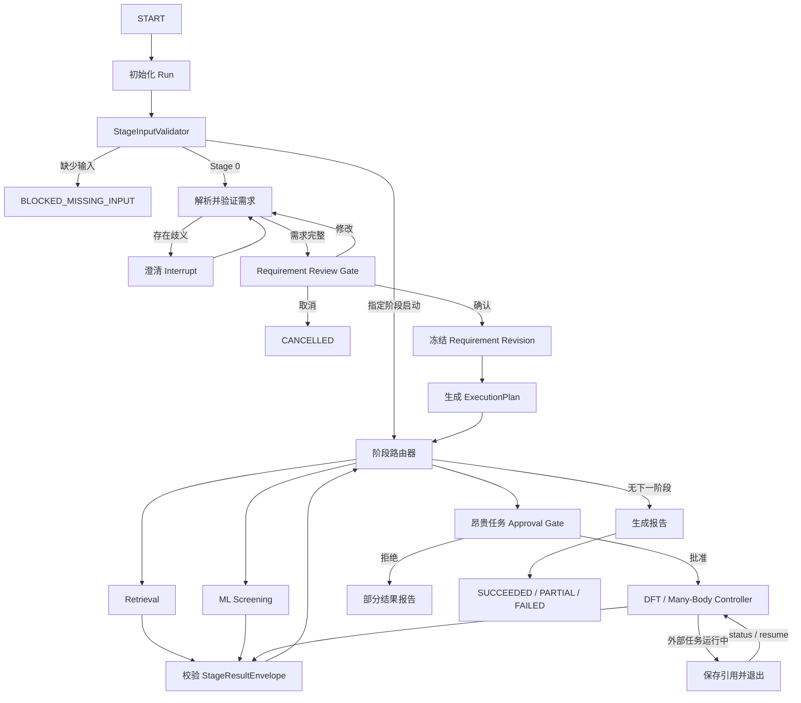

# 材料筛选 Agent：Orchestrator v1 实施计划

版本：v0.8
日期：2026-07-26
依据：[`docs/system-plan.md`](../../docs/system-plan.md)、[`docs/architecture.md`](../../docs/architecture.md)

## 开始开发前必读

- [README](../../README.md)：当前可运行能力、环境、CLI、测试和限制。
- [系统蓝图](../../docs/system-plan.md)：产品边界、证据等级、审批与安全原则。
- [技术架构](../../docs/architecture.md)：控制/执行/数据平面、状态真源、StageRunner、Artifact 和后端边界。
- [主计划](../master.md)：当前里程碑、跨 agent 依赖、阻塞项和验收状态。
- [原始系统总方案](../../docs/system-plan-original.md)：仅用于历史追溯，不作为当前接口依据。

### 模块职责与边界

- **职责：** 维护需求确认、阶段路由、审批、持久化、恢复、幂等、外部任务生命周期和汇总报告。
- **输入：** 已确认的 Requirement revision、显式阶段输入、Artifact URI/hash、版本化 policy 和 runner capability。
- **输出：** JSON 控制状态、ExecutionPlan/PreparedStagePlan 引用、StageExecutionRecord、审批/操作审计和通用报告。
- **不负责：** 检索、ML/DFT/多体科学计算、模型或方法参数选择、解析科学结果；不得把 fixture runner 注册为生产能力。
- **不可修改范围：** Agent 原生契约、科学阈值/模型/泛函/U/磁序/求解器、冻结 fixture、业务代码之外的其他 agent 计划。

涉及外部 DFT/多体后端时，遵循[技术架构的后端与 VASPilot 集成章节](../../docs/architecture.md#11-vaspilot-与未来后端集成)；仓库当前没有单独的 integration Markdown 文档。

### 当前下一步、依赖与阻塞

1. 以离线契约和四阶段安全回归持续验证 Agent02 条件生产 worker/P0.2 Fake Adapter、
   Agent03 v1 mock 和 Agent04 MVP mock 不破坏既有 `agent01-contract-v1` 与 P0.2 控制契约。
2. 在服务器阶段单独设计 Postgres checkpointer、后台 worker 和多用户权限迁移；每项都应有 schema/恢复测试和回滚边界。
3. Agent02 已在独立 worker 与安全 Gate 通过后实现显式配置下的条件生产注册；Agent03/04
   仍只有 mock，必须等真实 backend、科学验证和 Release Gate 后再评估生产注册。

当前服务器基础设施和 Agent03/04 生产 backend 尚未就绪，不能由 Orchestrator 代为实现或
伪造结果。Agent02 独立 worker 已提供，但未配置
`MATERIAL_AGENT_ML_WORKER_PYTHON` 时仍 fail closed，不是无条件默认能力。

完成每个控制面任务后，只更新本计划的实际状态、契约版本、测试证据、限制和依赖；公共契约变更须同步检查对应 agent plan、fixture、contract test 和 `docs/architecture.md`，不得在本计划复制科学实现细节。

### 当前任务：Hermes Gateway companion（2026-08-08）

用户已确认以 Hermes 统一后续 Agent/Skill/Tool 开发。首版 Gateway 只在
`OrchestratorRuntime` 公共生命周期和独立 `InspirationRunner` 之上增加协议适配，不修改
LangGraph 图、checkpoint schema、业务 SQLite migration、四阶段 `StageId`、Agent 原生契约
或科学 policy。

范围与验收：

- [x] 冻结 `materials-gateway-v1` 安全 DTO 和四个粗粒度 Tool；
- [x] Gateway 不直接读取 graph/repository/checkpointer，不开放任意 Artifact/path 或底层
  `run-stage`；
- [x] submission ID 绑定 canonical payload，重复调用幂等、冲突 fail closed；
- [x] `status/get` 严格只读，`act` 每次最多一次类型化状态转换；
- [x] Requirement 批准必须由独立 operator 进程签发绑定 request/interaction/manifest/action
  的一次性 grant；Hermes tool call 与 `confirmed_by_user=true` 本身不构成审批；
- [x] 对外报告在返回前同时校验保存的 URI/hash 与 canonical structured-result hash，大小
  受限并脱敏；
- [x] Hermes 与主项目使用独立环境，当前只支持单用户、单实例本机试点；
- [x] unit/contract/integration、真实 MCP stdio、重启恢复和非空 bundle smoke 已通过；
- [x] 完整离线、公共 Crossref live、依赖一致性、bundle verifier 和 MCP discovery Gate 通过；
- [x] 完成 Provider 设备授权后的 Hermes 自然语言 Agent turn；严格区分 Gateway 科学服务
  ledger 与 Hermes host provider usage，并保留提示 schema 调试证据。

详细 Hermes 与 Inspiration 里程碑见
[`material-screening-inspiration-plan.md`](material-screening-inspiration-plan.md)。

### Agent01 NOMAD 单来源兼容（2026-07-29）

- Orchestrator `run` 接受显式 `retrieval_source=materials_project|nomad`，默认仍为
  Materials Project；选择值写入初始 checkpoint 并在同一 Run 中保持不变；
- Runner factory 按选择构造 MP 或 NOMAD Adapter，同一 Run 不同时调用两个来源，
  fixture 只用于离线控制流且继续标记 mock；
- `Agent01RunnerAdapter` 接受 MP v1 或 NOMAD v2 原生结果，但仍只向
  `ControlStageOutcome(orchestrator-p0.2-v3)` 映射控制状态和 Artifact 引用，没有
  改变控制契约、SQLite migration、审批或路由顺序；
- 最终报告按实际来源声明 L1 retrieval evidence；缺失性质与
  `UNCERTAIN` 不由控制面改写。

### 本次 Stage 0 联网 LLM 接入范围（2026-07-29）

本任务只在现有 `RequirementParser` 边界内增加显式启用的
`LLMRequirementParser` 与 DeepSeek OpenAI-compatible Provider，不改变四阶段路由、
科学阈值、Agent 原生契约、checkpoint schema、业务数据库 migration 或证据规则。

冻结配置为：

- Provider：DeepSeek；
- Base URL：`https://api.deepseek.com`；
- Model ID：`deepseek-v4-pro`；
- API：非流式 OpenAI-compatible Chat Completions；
- 输出：JSON Output，之后强制经过 Pydantic `Requirement` 校验和人工
  `REQUIREMENT_CONFIRMATION`；
- 密钥：只允许进程环境变量或 macOS Keychain 延迟读取，不进入 prompt、日志、
  checkpoint、SQLite、Artifact 或错误消息；
- 默认行为：未显式配置 Provider 时继续使用 Offline Parser；显式配置错误、认证失败、
  非法/空 JSON 或 Schema 不匹配时 fail closed，不静默回退 Offline Parser 或其他模型。

本任务验收标准：

1. Provider transport、密钥来源、重试、响应大小、URL/model/config 校验和安全错误语义
   具有离线单元测试；
2. LLM 输出不能控制 `requirement_id`、revision、确认状态或 policy version，这些字段
   由本地代码覆盖并由 `Requirement` Schema 校验；
3. Orchestrator event 记录 provider、model、prompt version、请求/响应 hash、模式和
   token usage，但不记录 API key、原始 reasoning content 或未脱敏响应；
4. CLI/runtime 只通过显式环境配置启用联网 Parser，结构化 Requirement 输入仍走本地
   规范化路径；
5. 增加默认跳过的 `live_llm` Gate；完整离线 Gate 不访问网络或 Keychain；
6. README、主计划和本计划记录实际配置、运行方式、测试证据、限制与未完成项。

### Read-only Research Advisor companion（2026-08-04）

在不改动 `OrchestratorState`、checkpoint/SQLite schema、顶层图、runner 路由、审批和
Agent 原生契约的前提下，新增显式 `material-agent research-advice`。它只读取完成 Run 的
hash-verified Orchestrator report 与其中引用的 Agent01 retrieval report，生成版本化
evidence snapshot、候选缺口卡和本地 policy 固定的 action proposals。

- proposal 固定 `execution_allowed=false`，可包括“审阅证据缺口”“审阅阶段前提”“准备带分辨
  电子结构验证方案”“专家复核”；后者也只能提示走既有 DFT 输入冻结与审批 Gate，不会选择
  方法或提交任务，更不会写 artifact/checkpoint、修改需求或创建审批；
- 默认 deterministic advisor；显式启用 DeepSeek 时仅允许 LLM 为 snapshot 中已存在的
  action ID 生成解释。增加 action、科学数值/结论或未经证据支持的内容将被 Schema/本地
  验证拒绝；
- 测试覆盖 Artifact hash 复核、Agent01 缺口提取、动作不可执行、LLM 不能新增动作以及
  已完成 run 的 CLI 回归；既有 `run`、`resume`、`report` 行为保持不变。

### Stage 0 自然语言需求文件收口（2026-07-29）

本次任务只收口“用户自然语言 → 本地校验的 Requirement 草稿 → 现有人工确认
Gate → 不可变 `requirement.vN.json`”，不改变 Requirement 公共 Schema、四阶段路由、
checkpoint/SQLite schema、科学阈值或证据规则。

范围与依赖：

- 增加独立 `material-agent requirement parse` CLI，将自然语言解析为未确认的
  Requirement 草稿文件；该命令不能设置 `confirmed_by_user=true`，最终冻结仍必须
  进入现有 Orchestrator `REQUIREMENT_CONFIRMATION` Gate；
- 澄清交互在保留现有完整 Requirement/递归 `changes` JSON 的同时，允许显式
  `answer` 文本；Offline Parser 只合并其确定识别的约束，联网 Parser 输出继续经过
  本地 Schema、policy 和受控身份字段校验；
- 增加冻结的离线 Stage 0 回归集，逐 case 校验 Schema 与受支持硬约束翻译；
- 真实 DeepSeek `live_llm` Gate 依赖显式密钥、联网批准和可能的 API 成本，不以
  mock 或离线 Provider 代替发布证据；本次已在该边界下执行单请求发布验证。

验收标准：

1. parse CLI 输出严格 Requirement JSON、SHA-256、解析器版本和澄清问题，拒绝覆盖
   内容不同的既有文件；
2. 自然语言澄清不能控制 Requirement ID、revision、确认状态或 policy version，
   LLM 澄清调用只持久化安全审计元数据；
3. 离线冻结回归集的 Schema 校验与已声明硬约束翻译均为 100%；
4. unit、integration、E2E、完整离线 Gate、`pip check` 与 `git diff --check` 通过，
   README、主计划和本计划准确记录实际能力及未运行的联网 Gate。

实施结果：

- [x] `material-agent requirement parse` 输出严格、未确认且不可静默覆盖的 Requirement
  草稿，并报告 SHA-256、parser/version 和澄清问题；
- [x] `respond --text` 已接入 Offline/LLM Parser；受控身份字段由本地覆盖，LLM
  澄清事件只保存安全审计元数据；
- [x] `stage0-offline-regression-v1` 的 3 个中英文固定 case 均通过 Schema 与已声明
  硬约束逐字段校验；
- [x] Stage 0 专项为 `36 passed`；完整离线 Gate 为
  `411 passed, 9 skipped, 142 warnings`；
- [x] 真实 `live_llm` Gate 已通过：`1 passed in 26.56s`；联网 Provider 作为显式
  opt-in 能力发布，Offline Parser 仍为默认。

### Stage 0 多轮自然语言澄清（2026-07-29）

本次任务在现有 `CLARIFICATION` interrupt 内补齐多轮自然语言澄清，不改变
Requirement Schema、Orchestrator/checkpoint schema、SQLite migration、四阶段路由、
科学阈值或证据规则。

范围与验收标准：

- 每轮 `answer` 都通过当前 Offline/LLM Parser 重新解析，并基于上一轮 Requirement
  草稿保留未被明确修改的字段；
- Parser 仍返回 `clarification_questions` 时，Orchestrator 必须生成绑定新草稿 hash
  的新 `interaction_id`、保持 `CLARIFYING` 并再次暂停，不能提前进入 Review；
- 只有问题列表为空时才进入 `REQUIREMENT_CONFIRMATION`；`cancel`、完整 Requirement
  和递归 `changes` JSON 路径保持兼容；
- 每轮 LLM 调用继续只审计 provider/model/prompt/hash/token 元数据，旧 interaction
  重放或不同答案必须 fail closed；
- 测试覆盖至少两轮澄清、跨 runtime 恢复、CLI `respond --text`、事件数量与最终
  Requirement 字段累积；完整离线 Gate、`pip check` 和 `git diff --check` 通过。

实施结果：

- [x] 每轮未解决问题生成含递增 `round`、新草稿 hash 和新 `interaction_id` 的
  `CLARIFICATION`，Run 保持 `CLARIFYING`；
- [x] 问题清空后才进入 `REQUIREMENT_REVIEW`，旧 interaction 的相同响应幂等复用、
  不同响应 fail closed；
- [x] 每轮 LLM 只调用一次并写入独立安全审计事件，不因下一轮 checkpoint 恢复重放；
- [x] 两轮 Offline/LLM、跨 runtime、CLI E2E、无效回答重试和事件/字段累积测试通过；
  Stage 0 专项为 `38 passed`，完整离线 Gate 为
  `413 passed, 9 skipped, 142 warnings`。

## 0. 当前实施进度

当前状态：**Orchestrator P0.2 已完成：P0.1 发布基线为 `d681de8`，runner-owned
StagePlan 与动态审批桥接提交为 `701857c`；Agent02/03/04 的 Fake/mock 控制链均已
通过显式测试 registry 接入。Agent02 真实独立 worker 已在显式环境配置下条件注册；
无该配置时默认 production registry 仍只提供 Agent01 科学 Runner。Agent03/04 真实
backend 继续属于独立后续里程碑。**

已完成：

- [x] 锁定 `langgraph==1.2.9` 与 `langgraph-checkpoint-sqlite==3.1.0`；
- [x] 实现 JSON-only `OrchestratorState`、ExecutionPlan、交互和审批契约；
- [x] 实现 SQLite project/run/stage/approval/operation/event 业务状态层；
- [x] 实现确定性 Offline Parser，未知约束通过 clarification interrupt 补充；
- [x] 实现 Requirement review、不可变 revision 和审批后跨进程恢复；
- [x] 实现真实 `Stage 0 → Agent 01 → Envelope 校验 → Report` LangGraph；
- [x] 实现 project/run/status/respond/approve/resume/retry/cancel/report CLI；
- [x] 保持独立 `material-agent retrieval` 向后兼容；
- [x] 使用离线 Si/O fixture 完成跨 runtime checkpoint E2E；
- [x] 实现业务 schema v1→v2 migration、集中状态转换和项目级推进锁；
- [x] 实现四阶段 `StageRoute`、runner registry、Agent01 Adapter 和通用报告；
- [x] 实现显式 `run-stage`、输入阻塞及 capability unavailable 语义；
- [x] 实现昂贵任务审批、`WaitingExternal/reconcile/cancel` 和幂等冲突检测；
- [x] 实现 Parser Protocol、固定 Clock/IdFactory 和测试专用 fixture runner；
- [x] 冻结 `PreparedStagePlan(orchestrator-stage-plan-v2)`、阶段输入快照和 runner-owned native plan；
- [x] 实现 capability 审批下限与 runner 动态审批的 OR 合并规则；
- [x] 实现真实阶段计划引用、计划/输入篡改防护及 P0.1 checkpoint 兼容策略；
- [x] 历史 P0 收口快照为 `325 passed, 2 skipped`，P2 v1 收尾快照为
  `337 passed, 7 skipped`；当前 P3 工作树完整离线 Gate 为
  `668 passed, 13 skipped, 362 warnings`。

P2 系统 v1 收尾（2026-07-28）复核确认：Agent01 是默认生产科学 runner；Agent02
仅在校验通过的 `MATERIAL_AGENT_ML_WORKER_PYTHON` 下注册，当前 L2 审计限于 3D
单质 Si；Agent03/04 仅为 mock 控制链且默认不可用。P2 v1 收尾时完整离线 Gate 为
`337 passed, 7 skipped`；Stage 0 收口快照为
`413 passed, 9 skipped, 142 warnings`。真实 `live_llm` 单请求 Gate 已通过；未运行
live MP 或接触 `MP_API_KEY`。本次未修改
公共契约、checkpoint/schema、数据库迁移、依赖或科学阈值。

剩余工作：

- [x] 完成第 7 节定义的 `Orchestrator P0.1a` 通用同步控制面；
- [x] 完成 `Orchestrator P0.1b` 审批与外部任务生命周期；
- [x] 抽象可替换 Parser Protocol，Offline Parser 继续作为默认实现；
- [x] 增加 Agent 02–04 capability 骨架和测试专用 fixture runner；
- [x] Orchestrator 真实 MP 人工 opt-in 发布 Gate 已通过；
- [x] 按第 8.2 节形成真实、可审阅的 P0.1 代码/测试提交与文档提交；
- [x] 完成第 8.3 节的 `orchestrator-p0.2-v3` runner-owned `StagePlan` 与动态审批桥接；
- [ ] 在后续服务器阶段迁移 Postgres checkpointer、后台 worker 和多用户权限。

## 1. 目标与完成标准

编排器采用 LangGraph `StateGraph`，负责需求确认、阶段路由、人工审批、状态持久化、失败恢复和报告汇总，不承载具体科学计算。

首版范围：

- 真实实现 Stage 0 → Materials Project 检索 → 报告的 P0 链路。
- 建立 ML、DFT、多体阶段的完整路由和统一接口；fixture/mock 仅用于测试，生产未注册能力显式标记为不可用。
- 采用单项目串行、命令式运行；执行到澄清、审批或外部任务等待点后退出。
- 通过 `status`、`respond`、`approve`、`resume` 恢复，不运行后台 worker。
- 同一操作重复执行不得重复提交任务、候选或审批记录。

验收主链路：

> 创建项目 → 提交需求 → 澄清 → 确认需求 → 自动规划 → 检索 → 筛选 → 报告 → 中断后恢复

## 2. 编排模型

### 2.1 顶层状态图



具体节点拆分为：

- `initialize_run`：创建 `run_id`，绑定项目、起始阶段和配置快照。
- `validate_entry_input`：检查目标阶段最低输入，禁止伪造上游结果。
- `parse_requirement`、`validate_requirement`：调用离线 Parser 或 LLM Provider，输出结构化草稿。
- `clarification_gate`：以 LangGraph `interrupt()` 暂停并等待结构化回答。
- `requirement_review_gate`：支持 `approve`、`revise`、`cancel`。
- `freeze_requirement`：生成不可变 requirement revision 和内容 hash。
- `build_execution_plan`：确定性生成阶段列表、理由、前置条件和 Gate。
- `route_next_stage`：依据预算、证据缺口、能力注册表和当前结果路由。
- `prepare_stage`、`execute_stage`、`reconcile_stage`、`validate_stage_result`。
- `generate_report`、`finalize_run`。

v1 使用单个顶层图和 `StageRunner` 服务，不引入嵌套子图；候选级并发由阶段内部控制，顶层图保持串行。

### 2.2 路由规则

- 从 Stage 0 启动时，需求确认后必须执行 Retrieval。
- ML 仅在 `allow_ml=true`、存在可处理的证据缺口且模型适用时进入。
- DFT/多体仅在预算允许、输入完整且对应方法能提升目标证据等级时进入。
- `allow_ml/allow_dft/allow_many_body` 只表示用户授权上限，不表示对应阶段必须执行。
- DFT、Many-Body、超预算 ML 和高级方法必须进入审批 Gate。
- LLM 只能帮助解析和解释；阶段选择由版本化 routing policy 决定。
- 未选择的阶段不创建 `stage_run`；审批被拒绝的阶段记为 `CANCELLED`，已有结果保留，顶层运行以 `PARTIAL` 结束。
- “检索结果为空”属于成功执行的科学结果，Retrieval 和 Run 均可为 `SUCCEEDED`，不能标记为工具失败。
- 从任意阶段启动时，只使用已存在且 hash 匹配的 artifact；输入不足时阶段为 `BLOCKED_MISSING_INPUT`、Run 为 `PAUSED`。

## 3. 状态、接口与持久化

### 3.1 核心状态契约

`OrchestratorState` 只保存 JSON 可序列化的小型状态：

- `schema_version`
- `project_id`、`run_id`、`thread_id`
- `requested_start_stage`
- `run_status`、`current_stage`
- `requirement_revision`、`requirement_artifact_uri`
- `execution_plan_uri`、`execution_plan_hash`
- `stage_statuses`
- `candidate_ids`
- `stage_result_uris`
- `external_job_refs`
- `pending_interaction`
- `retry_counters`
- `warnings`、结构化 `errors`
- `created_at`、`updated_at`

CIF、API 响应、候选清单、报告和计算输出只存 Artifact Store，图状态只引用 URI/hash。

新增公共契约：

- `StageId`：控制面名称 `retrieval | ml | dft | many_body`，并保存与 `agent01`–`agent04` 的稳定映射。
- `StageCapability`：runner 注册状态、mock 标记、所需输入、审批要求和是否可能返回外部任务。
- `StageRoute`：阶段、`required`、`disposition`、选择/跳过原因、前置 artifact、Gate 和 capability snapshot。
- `ExecutionPlan`：有序 `StageRoute`、所需证据、预算、routing policy version 和输入快照 hash。
- `StageInputValidation`：`valid`、缺失字段、补充方式和 artifact hash。
- `StagePlan`：精确输入快照、参数、资源估计和审批要求。
- `ControlStageOutcome`：Orchestrator 自有控制结果，状态为 `Completed`、`WaitingExternal`、`Blocked`、`Failed`，只保存原生结果 URI/hash、operation/external job 引用和控制面错误。
- `StageExecutionRecord`：attempt、operation key、plan/result URI 与 hash、状态和错误。
- `ExternalJobRecord`：backend、external ref、最后观察状态、本地单调 observation sequence、提交 operation key 和更新时间。
- `PendingInteraction`：澄清或审批的类型、ID、展示内容和输入 Schema。
- `ApprovalRecord`：Gate、输入快照 hash、决定、操作者、时间和理由。
- `OperationRecord`：幂等键、尝试次数、状态、结果引用。
- `ErrorRecord`：错误类别、是否可重试、阶段、操作、公开消息和内部诊断。

Orchestrator 控制契约与各 Agent 原生结果契约分离。`agent01-contract-v1` 保持不变，`Agent01RunnerAdapter` 负责验证 Agent01 原生 `StageResultEnvelope`，再映射为 `ControlStageOutcome`。Agent02–04 后续各自拥有版本化的原生结果 Envelope，不得依赖 `material_agent.retrieval.models` 作为通用控制契约。

所有阶段 Adapter 实现统一 `StageRunner`：

- `validate_input(context) -> StageInputValidation`
- `prepare(context) -> StagePlan`
- `start(plan, idempotency_key) -> ControlStageOutcome`
- `reconcile(external_job_ref) -> ControlStageOutcome`

可能产生外部任务的 Adapter 额外实现：

- `cancel(external_job_ref, idempotency_key) -> CancelOutcome`

完成结果必须先通过对应 Agent 的原生 Envelope 校验，再由 Adapter 映射到控制面。fixture/mock 必须显式 `is_mock=true`；其执行不得把候选证据提升为真实 L2/L3/L4。

### 3.2 状态真源

- LangGraph checkpoint：控制流当前位置和可恢复图状态的真源。
- SQLite 业务表：project、run、stage run、approval、operation、external job 的查询与审计真源。
- Artifact Store：文件内容真源。
- 外部 backend：已提交外部任务状态真源。

`thread_id` 固定等于 `run_id`。一个 Project 可以有多个 Run，但 v1 同一时刻只允许一个 CLI 调用推进该 Project 下的任意 Run，使用项目级非阻塞文件锁；服务器阶段再放宽为每 Run 串行。

使用同步 `SqliteSaver`，并将 LangGraph 框架表与业务表放在同一 SQLite 文件的不同表中；禁止业务代码直接修改 checkpoint 表。官方将 `SqliteSaver` 定位为轻量同步本地场景，符合该 Mac MVP；服务器迁移时替换为 Postgres checkpointer。[LangGraph Checkpoint 文档](https://reference.langchain.com/python/langgraph/checkpoints)

checkpoint 使用严格 msgpack 白名单，状态中禁止对象、密钥、DataFrame 和 pickle fallback。

`status` 永远只读取 checkpoint、业务表和 artifact 索引，不调用 backend、不提交或取消任务。只有 `resume` 才允许调用 `reconcile` 推进外部任务状态。

### 3.3 审批与恢复

- 先由 `prepare_*_approval` 幂等创建审批记录，再进入只负责 `interrupt()` 的 Gate 节点。
- 审批 payload 必须包含 `approval_id`、Gate 类型、输入快照 URI/hash、资源估计和 policy version。
- `approve` 只接受当前仍为 PENDING 且快照 hash 一致的审批；过期审批不得复用。
- Requirement 修改生成新 revision、新 ExecutionPlan 和新审批，历史记录不覆盖。
- `resume` 必须使用原 `run_id/thread_id`；节点中的外部副作用全部放在 interrupt 之后或拆成独立幂等节点。
- LangGraph 恢复时会从发生 interrupt 的节点开头重新执行，因此所有写操作和 backend submit 都必须使用确定性幂等键。[LangGraph Interrupts](https://docs.langchain.com/oss/python/langgraph/interrupts)

幂等键格式：

```text
<project_id>:<run_id>:<stage>:<operation>:<input_snapshot_hash>
```

Artifact 使用临时文件写入、SHA-256 校验和原子 rename；SQLite 对幂等键加唯一约束。

### 3.4 错误与重试

错误分类：

- `TRANSIENT_EXTERNAL`：超时、429、临时 5xx，可自动重试。
- `INVALID_RESPONSE`：非法 JSON、Envelope 不合规；允许一次修复，不能静默换 Provider。
- `MISSING_INPUT`：进入 `BLOCKED_MISSING_INPUT`。
- `NOT_APPLICABLE`：生成证据缺口说明，不视为失败。
- `SCIENTIFIC_NO_MATCH`：正常成功结果。
- `PERMANENT_CONFIGURATION`：凭据、路径、Schema 或不支持的参数错误。
- `BACKEND_INCONSISTENT`：本地与 backend 状态矛盾，停止推进并要求检查。
- `APPROVAL_DECLINED`：阶段取消，保留已有结果。

默认瞬时错误最多执行三次，指数退避并带 jitter；耗尽后阶段为 `RETRYABLE_FAILED`、Run 为 `PAUSED`。确定性错误不自动重试。P0 必需阶段永久失败时 Run 为 `FAILED`；可选后续阶段失败但已有有效结果时生成 `PARTIAL` 报告。

## 4. CLI 与实施顺序

CLI 固定为：

```bash
material-agent project create
material-agent run --project <id> --source <source-id> --request "..."
material-agent run-stage <retrieval|ml|dft|many_body> --project <id> --input <stage-input.json> [--run-id <id>]
material-agent status --project <id> --run <id>
material-agent respond --project <id> --run <id> --interaction <id> --json <payload>
material-agent approve --project <id> --run <id> --approval <id> --decision <approve|reject> [--reason "..."]
material-agent resume --project <id> --run <id>
material-agent retry --project <id> --run <id>
material-agent cancel --project <id> --run <id>
material-agent report --project <id> --run <id>
```

`run-stage` 创建新的 Run。`stage-input.json` 必须包含来源 Run、Requirement revision，以及所有前置 artifact 的逻辑 URI 和 SHA-256；不得通过“取最新 artifact”隐式选择输入。ML、DFT 或 many-body 输入不完整时创建可审计 Run，并以 `BLOCKED_MISSING_INPUT`/`PAUSED` 返回缺失字段和补充方式。

实施分四步：

1. 建立 Pydantic 契约、状态枚举、SQLite 业务表、Artifact Store 和 LangGraph checkpointer。
2. 实现 Requirement 节点、澄清/确认 interrupt、不可变 revision、ExecutionPlan 和确定性路由。
3. 接入 Retrieval 真实执行链，并完成 Envelope 校验、错误分类、幂等 operation ledger 和报告。
4. 接入 ML/DFT/Many-Body capability descriptor 与测试专用 fixture runner，完成昂贵任务审批、外部状态 reconcile 和 CLI 恢复。

## 5. 测试与验收

必须覆盖：

- 状态转换表和 routing policy 的纯函数单元测试。
- Requirement approve、revise、cancel，以及旧审批 hash 失效。
- 固定 Si/O 用例从输入到候选报告的离线 E2E；真实 MP 测试作为需 API key 的可选集成测试。
- 在澄清、审批、Retrieval 完成后和外部任务运行中强制终止进程，再由新进程恢复。
- 重复执行 `run`、`approve`、`resume`、backend `submit` 不产生重复记录或任务。
- 从 ML/DFT/多体直接启动时，准确返回缺失字段和补充方式。
- 审批拒绝后阶段为 `CANCELLED`、Run 为 `PARTIAL`，已有 artifact 仍可报告。
- API 超时、限流、非法 LLM JSON、CIF 失败、Envelope 错误、checkpoint 损坏和 backend 状态倒退。
- 零候选为成功；部分候选失败为 `PARTIAL`；mock 永远不能生成真实 L3/L4 证据。
- secret 脱敏、路径越界拒绝、Artifact hash 校验和审批/event 审计完整性。

最终验收要求：

- 同一个 `run_id` 在跨进程恢复后得到完全相同的 requirement、candidate ID、artifact hash 和外部任务引用；
- 跨全新临时目录的基线比较，对 candidate manifest 和规范化科学 payload 做字节级比较，对排除时间、Project/Run ID 后的报告做语义比较；
- 若测试需要冻结完整 report hash，必须注入固定 `Clock` 与 `IdFactory`，不能删除真实运行所需的时间 provenance；
- 所有阶段状态、审批、错误与证据等级均可追溯。

## 6. 已确认假设

- 首版采用“完整四阶段骨架 + P0 真实实现”。
- 默认由版本化政策自动路由，不要求用户逐阶段选择。
- 编排器无后台 worker；长任务通过 `status/resume` 显式对账。
- `status` 只读，`resume` 才执行 backend reconcile。
- 有限自动重试，仅处理明确的瞬时错误。
- 拒绝昂贵阶段不会取消已有工作，而是输出部分报告。
- Python 3.11、Pydantic v2、LangGraph 1.x 和兼容的 SQLite checkpoint 包统一锁定版本。
- 当前仅支持单用户、单项目串行调用；服务器阶段再迁移 PostgreSQL、任务队列和多用户权限。
- P0.1 只建立 Parser Protocol，不以真实联网 LLM Provider 阻塞 Agent02。

## 7. Orchestrator P0.1a/P0.1b 实施规划与结果

### 7.1 实施背景与当前结论

本节记录从 Orchestrator P0 继续推进 P0.1a/P0.1b 的实施依据和执行结果。P0.1a/P0.1b 的代码与技术门禁已经完成；初始混合工作区随后已整理为可审阅提交，第 8 节定义的窄契约桥接也已完成。

实施依据：

- Agent01 的 `agent01-contract-v1`、离线冻结 fixture 和真实 Materials Project release Gate 已完成，足以作为稳定上游；
- P0 阶段虽然已跑通真实 `Requirement → Agent01 → Report`，但 `ExecutionPlan.stages`、执行节点、重试和报告仍是 Agent01 专用实现；
- P0 阶段尚无 Agent02–04 的统一 runner 注册、输入阻塞、昂贵任务审批和 `WaitingExternal/reconcile` 控制流，直接接入 Agent02 会复制 Agent01 专用分支；
- P0.1a/P0.1b 已补齐上述公共控制能力，并已通过编排器自身的真实 MP 人工 opt-in 发布门禁。

为降低一次性重构风险，本阶段拆分为：

- `Orchestrator P0.1a`：公共控制契约、schema migration、runner registry、通用同步路由、`run-stage` 和 Agent01 Adapter；
- `Orchestrator P0.1b`：昂贵任务审批、外部任务 `WaitingExternal/reconcile/cancel`、不一致检测和发布门禁。

P0.1a 和 P0.1b 的技术退出门禁已经通过，发布基线已形成代码提交 `d681de8` 和独立文档提交。第 8 节契约桥接现已完成，主线切换到 `material-screening-ml-agent-plan.md` 实现 Agent02；除非集成暴露 `agent01-contract-v1` 缺陷，否则不开展 Agent01 P1。

### 7.2 实施前差距与当前处理结果

- [x] `ExecutionPlan.stages` 已升级为四阶段 `StageRoute`，可以表达 required/optional、disposition、跳过原因、输入要求和 Gate；
- [x] LangGraph 已使用 `route_next_stage`、通用 execute/reconcile 和统一结果验证路径，移除 Agent01 专用控制分支；
- [x] 生产 registry 默认注册 Agent01 runner；Agent02 由显式且校验通过的 worker 配置
  条件注册，Agent03/04 提供 capability descriptor 和明确的 unavailable 原因，fixture
  runner 仅用于测试；
- [x] 已实现绑定不可变 plan/input snapshot 的 `EXPENSIVE_BATCH_APPROVAL`；
- [x] 已实现 `WaitingExternal`、external job 业务记录及 `reconcile/cancel` 生命周期；
- [x] 测试已覆盖外部任务状态倒退、重复提交、Artifact/SQLite/checkpoint 不一致和跨阶段路由；
- [x] Offline Parser 已置于可替换的 Parser Protocol 后，继续作为 P0.1 默认实现；
- [x] checkpoint schema 已升级为 `orchestrator-p0.1-v2`，旧版未完成 checkpoint 保持只读并拒绝不安全恢复；
- [x] 推进锁已调整为 Project 粒度，满足同一 Project 串行推进约束；
- [x] 报告和 StageOutcome 控制状态已收敛为引用、URI/hash 和小型摘要。

### 7.3 规划与执行顺序

以下步骤定义并指导了本轮实施。代码和验证步骤已完成；尚未完成的发布基线和契约桥接由第 7.4、7.5 节与第 8 节继续跟踪。

#### Step 0：冻结当前 P0 基线

1. 审阅当前 Orchestrator 未提交变更，确认没有把运行产物、缓存或密钥纳入版本控制；
2. 再次执行默认测试与 `pip check`，记录准确的收集数、通过数和唯一跳过原因；
3. 原计划将 `Stage 0 → Agent01 → Report` 作为独立中间提交；由于该中间状态从未形成 Git 快照，后续不事后重建或伪造这一历史，而以通过全部门禁的 P0.1 作为首个 Orchestrator 发布基线；
4. 保存一套确定性的 Orchestrator P0 fixture 和关键 artifact hash，作为重构前后等价性基准；
5. 为需要字节级冻结的测试注入固定 `Clock` 与 `IdFactory`，生产路径继续保存真实时间。

退出条件：

- 同一 Run 的中断恢复得到完全相同的 Requirement、candidate ID、StageResult 和 artifact hash；
- 跨全新临时目录时，candidate manifest 和规范化科学 payload 字节级相同；
- 报告在排除时间、Project/Run ID 后语义相同；
- 只有使用固定 `Clock` 与 `IdFactory` 的冻结测试才要求完整 report hash 相同。

#### Step 1（P0.1a）：先建立 migration、兼容策略和公共控制契约

先完成基础设施决策：

- 为业务 SQLite 增加显式 `schema_version` 和从当前 P0 schema 到 P0.1 的 migration；migration 不得修改 LangGraph 自有表；
- 集中定义 Run、Stage、Approval、Operation 和 ExternalJob 的允许状态转换，图节点只能通过该转换器更新状态；
- 未完成的 `orchestrator-p0-v1` checkpoint 在 P0.1 中显式拒绝恢复，并返回迁移说明；已完成 Run 的历史报告和 artifact 仍可读取；
- 将锁粒度改为 Project 级非阻塞推进锁，继续保持 `thread_id == run_id`。

随后新增或扩展 JSON-only Pydantic 契约：

- `StageId = retrieval | ml | dft | many_body`，同时保存与 `agent01`–`agent04` 的稳定映射；
- `StageCapability`：runner 是否注册、是否 mock、所需输入、是否需要审批、是否可能返回外部任务；
- `StageRoute`：阶段、`required`、`disposition=SELECTED|SKIPPED|BLOCKED|UNAVAILABLE`、选择/跳过理由、前置 artifact、Gate 和 capability snapshot；
- `ExecutionPlan`：由单一 Agent01 列表扩展为四阶段有序 `StageRoute`，保存 routing policy version 和输入快照 hash；
- `ExternalJobRecord`：backend、external job ref、最后观察状态、状态序号、提交 operation key 和更新时间；
- 通用 `StageExecutionRecord`：attempt、operation key、plan/result URI 与 hash、状态和错误；
- Orchestrator 自有 `ControlStageOutcome`：只保存控制状态、原生 result URI/hash、operation/external job 引用和控制面错误；
- Parser protocol：`parse`、`normalize_structured`、`apply_response`；Offline Parser 继续作为默认实现。

约束：

- 不修改 `agent01-contract-v1`；通过 `Agent01RunnerAdapter` 接入通用控制面；
- 各 Agent 保有自己的版本化原生结果 Envelope，Orchestrator Adapter 先校验原生结果，再映射为 `ControlStageOutcome`；
- `allow_*` 只表示用户授权上限；是否选择阶段还必须同时满足证据目标、证据缺口、输入和 capability；
- fixture/mock 必须显式 `is_mock=true`，不得产生真实 L2/L3/L4 证据；
- checkpoint 仍只保存 JSON 小对象和 URI/hash；
- 完整原生 StageOutcome、metrics 和错误详情写入 Artifact Store，checkpoint 只保存引用和汇总字段。

退出条件：migration、状态转换、契约 JSON Schema、序列化往返、未知字段拒绝、旧 checkpoint 显式拒绝、项目锁和 mock 证据降级测试全部通过。

#### Step 2（P0.1a）：将图重构为通用同步阶段控制面

按以下职责拆分现有 Agent01 专用节点：

```text
build_execution_plan
  → route_next_stage
  → validate_stage_input
  → prepare_stage
  → prepare_stage_approval（按需）
  → execute_or_reconcile_stage
  → validate_stage_result
  → record_stage_outcome
  → route_next_stage / generate_report
```

实现决定：

- 使用 `StageRunnerRegistry` 按 `StageId` 注入 runner，不在图节点中直接构造具体科学 backend；
- Agent01 先通过 adapter 迁移到通用路径，迁移前后候选和报告语义必须一致；
- 生产注册表在 Agent02–04 尚未实现时不注册科学 runner，只提供 capability descriptor；路由结果必须明确为 `UNAVAILABLE` 或 `BLOCKED`，不生成伪科学结果；
- 单元/集成测试使用确定性 `FixtureStageRunner` 验证四阶段路由和生命周期；
- `ExecutionPlan` 始终包含四阶段 `StageRoute`；未被选择的阶段也保存明确 disposition 和理由；
- required 阶段永久失败使 Run 为 `FAILED`；optional 阶段失败、拒绝或不可用且已有有效结果时为 `PARTIAL`；仅授权但未被证据目标选中的阶段为 `SKIPPED`，不降低 Run 状态；
- 增加 `run-stage` 入口校验：命令创建新 Run，必须传入 `stage-input.json`，其中包含来源 Run、Requirement revision、前置 artifact URI/hash；禁止隐式读取“最新”结果；
- 从 ML、DFT 或 many-body 直接启动时，输入缺失为 `BLOCKED_MISSING_INPUT`/`PAUSED`，capability 未注册为 `CAPABILITY_UNAVAILABLE`，并返回补充方式；
- 通用报告遍历 ExecutionPlan 和 stage outcome 汇总，不再硬编码 `stages.agent01`。

退出条件：现有 Agent01 E2E 无回归，同一套图可以用 fixture runner 执行、跳过、阻塞和汇总任意同步阶段，`run-stage` 输入不存在任何隐式选择。

#### Step 3（P0.1b）：实现昂贵任务 Gate 与外部任务契约

审批流程：

- 新增 `EXPENSIVE_BATCH_APPROVAL`，payload 必须包含 stage、plan URI/hash、输入快照 hash、资源估算、policy version 和风险说明；
- 审批 ID 由 run、stage、plan hash 和 Gate 类型确定性生成；
- 只接受当前 `PENDING` 且 snapshot hash 一致的审批；旧审批、重复冲突决定和修改后的 plan 必须被拒绝；
- 拒绝可选昂贵阶段时，该阶段为 `CANCELLED`，已有有效结果保留，Run 生成 `PARTIAL` 报告。

外部任务流程：

- `start` 返回 `WaitingExternal` 时，先持久化 operation 和 external job ref，然后当前 CLI 正常退出；
- `WaitingExternal` 对应 Stage 保持 `RUNNING`，Run 为 `PAUSED`；不能新增含义重叠的 StageStatus；
- `status` 只读取本地状态，不隐式重复提交；
- `resume` 使用原 operation key 调用 `reconcile`，仍运行则继续保持等待，完成后才进入 Envelope 校验和下一阶段；
- backend 状态倒退、同一 operation 出现不同 external ref、完成结果 hash 改变时，标记 `BACKEND_INCONSISTENT` 并停止推进；
- 可能产生外部任务的 Adapter 必须实现 `cancel(external_job_ref, idempotency_key) -> CancelOutcome`；
- `cancel` 只通过 runner/backend 契约取消已知 external job，不以本地状态覆盖 backend 真源；用户显式调用 cancel 即为取消授权，不再增加第二个人工 Gate；
- 使用 mock DFT 或 many-body runner 覆盖 `RUNNING → SUCCEEDED/FAILED/CANCELLED/TIMEOUT`，但不输出任何虚构科研数值。

退出条件：在提交后强制关闭 runtime，由新进程恢复时不重复 submit，且 external job ref、operation key 和最终 artifact hash 保持一致。

#### Step 4（P0.1b）：补齐幂等、恢复和不一致防线

- 使用 Step 1 的 migration 增加 external job/attempt 记录，不在本步骤临时修改无版本 schema；
- 所有状态更新通过 Step 1 的集中转换器，禁止终态倒退；
- 在推进节点前后校验 checkpoint、业务表和 Artifact Store 的 run ID、revision、URI 与 hash；
- 重复 `respond`、`approve`、`resume`、`retry`、`cancel` 和 backend `submit` 必须返回既有结果或明确冲突，不产生第二条副作用；
- 保持 `thread_id == run_id` 和同一 Project 的跨进程非阻塞文件锁；
- 对缺失/损坏 artifact、checkpoint 损坏、SQLite 与 checkpoint 状态分歧返回可审计错误，不自动重建或覆盖真源；
- event 写入继续使用确定性 event key，并验证同 key 不得对应不同 payload。

退出条件：失败注入测试证明每个可恢复点最多产生一次外部副作用，所有不一致均停止推进且保留诊断记录。

#### Step 5：执行 P0.1 发布测试矩阵

默认离线 Gate：

- 当前全仓测试全部继续通过；
- 固定 Si/O 用例完成 `Requirement review → Agent01 → Report`，并在澄清、审批后、Agent01 完成后分别跨进程恢复；
- Agent02–04 的直接启动分别验证 `BLOCKED_MISSING_INPUT`、capability unavailable 和补充方式；
- fixture runner 验证四阶段路由、阶段跳过、昂贵审批拒绝后的 `PARTIAL`、外部任务恢复及无重复提交；
- 验证零候选为 `SUCCEEDED`，可选阶段失败为 `PARTIAL`，必需阶段永久失败为 `FAILED`；
- 验证旧审批、错误 interaction ID、路径越界、hash 篡改、非法 Envelope、状态倒退和锁冲突；
- 扫描 checkpoint、SQLite、artifact、报告和日志，确认不含 `MP_API_KEY`。

真实 MP 人工 opt-in、但正式发布前必跑的 Gate：

1. 只从进程环境读取 `MP_API_KEY`；
2. 使用固定 Si/O Requirement 创建全新 Project/Run；
3. 在 Requirement approval 前关闭进程，再由新 runtime 审批并执行真实 Agent01；
4. 验证 Orchestrator report、Agent01 StageResult、candidate manifest 和全部 hash；
5. 对同一 Run 再次 `resume`，确认不重复查询 Materials Project；
6. 记录数据库版本、候选数、operation 数、checkpoint 数和密钥泄漏扫描结果；
7. 测试产物只保留在隔离临时目录，Gate 结束后不写入仓库。

#### Step 6：文档、提交与切换主线

- 更新 README 的四阶段状态图、`run-stage`、审批、外部任务恢复和真实 MP Gate 命令；
- 回写本节 checklist 的实际测试数字、契约版本、已知限制和提交 ID；
- 将当前 P0.1a/P0.1b 代码、依赖和测试形成一个可复现的发布基线提交，再将 README 与 plan 形成独立文档提交；不事后制造不存在的中间实现历史；
- 在下方技术门禁、发布提交以及第 8 节 Agent02 契约桥接全部满足后，下一步切换到 `material-screening-ml-agent-plan.md`，开始 Agent02 科学实现；
- 届时 Agent02 只实现 ML 阶段自己的输入验证、CHGNet runner 和结果契约，不再修改 Orchestrator 的通用控制流。

### 7.4 P0.1a/P0.1b 退出门禁

#### P0.1a：通用同步控制面

- [x] 已确认不事后重建不存在的 P0 中间提交；当前通过门禁的 P0.1 将作为首个 Orchestrator 可复现基线；
- [x] 业务 schema migration、状态转换矩阵、旧 checkpoint 拒绝策略和项目级锁已通过测试；
- [x] Orchestrator 自有控制契约与各 Agent 原生结果契约完全分离；
- [x] Agent01 已通过通用 StageRunner Adapter 路径，离线科学输出与基线等价；
- [x] ExecutionPlan、runner registry、通用路由、输入阻塞和报告汇总不再硬编码 Agent01；
- [x] 四阶段 StageRoute 均包含 required、disposition、理由、输入和 capability snapshot；
- [x] `allow_*` 被验证为授权上限，而非强制执行信号；
- [x] `run-stage` 使用显式 stage-input，不读取隐式“最新” artifact；
- [x] Agent02–04 只有 capability descriptor 和测试专用 fixture runner，生产环境不会伪造后续科学结果；
- [x] 默认离线测试、`pip check` 和 path/hash 安全测试通过；
- [x] P0.1a/P0.1b 的代码、依赖和测试共同形成可回退的 P0.1 发布基线提交 `d681de8`。

#### P0.1b：审批与外部任务生命周期

- [x] 昂贵任务审批绑定不可变 plan/input snapshot，旧审批不可复用；
- [x] `WaitingExternal` 使用 Stage `RUNNING` + Run `PAUSED`，`status` 保持只读；
- [x] `start/reconcile/cancel` 跨进程恢复不重复提交或取消；
- [x] checkpoint、SQLite、Artifact 不一致和 backend 状态倒退会停止推进；
- [x] mock 外部任务覆盖成功、失败、取消和超时，且不产生虚构科学数值；
- [x] 默认离线测试、`pip check` 和 secret/path/hash 安全测试通过；
- [x] Orchestrator 真实 MP 人工 opt-in release Gate 通过，且仓库中不保留真实运行产物；
- [x] README、本计划的实际进度、契约版本和测试数字同步完成；
- [x] README 与 plan 的发布记录形成独立文档提交。

P0.1a、P0.1b 和 P0.2 的技术门禁与发布提交均已完成。Orchestrator 本地 MVP 控制流冻结，正式切换到 Agent02 科学实现。

### 7.5 实施结果（2026-07-26）

- Orchestrator 控制契约升级为 `orchestrator-p0.1-v2`，报告契约升级为 `orchestrator-report-p0.1-v2`；
- 业务 SQLite schema 升级为 version 2；legacy version 1 自动迁移，但不修改 LangGraph 自有表；
- 未完成的 `orchestrator-p0-v1` checkpoint 保持只读并拒绝 P0.1 恢复；
- 默认生产 registry 注册 Agent01；Agent02 仅在显式 worker 配置通过校验后注册，Agent03/04
  仍仅提供 unavailable capability snapshot；
- 离线测试收集 `118` 项，其中 `116 passed`，两个 `live_mp` Gate 因未显式启用而 skipped；
- `pip check` 返回 `No broken requirements found`，`git diff --check` 通过；
- Agent01 独立真实 MP Gate 与 Orchestrator restart Gate 均已通过：`2 passed`，耗时 `58.61s`；
- P0.1 代码、依赖和测试已形成发布基线提交 `d681de8`；该提交从全新临时目录安装后仍为 `116 passed, 2 skipped`，`pip check` 通过；
- README、Agent01 plan 与本计划作为独立文档提交，不事后制造不存在的 P0/P0.1a/P0.1b 中间历史。

### 7.6 本里程碑明确不做

- 不实施 Agent01 的 cursor checkpoint、StructureMatcher 性能优化等 P1 项；
- 不在本里程碑真实运行 CHGNet、DFT 或多体求解器；
- 不接入真实 DFT/Slurm/VASP 或 many-body 外部 backend；
- 不允许 LLM 决定阶段路由、科学阈值、预算或审批；
- 只建立可替换 Parser provider 接口，不把联网 LLM Provider 作为切换 Agent02 的阻塞项；
- 不迁移 PostgreSQL，不增加后台 worker、Web API 或多用户权限。

## 8. 已完成：P0.1 发布冻结与 Orchestrator P0.2 契约桥接

### 8.1 重扫后的决策

Orchestrator P0.1 的通用路由、恢复、审批、外部任务和真实 MP 技术门禁完成后，本节只完成了两项收尾工作：

1. 将当前未提交实现冻结为真实、可审阅、可回退的 P0.1 发布基线；
2. 以 Orchestrator P0.2 补齐 Agent02 接入暴露出的通用 `StagePlan` 与动态审批缺口。

完成后，主线必须切换到 `material-screening-ml-agent-plan.md`。Agent01 P1、联网 LLM Provider、Postgres、后台 worker、DFT 和多体 backend 均不属于本阶段。

### 8.2 Step 1：形成真实的 P0.1 发布基线

实施前 Git `HEAD` 位于 Agent01 release Gate，Orchestrator 的 P0、P0.1a 和 P0.1b 没有各自独立的历史快照。现已按真实历史将完整 P0.1 冻结为发布基线 `d681de8`，不事后拆出或重建不存在的中间实现。

提交策略固定为：

0. **建立工作分支**
   - 从当前 `main` 的 Agent01 release Gate 创建 `codex/orchestrator-p01-bridge`；
   - 保留当前工作区已有修改，不 reset、不覆盖、不事后重建不存在的中间提交；
   - 除非用户明确要求，否则不直接在 `main` 上形成发布提交。
1. **代码与测试提交**
   - Orchestrator package、CLI、LangGraph/SQLite 依赖与 lockfile；
   - Agent01 `Clock` 注入等 Orchestrator 集成所需的小型兼容修改；
   - unit、integration、E2E 与两个 opt-in `live_mp` Gate；
   - 提交前检查 staged diff、路径越界、密钥、缓存、运行产物和安装元数据；
   - staged 内容执行默认测试、`pip check` 和 `git diff --check`。
2. **文档提交**
   - README；
   - Orchestrator plan 与 Agent01 plan 的实际进度；
   - 写入准确测试结果、契约版本、真实 MP Gate 指标和代码提交 ID。

约束：

- 不提交 workspace、真实 MP 运行产物、模型文件、API key、`.venv` 或缓存；
- 不为了制造提交边界临时回退已经通过测试的代码；
- 若 staged diff 中发现与 Orchestrator 无关的用户修改，先排除并保留在工作区；
- 分支创建前后都必须确认 `HEAD` 仍为 Agent01 release Gate，且现有未提交文件没有丢失；
- 代码提交完成后从干净临时目录重新安装并执行默认 Gate；文档提交不得改变代码测试结果。

退出条件：

- [x] P0.1 代码、依赖和测试形成可回退提交 `d681de8`；
- [x] README 与 plan 形成独立文档提交；
- [x] 发布提交位于 `codex/orchestrator-p01-bridge`，未直接改写 `main`；
- [x] 两个提交均不包含密钥、运行产物或无关修改；
- [x] 默认结果为 `116 passed, 2 skipped`，`pip check` 和 `git diff --check` 通过；
- [x] 当前分支已从全新临时目录重建并完成固定 Si/O 离线 E2E。

### 8.3 Step 2：冻结 runner-owned `StagePlan`

#### 8.3.1 必须解决的接口差异

Agent02 计划要求：

- 默认自动批次最多 5 个候选，无需人工审批；
- 用户显式请求 6–20 个候选时进入 `EXPENSIVE_BATCH_APPROVAL`；
- 超过 20 个候选直接阻塞；
- 审批 payload 必须包含实际候选数、最大原子数、设备、弛豫步数、资源估算、模型、policy 和输入快照 hash。

P0.1 基线的审批只由静态 `StageCapability.requires_approval` 决定，审批计划中的资源估算也是通用占位值；当时的 `StageRunner` 也没有在审批前生成 runner-owned plan 的步骤。若直接注册 Agent02，只能让所有 ML 批次都审批，或让超过 5 个候选的批次绕过审批，二者都不符合冻结的 Agent02 规则。

#### 8.3.2 新增控制契约

本桥接显式升级以下契约版本：

- checkpoint/control contract：`orchestrator-p0.1-v2` → `orchestrator-p0.2-v3`；
- stage plan contract：`orchestrator-stage-plan-v1` → `orchestrator-stage-plan-v2`；
- report contract：`orchestrator-report-p0.1-v2` → `orchestrator-report-p0.2-v3`。

业务 SQLite schema 继续使用 version 2；现有 `stage_attempts.plan_uri/plan_sha256` 已能保存真实阶段计划引用，不为本桥接增加无必要的表迁移。新 Run 写入 `orchestrator-p0.2-v3`；已完成的 P0.1 report/artifact 保持可读。由于图拓扑、StageRunner 生命周期和 checkpoint state 均发生变化，所有未完成的 `orchestrator-p0.1-v2` checkpoint 必须显式拒绝 P0.2 恢复，并返回重新创建 Run 的说明，不进行原地 checkpoint 迁移。

P0.2 同时为 `StageInputValidation` 增加可选的 `error_code` 和 `failure_status`。`failure_status` 仅允许 `BLOCKED_MISSING_INPUT` 或 `PERMANENT_FAILED`；未提供时继续按 missing fields 推导，保证 Agent01 Adapter 简单兼容。硬批次上限使用 `error_code=BATCH_LIMIT_EXCEEDED`、`failure_status=BLOCKED_MISSING_INPUT`，不把它伪装成缺失字段。

新增 Orchestrator 自有 `PreparedStagePlan`，只保存控制面信息：

```text
schema_version = orchestrator-stage-plan-v2
project_id
run_id
requirement_revision
stage
agent_id
attempt
input_snapshot_uri
input_snapshot_sha256
native_plan_uri
native_plan_sha256
operation_input_sha256
approval_required
gate_type | null
resource_estimate
policy_version
risk_summary
created_at
```

职责边界：

- 各 Agent 的 runner/adapter 解释本阶段科学输入并生成原生 plan；
- Orchestrator 只校验、冻结和引用原生 plan，不解释候选、模型或科学参数；
- `PreparedStagePlan` 和原生 plan 都必须是不可变 artifact，并绑定同一输入快照；
- checkpoint 只保存 plan URI/hash 和少量控制字段；
- `operation_input_sha256` 参与幂等键，审批后不得重新规划或改变批次；
- `project_id`、`run_id`、`requirement_revision`、stage、agent 和 attempt 必须与当前 `StageExecutionContext` 完全一致，禁止跨 Run 复用计划；
- `created_at` 只作为 provenance，不参与 `operation_input_sha256`；节点重放时复用首次成功冻结的计划及其原始时间，不生成新计划。

`operation_input_sha256` 固定为以下对象经 UTF-8、key 排序、无多余空白的 canonical JSON 后计算 SHA-256：

```text
{
  "schema_version": "orchestrator-stage-plan-v2",
  "project_id": project_id,
  "run_id": run_id,
  "requirement_revision": requirement_revision,
  "stage": stage,
  "agent_id": agent_id,
  "attempt": attempt,
  "input_snapshot_sha256": input_snapshot_sha256,
  "native_plan_sha256": native_plan_sha256,
  "policy_version": policy_version
}
```

StageRunner 生命周期调整为：

```text
validate_input(context) -> StageInputValidation
prepare(context) -> PreparedStagePlan
start(context, prepared_plan, idempotency_key) -> ControlStageOutcome
reconcile(context, prepared_plan, external_job_ref, idempotency_key)
cancel(external_job_ref, idempotency_key) -> CancelOutcome
```

Agent01 Adapter 继续调用冻结的 `agent01-contract-v1` 原生
`prepare/start/reconcile`，只在 Orchestrator Adapter 层映射为
`PreparedStagePlan` 和 `ControlStageOutcome`，不得修改 Agent01 公共契约。

硬输入限制由 `validate_input()` 负责。Agent02 显式请求超过 20 个候选时，必须在调用 `prepare()` 前返回带 `BATCH_LIMIT_EXCEEDED`、`BLOCKED_MISSING_INPUT` 和缩小批次 remediation 的无效 `StageInputValidation`；不得创建计划、审批或 operation。`prepare()` 只接受已经通过验证的输入并返回 `PreparedStagePlan`，不复用 `ControlStageOutcome` 表达阻塞。若 runner 对有效输入生成了超过硬上限或与上下文不一致的计划，Orchestrator 将其视为 `INVALID_PLAN`/`PERMANENT_FAILED` 并停止推进。

#### 8.3.3 动态审批规则

审批判定固定为：

```text
effective_approval =
    stage_capability.requires_approval
    OR prepared_stage_plan.approval_required
```

- 保留现有 `StageCapability.requires_approval` 字段，不重命名；其语义冻结为 capability 声明的强制审批下限；
- Retrieval：始终不需要昂贵任务审批；
- Agent02：默认 Top-5 为 false，显式 6–20 个候选为 true，显式超过 20 个在 `validate_input()` 阶段返回阻塞；
- DFT/Many-Body：capability 始终要求审批，runner 不能降级；
- runner 可以提高审批要求，不能取消 capability 已声明的强制审批；
- 审批 payload 必须直接引用 `PreparedStagePlan` URI/hash，不再由图生成 runner-specific 占位资源；
- 审批拒绝后不得调用 `start`；审批通过和跨进程恢复时必须使用原 plan；
- plan 或输入 hash 改变后，旧审批立即失效。

显式 `run-stage ml` 可以通过 `input_artifacts["stage_request"]` 引用不可变 Agent02 request artifact。普通 Stage 0 自动路由没有该 artifact 时，Agent02 使用冻结 policy 的默认 Top-5；Orchestrator 不解析 request 内容，也不读取“最新”请求。

### 8.4 Step 3：重构图节点而不扩大功能范围

控制流调整为：

```text
validate_stage_input
  → prepare_stage_plan
  → decide_stage_approval
  → prepare_stage_approval / execute_stage
  → record_stage_outcome
```

实现约束：

- `prepare_stage_plan` 是独立、幂等、可 checkpoint 的节点；
- 节点进入时先检查当前 attempt 是否已有 URI/hash 匹配且上下文绑定一致的冻结计划；存在则直接复用，不再次调用 runner `prepare()`；
- interrupt 发生在 plan 持久化之后，恢复时不重复生成不同 plan；
- `start` 的幂等键由 project、run、stage、attempt 和 `operation_input_sha256` 确定性生成；
- 现有 `WaitingExternal/reconcile/cancel` 继续携带同一个 plan URI/hash；
- stage execution 业务记录写入真实的 plan URI/hash，不再引用顶层 ExecutionPlan 代替 stage plan；
- `status` 继续只读，只有 `resume` 可以 reconcile；
- 通用 report 只新增 stage plan 引用，不包含 runner 内部大对象。

本步骤不实现 Agent02 的 pre-filter、适用域、Top-5 算法、CHGNet Adapter 或 L2 证据；测试 runner 只用结构化计数验证动态 Gate。

### 8.5 Step 4：契约与恢复测试

必须增加：

- Agent01 经新 `prepare → start` 路径后，固定 Si/O 离线结果、candidate manifest 和原生 StageResult 无回归；
- fixture ML 计划 1–5 个候选时不进入审批并只提交一次；
- fixture ML 计划 6–20 个候选时进入审批，payload 与 plan 中的候选数、资源和 hash 一致；
- fixture ML 计划超过 20 个候选时阻塞且不创建审批、不调用 `start`；
- 审批拒绝后 Run 为 `PARTIAL`，已有 Agent01 结果保留；
- 审批通过后关闭 runtime，再恢复时使用同一 plan 且不重复 prepare/start；
- plan artifact 篡改、input snapshot 变化、旧审批、operation key 冲突均停止推进；
- DFT/Many-Body 的 capability `requires_approval` 不能被 runner plan 关闭；
- 已完成的 P0.1 report 继续可读；未完成的 `orchestrator-p0.1-v2` checkpoint 被明确拒绝恢复，并有错误信息测试；
- 默认测试不安装 CHGNet、Torch 或 ASE，不下载模型、不访问网络。

退出条件：

- [x] `orchestrator-p0.2-v3`、`orchestrator-stage-plan-v2`、`orchestrator-report-p0.2-v3`、`PreparedStagePlan`、更新后的 StageRunner Protocol 和 JSON Schema 冻结；
- [x] 动态审批和 capability `requires_approval` 下限合并规则通过纯函数测试；
- [x] Agent01 离线与真实 MP Gate 无回归；
- [x] 审批前后跨进程恢复不重新规划、不重复启动；
- [x] 默认测试、`pip check`、path/hash/secret 检查通过；
- [x] 契约桥接代码与测试形成独立、可回退提交 `701857c`；
- [x] README 和本计划记录新契约版本、测试数字与提交 ID。

### 8.5.1 实施结果（2026-07-26）

- checkpoint/control、stage plan 和 report 契约分别冻结为 `orchestrator-p0.2-v3`、`orchestrator-stage-plan-v2` 和 `orchestrator-report-p0.2-v3`；
- `prepare_stage_plan` 在审批前冻结 Orchestrator `PreparedStagePlan`、runner native plan 和阶段输入快照，stage attempt 与通用报告均保存真实 stage plan URI/hash；
- `operation_input_sha256` 使用固定 canonical JSON 字段计算，阶段 operation key 绑定 project、run、stage、attempt 和该 hash；
- 动态审批使用 `StageCapability.requires_approval OR PreparedStagePlan.approval_required`；DFT/Many-Body capability 下限不可由 runner 降级；
- fixture ML 覆盖 1–5 自动执行、6–20 审批和超过 20 在 `validate_input()` 阶段阻塞；fixture 不注册为生产 Agent02；
- 审批拒绝保留 Agent01 结果并形成 `PARTIAL`；审批、外部任务和跨 runtime 恢复复用同一计划，不重复 `prepare/start`；
- 计划/输入篡改、runner plan 身份不一致、plan URI/hash 或 operation key 冲突均停止推进；
- 已完成 P0.1 report 保持可读，未完成的 `orchestrator-p0.1-v2` checkpoint 明确拒绝 P0.2 恢复；
- P0.2 代码与测试提交为 `701857c`，全仓默认结果为 `129 passed, 2 skipped`、`106 warnings`，`pip check` 与 `git diff --check` 通过；
- 从 `701857c` 导出到全新临时目录、按 `requirements.lock` 建立独立 Python 3.11 环境后，结果仍为 `129 passed, 2 skipped`，`pip check` 通过；
- Agent01 standalone 与 Orchestrator restart 两个真实 MP Gate 均通过：`2 passed`，耗时 `78.10s`；密钥和真实运行产物均未进入仓库。

### 8.6 完成后的主线切换

### Adaptive MP screening handoff（2026-07-31）

Requirement review/freeze 现在可携带独立 MP screening spec，并将其作为 Agent01
`input_artifacts` 指针；联合 review bundle 哈希绑定 Requirement、spec 与 catalog。
新增 `--mp-adaptive-screening` 显式启用 v2，未启用时保持既有 v1 路由与契约。

### DeepSeek JSON Output 兼容性修正（2026-07-31）

- 根据 DeepSeek JSON Output 文档，Stage0 在 JSON mode 下关闭 thinking，并在返回空
  `content` 时只重试一次受控请求；不读取或持久化 `reasoning_content`。
- system prompt 增加 JSON 样例，满足 DeepSeek 对 JSON Output prompt 的要求。

### 8.7 Agent01 MP 报告限额状态（2026-07-30）

- Orchestrator state 新增可选 `mp_report_heavy_limit`，只作用于 Materials Project
  富媒体报告，不改变 Agent01 candidate manifest 或其他 Agent 输入。
- 该值写入 execution-plan 输入种子，并在运行时构造 Agent01 policy；因此恢复和
  operation identity 不会在不同 Top-N 报告限额之间错误复用。

第 8.2 与 8.5 节退出条件已经全部通过，后续执行顺序固定为：

1. Agent02 的生产 capability 继续保持 unavailable；第 8 节只冻结可供后续 Adapter 注入的通用接口，测试 fixture 不改变生产注册状态；
2. 下一实施计划只写入 `material-screening-ml-agent-plan.md`；
3. 先实现 Agent02 原生契约、输入完整性、pre-filter、适用域、Top-5 和 Fake Adapter；
4. Agent02 Adapter 实现并通过契约测试后，才把生产 capability 切换为 registered；
5. 之后才建立独立 ML 环境并接入真实 CHGNet；
6. 除契约集成缺陷外，不再修改 Orchestrator 通用控制流。

这意味着第 8 节是 Orchestrator 在进入 Agent02 前的最后一个本地 MVP 增强里程碑。
